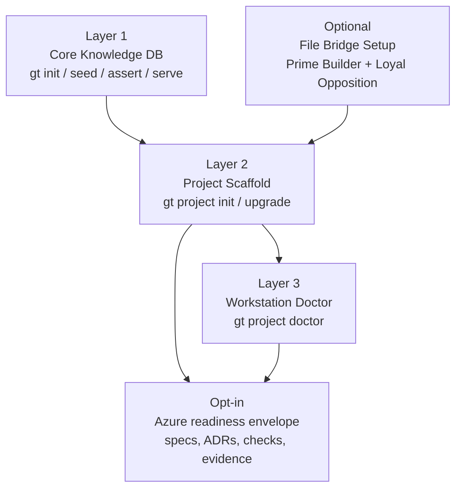
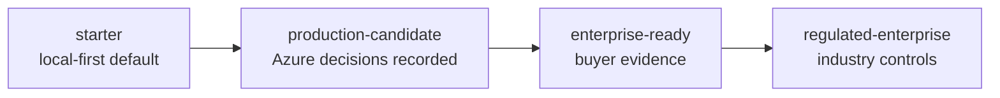

# GroundTruth Knowledge DB

[](https://github.com/Remaker-Digital/groundtruth-kb/actions/workflows/ci.yml)
[](https://github.com/Remaker-Digital/groundtruth-kb/actions/workflows/codeql.yml)
[](https://github.com/Remaker-Digital/groundtruth-kb/actions/workflows/security.yml)
[](https://sonarcloud.io/summary/new_code?id=mike-remakerdigital_groundtruth)
[](https://pypi.org/project/groundtruth-kb/)
[](LICENSE)
[](https://www.python.org/downloads/)

**A specification-driven governance toolkit for AI engineering teams.**

Track specifications, tests, work items, and architecture decisions with
append-only versioning. Coordinate two AI agents (Prime Builder + Loyal
Opposition) through a file-bridge protocol. Built for teams that need
traceable, auditable engineering decisions.

## New Here?

If you have never seen GroundTruth-KB before, start with
[docs/start-here.md](docs/start-here.md). It assumes **zero prior context**
and walks through everything from install to your first assertion on a
Windows workstation with internet access.

Already a developer-preview adopter? Jump straight to:

- [CTO Evaluation Guide](docs/cto-evaluation.md) - pip install, dashboard, lifecycle, services, roles

- [Day in the Life](docs/day-in-the-life.md) — a synthetic first week
- [Evidence](docs/evidence.md) — live metrics, every row dated + pinned to a commit
- [Known Limitations](docs/known-limitations.md) — open gaps, stated plainly
- [Executive Overview](docs/groundtruth-kb-executive-overview.md) — the business case

## At a Glance

| Capability | Description |
|-----------|-------------|
| **Specifications** | Decision log for what the system must do |
| **Tests** | Verify implementation meets specifications |
| **Assertions** | Continuously prove spec-implementation alignment |
| **Work Items** | Track gaps between specs and implementation |
| **Deliberation Archive** | Searchable decision history with rejected alternatives |
| **Governance Gates** | Pluggable enforcement at lifecycle transitions |
| **File Bridge** | Asynchronous two-agent review via versioned markdown |

**Tooling:** CLI (`gt`), Web UI, Python API, project scaffolding,
CI templates, process templates, dual-agent file bridge setup.

## Quick Start

```powershell
# Install from PyPI (Windows workstation with internet access)
pip install groundtruth-kb

# Create a project with scaffolding
gt project init my-project --profile local-only --no-seed-example --no-include-ci

# Verify workstation readiness
cd my-project
gt project doctor
```

**Web UI** (requires `[web]` extra):

```powershell
pip install "groundtruth-kb[web]"
gt serve
# Visit http://localhost:8090
```

**Operations dashboard** (local Grafana + generated SQLite reporting DB):

```powershell
gt dashboard init
gt dashboard install
gt dashboard start
# Visit http://127.0.0.1:3000/d/groundtruth-kb/groundtruth-kb-dashboard
```

**Same-day prototype** (includes example data):

```powershell
gt bootstrap-desktop my-prototype --owner "Your Organization" --init-git
```

See [Start Here](docs/start-here.md) for the full walkthrough, including
a PowerShell primer for readers who have never opened a terminal.

## Architecture



See [docs/architecture/product-split.md](docs/architecture/product-split.md)
for the authoritative layer definitions.

## Why?

AI-powered systems change fast. Without traceable specifications and
assertions, teams lose track of what was decided, why, and whether the
implementation still matches. GroundTruth-KB provides the engineering
discipline layer.

## Status

This project is in early development (v0.6.1, developer-preview). The
toolkit is extracted from a production system managing 2,000+
specifications and 11,000+ tests. See
[docs/known-limitations.md](docs/known-limitations.md) for current gaps.

Project scaffolding (`gt project init`), environment verification
(`gt project doctor`), and scaffold upgrades (`gt project upgrade`) are
available. The local operations dashboard (`gt dashboard init/install/start`)
generates Grafana provisioning and a dashboard SQLite database from the pip
package. Three profiles support different team configurations: `local-only`,
`dual-agent`, and `dual-agent-webapp`.

## Documentation

The [method documentation](docs/method/README.md) describes the engineering
discipline behind GroundTruth:

| Guide | Topic |
|-------|-------|
| [01 — Overview](docs/method/01-overview.md) | Core workflow and governance model |
| [02 — Specifications](docs/method/02-specifications.md) | Writing and managing specifications |
| [03 — Testing](docs/method/03-testing.md) | Test forms, outside-in testing, pipeline organization |
| [04 — Work Items](docs/method/04-work-items.md) | Gap tracking, stage lifecycle, prioritization |
| [05 — Governance](docs/method/05-governance.md) | GOV specs, gates, assertions, protected behaviors |
| [06 — Dual-Agent](docs/method/06-dual-agent.md) | Prime Builder + Loyal Opposition collaboration |
| [07 — Sessions](docs/method/07-sessions.md) | Session IDs, wrap-up, audit cadence |
| [08 — Architecture](docs/method/08-architecture.md) | ADR/DCL/IPR/CVR workflow |
| [09 — Adoption](docs/method/09-adoption.md) | Upstream/downstream model, update procedures |
| [10 — Tooling](docs/method/10-tooling.md) | CLI commands, web UI, Python API, configuration |
| [11 — Operational Config](docs/method/11-operational-configuration.md) | Bridges, automations, directives, roles |
| [12 — File Bridge Automation](docs/method/12-file-bridge-automation.md) | Durable file bridge polling, prompts, plugins, skills, and scheduler capture |
| [13 — Deliberation Archive](docs/method/13-deliberation-archive.md) | Decision log with semantic search |

**Reference:**
[Assertion Language](docs/reference/assertion-language.md) |
[Azure Readiness Taxonomy](docs/reference/azure-readiness-taxonomy.md) |
[Desktop Setup](docs/desktop-setup.md) |
[Example Project](examples/task-tracker/WALKTHROUGH.md)

## Azure Readiness

GroundTruth-KB keeps the default scaffold lightweight, then adds an opt-in
Azure enterprise readiness path for SaaS teams that need buyer-grade cloud
evidence.



The full taxonomy is in
[docs/reference/azure-readiness-taxonomy.md](docs/reference/azure-readiness-taxonomy.md).
The wiki-ready summary lives at
[docs/wiki/azure-enterprise-readiness.md](docs/wiki/azure-enterprise-readiness.md)
and is mirrored to the GitHub Wiki.

## Process Templates

The [templates/](templates/README.md) directory contains reference templates
for setting up a GroundTruth project: rules files, state files, hooks, and
agent configuration, including a file bridge OS-poller setup prompt. Use
`gt project init my-project --profile <profile>` for automated setup, or
copy templates manually and customize the placeholders.

## Contributing

See [CONTRIBUTING.md](CONTRIBUTING.md) for how to contribute. We especially
value feedback about the engineering method itself — tag issues with
`method-feedback`.

## License

[AGPL-3.0](LICENSE)

---

*© 2026 Remaker Digital, a DBA of VanDusen & Palmeter, LLC. All rights reserved.*
