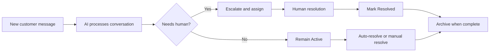

# Conversation Inbox

The Inbox provides a real-time view of all customer conversations, with tools to filter, assign, escalate, and resolve them.

## Inbox workflow map

## Conversation List

The left panel shows all conversations, sorted by most recent activity. Each entry displays:

- **Customer identity** — Displayed using the best available identification: Shopify customer name (verified), asserted name from conversation (unverified, shown with badge), or session ID as fallback
- **Status badge** — Active, Escalated, or Resolved
- **Unread indicator** — Red dot for conversations with unread messages
- **Message count** and last activity timestamp

### Filtering

Use the filter tabs to view conversations by status:

- **All** — Every conversation regardless of status
- **Active** — Currently open conversations with recent customer activity
- **Esc** — Conversations escalated to a human team member
- **Resolved** — Conversations that have been resolved (by agent action, customer ending the chat, or reaching max conversation turns)
- **Archived** — Conversations that have been archived for long-term storage

### Search

The search bar searches across **message content** as well as customer identity. Type any keyword and the list updates in real time (with a short debounce). Search results display matching conversation snippets so you can quickly find the conversation you need.

When a search returns no results, the reader pane is cleared to avoid confusion.

## Conversation Detail

Select a conversation to view the full message thread. The detail panel shows:

- Complete message history with timestamps
- AI-generated responses and customer messages
- Internal notes (visible only to your team, not to customers)

### Actions

- **Escalate** — Hand off to a human team member. You can optionally select a category (service, support, sales, account, technical assistance, or general inquiry) and a specific team member. When a category is selected without a specific agent, Agent Red automatically assigns the conversation to the escalation agent with the fewest unresolved escalations in that category. Email notification is sent to the assigned agent (or all escalation agents if no specific assignment). The conversation status changes to Escalated.
- **Resolve** — Mark the conversation as resolved and close it. The conversation status changes to Resolved.
- **Archive** — Move a resolved or timed-out conversation to the archive for long-term storage. Archived conversations no longer appear in the default list view but remain accessible via the Archived filter tab.
- **Unarchive** — Restore an archived conversation back to the main list.

### AI-Initiated Escalation

When the AI pipeline detects that a conversation should be escalated (based on confidence thresholds, keyword triggers, or turn limits), it also classifies the conversation into a category. The system then automatically assigns the conversation to the best-fit escalation agent based on category match and current workload. The assigned agent receives a targeted email notification.

### Escalation Details

For escalated conversations, the detail panel shows:

- **Escalation category** — Displayed as a badge (e.g., "support", "sales", "technical assistance")
- **Assigned to** — The team member assigned to handle the escalation, shown by display name

## Customer Profile

The right panel shows the customer's profile information, including:

- Contact details
- Conversation history summary (message count, start time, last activity)
- Customer context data (when [Customer Memory](/docs/admin-guide/customer-memory) is enabled)

## Pipeline Trace

For each conversation, the detail panel includes a **pipeline trace** that shows how the AI processed the most recent message. The trace displays each stage of the agent pipeline:

| Stage | What it shows |
|---|---|
| **Route** | How the message was classified (intent, category) |
| **Retrieve** | Which knowledge base articles were retrieved and their relevance scores |
| **Generate** | The AI model used and response generation time |
| **Critic** | Whether the response passed the Critic/Supervisor safety validation |
| **Respond** | Final delivery time and total pipeline duration |

Each stage shows its duration in milliseconds and a trace ID for debugging.

---

## Managing the inbox — daily workflow

Follow this routine to stay on top of customer conversations:

### Morning triage

1. **Open the Inbox** and click the **Escalated** filter tab. These are conversations that need human attention.
2. **Review each escalated conversation.** Read the full message thread to understand the customer's issue. Check the escalation category and reason.
3. **Respond or reassign.** If you can resolve the issue, do so. If it needs a different team member, note their category and let the auto-assignment handle routing.
4. **Resolve handled conversations.** Click the checkmark icon to mark a conversation as resolved once the customer's issue is addressed.

### Ongoing monitoring

1. **Check Active conversations.** Switch to the **Active** filter tab periodically. These are conversations the AI is currently handling. Spot-check a few to verify response quality.
2. **Search for specific customers.** Use the search bar to find conversations by customer name or message content. Search matches across message text and customer identity.
3. **Review the pipeline trace** for any conversation where the AI gave a poor response. The Retrieve stage shows which knowledge base articles were used — if the wrong articles were retrieved, improve your article titles or content.

### End-of-day cleanup

1. **Archive old conversations.** Switch to the **Resolved** filter tab. Archive conversations that are fully completed to keep the inbox clean. Archived conversations remain accessible via the **Archived** filter.
2. **Check for idle conversations.** Look for Active conversations with no recent customer activity — these may have been abandoned. The idle timeout setting (configured in [Escalation rules](./escalation-rules.md)) auto-resolves inactive conversations.

### Handling escalated conversations step by step

1. Click an escalated conversation in the left panel.
2. Read the full message thread — the AI's handoff message explains the escalation reason.
3. Review the **customer profile** in the right panel — check order history, email, and previous interactions.
4. If the issue requires action outside Agent Red (e.g., processing a refund in Shopify), handle it in the external system and then return to update the conversation.
5. Click the **Resolve** button (checkmark icon) to close the conversation.
6. If the customer contacts again, a new conversation starts — the AI has access to the previous conversation history through the memory layer.

### Manually escalating a conversation

If you see an Active conversation that the AI should not be handling:

1. Click the conversation.
2. Click the **Escalate** button (up-arrow icon) in the conversation header.
3. Select a **category** (Service, Support, Sales, Account, Technical Assistance, General Inquiry).
4. Optionally select a specific **team member** to assign it to. Leave empty for auto-assignment.
5. Click **Escalate**. The conversation status changes and the assigned agent receives an email notification.

---

## Billable Conversations

A conversation is billable when the AI produces at least one response. Test, admin, health-check, and system conversations are excluded. See [Billable Conversation Spec](/docs/billing/billable-conversation-spec) for the complete definition.

---

*© 2026 Remaker Digital, a DBA of VanDusen & Palmeter, LLC. All rights reserved.*
