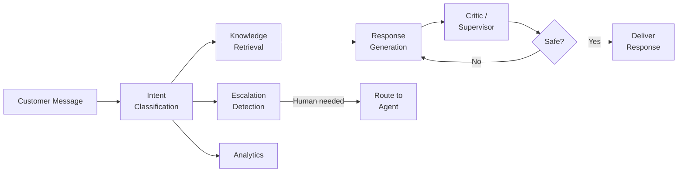
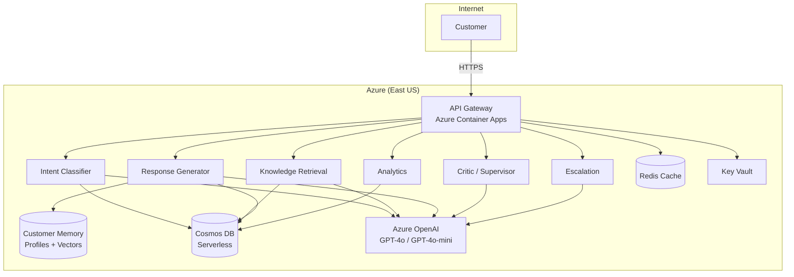

# Platform Overview

Agent Red Customer Experience automates customer support for e-commerce businesses using a pipeline of six specialized AI agents. Each agent handles a distinct responsibility — from classifying the customer's intent to generating a response and validating it for safety — so that routine conversations are resolved accurately with minimal human intervention.

## The agent pipeline

When a customer sends a message, it flows through the agent pipeline:

1. **Intent Classification** — Determines what the customer needs (order status, return request, product question, and others) across 18 total intent categories (17 customer-facing plus an admin-assistance route for admin-authenticated traffic) using GPT-4o-mini.
2. **Knowledge Retrieval** — Searches your product catalog, FAQ database, and policy documents using hybrid semantic vector + keyword search to find relevant context.
3. **Response Generation** — Composes a natural-language reply using the retrieved context and conversation history, personalized to your brand voice.
4. **Critic / Supervisor** — Validates the response for factual accuracy, policy compliance, and content safety before it reaches the customer.
5. **Escalation Detection** — Evaluates whether the conversation requires human attention (angry customer, complex issue, VIP account) and routes accordingly.
6. **Analytics** — Records conversation metrics for quality monitoring, reporting, and continuous improvement.

## Architecture

Agent Red runs as a unified API Gateway on Azure Container Apps (East US) with native auto-scaling. The six AI agents run in-process within the gateway, communicating via synchronous HTTP endpoints. Customer data is stored in Cosmos DB (Serverless) with tenant-level partition isolation. A dedicated Customer Memory layer stores customer profiles and vectorized conversation transcripts — enabling the response generator to personalize replies based on each customer's interaction history.

| Component | Technology |
|---|---|
| Agent runtime | Azure Container Apps (native auto-scaling) |
| Agent communication | HTTP (in-process, synchronous pipeline) |
| Database | Azure Cosmos DB (Serverless, DiskANN vector index) |
| Cache | Azure Cache for Redis |
| AI models | Azure OpenAI Service (GPT-4o, GPT-4o-mini) |
| Embeddings | text-embedding-3-large |
| Secrets | Azure Key Vault (Managed Identity) |
| Customer Memory | Cosmos DB (profiles + vectorized conversation transcripts) |
| Monitoring | OpenTelemetry (Application Insights) |

## Design targets

These are the performance targets Agent Red is designed to achieve:

| Metric | Target |
|---|---|
| Response latency (P95) | < 2 seconds |
| Uptime SLA (Enterprise) | 99.95% |
| Concurrent tenants at launch | 680 |
| Rate limit (all tiers) | 300 requests per minute per tenant |

## Next steps

- [How It Works](./how-it-works) — Deep dive into the six-agent pipeline, communication protocols, and data flow.
- [Initial Setup](./setup) — What you need to get Agent Red running for your store.

---

*© 2026 Remaker Digital, a DBA of VanDusen & Palmeter, LLC. All rights reserved.*
