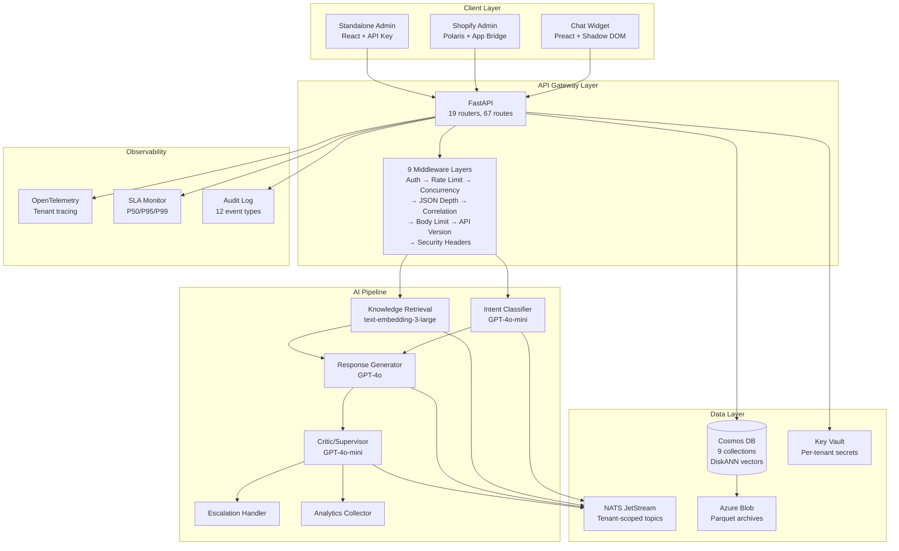
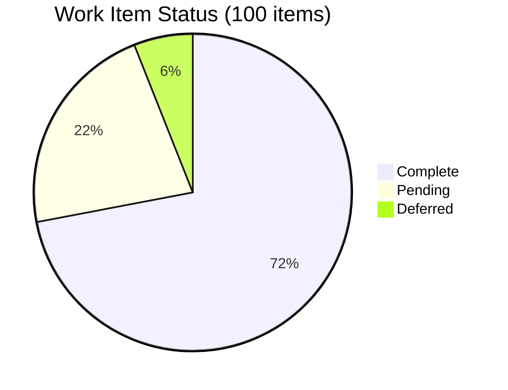

# Master Plan Review — 2026-01-30

> **Status:** Living document — captures all decisions from the 2026-01-30 architecture review session
> **Project:** Agent Red Customer Experience
> **Owner:** Remaker Digital (DBA of VanDusen & Palmeter, LLC)
> **Session Scope:** Multi-tenant architecture, metering/SLA validation, Persistent Customer Memory implementation

---

## Table of Contents

1. [Session Overview](#1-session-overview)
2. [Decision Log (32 Decisions)](#2-decision-log-32-decisions)
3. [Work Item Registry (100 Items)](#3-work-item-registry-100-items)
4. [Architecture Decisions Detail](#4-architecture-decisions-detail)
5. [SLA Gap Analysis and Resolutions](#5-sla-gap-analysis-and-resolutions)
6. [Cost Model Validation](#6-cost-model-validation)
7. [Previously Completed Work](#7-previously-completed-work)
8. [Remaining Phase 2.1 Items](#8-remaining-phase-21-items)
9. [Priority Framework](#9-priority-framework)
10. [Open Questions and Future Investigations](#10-open-questions-and-future-investigations)

---

## 1. Session Overview

### What Was Accomplished

This review session conducted a comprehensive technical architecture review covering three major areas:

1. **Multi-tenant architecture** across 7 sub-areas (cost optimization, security, GDPR, tracing, performance, disaster recovery, per-merchant tuning)
2. **Metering and scaling SLAs** to validate product licensing decisions
3. **Persistent Customer Memory** implementation design and test cases

### Key Outcomes

| Metric | Value |
|---|---|
| Total decisions made | 32 |
| Total work items identified | 100 |
| SLA gaps identified and resolved | 3 |
| Cost model validated | Yes — 76-90% gross margins confirmed |
| Pricing changes required | None |
| Infrastructure cost increase | +$52-80/month (Option B+ redundancy) |

### Priority Rule Established

**Technical work has elevated priority over creative/content work.** Technical gap identification, test case creation, testing/results analysis, and implementation of new capabilities should always be prioritized above creative assets, marketing content, and cosmetic work. The rationale: the technical implementation is the foundation for cost estimates, which are in turn the basis for pricing and licensing decisions.

### Architecture Overview

### Work Item Completion Progress (Updated 2026-02-02)

---

## 2. Decision Log (32 Decisions)

### Multi-Tenant Architecture: Security / Tenant Isolation

| # | Decision | Summary |
|---|---|---|
| 1 | TenantScopedRepository | Mandatory data access layer enforcing `tenant_id` on every Cosmos DB operation. No direct Cosmos DB access bypassing this layer. |
| 2 | Cosmos DB partition key = `tenant_id` | All 7 tenant-scoped collections use `tenant_id` as partition key. 2 platform-wide collections (`platform_config`, `audit_log`) use functional keys. |
| 3 | Tenant-scoped NATS topics | Topic pattern: `{tenant_id}.{agent}` for conversation pipeline isolation. Subscription authorization prevents cross-tenant message access. |
| 4 | Dual authentication | Shopify merchants: session tokens (signed JWT, verified via Shopify API). Direct customers: API keys (hashed, stored in Key Vault). Both resolve to server-derived `tenant_id`. |
| 5 | Per-tenant rate limits | Starter: 10 req/min. Professional: 50 req/min. Enterprise: 200 req/min. Enforced at API Gateway. |
| 6 | Per-tenant secrets in Key Vault | `TenantSecretService` with enum-based access. Naming: `tenant-{id}-{type}` (e.g., `tenant-abc-shopify-token`). |

### Multi-Tenant Architecture: GDPR Compliance

| # | Decision | Summary |
|---|---|---|
| 7 | PII scrubbing at logging layer | No customer-identifiable data in Application Insights. SpanProcessor/LogProcessor strips PII before export. Operational metrics only. |
| 8 | Channel-specific grace periods | Shopify: 48-hour mandatory grace period (per Shopify requirements). Stripe: 30-day grace period (per SLA). |
| 9 | DataExportService + DataDeletionService | Data store registry pattern. Export/delete across all stores: Cosmos DB (7 collections), NATS, Application Insights (redacted), Key Vault, external (Stripe/Shopify). |
| 10 | Consent management for Persistent Customer Memory | `consent_status` field: `granted` / `denied` / `not_asked`. Gates Layers 2-4. Consent changes logged to audit log. |

### Multi-Tenant Architecture: Tracing / Observability

| # | Decision | Summary |
|---|---|---|
| 11 | `tenant_id` on all Application Insights telemetry | OpenTelemetry SpanProcessor and LogProcessor inject `tenant_id` as custom dimension. Enables per-tenant dashboards and alerting. |
| 12 | Correlation ID chain across 6-agent pipeline | `conversation_id` + `tenant_id` + `trace_id` propagated through all agents. PII-free. NATS message headers carry correlation context. |
| 13 | Append-only audit log | 12 event types. Time-partitioned. 1-year retention. Survives tenant deletion. Stored in `audit_log` Cosmos DB collection. |

### Multi-Tenant Architecture: Performance / Noisy Neighbor

| # | Decision | Summary |
|---|---|---|
| 14 | Per-tenant concurrency limits + queue depth | Starter: 3 concurrent / 5 queue. Professional: 10/20. Enterprise: 30/50. NATS-backed per-tenant queue. HTTP 429 with `Retry-After` when exceeded. |
| 15 | Layered timeouts + circuit breakers | Per-stage timeout budget (total 8s hard deadline). Circuit breakers on Azure OpenAI (5 failures/30s), Cosmos DB (3/15s), NATS (3/10s). Graceful fallbacks. |
| 16 | Option B+ — 7 critical at min=2, fail-closed Critic | API Gateway, Intent Classifier, Response Generator, Knowledge Retrieval, NATS, SLIM Gateway, Critic/Supervisor all min=2 replicas. Escalation, Analytics min=1. Fail-closed: pipeline never delivers responses that skip Critic validation. |
| 17 | TenantUsageMonitor — progressive throttling | Watch → Warn → Throttle → Isolate escalation. Tracks: latency caused, Cosmos RU consumption, OpenAI token consumption, error rate, payload size. 5-minute rolling window. |

### Multi-Tenant Architecture: Disaster Recovery / Maintenance

| # | Decision | Summary |
|---|---|---|
| 18 | Cosmos DB continuous 7-day backup | Self-service point-in-time restore. ~$4-6/month at launch scale. |
| 18+ | Long-term archival pipeline | Three-tier: Hot (Cosmos DB) → Warm (Blob Cool, 90 days) → Cold (Blob Archive, 7+ years). Parquet format for ML training. Customer-Managed Keys (CMK) with auto-rotation. Tenant-level purge cascades across all tiers. Daily Change Feed → Azure Function → Blob pipeline. |
| 19 | Zero-downtime rolling deployment | Connection draining (60s). Readiness + liveness probes. Min replicas maintained during deploy. NATS consumer group handles message redelivery. |
| 20 | Tiered maintenance approach | No formal window for most operations. Scheduled window: Tuesdays 02:00-04:00 UTC for infrastructure changes. 72-hour advance notice. |
| 21 | Option A for launch, path to Option C | Single region (East US 2) + backup for launch. Documented upgrade to Cosmos DB geo-replication + pilot light at 50+ tenants. |

### Multi-Tenant Architecture: Per-Merchant Behavior Tuning

| # | Decision | Summary |
|---|---|---|
| 22 | Tenant configuration management system | 5 layers: (1) TenantConfigProcessor — standalone validation/cleansing service consumable via API/CLI/GUI. (2) A/B testing framework — deterministic customer segmentation via hash, experiment lifecycle. (3) Configuration API — 10 RESTful endpoints. (4) Merchant Configuration UI — 9-step onboarding workflow, pervasive tooltips, documentation links, live preview, contextual data adjacent to every decision. (5) Contextual Data Service — per-field decision-relevant data from tenant analytics + platform benchmarks. Config inheritance: platform defaults → tier defaults → tenant overrides. 60-second in-memory cache. Version history with rollback. |
| 23 | SystemPromptBuilder | Template-based dynamic prompt assembly: platform base → tier capabilities → tenant config → A/B variant → customer context. Safety guardrails immutable (platform base prompt + Critic validation). Per-agent prompt composition. |

### Metering and Scaling SLAs

| # | Decision | Summary |
|---|---|---|
| 24 | Billable conversation definition | Starts: first customer message (new `conversation_id`). Ends: 30-min idle / customer ends / escalated / 50 turns. 1 conversation = 1 session regardless of message count. Not billable: health checks, admin interactions, test conversations, platform errors before first AI response. Idempotent counting. Daily reconciliation against Stripe. |
| 25 | Three-layer usage transparency | (1) Real-time dashboard — conversations used, allowance remaining, overage estimate, daily volume chart. (2) Per-conversation audit trail — every billable conversation has full audit record, CSV exportable. (3) Dispute resolution — flag, auto-review (1 hr), auto-credit if metering error, manual escalation (24 hr), resolution within 48 hr. Proactive alerts at 80%/100% of allowance, pack balance low, volume spikes, spend projection. Billable conversation spec published as binding reference document. |
| 26 | SLA validation — 3 gaps resolved | Gap 1: API P50 revised from 500ms to 1,500ms (realistic for GPT-4o pipeline). Gap 2: Maintenance window aligned to Tuesdays 02:00-04:00 UTC. Gap 3: Backup retention clarified — 7-day PITR + 90-day archive exceeds 30-day SLA commitment. |
| 26+ | P50 latency cost/benefit investigation | Separate research: (A) customer satisfaction impact of reducing P50 below 1,500ms, (B) cost of reduction options (model distillation, speculative generation, streaming, PTU, caching). Deliverable: cost/benefit chart. |
| 27 | Cost basis validated | Per-conversation cost: ~$0.0073 (up from $0.007 — marginal increase from architecture additions). Fixed infrastructure: ~$252-436/month (up from $200-400). Gross margins: 76-90% across all tier/volume scenarios. Break-even: 2 Starter tenants. No pricing changes required. |

### Persistent Customer Memory

| # | Decision | Summary |
|---|---|---|
| 28 | Layer 1 — Customer context profile (revised) | Structured profile with 6 additional data sources: (1) purchase history (product ID, date, rating/review), (2) historical product questions, (3) geographic region codes, (4) marketing segmentation codes, (5) jurisdiction codes (regulatory compliance), (6) shopping cart contents (active + abandoned). All 6 validated as high-confidence quality improvements. ~250 token prompt injection. |
| 28+ | Response explainability framework | Per-response decision trace capturing: profile factors used, knowledge sources matched, memory signals, A/B variant active, tenant config overrides, model attribution, Critic assessment. Stored per-conversation, accessible via merchant dashboard, exportable for audit. |
| 29 | Layer 2 — Conversation memory (vectorized search) | Post-conversation pipeline: transcript → chunking (200-300 tokens) → PII tokenization → embedding (text-embedding-3-large, 3072d) → Cosmos DB DiskANN vector index. Parallel semantic search at conversation start. Tier-gated history depth: Starter 90d, Professional 365d, Enterprise unlimited. ~300 token prompt injection. Consent-gated. |
| 30 | Layer 3 — Cross-session learning | PatternExtractionService: post-conversation GPT-4o-mini extraction of communication style, product preferences, issue patterns, satisfaction drivers, decision-making style, temporal patterns. Confidence scoring (0-1). Patterns below 0.5 stored but not injected. Monthly decay (0.05/month without reinforcement). Professional+ only. ~100 token prompt injection. ~$0.0003/conversation. |
| 31 | Layer 4 — Dedicated model training | Fine-tuning GPT-4o-mini on 1,000+ tenant conversations. Monthly pipeline: data selection (quality filters) → PII scrubbing → quality validation → fine-tuning → evaluation → quality gate → deployment → A/B validation (20/80 for 7 days) → promotion. Cost: $90-200/month, priced at $299/month (33-70% margin). Enterprise add-on only. Critic still validates all outputs. |
| 32 | Test cases and validation framework | 3-tier testing: (1) 20 unit tests across all 4 layers, (2) 10 integration tests cross-layer, (3) 5 A/B validation tests in production. 95% confidence interval, 5% minimum effect size. Test data fixtures for deterministic testing. |

---

## 3. Work Item Registry (100 Items)

### Items 1-12: Cost Optimization (from gap analysis)

| # | Work Item | Priority | Status |
|---|---|---|---|
| 1 | Benchmark per-container max throughput (Intent Classifier) | High | Pending |
| 2 | Benchmark per-container max throughput (Knowledge Retrieval) | High | Pending |
| 3 | Benchmark per-container max throughput (Response Generator) | High | Pending |
| 4 | Benchmark per-container max throughput (Critic/Supervisor) | High | Pending |
| 5 | Benchmark per-container max throughput (Escalation) | High | Pending |
| 6 | Benchmark per-container max throughput (Analytics) | High | Pending |
| 7 | Benchmark end-to-end single-instance system capacity | High | Pending |
| 8 | Define physical isolation levels (logical, data-isolated, compute-isolated, fully isolated) | High | Pending |
| 9 | Map isolation levels to subscription tiers | High | Pending |
| 10 | Assess SLA/redundancy alignment | High | Resolved (Decision 16) |
| 11 | Inventory all data persistence locations | High | Resolved (Decision 9) |
| 12 | Document data lifecycle per persistence layer | High | Resolved (Decisions 18, 18+) |

### Items 13-23: Multi-Tenant Foundation (from earlier session)

| # | Work Item | Priority | Status |
|---|---|---|---|
| 13 | Design multi-tenant Cosmos DB schema (9 collections) | Critical | ✅ Complete — cosmos_schema.py |
| 14 | Implement TenantScopedRepository base class | Critical | ✅ Complete — repository.py |
| 15 | Design NATS topic namespace with tenant isolation | Critical | ✅ Complete — nats_isolation.py |
| 16 | Implement tenant provisioning for Cosmos DB collections | High | ✅ Complete — nats_isolation.py (provision_tenant_topics) |
| 17 | Implement tenant-aware NATS subscription management | High | ✅ Complete — nats_isolation.py |
| 18 | Design API Gateway tenant resolution middleware | Critical | ✅ Complete — auth.py + middleware.py |
| 19 | Implement Shopify session token verification | High | ✅ Complete — auth.py |
| 20 | Implement API key authentication for direct customers | High | ✅ Complete — auth.py |
| 21 | Design tenant lifecycle state machine | High | ✅ Complete — cosmos_schema.py (TenantStatus enum) |
| 22 | Implement usage quota enforcement at API Gateway | High | ✅ Complete — middleware.py (RateLimitMiddleware) |
| 23 | Design shared-everything cost allocation model | Medium | Pending |

### Items 24-29: Security / Tenant Isolation

| # | Work Item | Priority | Status |
|---|---|---|---|
| 24 | Implement TenantScopedRepository with mandatory tenant_id enforcement | Critical | ✅ Complete — repository.py |
| 25 | Configure Cosmos DB partition keys for all 9 collections | Critical | ✅ Complete — cosmos_schema.py |
| 26 | Implement tenant-scoped NATS topic authorization | High | ✅ Complete — nats_isolation.py |
| 27 | Implement dual authentication (Shopify session tokens + API keys) | High | ✅ Complete — auth.py + middleware.py |
| 28 | Implement per-tenant rate limiting at API Gateway | High | ✅ Complete — middleware.py (RateLimitMiddleware) |
| 29 | Implement TenantSecretService with Key Vault integration | High | ✅ Complete — tenant_secret_service.py |

### Items 30-38: GDPR Compliance

| # | Work Item | Priority | Status |
|---|---|---|---|
| 30 | Implement PII-scrubbing SpanProcessor and LogProcessor for Application Insights | High | ✅ Complete — gdpr_services.py (PiiScrubber) |
| 31 | Implement channel-specific grace period logic (48hr Shopify, 30d Stripe) | High | ✅ Complete — gdpr_services.py (GracePeriodManager) |
| 32 | Implement DataExportService with data store registry | High | ✅ Complete — gdpr_services.py (DataExportService + DataStoreRegistry) |
| 33 | Implement DataDeletionService with cascading delete across all stores | High | ✅ Complete — gdpr_services.py (DataDeletionService) |
| 34 | Implement consent_status field and gating logic | High | ✅ Complete — gdpr_services.py (ConsentManager) |
| 35 | Implement GDPR compliance webhooks (3 Shopify endpoints) | High | ✅ Complete — shopify_gdpr_webhooks.py |
| 36 | Implement consent change audit logging | Medium | ✅ Complete — gdpr_services.py (audit via AuditLogRepository) |
| 37 | Implement data retention policy enforcement (automated cleanup) | Medium | ✅ Complete — data_retention.py (~380 lines) |
| 38 | Create GDPR compliance test suite | Medium | Pending |

### Items 39-43: Tracing / Observability

| # | Work Item | Priority | Status |
|---|---|---|---|
| 39 | Implement OpenTelemetry SpanProcessor injecting tenant_id | High | ✅ Complete — otel_tracing.py (TenantSpanProcessor + TenantLogFilter) |
| 40 | Implement correlation ID propagation across all agents via NATS headers | High | ✅ Complete — otel_tracing.py (CorrelationContext + CorrelationMiddleware + NATS helpers) |
| 41 | Implement append-only audit log (12 event types, time-partitioned) | High | ✅ Complete — cosmos_schema.py (AuditLogDocument) + repository.py (AuditLogRepository) |
| 42 | Build per-tenant Application Insights dashboard template | Medium | Pending |
| 43 | Implement audit log query API for compliance reporting | Medium | ✅ Complete — admin_audit_api.py (2 endpoints: paginated query + CSV export) |

### Items 44-51: Performance / Noisy Neighbor

| # | Work Item | Priority | Status |
|---|---|---|---|
| 44 | Implement TenantConcurrencyMiddleware with per-tenant semaphore and queue depth | High | ✅ Complete — pipeline_resilience.py |
| 45 | Implement layered timeout budget across 6-agent pipeline | High | ✅ Complete — pipeline_resilience.py (PipelineTimeoutBudget) |
| 46 | Implement circuit breakers on Azure OpenAI, Cosmos DB, NATS | High | ✅ Complete — pipeline_resilience.py + nats_isolation.py |
| 47 | Define KEDA scaling profiles (min/max replicas, triggers) for all 9 containers | High | ✅ Complete — dr_security.tf (KEDA profiles + night scaling) |
| 48 | Update Terraform IaC for min replicas = 2 on 7 critical components | High | ✅ Complete — dr_security.tf (Option B+ configuration) |
| 49 | Revise SLA if Option A chosen (N/A — Option B+ selected) | N/A | Resolved |
| 50 | Implement fail-closed policy for Critic/Supervisor | Critical | ✅ Complete — critic_policy.py |
| 51 | Implement TenantUsageMonitor with progressive throttling | Medium | ✅ Complete — tenant_usage_monitor.py (~500 lines) |

### Items 52-62: Disaster Recovery / Maintenance

| # | Work Item | Priority | Status |
|---|---|---|---|
| 52 | Enable Cosmos DB continuous backup (7-day) and document restore procedure | High | ✅ Complete — dr_security.tf |
| 53 | Design and implement archival pipeline (Change Feed → Parquet → Blob) | Medium | ✅ Complete — archival_pipeline.py (~750 lines) |
| 54 | Configure Azure Blob Lifecycle Management (Cool 90d → Archive) | Medium | ✅ Complete — dr_security.tf (lifecycle rules) |
| 55 | Enable Customer-Managed Keys (CMK) for Cosmos DB and Blob Storage | High | ✅ Complete — dr_security.tf |
| 56 | Implement tenant-level archive purge for GDPR cascade | Medium | Pending |
| 57 | Document archive rehydration runbook for ML training | Low | Pending |
| 58 | Configure health probes (readiness + liveness) on all 9 containers | High | ✅ Complete — dr_security.tf |
| 59 | Configure rolling deployment with connection draining (60s) | High | ✅ Complete — dr_security.tf |
| 60 | Document maintenance runbook (operation types, notification, rollback) | Medium | ✅ Complete — docs/operations/DEPLOYMENT-RUNBOOK.md |
| 61 | Document DR runbook Option A (manual region redeploy) | Medium | ✅ Complete — docs/operations/DEPLOYMENT-RUNBOOK.md |
| 62 | Document Option C upgrade path (trigger: 50+ tenants) | Low | ✅ Complete — docs/operations/OPTION-C-UPGRADE-PATH.md |

### Items 63-70: Per-Merchant Behavior Tuning

| # | Work Item | Priority | Status |
|---|---|---|---|
| 63 | Design tenant_config JSON schema with field definitions, validation, tooltips, doc links | High | ✅ Complete — tenant_config_schema.py |
| 64 | Implement TenantConfigProcessor — validation, cleansing, versioning, A/B resolution | High | ✅ Complete — tenant_config_processor.py |
| 65 | Implement Configuration API (10 endpoints) | High | ✅ Complete — tenant_config_api.py |
| 66 | Design and implement A/B experiment framework | Medium | Pending (deferred to Phase 3 — Smart Rollout) |
| 67 | Implement Merchant Configuration UI — 9-step onboarding workflow | Medium | ✅ Complete — admin/shared/OnboardingWizard.tsx + ConfigEditor.tsx |
| 68 | Implement Contextual Data Service (per-field analytics + benchmarks) | Medium | Pending |
| 69 | Build config version history and rollback UI | Medium | Pending |
| 70 | Implement SystemPromptBuilder — per-agent prompt composition | High | ✅ Complete — system_prompt_builder.py |

### Items 71-82: Metering and Scaling SLAs

| # | Work Item | Priority | Status |
|---|---|---|---|
| 71 | Define and document billable conversation specification | Critical | ✅ Complete — conversation_meter.py |
| 72 | Implement ConversationMeter with idempotent counting and reconciliation | Critical | ✅ Complete — conversation_meter.py |
| 73 | Implement real-time usage dashboard | High | ✅ Complete — usage_dashboard_api.py |
| 74 | Implement per-conversation audit trail with CSV export | High | ✅ Complete — usage_dashboard_api.py |
| 75 | Implement dispute resolution workflow | Medium | Pending |
| 76 | Implement proactive billing alerts | Medium | ✅ Complete — conversation_meter.py (80%/100% threshold alerts) |
| 77 | Publish billable conversation spec as docs-site page | High | ✅ Complete — docs-site/docs/billing/billable-conversation-spec.md |
| 78 | Update SLA document (P50, maintenance window, backup retention) | High | ✅ Complete — SLA v0.2.0 |
| 79 | Build SLA monitoring dashboard | Medium | ✅ Complete — sla_monitoring.py (~390 lines) |
| 80 | Investigate P50 latency vs. customer satisfaction impact | Medium | Pending |
| 81 | Investigate P50 reduction cost/benefit (custom models, PTU, etc.) | Medium | Pending |
| 82 | Build parameterized cost model calculator | Medium | ✅ Complete — cost_model.py (~370 lines) |

### Items 83-100: Persistent Customer Memory

| # | Work Item | Priority | Status |
|---|---|---|---|
| 83 | Define customer profile JSON schema (with 6 data sources, PII classification, consent gating) | High | ✅ Complete — customer_profile_service.py |
| 84 | Implement CustomerProfileService — CRUD, Shopify sync, history computation, consent | High | ✅ Complete — customer_profile_service.py |
| 85 | Implement profile injection into SystemPromptBuilder (~250 token budget) | High | ✅ Complete — system_prompt_builder.py + customer_profile_service.py |
| 86 | Design and implement response explainability framework (per-response decision trace) | High | ✅ Complete — response_explainability.py |
| 87 | Implement conversation vectorization pipeline (chunking, PII tokenization, embedding, DiskANN) | High | ✅ Complete — conversation_vectorizer.py |
| 88 | Implement customer history semantic search (parallel query, top-K, result compression) | High | ✅ Complete — conversation_vectorizer.py (search_history + compress_for_prompt) |
| 89 | Implement tier-based history depth limits and consent-gated vector lifecycle | Medium | ✅ Complete — conversation_vectorizer.py (tier-gated depth + consent gating) |
| 90 | Implement PatternExtractionService (GPT-4o-mini extraction, confidence scoring, profile merge) | Medium | Pending |
| 91 | Implement pattern decay mechanism (monthly confidence reduction, cleanup) | Low | Pending |
| 92 | Implement merchant admin UI for viewing/editing extracted patterns | Low | Pending |
| 93 | Implement fine-tuning data pipeline (selection, format, PII scrub, validation) | Low | Pending |
| 94 | Implement fine-tuning job orchestration (Azure OpenAI API, scheduling, evaluation, quality gate) | Low | Pending |
| 95 | Implement fine-tuned model deployment (per-tenant revision, traffic routing, A/B validation) | Low | Pending |
| 96 | Implement fine-tuned model rollback | Low | Pending |
| 97 | Implement Tier 1 unit test suite (20 tests across 4 layers) | High | ✅ Complete — tests/persistent_memory/test_unit_layers.py |
| 98 | Implement Tier 2 integration test suite (10 cross-layer tests) | High | ✅ Complete — tests/persistent_memory/test_integration_layers.py |
| 99 | Design Tier 3 A/B validation framework | Medium | Pending |
| 100 | Create test data fixtures (synthetic profiles, transcripts, purchases, carts) | High | ✅ Complete — tests/persistent_memory/fixtures.py |

---

## 4. Architecture Decisions Detail

### Infrastructure Summary (Post-Decisions)

**Container Scaling (Option B+):**

| Container | Min Replicas | Max Replicas | Scale Trigger | Critical? |
|---|---|---|---|---|
| API Gateway | 2 | 8 | HTTP concurrent > 50 | Yes |
| Intent Classifier | 2 | 6 | NATS queue > 20 | Yes |
| Knowledge Retrieval | 2 | 6 | NATS queue > 15 | Yes |
| Response Generator | 2 | 10 | NATS queue > 10 | Yes |
| Critic/Supervisor | 2 | 4 | NATS queue > 20 | Yes (upgraded) |
| NATS | 2 | N/A | N/A | Yes |
| SLIM Gateway | 2 | N/A | N/A | Yes |
| Escalation | 1 | 3 | NATS queue > 30 | No |
| Analytics | 1 | 2 | NATS queue > 50 | No |

**Cosmos DB Collections (9 total):**

| Collection | Partition Key | Scope | Purpose |
|---|---|---|---|
| tenants | tenant_id | Per-tenant | Tenant config, status, metadata |
| conversations | tenant_id | Per-tenant | Conversation transcripts, billing records |
| usage | tenant_id | Per-tenant | Metered usage counters, pack balances |
| customer_profiles | tenant_id | Per-tenant | Layer 1 structured profiles |
| knowledge_bases | tenant_id | Per-tenant | Per-merchant product/FAQ data |
| memory_vectors | tenant_id | Per-tenant | Layer 2 vectorized transcript chunks |
| preferences | tenant_id | Per-tenant | Merchant settings, config versions |
| platform_config | config_type | Platform-wide | Tier defaults, feature flags |
| audit_log | time_partition | Platform-wide | Append-only audit events (1-year retention) |

**Data Storage Tiers:**

| Tier | Storage | Retention | Encryption | Purpose |
|---|---|---|---|---|
| Hot | Cosmos DB | Current + 7-day PITR | CMK (AES-256) | Active data |
| Warm | Blob Cool | 90 days | CMK (AES-256) | Recent archives, debugging |
| Cold | Blob Archive | 7+ years | CMK (AES-256) | Model training, compliance |

**Per-Tenant Rate Limits:**

| Tier | Rate Limit | Max Concurrent | Queue Depth |
|---|---|---|---|
| Starter | 10 req/min | 3 | 5 |
| Professional | 50 req/min | 10 | 20 |
| Enterprise | 200 req/min | 30 | 50 |

**Timeout Budget (per conversation):**

| Stage | Timeout |
|---|---|
| API Gateway → NATS | 500ms |
| Intent Classifier | 800ms |
| Knowledge Retrieval | 1,000ms |
| Response Generator | 3,000ms |
| Critic/Supervisor | 800ms |
| Escalation (parallel) | 500ms |
| Hard deadline | 8,000ms |

**Circuit Breakers:**

| Dependency | Failure Threshold | Recovery Probe | Fallback |
|---|---|---|---|
| Azure OpenAI | 5 in 30s | 1/10s | Graceful delay message |
| Cosmos DB | 3 in 15s | 1/5s | NATS cached context |
| NATS | 3 in 10s | 1/3s | Direct HTTP fallback |

### Tenant Configuration System

**5-layer architecture:**
1. TenantConfigProcessor (backend validation/cleansing, API/CLI/GUI agnostic)
2. A/B Testing Framework (deterministic hash segmentation, experiment lifecycle)
3. Configuration API (10 RESTful endpoints)
4. Merchant Configuration UI (9-step onboarding, tooltips, contextual data, live preview)
5. Contextual Data Service (per-field analytics + platform benchmarks)

**9-step merchant onboarding workflow:**
1. Brand & Tone
2. Languages
3. Response Style
4. Knowledge Base
5. Business Policies
6. Escalation Rules
7. Integrations
8. Memory & Privacy
9. Review & Launch

### Persistent Customer Memory Stack

**Prompt token budget per conversation:**

| Layer | Tokens | Available On |
|---|---|---|
| Layer 1: Customer Context | ~250 | All tiers |
| Layer 2: Conversation History | ~300 | All tiers |
| Layer 3: Learned Patterns | ~100 | Professional+ |
| **Total personalization context** | **~650** | |

**Layer 1 data sources (6 validated):**
1. Purchase history (product ID, date, rating/review)
2. Historical product questions (from conversation mining)
3. Geographic region codes (shipping, availability, seasonal)
4. Marketing segmentation codes (campaign context, segments)
5. Jurisdiction codes (regulatory compliance, applicable law)
6. Shopping cart contents (active + abandoned)

**Layer 2 vectorization:**
- Chunking: 200-300 tokens
- Embedding: text-embedding-3-large (3072 dimensions)
- Index: Cosmos DB DiskANN
- History depth: Starter 90d, Professional 365d, Enterprise unlimited

**Layer 3 extraction:**
- Model: GPT-4o-mini (post-conversation)
- Confidence scoring: 0.0-1.0
- Injection threshold: 0.5
- Decay: 0.05/month without reinforcement

**Layer 4 fine-tuning:**
- Base model: GPT-4o-mini
- Minimum data: 1,000 conversations
- Pipeline: selection → PII scrub → validate → fine-tune → evaluate → quality gate → A/B deploy → promote
- Cost: $90-200/month (priced at $299)
- Critic still validates all outputs

### Response Explainability

Per-response decision trace capturing:
- Profile factors used
- Knowledge sources matched (with relevance scores)
- Memory signals (Layer 2-3 contributions)
- A/B variant active
- Tenant config overrides applied
- Model attribution per pipeline stage
- Critic assessment (flags, modifications)

---

## 5. SLA Gap Analysis and Resolutions

| Gap | Published SLA | Actual Capability | Resolution |
|---|---|---|---|
| API P50 latency | < 500ms | ~1,000-1,500ms (GPT-4o pipeline) | **Revised to < 1,500ms** |
| Maintenance window | Sundays 02:00-06:00 UTC | Tuesdays 02:00-04:00 UTC | **Aligned to Tuesday** |
| Backup retention | 30 days | 7-day PITR + 90-day archive | **Clarified: PITR 7d + archive 90d exceeds commitment** |

**Additional SLA items requiring update (work item 78):**
- Section 2.1: P50 target from 500ms to 1,500ms
- Section 4.1: Maintenance window from Sundays to Tuesdays 02:00-04:00 UTC
- Section 7.1: Backup retention clarified

---

## 6. Cost Model Validation

### Fixed Infrastructure (Monthly)

| Component | Updated Cost |
|---|---|
| Container Apps (Option B+) | $145-230 |
| Cosmos DB Serverless + backup | $29-76 |
| Blob Storage (archive) | $0.02-0.20 |
| NATS (2 replicas) | $15-25 |
| Application Gateway + WAF | $40-60 |
| Application Insights | $10-20 |
| Key Vault (CMK + secrets) | $8-15 |
| Azure Container Registry | $5-10 |
| **Total** | **$252-436** |

### Variable Per-Conversation

| Component | Cost |
|---|---|
| Azure OpenAI (GPT-4o) | $0.0066 |
| Azure OpenAI (GPT-4o-mini × 3) | $0.0004 |
| Azure OpenAI (embedding) | $0.0001 |
| Cosmos DB RU | $0.0002 |
| NATS + archival | $0.00002 |
| **Total** | **~$0.0073** |

### Margin Validation

| Scenario | Revenue | Margin |
|---|---|---|
| Starter (1K conv) | $149/mo | 87-90% |
| Professional (5K conv) | $399/mo | 82-85% |
| Enterprise (20K conv) | $999/mo | 83-85% |
| Enterprise (40K conv, 2x overage) | $1,299/mo | 76-79% |
| **Break-even** | **2 Starter tenants** | |

### Pricing Decision

**No changes required.** Margins validated at 76-90% across all scenarios. Infrastructure cost increase (+$52-80/month from Option B+) absorbed within existing budget ($500-1,000/month).

---

## 7. Previously Completed Work

### Phase 0: Project Setup ✅
- Project requirements, directory structure, CLAUDE.md, README, .gitignore, PROJECT-PLAN.md
- Commercial proposal, product features, website content migrated
- GitHub private repository, initial commit, Docker environment
- AGNTCY baseline verified (local + production)
- GitHub Project board (#2)

### Phase 1.1: Brand Identity ✅
- Logo ("The Beacon" AR monogram), colors (15, WCAG AA/AAA), typography (Inter + JetBrains Mono)
- Brand guidelines document

### Phase 1.2: Legal Documents ✅
- Terms of Service, Privacy Policy, SLA, Data Processing Agreement (all draft, pending legal review)

### Phase 1.3: Website Content ✅
- 6 pages: Homepage, Features, Pricing, Integrations, About, Contact

### Phase 1.4: Public Documentation ✅
- Docusaurus scaffold, quality framework, Diataxis inventory
- Getting-started guide, Shopify integration guide, feedback widget
- Coverage: 26% actionable slots documented

### Phase 2.1: E-Commerce (In Progress ~90%)
- Stripe product catalog (27 objects), Checkout, webhooks (7 events), metered usage (3-tier)
- Shopify Billing API (GraphQL), conversation packs (FIFO), unified provisioning
- Customer Portal, Rewardful affiliate, Stripe Tax, App Store listing copy

---

## 8. Remaining Phase 2.1 Items

| Item | Estimate | Status |
|---|---|---|
| GDPR compliance webhooks (3 Shopify endpoints) | 4 hrs | Todo |
| Session token authentication (embedded app) | 4 hrs | Todo |
| App Bridge Save Bar API | 2 hrs | Todo |
| App Store creative assets (icon, screenshots, video, demo store) | 8-16 hrs | Todo |
| App Store review submission | 2 hrs | Blocked by above |
| Test checkout flows (both channels) | 4 hrs | Todo |

---

## 9. Priority Framework

### Tier 1: Critical (Blocks Everything Else)

| Work Items | Category |
|---|---|
| 13-14, 24-25 | Cosmos DB schema + TenantScopedRepository |
| 18, 27 | API Gateway tenant resolution + dual auth |
| 50 | Fail-closed Critic policy |
| 71-72 | Billable conversation definition + ConversationMeter |

### Tier 2: High (Core Architecture)

| Work Items | Category |
|---|---|
| 15-17, 26 | NATS isolation, provisioning, subscription management |
| 28-29 | Rate limiting, TenantSecretService |
| 30-34 | GDPR core (PII scrubbing, export, deletion, consent) |
| 39-41 | Tracing (OpenTelemetry, correlation IDs, audit log) |
| 44-48 | Performance (concurrency, timeouts, circuit breakers, KEDA, Terraform) |
| 52, 55, 58-59 | Backup, CMK, health probes, rolling deploy |
| 63-65, 70 | Tenant config schema, processor, API, SystemPromptBuilder |
| 73-74, 77-78 | Usage dashboard, audit trail, billing spec, SLA update |
| 83-88 | Customer profile, Layer 1+2 implementation |
| 97-98, 100 | Test suites + fixtures |

### Tier 3: Medium (Full Feature Set)

| Work Items | Category |
|---|---|
| 19-23 | Session tokens, API keys, lifecycle, quota, cost model |
| 35-38 | GDPR webhooks, consent logging, retention, compliance tests |
| 42-43 | Per-tenant dashboards, audit query API |
| 51 | TenantUsageMonitor |
| 53-54, 56 | Archival pipeline, lifecycle policies, purge |
| 60-61 | Maintenance + DR runbooks |
| 66-69 | A/B framework, merchant UI, contextual data, version history |
| 75-76, 79-82 | Dispute resolution, alerts, SLA dashboard, cost calculator, P50 investigations |
| 89-92, 99 | Layer 2 tier limits, Layer 3 extraction + decay + admin, A/B validation design |

### Tier 4: Low (Deferred / Future)

| Work Items | Category |
|---|---|
| 57, 62 | Rehydration runbook, Option C DR upgrade path |
| 93-96 | Layer 4 fine-tuning pipeline (Enterprise add-on, needs scale) |

---

## 10. Open Questions and Future Investigations

| # | Question | Context | Priority |
|---|---|---|---|
| 1 | Per-container capacity benchmarks (items 1-7) | Need load testing against actual Azure deployment to validate capacity assumptions | High |
| 2 | P50 latency cost/benefit curve (items 80-81) | What would it cost to push P50 from 1,500ms toward 500ms? What's the CSAT impact? | Medium |
| 3 | Option C DR trigger (item 62) | At what tenant count does geo-replication become justified? | Low |
| 4 | Layer 4 minimum viable data (item 93) | Is 1,000 conversations the right threshold? Should we test with 500? | Low |
| 5 | iubenda integration timeline | Legal docs auto-generation for multi-language support (ES-MX, FR-CA, PT-BR, EN-UK) | Medium |
| 6 | LegalZoom SLA/DPA review | SLA document needs legal review before publication, especially with revised targets | High |
| 7 | Shopify App Store review timeline | Typical review: 3-7 business days. Need all blockers resolved first. | Medium |
| 8 | Rewardful live connection | Deferred to launch — requires live Stripe. Starter plan $49/mo. | Low |

---

## Document History

| Date | Author | Changes |
|---|---|---|
| 2026-01-30 | Architecture review session | Initial creation — 32 decisions, 100 work items |

---

*© 2026 Remaker Digital, a DBA of VanDusen & Palmeter, LLC. All rights reserved.*
