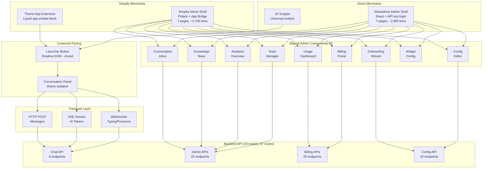

# UI/UX Architecture Decisions — Agent Red Customer Experience

**Date:** 2026-01-31
**Session:** UI/UX competitive analysis + design specification session
**Status:** All decisions approved by project owner

© 2026 Remaker Digital, a DBA of VanDusen & Palmeter, LLC. All rights reserved.

---

## Table of Contents

1. [Competitive Analysis Summary](#1-competitive-analysis-summary)
2. [Architecture Decisions](#2-architecture-decisions)
3. [Chat API Specification (Phase 1)](#3-chat-api-specification-phase-1)
4. [Chat Widget Specification (Phase 2)](#4-chat-widget-specification-phase-2)
5. [Shopify Theme App Extension (Phase 3)](#5-shopify-theme-app-extension-phase-3)
6. [Merchant Admin Dashboard (Phases 4-6)](#6-merchant-admin-dashboard-phases-4-6)
7. [New Work Items Identified](#7-new-work-items-identified)
8. [Build Order](#8-build-order)

---

## 1. Competitive Analysis Summary

Full analysis in `docs/research/UI-UX-COMPETITIVE-ANALYSIS.md`.

**Competitors analyzed:** Tidio, Gorgias, Zendesk, Intercom, Re:amaze (top 5 by Shopify installs).

**Critical finding (original, 2026-01-31):** Agent Red had zero customer-facing or merchant-facing UI. **UPDATE (2026-02-01):** All frontend deliverables now complete — chat widget, Shopify Theme App Extension, admin shared components, Shopify admin shell, standalone admin shell. Both admin shells build-validated.

**Table-stakes UI requirements for Shopify App Store credibility:**
- Embeddable chat widget (JavaScript snippet + Theme App Extension)
- Shopify embedded admin app (Polaris + App Bridge)
- Real-time conversation inbox with human takeover
- Visual onboarding wizard
- Usage and billing dashboard

**Agent Red structural advantages (none of these exist in competitors):**
- Per-customer vector RAG over historical transcripts
- Fail-closed Critic safety validation on every response
- Per-response explainability traces
- $0.007/conversation AI cost (2-13x cheaper per interaction than competitors)
- SSE streaming with ~1,500ms P50 (4.7x faster than Intercom's published 7,000ms)

### Frontend Architecture Overview (All Build Phases Complete)



---

## 2. Architecture Decisions

### Decision UI-1: Frontend Framework Selection

| Surface | Framework | Rationale |
|---------|-----------|-----------|
| Customer chat widget | **Preact** (~4.5KB gzip) | Minimum bundle size for merchant storefront injection. Compatible with React ecosystem. Target: ~15-20KB gzip total bundle (competitors: Tidio ~40-60KB, Intercom ~80-100KB) |
| Shopify embedded admin | **React + Shopify Polaris + App Bridge** | Required for Shopify App Store approval. App Bridge provides session token auth, navigation, save bar, modals, toasts |
| Standalone admin (Stripe-direct) | **React + custom design system** | Matches Agent Red brand. Tailwind CSS or similar utility-first framework. Shares component library with Shopify admin |

**Shared component library:** Both admin shells import from `admin/shared/` which contains framework-agnostic React components (no Polaris dependency). Each shell wraps shared components in its own chrome (nav, layout, auth provider).

### Decision UI-2: Widget Delivery Mechanism

| Channel | Method | Detail |
|---------|--------|--------|
| Shopify merchants | **Shopify Theme App Extension** (app embed block, `target: "body"`) | Required for App Store approval. ScriptTags deprecated. Assets hosted on Shopify CDN. Clean uninstall. Merchant-configurable in theme editor |
| Non-Shopify merchants | **Universal JavaScript snippet** | `<script src="https://widget.agentred.ai/v1/agent-red.js" data-key="pk_live_..."></script>` — self-contained, no dependencies |

### Decision UI-3: Widget DOM Isolation

**Shadow DOM (closed mode)** for the launcher button — provides CSS isolation from the merchant's storefront without a full iframe.

**iframe** for the conversation panel — provides full JS/CSS sandboxing for the chat window (same approach as Zendesk). The iframe loads the Preact widget app.

Rationale: The launcher must integrate visually with the page (position: fixed, z-index layering) while being protected from the merchant's CSS. The conversation panel needs full isolation because it runs real-time WebSocket connections, manages authentication state, and renders potentially complex content (code blocks, images, file attachments).

### Decision UI-4: Communication Protocol (Hybrid)

Three protocols, all required at launch:

| Protocol | Direction | Purpose |
|----------|-----------|---------|
| **HTTP POST** | Client → Server | Send customer messages (`POST /api/chat/message`) |
| **SSE (Server-Sent Events)** | Server → Client | Stream AI response tokens in real-time (`GET /api/chat/stream/{conversation_id}`) |
| **WebSocket** | Bidirectional | Typing indicators, presence, human-agent chat after escalation (`/ws/chat/{conversation_id}`) |

HTTP POST + SSE handles the primary AI conversation flow. WebSocket is required because escalated conversations need a bidirectional channel for human-agent live chat — this is not optional since escalated conversations need somewhere to go.

### Decision UI-5: SSE Stream-then-Validate with Critic Retraction

**Option A (approved):** Stream AI tokens to the customer in real-time via SSE, then Critic validates the complete response post-stream.

**Normal flow (>99% of responses):**
1. Response Generator streams tokens → SSE `event: token` → rendered in widget
2. Critic validates complete response (800ms budget) → SSE `event: validated`
3. Widget shows response as final

**Rejection flow (<1% of responses):**
1. Response Generator streams tokens → SSE `event: token` → rendered in widget
2. Critic rejects → SSE `event: retracted` with safe fallback text
3. Widget replaces displayed text with `SAFE_FALLBACK_MESSAGE`
4. Audit log records `SECURITY_EVENT`

**Exposure window:** ~800ms at P50 between last streamed token and Critic verdict. Acceptable because: (a) the Critic catches policy violations and safety issues, not minor quality problems; (b) the retraction UX is clear; (c) the alternative (buffer entire response until Critic approves) adds 800ms latency to every response, penalizing >99% of valid responses.

**Pipeline timing context:**
- 8,000ms is the **abort threshold** for pathological cases, not the expected duration
- Stage budgets (IC=800ms, KR=1000ms, RG=3000ms, CR=800ms) are **maximums**, not expected durations
- SLA targets: P50 < 1,500ms, P95 < 2,000ms, P99 < 5,000ms
- Only Intercom publishes actual latency: 7,000ms P50 TTFT. Agent Red target is 4.7x faster

### Decision UI-6: Widget Authentication

**Publishable widget key** — a public credential scoped exclusively to `/api/chat/*` endpoints:

```
Format: pk_live_{tenant_id_hash}_{random}
Example: pk_live_a7f3c9e1_x8k2m5p9
```

**Three auth paths in TenantAuthMiddleware:**
1. Shopify session token (JWT HS256) → existing, for Shopify admin
2. API key (SHA-256 hash lookup) → existing, for merchant server-to-server
3. Publishable widget key (new) → for client-side widget, read-only chat scope

**Publishable key properties:**
- Public — safe to embed in HTML/JS source code
- Scoped — only grants access to `/api/chat/*` endpoints
- Tenant-bound — resolves to a specific tenant_id
- `is_widget_auth = True` on TenantContext — no config mutations, no billing access

**Optional HMAC customer identity verification:**
Merchants with logged-in customers can pass an HMAC signature to verify customer identity: `HMAC-SHA256(customer_id, tenant_secret)`. This prevents customer impersonation in the widget. Optional — anonymous visitors chat without identity verification.

### Decision UI-7: Two Admin Frontends Required

Shopify-only admin is insufficient because Stripe-direct merchants exist as a billing channel. If a merchant subscribes via Stripe, they have no Shopify account and therefore cannot access a Shopify embedded admin app.

**Shopify admin shell:**
- React + Polaris + App Bridge
- Auth: Shopify session token (automatic via App Bridge)
- Navigation: App Bridge NavMenu API (appears in Shopify admin sidebar)
- Save UX: App Bridge SaveBar API
- Billing: links to Shopify admin billing page

**Standalone admin shell:**
- React + custom design system (Agent Red brand)
- Auth: API key login page
- Navigation: custom sidebar
- Save UX: custom sticky save bar
- Billing: Stripe Customer Portal redirect

Both shells render identical shared components from `admin/shared/`.

---

## 3. Chat API Specification (Phase 1)

**Location:** `src/chat/`

### Module Structure

| File | Lines (est.) | Purpose |
|------|-------------|---------|
| `models.py` | ~150 | Request/response Pydantic models: ChatMessage, ConversationStart, StreamEvent, ConversationState |
| `session.py` | ~300 | Conversation lifecycle: create, resume, end, timeout. Maps to ConversationDocument in Cosmos DB. Manages conversation_id assignment, idle timeout (30min), turn counting |
| `pipeline.py` | ~400 | 6-agent pipeline orchestrator: IC → KR → RG → CR path with PipelineTimeoutBudget. Produces SSE event stream. Calls SystemPromptBuilder, CustomerProfileService (L1), ConversationVectorizer (L2) |
| `endpoints.py` | ~250 | 6 FastAPI routes (see below) |
| `__init__.py` | ~5 | Package init |

### Endpoints

| Method | Path | Purpose |
|--------|------|---------|
| `POST /api/chat/conversations` | Start a new conversation (assigns conversation_id, creates ConversationDocument) |
| `POST /api/chat/message` | Send a customer message (appends to conversation, triggers pipeline) |
| `GET /api/chat/stream/{conversation_id}` | SSE endpoint — streams AI response tokens + Critic verdict |
| `GET /api/chat/conversations/{conversation_id}` | Get conversation state (status, turn_count, messages) |
| `POST /api/chat/conversations/{conversation_id}/end` | Customer ends conversation |
| `WS /ws/chat/{conversation_id}` | WebSocket for typing indicators, presence, human-agent chat |

### Authentication

All `/api/chat/*` endpoints accept the publishable widget key (`pk_live_...`) via `X-Widget-Key` header. The WebSocket endpoint accepts the key as a query parameter (`?key=pk_live_...`) since WebSocket does not support custom headers in the browser API.

---

## 4. Chat Widget Specification (Phase 2)

**Location:** `widget/`
**Framework:** Preact + TypeScript
**Bundle target:** ~15-20KB gzip

### Component Tree

```
WidgetRoot (Shadow DOM host)
├── Launcher (FAB button, unread badge, position: fixed)
└── ConversationFrame (iframe)
    └── WidgetApp (Preact app inside iframe)
        ├── HeaderBar (title, avatar, minimize, close)
        ├── MessageList (virtual scroll)
        │   ├── CustomerMessage
        │   ├── AgentMessage (streaming token renderer)
        │   ├── SystemMessage (escalation, retraction)
        │   └── TypingIndicator
        ├── InputBar (textarea, send button, file attach)
        ├── PreChatForm (optional: name, email before first message)
        └── ConsentBanner (GDPR: memory opt-in for Layers 2-4)
```

### State Management

```typescript
interface WidgetState {
  phase: 'closed' | 'launcher' | 'pre_chat' | 'conversation' | 'ended';
  conversationId: string | null;
  messages: Message[];
  isStreaming: boolean;
  streamBuffer: string;
  isAgentTyping: boolean;
  isHumanAgent: boolean;       // true after escalation takeover
  connectionStatus: 'connected' | 'reconnecting' | 'disconnected';
  unreadCount: number;
  visitor: { name?: string; email?: string; hmac?: string } | null;
  consentStatus: 'not_asked' | 'granted' | 'denied';
}
```

### Transport Layer

- **HTTP:** `fetch()` for `POST /api/chat/conversations`, `POST /api/chat/message`, `POST .../end`
- **SSE:** `EventSource` for `GET /api/chat/stream/{conversation_id}`. Events: `token`, `validated`, `retracted`, `error`, `done`
- **WebSocket:** Native `WebSocket` for `/ws/chat/{conversation_id}?key=pk_live_...`. Messages: `typing_start`, `typing_stop`, `presence`, `human_message`, `agent_message`

### JavaScript SDK Public API

```javascript
// Loaded via <script> tag
window.AgentRed = {
  init(config: { key: string; ... }): void;
  open(): void;
  close(): void;
  toggle(): void;
  setVisitor(visitor: { name?: string; email?: string; hmac?: string }): void;
  on(event: string, callback: Function): void;
  off(event: string, callback: Function): void;
  destroy(): void;
};
```

### Shopify Liquid Template (Theme App Extension)

```liquid
 blocks/agent-red-chat.liquid 

{
  "name": "Agent Red Chat",
  "target": "body",
  "settings": [
    { "type": "text", "id": "widget_key", "label": "Widget Key" },
    { "type": "color", "id": "primary_color", "label": "Primary Color", "default": "#C41E2A" },
    { "type": "select", "id": "position", "label": "Position", "options": [...], "default": "bottom-right" }
  ]
}


<script src="{{ 'agent-red.js' | asset_url }}" defer
  data-key="{{ block.settings.widget_key }}"
  data-color="{{ block.settings.primary_color }}"
  data-position="{{ block.settings.position }}">
</script>
```

---

## 5. Shopify Theme App Extension (Phase 3)

**Type:** App embed block with `target: "body"`
**Assets:** `agent-red.js` (widget bundle) + `agent-red.css` (minimal launcher styles)
**Configuration:** Widget key, primary color, position — configurable by merchant in Shopify theme editor
**Activation:** Merchant enables the app embed in Online Store → Themes → Customize → App embeds

---

## 6. Merchant Admin Dashboard (Phases 4-6)

### Shared Components (Deliverable D — `admin/shared/`)

9 major components, all framework-agnostic React:

| Component | Backend APIs Used | New APIs Needed |
|-----------|------------------|-----------------|
| **D1. OnboardingWizard** | `GET /api/config/schema/{step}`, `POST /api/config/validate`, `PUT /api/config`, `GET /api/config` | None |
| **D2. ConfigEditor** | `GET /api/config`, `PUT /api/config`, `GET /api/config/diff`, `GET /api/config/schema`, `GET /api/config/versions`, `POST /api/config/rollback`, `POST /api/config/reset` | None |
| **D3. UsageDashboard** | `GET /api/dashboard/usage`, `GET /api/dashboard/usage/daily`, `GET /api/dashboard/conversations`, `GET /api/dashboard/conversations/{id}`, `GET /api/dashboard/conversations/export` | None |
| **D4. ConversationInbox** | ConversationRepository queries | `GET /api/conversations`, `GET /api/conversations/{id}/transcript`, `POST /api/conversations/{id}/takeover`, `WS /ws/conversations` |
| **D5. KnowledgeBaseManager** | — | `GET/POST/PUT/DELETE /api/knowledge/*` |
| **D6. AnalyticsOverview** | — | `GET /api/analytics/summary`, `GET /api/analytics/intents`, `GET /api/analytics/gaps` |
| **D7. BillingPortal** | `GET /api/shopify/billing/status`, `POST /api/billing/portal`, `POST /api/packs/purchase`, `GET /api/packs/balance/{id}` | None |
| **D8. WidgetConfigurator** | `GET /api/config`, `PUT /api/config` | Widget appearance fields in config schema |
| **D9. TeamManager** | — | `GET/POST/DELETE /api/team/*` |

**Pages fully supported by existing endpoints (no new backend):** OnboardingWizard, ConfigEditor, UsageDashboard, BillingPortal

**Pages requiring new backend APIs:** ConversationInbox (conversation management + WebSocket), KnowledgeBaseManager (KB CRUD), AnalyticsOverview (aggregation queries), TeamManager (member management)

### Shopify Embedded Admin (Deliverable E — `admin/shopify/`)

7 navigation items mapping to shared components:
1. Dashboard → AnalyticsOverview + UsageDashboard
2. Inbox → ConversationInbox
3. Configuration → ConfigEditor (or OnboardingWizard on first visit)
4. Knowledge Base → KnowledgeBaseManager
5. Widget → WidgetConfigurator
6. Billing → BillingPortal (Shopify variant)
7. Settings → TeamManager + GDPR controls

Shopify-specific: App Bridge NavMenu, TitleBar, SaveBar, Modal, Toast, Redirect APIs.

### Standalone Admin (Deliverable F — `admin/standalone/`)

Same 7 pages. Differences: custom sidebar navigation, API key login page, Stripe Customer Portal for billing (not Shopify admin), Agent Red branded design system.

---

## 7. New Work Items Identified

This session identified the following work items needed to support the UI:

### New Backend APIs (blocks admin components)

| WI | Description | Blocks |
|----|-------------|--------|
| WI-164 | `POST /api/chat/conversations` — start conversation | Chat API (Phase 1) |
| WI-165 | `POST /api/chat/message` — send customer message + trigger pipeline | Chat API (Phase 1) |
| WI-166 | `GET /api/chat/stream/{id}` — SSE response streaming | Chat API (Phase 1) |
| WI-167 | `GET /api/chat/conversations/{id}` — conversation state | Chat API (Phase 1) |
| WI-168 | `POST /api/chat/conversations/{id}/end` — end conversation | Chat API (Phase 1) |
| WI-169 | `WS /ws/chat/{id}` — WebSocket for typing/presence/human chat | Chat API (Phase 1) + widget |
| WI-170 | Publishable widget key auth path in TenantAuthMiddleware | Chat API + widget |
| WI-171 | `GET /api/conversations` — list active conversations (admin) | ConversationInbox (D4) |
| WI-172 | `GET /api/conversations/{id}/transcript` — full transcript | ConversationInbox (D4) |
| WI-173 | `POST /api/conversations/{id}/takeover` — human takeover | ConversationInbox (D4) |
| WI-174 | `WS /ws/conversations` — admin real-time conversation feed | ConversationInbox (D4) |
| WI-175 | `GET/POST/PUT/DELETE /api/knowledge/*` — KB CRUD | KnowledgeBaseManager (D5) |
| WI-176 | `GET /api/analytics/summary` — aggregated metrics | AnalyticsOverview (D6) |
| WI-177 | `GET /api/analytics/intents` — top intents by volume | AnalyticsOverview (D6) |
| WI-178 | `GET /api/analytics/gaps` — knowledge gap report | AnalyticsOverview (D6) |
| WI-179 | `GET/POST/DELETE /api/team/*` — team member CRUD | TeamManager (D9) |
| WI-180 | `POST /api/gdpr/export`, `POST /api/gdpr/delete` — GDPR endpoints | Settings page |
| WI-181 | Widget appearance config fields in tenant_config_schema.py | WidgetConfigurator (D8) |

### Frontend Deliverables

| WI | Description | Phase |
|----|-------------|-------|
| WI-182 | Chat API module (`src/chat/`) — models, session, pipeline, endpoints | Phase 1 |
| WI-183 | Chat widget (`widget/`) — Preact app, Shadow DOM launcher, iframe panel | Phase 2 |
| WI-184 | Shopify Theme App Extension — app embed block + Liquid template | Phase 3 |
| WI-185 | Shared admin component library (`admin/shared/`) | Phase 4 |
| WI-186 | Shopify embedded admin shell (`admin/shopify/`) | Phase 5 |
| WI-187 | Standalone admin shell (`admin/standalone/`) | Phase 6 |

---

## 8. Build Order

Phases are sequenced by dependency. Each phase produces a deployable increment.

| Phase | Deliverable | Dependencies | Launch-Required |
|-------|-------------|-------------|-----------------|
| **1** | Chat API endpoints (`src/chat/`) | Existing pipeline modules, ConversationMeter, SystemPromptBuilder, CustomerProfileService | Yes |
| **2** | Chat widget (`widget/`) | Phase 1 endpoints | Yes |
| **3** | Shopify Theme App Extension | Phase 2 widget bundle | Yes (for Shopify channel) |
| **4** | Shared admin component library (`admin/shared/`) | Phase 1 endpoints + existing /api/config, /api/dashboard | Yes |
| **5** | Shopify embedded admin shell (`admin/shopify/`) | Phase 4 components | Yes (for Shopify channel) |
| **6** | Standalone admin shell (`admin/standalone/`) | Phase 4 components | Yes (for Stripe channel) |

**Within the admin, component build priority:**
1. OnboardingWizard + ConfigEditor (merchant cannot configure AI without this)
2. UsageDashboard + BillingPortal (merchant cannot monitor costs)
3. ConversationInbox (merchant cannot see conversations or handle escalations)
4. WidgetConfigurator (merchant cannot customize widget appearance)
5. KnowledgeBaseManager (KB content can use config API initially)
6. AnalyticsOverview (useful but not blocking — core metrics in UsageDashboard)
7. TeamManager (single-user launch viable; multi-user is enhancement)

Items 1-2 required for launch. Items 3-4 required for effective merchant operation.
