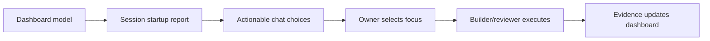

# GT-KB Session Startup and Project Dashboard

**Status:** Active  
**Audience:** owner, Prime Builder, Loyal Opposition reviewer, release stakeholders  
**Primary artifacts:** `docs/gtkb-dashboard/index.html`, `docs/gtkb-dashboard/session-startup-report.md`, `docs/gtkb-dashboard/agent-red-project-dashboard.pdf`

This guide explains how Agent Red uses GT-KB as project governance and delivery infrastructure. The dashboard reports the Agent Red project state; GT-KB implementation details appear only as supporting infrastructure health.

---

## Control Surface

Open the dashboard locally:

```text
docs/gtkb-dashboard/index.html
```

The top of the dashboard is designed for fast orientation: generated time, branch/commit, PDF export, and the delivery timeline appear before the deeper tables.


## Session Startup

Fresh sessions should begin with the generated focus choices in the AI/user chat stream. The choices are not static. They are ordered from the current dashboard model so that blockers, integration failures, release-path gaps, and risk signals rise to the top.


### Harness-Local Dashboard Opening

The startup hook can request that the live dashboard be opened at the beginning
of each session. By default, that request is handled by the AI harness browser
connector so dashboard inspection stays inside the harness-controlled browser
session instead of launching the operating system's default browser.

This preference is intentionally user-local and machine-specific. Store it in:

```text
C:\Users\micha\.codex\agent-red-hooks\session-startup-preferences.json
```

Enable automatic opening:

```json
{
  "open_dashboard_on_session_start": true,
  "dashboard_open_mode": "harness_browser"
}
```

Disable automatic opening:

```json
{
  "open_dashboard_on_session_start": false
}
```

If the file is missing, malformed, or set to `false`, startup does not open a
browser. Harness browser failures are non-fatal and do not block the normal
startup disclosure.

The legacy operating-system browser path is available only as an explicit local
override:

```json
{
  "open_dashboard_on_session_start": true,
  "dashboard_open_mode": "system_default_browser"
}
```

Future owner requests using `enable dashboard` or `disable dashboard` should be
handled by toggling only the user-local `open_dashboard_on_session_start`
preference. Do not change the mode away from `harness_browser` unless Mike
explicitly asks to use the operating system browser.

Recommended operating pattern:

1. Start with the generated session startup report.
2. Pick one focus option from the chat stream.
3. Use the dashboard as supporting evidence, not as the action selector.
4. Keep GT-KB implementation work out of Agent Red product KPIs unless it affects project delivery health.
5. Capture the result in GT-KB evidence, backlog disposition, or the next session startup summary.



## Delivery Timeline

The delivery timeline should remain directly below the heading block. It shows commits, builds, staging deployments, production deployments, version/build labels, calendar dates, and test results from oldest to newest.


Use the timeline to answer:

- Is work clustered around release dates or spread evenly?
- Did a build/test/deploy chain complete after the latest relevant commit?
- Are staging and production deployments aligned with version manifests?
- Are failures concentrated in a specific stage?

## Health Strip and Action Center

The health strip gives a visual release posture snapshot; the Action Center identifies the next corrective move.


Use these sections before committing, merging, or pushing. If release blockers, failing integrations, unknown GT-KB version posture, or stale evidence remain, the dashboard should describe the remediation path rather than implying readiness.

## Testing Service / Tool Integrations

Each testing service or tool integration is a collapsible subsection with a red/yellow/green status dot. Expanded details are shown as a two-column table so failing services can include direct remediation guidance.


The integration section should include, at minimum:

- GitHub Actions
- GitHub CLI authentication
- SonarCloud
- Dependabot
- CodeQL or equivalent security scan
- Ruff
- Pytest
- Playwright or browser verification
- PDF export generation

## Stakeholder Export

Use the single dashboard export control to produce:

```text
docs/gtkb-dashboard/agent-red-project-dashboard.pdf
```

The exported PDF is intended for stakeholder distribution. Before distribution, verify that the dashboard excludes implementation-specific GT-KB project KPIs except where they are relevant as Agent Red delivery infrastructure.

## Maintenance Rules

- Keep the dashboard focused on Agent Red product/project state.
- Treat GT-KB as infrastructure used to implement Agent Red.
- Keep session startup choices in the chat stream, not as a dashboard-only interaction.
- Keep the timeline visually first so delivery rhythm is visible immediately.
- Keep all failing integrations paired with suggested remediation.
- Regenerate screenshots when the dashboard layout changes materially.
