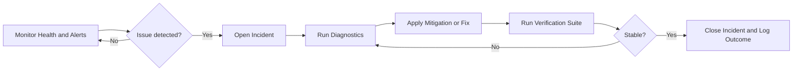
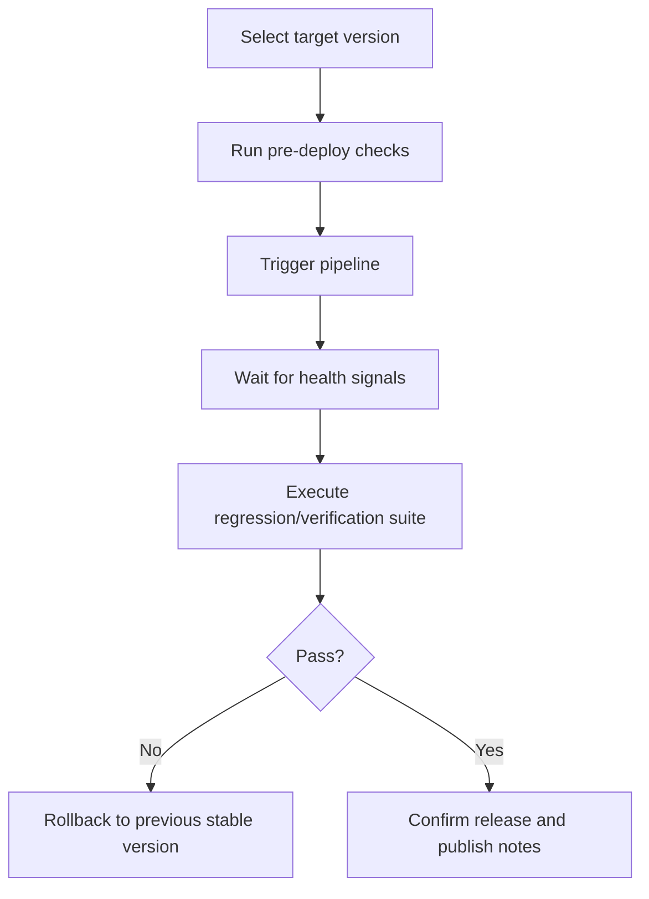

# Provider console

The Provider console is the platform-operator workspace used by Remaker Digital (or authorized operators) to run Agent Red across all tenants. It is separate from the merchant admin console and focuses on cross-tenant operations, reliability, compliance, and release control.

:::info Scope
Merchant users manage their own storefront configuration in the standard admin console. The Provider console is for platform operations only.
:::

## Core workspaces

| Workspace | Primary purpose |
|---|---|
| Tenant directory | View tenant status, tier, activity, and lifecycle actions |
| Health dashboard | Monitor API, database, cache, queue, and dependency health |
| Incident management | Create, track, and resolve platform incidents |
| Alert configuration | Manage thresholds, channels, and operational notifications |
| Compliance dashboard | Review privacy and retention posture at platform scope |
| Secret posture | Validate security controls and key management coverage |
| Deployment management | Trigger and monitor controlled deployments |
| Test execution | Run verification suites before or after release changes |
| Support diagnostics | Collect targeted diagnostics for tenant or environment issues |

## Operational workflow

## Deployment control workflow

## Security model

- Provider access is restricted to platform operators and protected by API-key login plus MFA/TOTP controls.
- Operator authentication posture is configured in [Securing Agent Red](/docs/admin-guide/mfa-security).
- Provider actions are auditable and designed for least-privilege operation.

## When to use this console

- A tenant or environment reports service degradation.
- A production/staging deployment must be executed or audited.
- Compliance, retention, or security posture needs platform-wide review.
- Ops teams need centralized diagnostics before escalating to engineering.

---

*© 2026 Remaker Digital, a DBA of VanDusen & Palmeter, LLC. All rights reserved.*

