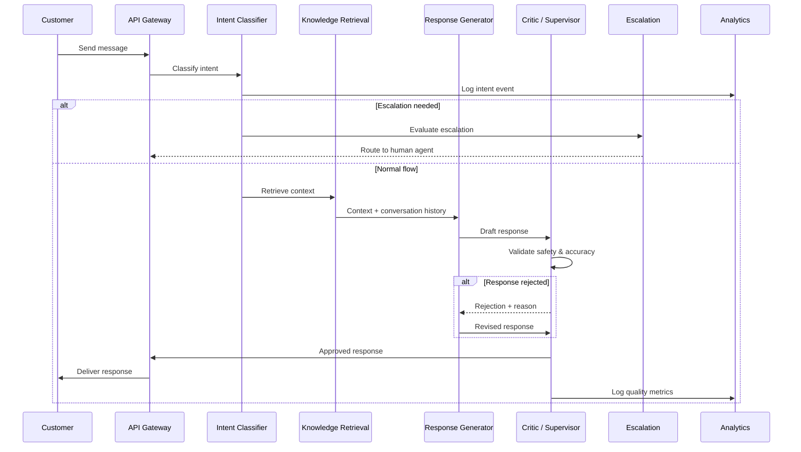
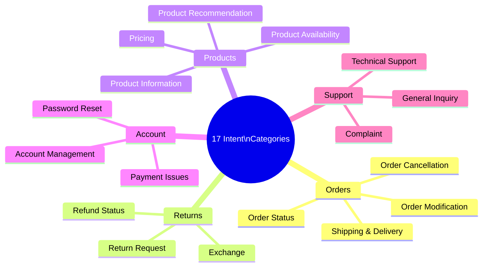
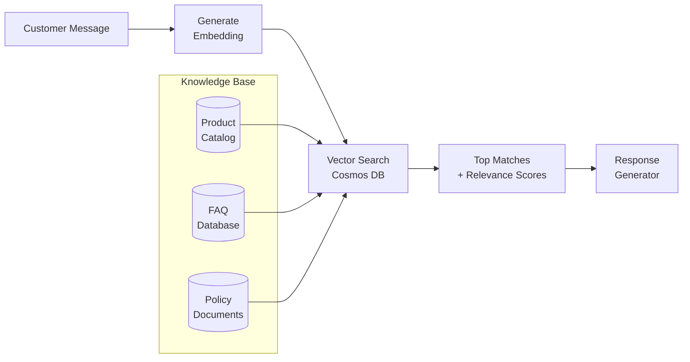
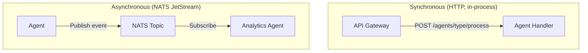
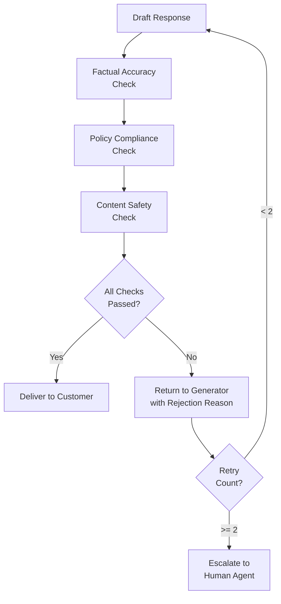
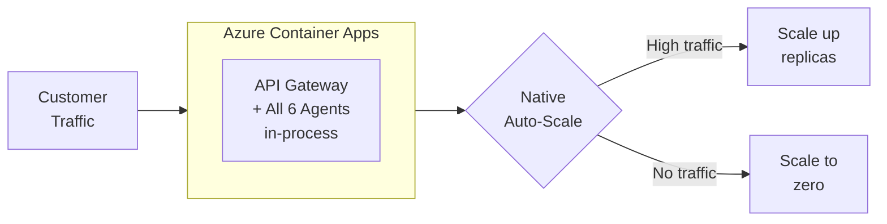
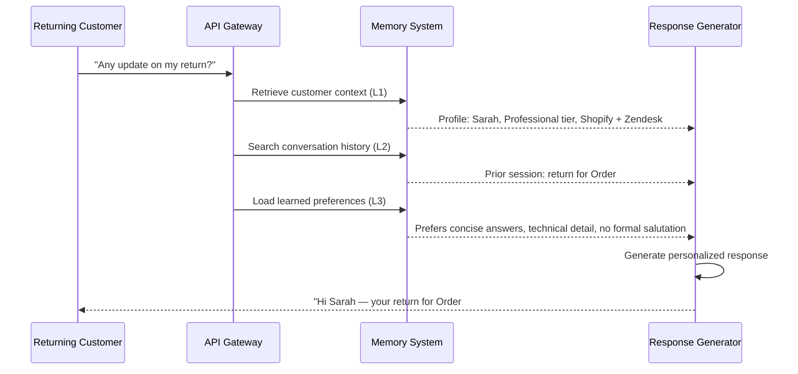

# How It Works

This page explains how Agent Red processes a customer conversation from first message to delivered response. Understanding the pipeline helps you configure agents, tune escalation rules, and interpret analytics data.

## End-to-end conversation flow

A single customer message passes through multiple agents before a response is delivered. The diagram below shows the complete path, including the feedback loop when the Critic rejects a response.



### What happens at each step

**1. API Gateway receives the message.** The customer's message arrives over HTTPS. The API Gateway authenticates the request using the tenant's API key, attaches tenant context, and forwards the message into the agent pipeline.

**2. Intent Classifier determines the customer's need.** The classifier analyzes the message text and assigns one of 17 intent categories using GPT-4o-mini. The classified intent determines which knowledge sources the retrieval agent searches and how the response generator frames its reply.



**3. Escalation Detection runs in parallel.** While the main pipeline processes the message, the escalation agent independently evaluates whether the conversation requires a human. It assesses customer sentiment, issue complexity, account value, and conversation history. If escalation triggers, the system routes the conversation to a human agent in your help desk (Zendesk, or another connected platform) and notifies the customer that a person is taking over.

Escalation rules are configurable per tenant — you control which situations trigger a handoff to a human agent.

**4. Knowledge Retrieval searches your data.** The retrieval agent takes the classified intent and customer message and runs a semantic vector search against your knowledge base. This includes:

- **Product catalog** — synced from Shopify (names, descriptions, prices, availability)
- **FAQ database** — your custom question-and-answer pairs
- **Policy documents** — return policies, shipping rules, warranty terms

The search uses `text-embedding-3-large` embeddings stored in Cosmos DB's DiskANN vector search index. It returns the top matching documents with relevance scores.



**5. Response Generator composes the reply.** The response generator receives the classified intent, retrieved knowledge, full conversation history, and Persistent Customer Memory context. It uses GPT-4o to compose a natural-language reply that:

- Answers the customer's question using retrieved facts (not hallucinated information)
- Maintains your brand's tone and voice
- Follows your configured response policies (greeting style, sign-off, escalation language)
- Handles multi-turn context (remembers what was discussed earlier in the conversation)
- Personalizes the response using the customer's profile, prior interactions, and learned preferences

Response generation accounts for approximately 94.5% of per-conversation AI cost because it uses the more capable GPT-4o model.

**6. Critic / Supervisor validates before delivery.** The critic agent is the final gate before the customer sees a response. It checks:

- **Factual accuracy** — Does the response match the retrieved knowledge? Are product names, prices, and policies correct?
- **Policy compliance** — Does the response follow your configured business rules?
- **Content safety** — Does the response contain inappropriate, harmful, or off-brand content?

If validation fails, the critic returns the response to the generator with a specific rejection reason, and the generator revises it. This feedback loop runs until the response passes or reaches a maximum retry count (default: 2), at which point the system escalates to a human agent.

The critic applies a fail-closed policy: responses are blocked unless all checks pass. This conservative approach prioritizes safety over throughput.

**7. Analytics records the interaction.** The analytics agent captures structured data from every conversation: intent distribution, response quality scores, escalation rates, latency, and customer satisfaction signals. This data powers the analytics dashboard and feeds continuous improvement cycles.

## Communication protocols

The six agents run in-process within a single API Gateway container. They communicate through two complementary systems: synchronous HTTP endpoints for the request-response pipeline, and asynchronous NATS JetStream events for analytics, logging, and decoupled processing.



### HTTP endpoints (synchronous pipeline)

Each agent exposes a POST endpoint within the API Gateway process. The main pipeline calls agents sequentially (intent → knowledge → response → critic) via internal HTTP calls. Health check endpoints are exposed for Azure Container Apps readiness probes.

### NATS JetStream (event bus)

NATS provides asynchronous event delivery with tenant-level stream isolation for:

- **Analytics events** — every pipeline step publishes metrics to NATS topics
- **Decoupled processing** — agents that do not need immediate responses communicate through events
- **Short-term durability** — JetStream retains events for 5 minutes, providing resilience during brief processing delays

Each tenant gets isolated NATS streams to prevent cross-tenant data leakage. Agents subscribe to dedicated topics for routing:

| Topic | Agent |
|---|---|
| `intent-classifier` | Intent Classification |
| `knowledge-retrieval` | Knowledge Retrieval |
| `response-generator-en` | Response Generation (English) |
| `escalation-handler` | Escalation |
| `analytics-collector` | Analytics |
| `critic-supervisor` | Critic / Supervisor |

## Internal message format

Agents exchange messages as JSON payloads over internal HTTP endpoints. Every message carries conversation context and tenant isolation:

```json
{
  "conversation_id": "conv-abc123",
  "tenant_id": "tenant-acme-corp",
  "message": "Where is my order #12345?",
  "intent": "order_status",
  "context": {
    "history": [...],
    "customer_profile": {...},
    "retrieved_knowledge": [...]
  },
  "metadata": {
    "language": "en",
    "timestamp": "2026-01-15T14:32:00Z"
  }
}
```

| Field | Purpose |
|---|---|
| `conversation_id` | Threads messages into a conversation (maintained across turns) |
| `tenant_id` | Ensures tenant isolation throughout the pipeline |
| `intent` | Classified intent from the Intent Classifier |
| `context` | Accumulated pipeline context (history, profile, knowledge) |
| `metadata` | Language, timestamps, and routing information |

The `conversation_id` persists across an entire customer conversation, allowing agents to reference previous messages. End-to-end traceability is available through OpenTelemetry and Application Insights.

## PII protection

Agent Red provides PII protection at three levels:

### Pipeline PII tokenization

Before any customer message reaches the AI models, Agent Red's PII tokenizer scans the text and replaces detected email addresses and phone numbers with reversible UUID tokens. The AI processes the tokenized text, and after the Critic validates the response, detected tokens are replaced with the original values before delivery to the customer. This means the AI models never see raw PII during processing.

Token mappings are stored in an isolated Cosmos DB container with a 7-day TTL, and are automatically purged when a customer exercises their GDPR right to erasure.

### Storage-layer PII scrubbing

When PII scrubbing is enabled in the [Memory & Privacy](/docs/admin-guide/customer-memory) settings, Agent Red automatically redacts email addresses and phone numbers from conversation transcripts before storing them. This protects customer data at rest while leaving the live conversation experience unchanged.

### Azure security perimeter

All AI processing uses Azure OpenAI Service, which means customer data stays within the Azure security perimeter. Data does not leave Azure infrastructure during conversation processing.


## Content safety pipeline

The Critic / Supervisor agent runs a multi-check validation pipeline on every generated response before delivery.



| Check | What it validates | Failure action |
|---|---|---|
| Factual accuracy | Response matches retrieved knowledge; no hallucinated data | Regenerate with stricter grounding |
| Policy compliance | Response follows business rules (refund limits, warranty terms) | Regenerate with policy context |
| Content safety | No inappropriate, harmful, or off-brand content | Regenerate or escalate |

The safety pipeline catches issues before they reach customers. The system uses a fail-closed policy — responses are blocked unless the critic explicitly approves them.

## Scaling behavior

Agent Red runs as a unified API Gateway on Azure Container Apps with native auto-scaling. The six agents run in-process within the gateway container, so scaling is at the container level rather than per-agent.



| Behavior | Description |
|---|---|
| Scale-to-zero | Container stops when idle, restarts on first request |
| Auto-scale up | Azure Container Apps scales replicas based on HTTP concurrency |
| Serverless database | Cosmos DB Serverless charges only for consumed RUs — no idle cost |
| Design target | 50 concurrent tenants at launch |

## Persistent Customer Memory

Most support platforms treat every conversation as a blank slate. Agent Red maintains a layered memory system that builds context over the lifetime of each customer relationship. The response generator draws on this memory to personalize every interaction — greeting returning customers by name, referencing prior issues, and adapting to individual communication preferences.

### Memory architecture

```mermaid
flowchart TB
    subgraph Layer 1 — Customer Context
        direction LR
        L1A[Shopify Profile] --> L1B[Customer Context\nProfile]
        L1C[Integration Data] --> L1B
        L1D[Plan & Tier Info] --> L1B
    end

    subgraph Layer 2 — Conversation Memory
        direction LR
        L2A[Conversation\nTranscript] --> L2B[Cleanse PII\n& Transient Data]
        L2B --> L2C[Chunk &\nEmbed]
        L2C --> L2D[(Vector Store\nCosmos DB)]
    end

    subgraph Layer 3 — Cross-Session Learning
        direction LR
        L3A[Accumulated\nTranscripts] --> L3B[Memory\nFramework]
        L3B --> L3C[Extracted\nPreferences]
        L3B --> L3D[Communication\nStyle]
        L3B --> L3E[Recurring\nPatterns]
    end

    subgraph Layer 4 — Dedicated Model Training
        direction LR
        L4A[1,000+\nInteractions] --> L4B[Fine-Tuning\nPipeline]
        L4B --> L4C[Per-Customer\nModel]
    end

    L1B --> RG[Response Generator]
    L2D --> RG
    L3C & L3D & L3E --> RG
    L4C --> RG
```

### How each layer works



**Layer 1: Customer Context (all tiers)** — A structured profile assembled from Shopify data, integration sources, and plan metadata. Injected into every conversation automatically. The response generator knows the customer's name, plan tier, active integrations, and communication preferences from the first message.

**Layer 2: Conversation Memory (all tiers)** — After each conversation, the transcript is cleansed of PII and transient data (session tokens, temporary URLs), chunked, and embedded into Cosmos DB's vector store. When a customer returns, the response generator retrieves semantically relevant prior conversations — no need for the customer to repeat themselves.

**Layer 3: Cross-Session Learning (Professional and Enterprise)** — A memory framework analyzes accumulated conversations to extract durable patterns: preferred communication style, recurring issues, escalation triggers, and product preferences. These learned insights are injected alongside the customer profile, enabling the AI to adapt its tone and proactively address known issues.

**Layer 4: Dedicated Model Training (Enterprise add-on)** — After a customer accumulates 1,000+ interactions, Agent Red can create a fine-tuned AI model specifically for that customer. The fine-tuning pipeline trains on the customer's historical data via Azure OpenAI, producing a per-customer model that delivers maximum personalization. Models are periodically re-trained as new interactions accumulate.

### Memory by tier

| Layer | Starter | Professional | Enterprise |
|-------|---------|-------------|------------|
| Customer Context (L1) | Included | Included | Included |
| Conversation Memory (L2) | Included | Included | Included |
| Cross-Session Learning (L3) | — | Included | Included |
| Dedicated Model Training (L4) | — | — | Add-on |

### Privacy and data handling

- Layers 1–3 operate under GDPR/CCPA legitimate interest — no additional consent required
- All memory data is tenant-isolated (customer A's memory never appears in customer B's context)
- Customers can request deletion of their memory profile and all associated data
- Conversation transcripts are cleansed of PII before vectorization

See the [Privacy Policy](https://www.iubenda.com/privacy-policy/51316355) for full details on data handling and retention.

## Next steps

- [Initial Setup](./setup) — What you need to get Agent Red running for your store.
- [Shopify Integration](/docs/integrations/shopify) — Connect your product catalog and order data.

---

*© 2026 Remaker Digital, a DBA of VanDusen & Palmeter, LLC. All rights reserved.*
