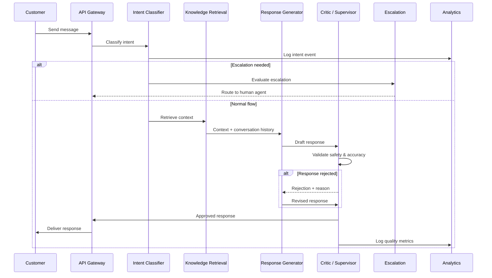
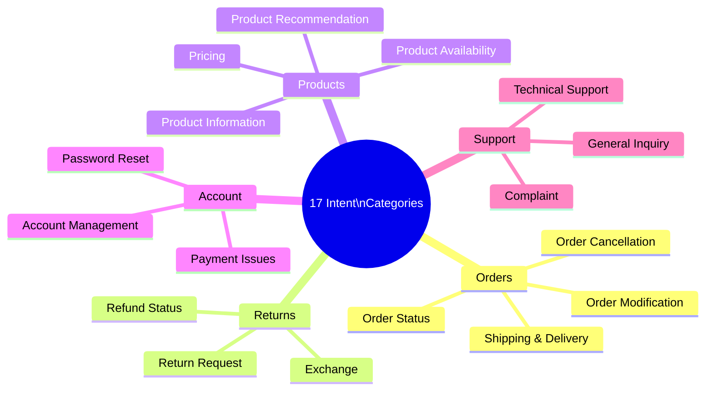
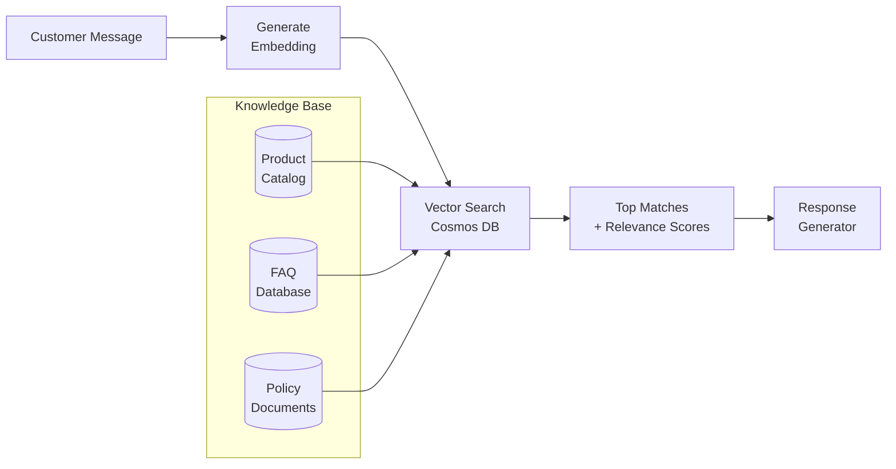
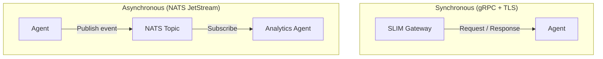
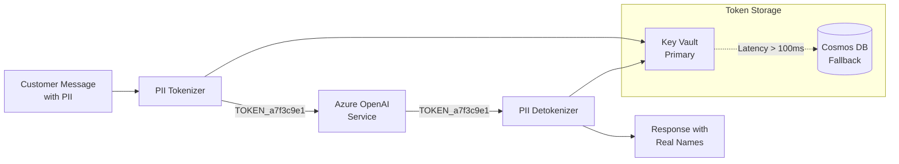
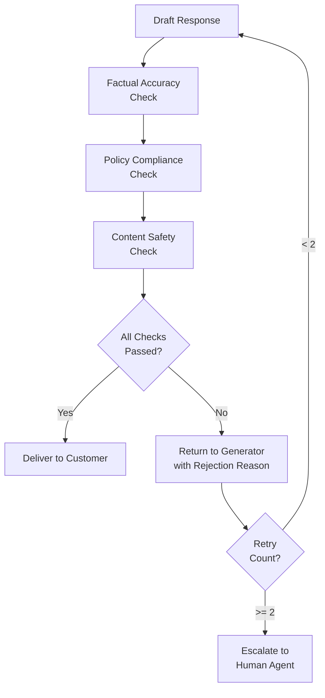
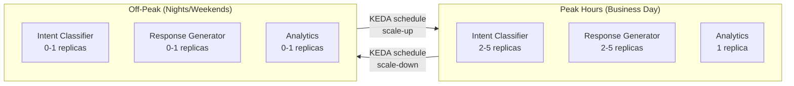
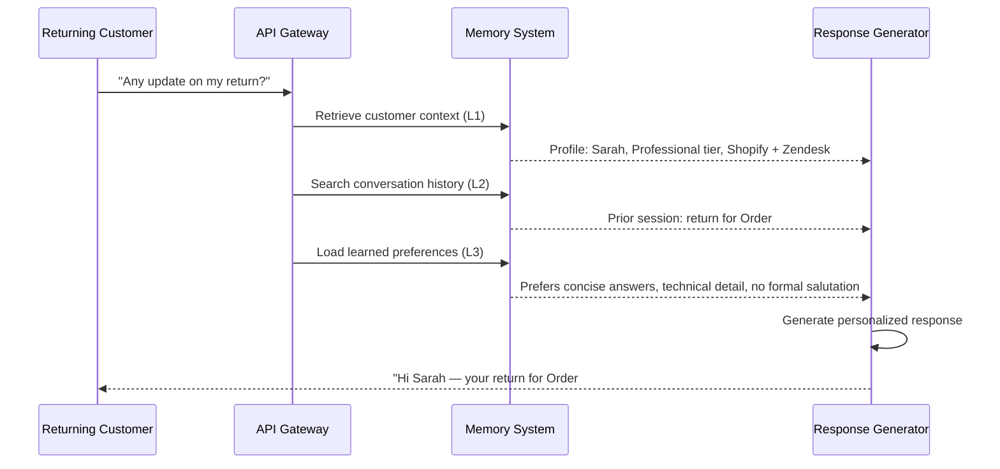

# How It Works

This page explains how Agent Red processes a customer conversation from first message to delivered response. Understanding the pipeline helps you configure agents, tune escalation rules, and interpret analytics data.

## End-to-end conversation flow

A single customer message passes through multiple agents before a response is delivered. The diagram below shows the complete path, including the feedback loop when the Critic rejects a response.



### What happens at each step

**1. API Gateway receives the message.** The customer's message arrives over HTTPS. The Application Gateway terminates TLS and applies WAF rules. The API Gateway authenticates the request using the tenant's API key, attaches tenant context, and forwards the message into the agent pipeline.

**2. Intent Classifier determines the customer's need.** The classifier analyzes the message text and assigns one of 17 intent categories. It uses GPT-4o-mini, which provides 98% classification accuracy at a fraction of GPT-4o's cost. The classified intent determines which knowledge sources the retrieval agent searches and how the response generator frames its reply.



**3. Escalation Detection runs in parallel.** While the main pipeline processes the message, the escalation agent independently evaluates whether the conversation requires a human. It assesses customer sentiment, issue complexity, account value, and conversation history. If escalation triggers, the system routes the conversation to a human agent in your help desk (Zendesk, or another connected platform) and notifies the customer that a person is taking over.

Escalation achieves 100% precision (no false alarms) and 100% recall (no missed cases) on the evaluated test set.

**4. Knowledge Retrieval searches your data.** The retrieval agent takes the classified intent and customer message and runs a semantic vector search against your knowledge base. This includes:

- **Product catalog** — synced from Shopify (names, descriptions, prices, availability)
- **FAQ database** — your custom question-and-answer pairs
- **Policy documents** — return policies, shipping rules, warranty terms

The search uses `text-embedding-3-large` embeddings stored in Cosmos DB's vector search index. It returns the top matching documents with relevance scores, achieving 100% retrieval accuracy at rank 1 on the evaluation set.



**5. Response Generator composes the reply.** The response generator receives the classified intent, retrieved knowledge, full conversation history, and Persistent Customer Memory context. It uses GPT-4o to compose a natural-language reply that:

- Answers the customer's question using retrieved facts (not hallucinated information)
- Maintains your brand's tone and voice
- Follows your configured response policies (greeting style, sign-off, escalation language)
- Handles multi-turn context (remembers what was discussed earlier in the conversation)
- Personalizes the response using the customer's profile, prior interactions, and learned preferences

Response generation accounts for approximately 94.5% of per-conversation AI cost because it uses the more capable GPT-4o model.

**6. Critic / Supervisor validates before delivery.** The critic agent is the final gate before the customer sees a response. It checks:

- **Factual accuracy** — Does the response match the retrieved knowledge? Are product names, prices, and policies correct?
- **Policy compliance** — Does the response follow your configured business rules?
- **Content safety** — Does the response contain inappropriate, harmful, or off-brand content?

If validation fails, the critic returns the response to the generator with a specific rejection reason, and the generator revises it. This feedback loop runs until the response passes or reaches a maximum retry count (default: 2), at which point the system escalates to a human agent.

The critic achieves 0% false positive rate (no good responses rejected) and 100% true positive rate (all unsafe responses caught) on the evaluated test set.

**7. Analytics records the interaction.** The analytics agent captures structured data from every conversation: intent distribution, response quality scores, escalation rates, latency, and customer satisfaction signals. This data powers the analytics dashboard and feeds continuous improvement cycles.

## Communication protocols

Agents communicate through two complementary systems: synchronous gRPC calls for the request-response pipeline, and asynchronous NATS events for analytics, logging, and decoupled processing.



### SLIM transport (gRPC)

SLIM (Secure Lightweight Inter-agent Messaging) handles real-time agent-to-agent communication. It provides:

- **gRPC with TLS** — encrypted, authenticated communication between containers
- **Request-response pattern** — synchronous calls for the main pipeline (intent → knowledge → response → critic)
- **Connection pooling** — up to 100 concurrent connections with 20 keepalive connections per agent
- **Health checks** — each agent exposes a health endpoint for Container Apps readiness probes

### NATS JetStream (event bus)

NATS provides asynchronous, durable event delivery for:

- **Analytics events** — every pipeline step publishes metrics to NATS topics
- **Decoupled processing** — agents that do not need immediate responses communicate through events
- **Durability** — JetStream retains events for 7 days, ensuring no data loss during transient failures

Each agent subscribes to a dedicated topic for routing:

| Topic | Agent |
|---|---|
| `intent-classifier` | Intent Classification |
| `knowledge-retrieval` | Knowledge Retrieval |
| `response-generator-en` | Response Generation (English) |
| `response-generator-fr-ca` | Response Generation (French-CA) |
| `escalation-handler` | Escalation |
| `analytics-collector` | Analytics |
| `critic-supervisor` | Critic / Supervisor |

## A2A message format

Agents exchange messages using the Agent-to-Agent (A2A) protocol. Every message carries conversation context and workflow tracking:

```json
{
  "messageId": "msg-a7f3c9e1-4b2d-8f6a",
  "role": "user",
  "parts": [
    {
      "type": "text",
      "text": "Where is my order #12345?"
    }
  ],
  "contextId": "conv-thread-abc123",
  "taskId": "workflow-xyz789",
  "metadata": {
    "language": "en",
    "sentiment": "neutral",
    "tenantId": "tenant-acme-corp",
    "timestamp": "2026-01-15T14:32:00Z"
  }
}
```

| Field | Purpose |
|---|---|
| `messageId` | Unique identifier for this message |
| `contextId` | Threads messages into a conversation (maintained across turns) |
| `taskId` | Tracks the message through the pipeline workflow |
| `parts` | Message content (text, structured data, or both) |
| `metadata` | Tenant context, language, sentiment, and routing information |

The `contextId` persists across an entire customer conversation, allowing agents to reference previous messages. The `taskId` changes with each pipeline invocation, providing end-to-end traceability in Application Insights.

## PII protection

Agent Red tokenizes personally identifiable information (PII) before sending data to external AI models. This ensures that customer names, email addresses, phone numbers, and other sensitive data never leave the Azure perimeter in plaintext.



### How tokenization works

1. The tokenizer scans the customer message for PII patterns (names, emails, phone numbers, addresses, order numbers).
2. Each PII value is replaced with a random UUID token in the format `TOKEN_a7f3c9e1-4b2d-8f6a-9c3e`.
3. The mapping between tokens and real values is stored in Azure Key Vault (primary) with Cosmos DB as a fallback if Key Vault latency exceeds 100ms.
4. The tokenized message is sent to Azure OpenAI for processing.
5. The AI response (containing tokens, not real data) is detokenized before delivery to the customer.

**Exemption:** Communication with Azure OpenAI Service does not require tokenization because the data stays within the Azure security perimeter. Tokenization applies to any future integration with third-party AI services outside the Azure boundary.

## Content safety pipeline

The Critic / Supervisor agent runs a multi-check validation pipeline on every generated response before delivery.



| Check | What it validates | Failure action |
|---|---|---|
| Factual accuracy | Response matches retrieved knowledge; no hallucinated data | Regenerate with stricter grounding |
| Policy compliance | Response follows business rules (refund limits, warranty terms) | Regenerate with policy context |
| Content safety | No inappropriate, harmful, or off-brand content | Regenerate or escalate |

The safety pipeline catches issues before they reach customers. On the evaluation test set, it achieved a 0% false positive rate (no unnecessary blocks) and a 100% true positive rate (all unsafe content caught).

## Auto-scaling behavior

Agent Red uses KEDA (Kubernetes Event-Driven Autoscaling) profiles on Azure Container Apps. Each agent scales independently based on its queue depth and CPU utilization.



| Agent | Scaling behavior | Resource allocation |
|---|---|---|
| Intent Classifier | Scales with request volume | 0.5 CPU, 1 GB memory |
| Knowledge Retrieval | Scales with request volume | 0.5 CPU, 1 GB memory |
| Response Generator | Scales with request volume (most resource-intensive) | 1.0 CPU, 2 GB memory |
| Critic / Supervisor | Scales with response volume | 0.5 CPU, 1 GB memory |
| Escalation | Scales with request volume | 0.25 CPU, 0.5 GB memory |
| Analytics | Batch processing, right-sized low | 0.25 CPU, 0.5 GB memory |

Scale-to-zero during off-peak hours saves approximately $20–30/month. The system handles up to 10,000 daily active users and 3,071 requests per second with auto-scaling enabled.

## Persistent Customer Memory

Most support platforms treat every conversation as a blank slate. Agent Red maintains a layered memory system that builds context over the lifetime of each customer relationship. The response generator draws on this memory to personalize every interaction — greeting returning customers by name, referencing prior issues, and adapting to individual communication preferences.

### Memory architecture

```mermaid
flowchart TB
    subgraph Layer 1 — Customer Context
        direction LR
        L1A[Shopify Profile] --> L1B[Customer Context\nProfile]
        L1C[Integration Data] --> L1B
        L1D[Plan & Tier Info] --> L1B
    end

    subgraph Layer 2 — Conversation Memory
        direction LR
        L2A[Conversation\nTranscript] --> L2B[Cleanse PII\n& Transient Data]
        L2B --> L2C[Chunk &\nEmbed]
        L2C --> L2D[(Vector Store\nCosmos DB)]
    end

    subgraph Layer 3 — Cross-Session Learning
        direction LR
        L3A[Accumulated\nTranscripts] --> L3B[Memory\nFramework]
        L3B --> L3C[Extracted\nPreferences]
        L3B --> L3D[Communication\nStyle]
        L3B --> L3E[Recurring\nPatterns]
    end

    subgraph Layer 4 — Dedicated Model Training
        direction LR
        L4A["1,000+\nInteractions"] --> L4B[Fine-Tune\nPipeline]
        L4B --> L4C{Quality\nGate}
        L4C -- Pass --> L4D[Deploy\nPer-Customer Model]
        L4C -- Fail --> L4E[Fallback to\nBase Model]
    end

    L1B --> RG[Response Generator]
    L2D --> RG
    L3C & L3D & L3E --> RG
    L4D --> RG
```

### How each layer works



**Layer 1: Customer Context (all tiers)** — A structured profile assembled from Shopify data, integration sources, and plan metadata. Injected into every conversation automatically. The response generator knows the customer's name, plan tier, active integrations, and communication preferences from the first message.

**Layer 2: Conversation Memory (all tiers)** — After each conversation, the transcript is cleansed of PII and transient data (session tokens, temporary URLs), chunked, and embedded into Cosmos DB's vector store. When a customer returns, the response generator retrieves semantically relevant prior conversations — no need for the customer to repeat themselves.

**Layer 3: Cross-Session Learning (Professional and Enterprise)** — A memory framework analyzes accumulated conversations to extract durable patterns: preferred communication style, recurring issues, escalation triggers, and product preferences. These learned insights are injected alongside the customer profile, enabling the AI to adapt its tone and proactively address known issues.

**Layer 4: Dedicated Model Training (Enterprise add-on, $299/month)** — For high-volume Enterprise customers with 1,000+ historical interactions, Agent Red can fine-tune a per-customer model that deeply internalizes the customer's domain vocabulary, communication style, and common workflows. A quality gate ensures the fine-tuned model meets or exceeds baseline performance before deployment. Requires explicit opt-in consent.

### Memory by tier

| Layer | Starter | Professional | Enterprise |
|-------|---------|-------------|------------|
| Customer Context (L1) | Included | Included | Included |
| Conversation Memory (L2) | Included | Included | Included |
| Cross-Session Learning (L3) | — | Included | Included |
| Dedicated Model Training (L4) | — | — | $299/month add-on |

### Privacy and data handling

- Layers 1–3 operate under GDPR/CCPA legitimate interest — no additional consent required
- Layer 4 requires explicit opt-in consent before any training occurs
- All memory data is tenant-isolated (customer A's memory never appears in customer B's context)
- Customers can request deletion of their memory profile and all associated data
- Conversation transcripts are cleansed of PII before vectorization
- Fine-tuned models (Layer 4) are per-customer only — one customer's data never trains another customer's model

See the [Privacy Policy](https://www.iubenda.com/privacy-policy/51316355) for full details on data handling and retention.

## Next steps

- [Initial Setup](/getting-started/setup) — What you need to get Agent Red running for your store.
- [Shopify Integration](/integrations/shopify) — Connect your product catalog and order data.

---

*© 2026 Remaker Digital, a DBA of VanDusen & Palmeter, LLC. All rights reserved.*
