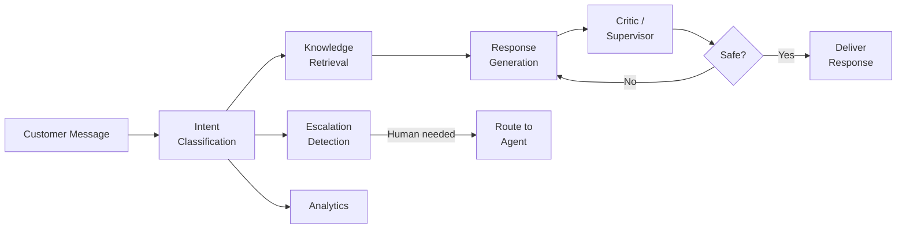
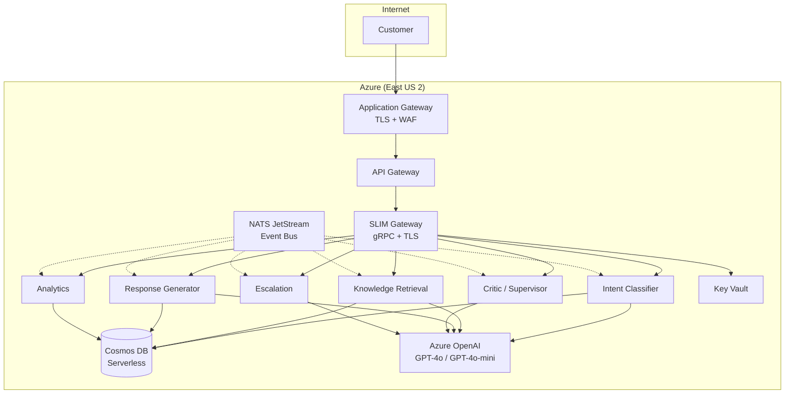

# Platform Overview

Agent Red Customer Engagement automates customer support for e-commerce businesses using a pipeline of six specialized AI agents. Each agent handles a distinct responsibility — from classifying the customer's intent to generating a response and validating it for safety — so that conversations are resolved accurately without human intervention.

## The agent pipeline

When a customer sends a message, it flows through the agent pipeline:

1. **Intent Classification** — Determines what the customer needs (order status, return request, product question, and others) across 17 supported intent categories with 98% accuracy.
2. **Knowledge Retrieval** — Searches your product catalog, FAQ database, and policy documents using semantic vector search to find relevant context.
3. **Response Generation** — Composes a natural-language reply using the retrieved context and conversation history, personalized to your brand voice.
4. **Critic / Supervisor** — Validates the response for factual accuracy, policy compliance, and content safety before it reaches the customer.
5. **Escalation Detection** — Evaluates whether the conversation requires human attention (angry customer, complex issue, VIP account) and routes accordingly.
6. **Analytics** — Records conversation metrics for quality monitoring, reporting, and continuous improvement.

## Architecture

Agent Red runs on Azure Container Apps with auto-scaling. Each agent is a separate container communicating over gRPC with TLS encryption. Customer data is stored in Cosmos DB with tenant-level isolation.

| Component | Technology |
|---|---|
| Agent runtime | Azure Container Apps (KEDA auto-scaling) |
| Agent communication | gRPC + TLS (SLIM transport) |
| Event bus | NATS JetStream (7-day retention) |
| Database | Azure Cosmos DB (Serverless) |
| AI models | Azure OpenAI Service (GPT-4o, GPT-4o-mini) |
| Embeddings | text-embedding-3-large |
| Secrets | Azure Key Vault (Managed Identity) |
| Monitoring | Application Insights (OpenTelemetry) |

## Performance

These metrics are from the evaluated open-source foundation that Agent Red builds on:

| Metric | Result |
|---|---|
| Response latency (P95) | < 2 seconds |
| Throughput | 3,071 requests/second |
| Daily user capacity | 10,000 users (with auto-scaling) |
| Uptime SLA | 99.95% |
| Intent classification accuracy | 98% |
| Escalation precision / recall | 100% / 100% |

## Next steps

- [How It Works](/getting-started/how-it-works) — Deep dive into the six-agent pipeline, communication protocols, and data flow.
- [Initial Setup](/getting-started/setup) — What you need to get Agent Red running for your store.

---

*© 2026 Remaker Digital, a DBA of VanDusen & Palmeter, LLC. All rights reserved.*
