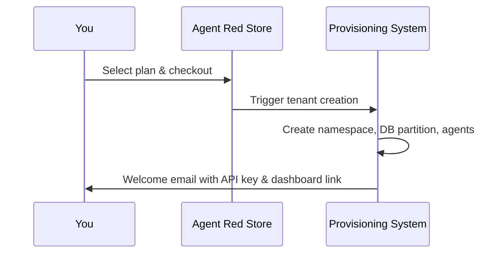
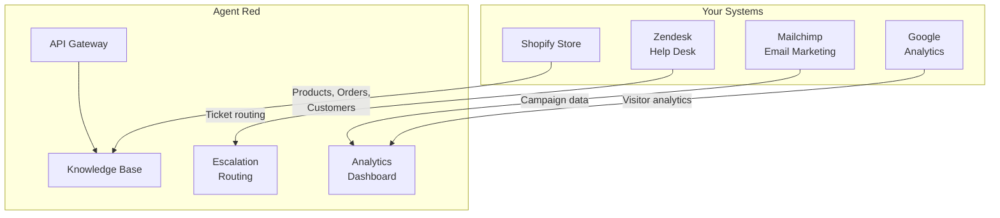
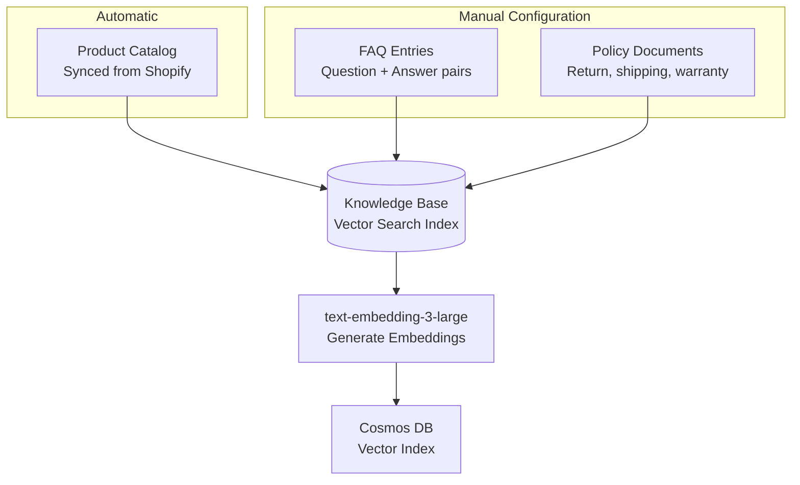
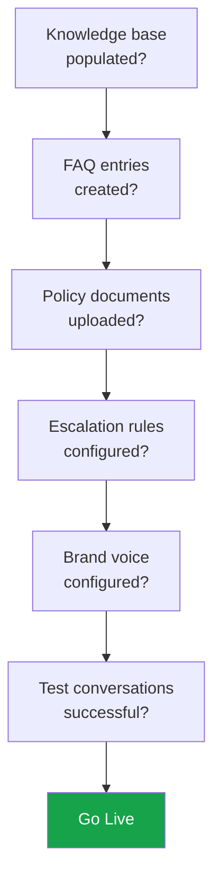

# Initial Setup

This guide walks through the steps to go from a new Agent Red account to handling your first automated customer conversation. Each section describes what happens, what you need to provide, and what configuration options are available.

:::info Early Access
Agent Red is preparing for public launch. The setup process described here reflects the planned onboarding flow. If you have early access, [contact us](https://agentredcx.com/docs/intro) for personalized onboarding assistance.
:::

## Setup overview

The complete setup path has five stages. Most customers complete the process in under an hour.


## 1. Account provisioning

When you subscribe to an Agent Red plan (Starter, Professional, or Enterprise), the system provisions a dedicated tenant environment.

### What gets created

| Resource | Description |
|---|---|
| Tenant namespace | Isolated environment for your data, agents, and configuration |
| Cosmos DB partition | Your data is stored in a dedicated partition with tenant-level isolation |
| Agent instances | Six AI agents deployed and configured for your account |
| API endpoint | A unique API endpoint for your tenant (e.g., `https://agent-red-api-gateway.lemonriver-f59f94b7.eastus2.azurecontainerapps.io/api/v1/tenant-acme`) |
| Dashboard access | Web portal for configuration, analytics, and conversation monitoring |

### What you need to provide

- **Business name** — used for tenant identification and branding
- **Primary contact email** — for account notifications and billing
- **Plan selection** — Starter ($149/mo), Professional ($399/mo), or Enterprise ($999/mo)
- **Billing information** — handled through the self-service checkout



## 2. API key configuration

Each tenant receives an API key for authenticating requests to the Agent Red API. The API key is delivered in your welcome email and is also visible in the dashboard.

### API key security

- API keys are stored in Azure Key Vault with Managed Identity access
- Each key is scoped to a single tenant — it cannot access other tenants' data
- Keys can be rotated from the dashboard without downtime
- All API calls require the key in the `Authorization` header

### Authentication format

```bash
curl -X POST https://agent-red-api-gateway.lemonriver-f59f94b7.eastus2.azurecontainerapps.io/api/chat/conversations \
  -H "Authorization: Bearer YOUR_API_KEY" \
  -H "Content-Type: application/json" \
  -d '{"message": "Where is my order #12345?"}'
```

## 3. Connect data sources

Agent Red needs access to your product and customer data to provide accurate, context-aware responses. The primary integration is Shopify, with additional integrations available as add-ons.



### Shopify integration (included in all plans)

The Shopify integration syncs your product catalog, order data, and customer profiles into the knowledge base. Agent Red uses OAuth for secure, permissioned access.

**Required Shopify permissions:**

| Scope | Purpose |
|---|---|
| `read_products` | Access product names, descriptions, prices, and availability |
| `read_orders` | Look up order status, tracking numbers, and delivery dates |
| `read_customers` | Identify returning customers and access order history |
| `read_inventory` | Check stock levels for availability questions |

**Sync behavior:**

- **Initial sync** — full catalog import when you connect your store (typically 5–15 minutes)
- **Ongoing sync** — webhook-driven updates whenever products, orders, or inventory change
- **Sync frequency** — real-time for order updates; every 15 minutes for catalog changes

### Additional integrations (add-on)

| Integration | Add-on cost | What it provides |
|---|---|---|
| Zendesk | Included (Pro, Enterprise) | Route escalated conversations to Zendesk tickets |
| Mailchimp | $49/mo | Access campaign data for customer context |
| Google Analytics | $49/mo | Correlate conversation data with site analytics |

## 4. Knowledge base setup

The knowledge base is what makes Agent Red's responses accurate and specific to your business. It combines three data sources:



### Product catalog (automatic)

The product catalog syncs from Shopify automatically. No manual configuration is required. The knowledge retrieval agent uses this data to answer product questions, check availability, and provide pricing information.

### FAQ entries (manual)

FAQ entries are question-and-answer pairs that you create in the dashboard. They cover common questions that are specific to your business and not covered by product data alone.

**Examples of effective FAQ entries:**

- "What is your return policy?" → Your specific return policy text
- "Do you offer gift wrapping?" → Your gift wrapping availability and pricing
- "How long does shipping take?" → Your shipping timeframes by region

**Best practices:**

- Write answers in the tone you want the AI to use with customers
- Cover the 20–30 most common questions first (analytics data helps identify these after launch)
- Update entries when policies change — the knowledge base re-indexes in minutes

### Policy documents (manual)

Policy documents are longer-form content (return policies, warranty terms, shipping rules) that the AI references when answering policy-related questions. Upload these as text in the dashboard. The system chunks and indexes them automatically.

## 5. Go live

Before enabling Agent Red for live customer traffic, review these configuration options.

### Pre-launch checklist



- **Knowledge base populated** — product catalog synced, FAQ entries created, policy documents uploaded
- **Escalation rules configured** — define which situations should route to a human agent (e.g., refund requests over a dollar threshold, complaints, VIP customers)
- **Brand voice configured** — set the tone, greeting style, and sign-off that match your brand
- **Test conversations completed** — run 10–20 test conversations covering common intents to verify response quality
- **Monitoring configured** — set up alert thresholds for escalation rate, response latency, and error rate

### Deployment options

| Option | Description | Recommended for |
|---|---|---|
| Shadow mode | Agent Red processes messages but does not deliver responses. Human agents see AI-suggested replies for review. | First 1–2 weeks. Build confidence before full automation. |
| Hybrid mode | Agent Red handles low-risk intents (product questions, order status) automatically. Complex intents route to humans. | Ongoing. Most customers use this mode. |
| Full automation | Agent Red handles all intents, with escalation as the safety net. | High-volume stores with well-tuned knowledge bases. |

### Monitoring after launch

The Agent Red dashboard provides real-time visibility into:

- **Conversation volume** — messages handled per hour/day/week
- **Automation rate** — percentage of conversations resolved without human intervention
- **Escalation rate** — percentage routed to human agents (target: under 15%)
- **Response quality scores** — Critic validation pass rate
- **Customer satisfaction** — inferred from conversation outcomes and explicit feedback

## Next steps

- [Shopify Integration](/integrations/shopify) — Detailed Shopify connection guide.
- [How It Works](/getting-started/how-it-works) — Deep dive into the agent pipeline and communication protocols.

---

*© 2026 Remaker Digital, a DBA of VanDusen & Palmeter, LLC. All rights reserved.*
