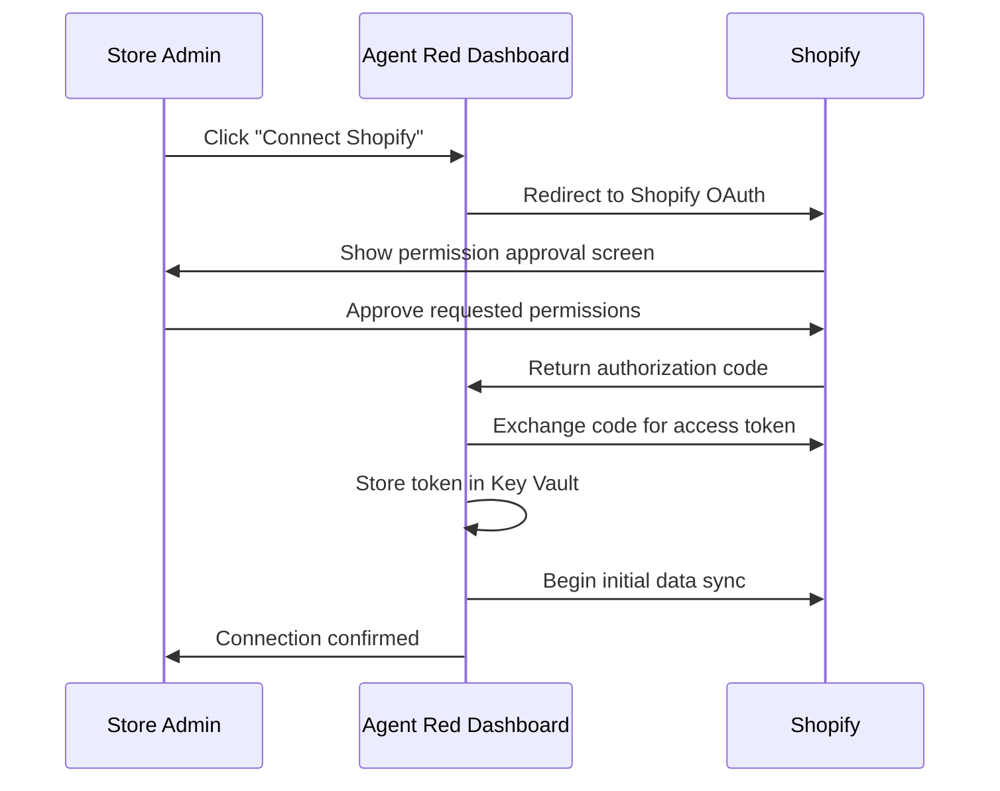
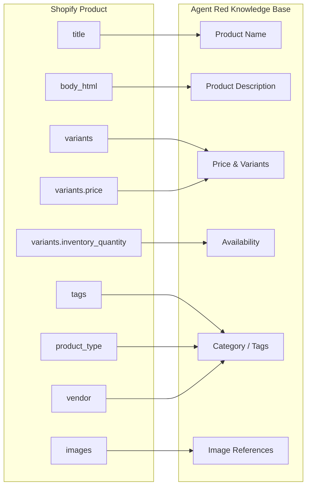
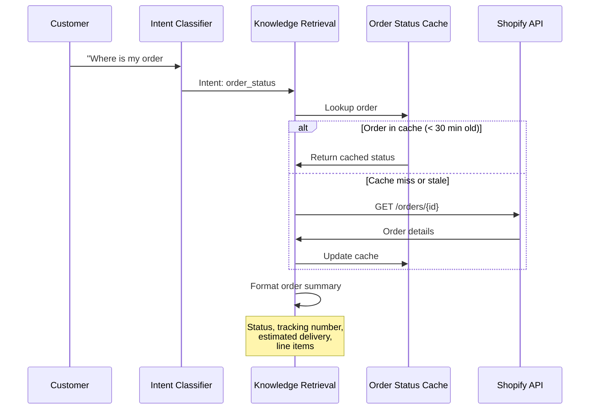

# Shopify Integration

The Shopify integration connects your store's product catalog, order data, and customer profiles to Agent Red's knowledge base. Once connected, the AI agents can answer product questions, look up order status, and reference your inventory — all using live data from your store.

Shopify is included in all Agent Red plans. No add-on purchase is required.

## Prerequisites

Before connecting Shopify, confirm you have:

- An active Shopify store (any plan — Basic, Shopify, Advanced, or Plus)
- Shopify admin access (you need permission to approve app installations)
- An active Agent Red account with your API key

## How the connection works

Agent Red connects to Shopify through OAuth 2.0, the same authorization flow that all Shopify apps use. You approve specific data permissions, and Agent Red receives a scoped access token. Agent Red never sees your Shopify admin password.



### Requested permissions

Agent Red requests read-only access to four data scopes. It does not request write access to your store.

| Scope | What Agent Red reads | Why |
|---|---|---|
| `read_products` | Product names, descriptions, prices, images, variants, availability | Answer product questions, recommend products, check pricing |
| `read_orders` | Order status, tracking numbers, delivery dates, line items | Handle "where is my order?" and order-related queries |
| `read_customers` | Customer names, email (for matching), order history | Identify returning customers, personalize responses, feed Persistent Customer Memory profiles |
| `read_inventory` | Stock levels by location and variant | Answer availability questions ("is this in stock?") |

:::tip Read-only access
Agent Red never modifies your Shopify data. It cannot create orders, change prices, update inventory, or modify customer records. The integration is strictly read-only.
:::

## Data sync

After you approve the connection, Agent Red performs an initial sync and then keeps data current through webhooks.

```mermaid
flowchart TB
    subgraph Initial Sync
        direction LR
        IS1[Full product\ncatalog import] --> IS2[Order history\nimport]
        IS2 --> IS3[Customer\nprofile import]
        IS3 --> IS4[Generate\nembeddings]
        IS4 --> IS5[Build vector\nsearch index]
    end

    subgraph Ongoing Sync
        direction LR
        WH[Shopify\nWebhooks] --> EV{Event type}
        EV -->|Product update| PU[Re-index\nproduct]
        EV -->|Order update| OU[Update order\nstatus cache]
        EV -->|Inventory change| IC[Update stock\nlevels]
    end

    Initial Sync --> Ongoing Sync
```

### Initial sync

The initial sync imports your complete catalog and recent order history. Timing depends on your catalog size:

| Catalog size | Approximate sync time |
|---|---|
| Under 500 products | 2–5 minutes |
| 500–5,000 products | 5–15 minutes |
| 5,000–50,000 products | 15–45 minutes |
| Over 50,000 products | 45–90 minutes (batched) |

During the initial sync, the system:

1. Fetches all active products with their variants, descriptions, and images
2. Imports order data from the past 90 days
3. Loads customer profiles associated with those orders
4. Generates vector embeddings using `text-embedding-3-large`
5. Builds the Cosmos DB vector search index

You can start handling conversations as soon as the initial sync completes. You do not need to wait for any manual step after sync finishes.

All synced customer data — profiles, order history, and product interactions — is automatically indexed into Agent Red's Persistent Customer Memory system, enabling personalized responses from the very first conversation.

### Ongoing sync (webhooks)

After the initial import, Shopify sends webhook notifications to Agent Red whenever data changes. This keeps the knowledge base current without polling.

| Webhook event | What triggers it | Agent Red action | Latency |
|---|---|---|---|
| `products/update` | Product edited in Shopify admin | Re-index product embeddings | Under 60 seconds |
| `products/create` | New product published | Add to knowledge base and index | Under 60 seconds |
| `products/delete` | Product removed or archived | Remove from knowledge base | Under 60 seconds |
| `orders/updated` | Order status changes (shipped, delivered) | Update order status cache | Under 30 seconds |
| `inventory_levels/update` | Stock level changes | Update availability data | Under 30 seconds |

### Catalog sync schedule

For data that does not trigger webhooks (bulk imports, metafield changes), Agent Red runs a scheduled catalog reconciliation:

- **Every 15 minutes** — lightweight check for products modified since last sync
- **Daily (02:00 UTC)** — full catalog reconciliation to catch any missed updates

## Product catalog mapping

Shopify product fields map to specific knowledge base fields that the AI agents use when answering questions.



| Shopify field | Knowledge base field | How it is used |
|---|---|---|
| `title` | Product Name | Primary identifier in responses ("The Classic Leather Wallet...") |
| `body_html` | Product Description | Semantic search target; used to answer feature and material questions |
| `variants[].price` | Price | Price comparisons, pricing questions |
| `variants[].title` | Variant Name | Size, color, and option-specific questions |
| `variants[].inventory_quantity` | Availability | "Is this in stock?" queries |
| `images[].src` | Image Reference | Referenced in responses (if your channel supports images) |
| `tags` | Category Tags | Helps the retrieval agent filter by category |
| `product_type` | Product Type | Category-level search and recommendations |
| `vendor` | Vendor/Brand | Brand-specific questions |
| `metafields` | Extended Attributes | Custom data (care instructions, dimensions, materials) if configured |

### Handling product variants

Products with multiple variants (sizes, colors) are indexed so that each variant is searchable independently. When a customer asks "Do you have the blue hoodie in large?", the retrieval agent searches at the variant level, not the product level.

```mermaid
flowchart TB
    P[Shopify Product\n"Classic Hoodie"] --> V1[Variant: Small / Blue\n$45 — In stock]
    P --> V2[Variant: Medium / Blue\n$45 — In stock]
    P --> V3[Variant: Large / Blue\n$45 — Out of stock]
    P --> V4[Variant: Small / Red\n$45 — In stock]

    V1 --> KB[(Knowledge Base\nVector Index)]
    V2 --> KB
    V3 --> KB
    V4 --> KB

    Q[Customer: "Blue hoodie\nin large?"] --> KB
    KB --> R[Match: Large / Blue\nOut of stock]
    R --> RESP[Response: "The Classic Hoodie\nin Large/Blue is currently\nout of stock. Medium/Blue\nis available."]
```

## Order data access

When a customer asks about an order, the intent classifier routes the query to the knowledge retrieval agent, which looks up the order in the order status cache.



### Order fields available to the AI

| Field | Example | Used for |
|---|---|---|
| Order number | `#12345` | Identifying the order |
| Fulfillment status | `shipped`, `delivered`, `unfulfilled` | Current status response |
| Tracking number | `1Z999AA10123456784` | Providing tracking links |
| Estimated delivery | `January 31, 2026` | Delivery date questions |
| Line items | `Classic Hoodie (Blue, Large) × 1` | Order contents confirmation |
| Shipping address (city/state only) | `Austin, TX` | Delivery location confirmation |

:::note Privacy
Agent Red only accesses the city and state from shipping addresses. Full street addresses are not stored in the knowledge base or exposed in AI responses. Customer email and phone are used for identity matching but are never included in generated responses. See [PII Protection](/getting-started/how-it-works#pii-protection) for details.
:::

## Testing the connection

After the initial sync completes, verify the integration by running test conversations through the Agent Red dashboard or API.

### Recommended test queries

| Test query | Expected behavior | Validates |
|---|---|---|
| "What products do you have?" | Lists product categories or popular items | Product catalog sync |
| "Tell me about [specific product name]" | Returns accurate description, price, availability | Product detail retrieval |
| "Is [product] available in [size/color]?" | Checks variant-level inventory | Variant indexing |
| "How much does [product] cost?" | Returns current price | Price sync |
| "Where is my order #[real order number]?" | Returns status, tracking, estimated delivery | Order data access |
| "I want to return my order" | References your return policy | Policy document retrieval |

### What to check

- **Accuracy** — Do product names, prices, and availability match your Shopify admin?
- **Freshness** — Change a product price in Shopify. Does the AI reflect the new price within 60 seconds?
- **Completeness** — Are all products searchable, including recently added ones?
- **Variant handling** — Does the AI distinguish between sizes and colors correctly?

## Troubleshooting

### Common issues

| Symptom | Likely cause | Resolution |
|---|---|---|
| Products missing from AI responses | Initial sync incomplete or product is in draft status | Check sync status in dashboard; ensure products are active/published in Shopify |
| Stale pricing or availability | Webhook delivery failure | Check the Shopify admin webhook health page; re-trigger sync from Agent Red dashboard |
| "Order not found" for valid orders | Order is older than 90 days (outside initial import window) | Extend order import range in Agent Red settings, or trigger a manual order re-sync |
| Connection fails during OAuth | Shopify app permissions changed or token expired | Disconnect and reconnect Shopify from the Agent Red dashboard |
| Slow initial sync | Large catalog (10,000+ products) | Normal behavior; sync runs in background batches. Monitor progress in dashboard. |

### Webhook health

Shopify provides a webhook health dashboard in your Shopify admin under **Settings → Notifications → Webhooks**. If Agent Red's webhook endpoint shows failures:

1. Verify the Agent Red API is reachable (check the status page)
2. Check for Shopify API rate limiting (Agent Red respects Shopify's 40 requests/second limit)
3. If failures persist for more than 1 hour, disconnect and reconnect the integration

### Data sync status

The Agent Red dashboard shows real-time sync status:

- **Last successful sync** — timestamp of the most recent data update
- **Products indexed** — count of products in the knowledge base vs. total active products in Shopify
- **Webhook delivery rate** — percentage of webhooks received successfully (target: 99.9%)
- **Index health** — vector search index status (healthy, rebuilding, or error)

## Next steps

- [How It Works](/getting-started/how-it-works) — Understand the full agent pipeline that uses Shopify data.
- [Initial Setup](/getting-started/setup) — Complete setup guide including knowledge base and go-live steps.

---

*© 2026 Remaker Digital, a DBA of VanDusen & Palmeter, LLC. All rights reserved.*
