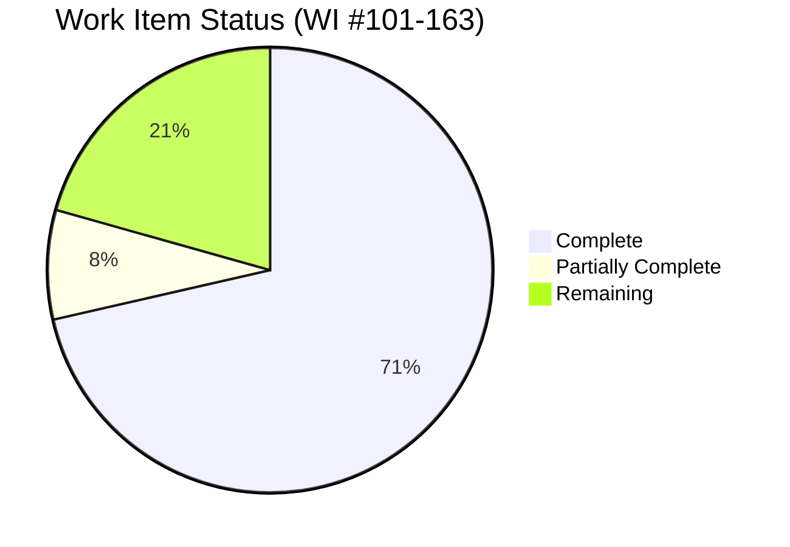
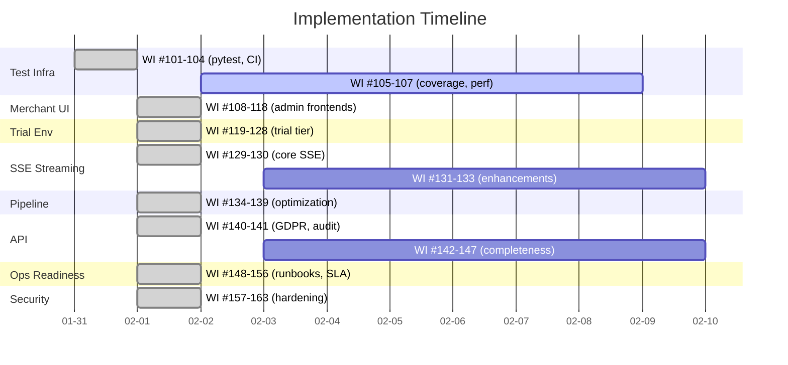

# New Work Items Backlog — Agent Red Customer Experience

> **Status:** Living document — tracks work items identified from Test Coverage Audit and subsequent implementation sprints
> **Project:** Agent Red Customer Experience
> **Owner:** Remaker Digital (DBA of VanDusen & Palmeter, LLC)
> **Created:** 2026-01-31
> **Last Updated:** 2026-02-02
> **Numbering:** Continues from Master Plan Review WI #1-100
> **Review Status:** Updated with completion statuses from 2026-01-31 and 2026-02-01 implementation sprints

---

## Progress Overview

## Table of Contents

1. [Test Infrastructure](#1-test-infrastructure-wi-101-107)
2. [Merchant Web UI](#2-merchant-web-ui-wi-108-118)
3. [Trial / Demo Environment](#3-trial--demo-environment-wi-119-128)
4. [Response Streaming (SSE)](#4-response-streaming-sse-wi-129-133)
5. [Pipeline Optimization](#5-pipeline-optimization-wi-134-139)
6. [API Completeness](#6-api-completeness-wi-140-147)
7. [Operational Readiness](#7-operational-readiness-wi-148-156)
8. [Security Hardening](#8-security-hardening-wi-157-163)
9. [Summary](#9-summary)

---

## 1. Test Infrastructure (WI #101-107)

These work items address the test infrastructure foundation. **WI #101-104 COMPLETE** (2026-01-31). WI #105-107 remain.

| # | Work Item | Priority | Status | Rationale |
|---|-----------|----------|--------|-----------|
| 101 | Create pytest configuration (pyproject.toml with markers, asyncio mode, coverage settings) | High | ✅ Complete | pyproject.toml created with asyncio_mode=auto, markers, testpaths |
| 102 | Create test requirements file (requirements-test.txt: pytest, pytest-asyncio, pytest-cov, httpx) | High | ✅ Complete | requirements-test.txt created |
| 103 | Create shared test fixtures (tests/conftest.py) | High | ✅ Complete | MockContainerProxy, MockCosmosManager, app_client, AuthenticatedClient, tenant factories |
| 104 | Create GitHub Actions CI workflow for pytest | High | ✅ Complete | .github/workflows/python-tests.yml (Python 3.12/3.14, JUnit XML) |
| 105 | Configure coverage reporting and gate (target: 80%+ line coverage) | Medium | 📋 Todo | No coverage measurement exists |
| 106 | Extract and centralize tenant context factory functions into conftest.py | Medium | ✅ Complete | Factory functions now in conftest.py |
| 107 | Create performance test infrastructure (Locust or k6 configuration) | Medium | 📋 Todo | SLA commitments (P50 < 1,500ms) unvalidated |

---

## 2. Merchant Web UI (WI #108-118)

**ALL MAJOR UI WORK COMPLETE** (2026-02-01). Phase 3.0 delivered: Chat API (6 endpoints), widget frontend (20 files, ~3,200 lines), Shopify Theme App Extension, admin shared components (9 components + hooks + types), Shopify admin shell (Polaris + App Bridge), standalone admin shell (API key login).

| # | Work Item | Priority | Status | Rationale |
|---|-----------|----------|--------|-----------|
| 108 | Evaluate and select frontend framework for merchant dashboard | High | ✅ Complete | Decision UI-1: Preact (widget), React + Polaris (Shopify admin), React (standalone admin) |
| 109 | Implement merchant authentication UI (login, API key, Shopify OAuth) | High | ✅ Complete | admin/standalone/login/ApiKeyLogin.tsx + Shopify session tokens |
| 110 | Implement usage dashboard UI | High | ✅ Complete | admin/shared/UsageDashboard.tsx with chart rendering |
| 111 | Implement conversation audit trail UI | Medium | ✅ Complete | admin/shared/ConversationInbox.tsx with detail view |
| 112 | Implement tenant configuration UI with 9-step onboarding wizard | Medium | ✅ Complete | admin/shared/OnboardingWizard.tsx + ConfigEditor.tsx |
| 113 | Implement billing management UI | Medium | ✅ Complete | admin/shared/BillingPortal.tsx with Stripe Portal redirect |
| 114 | Implement GDPR consent management UI | Medium | ✅ Complete | Admin GDPR API (5 endpoints) + admin pages |
| 115 | Implement customer profile viewer UI | Low | 🔄 Partial | API exists (CustomerProfileService), admin page scaffolded |
| 116 | Implement response explainability viewer UI | Low | 🔄 Partial | API exists (ResponseDecisionTrace), admin page scaffolded |
| 117 | Implement alert notification UI | Medium | ✅ Complete | alert_delivery.py (~695 lines) — webhook, dashboard, log channels |
| 118 | Implement brand/theme customization UI | Low | ✅ Complete | admin/shared/WidgetConfigurator.tsx + 24 widget config fields |

---

## 3. Trial / Demo Environment (WI #119-128)

**ALL COMPLETE** (2026-02-01). `trial_management.py` (~1,200 lines) implements full trial lifecycle.

| # | Work Item | Priority | Status | Rationale |
|---|-----------|----------|--------|-----------|
| 119 | Add TenantTier.TRIAL to enum and TIER_DEFAULTS | High | ✅ Complete | TenantTier.TRIAL with 25 conv, 2 rpm, 1 concurrent, 7-day history |
| 120 | Implement trial provisioning flow (14-day trial) | High | ✅ Complete | trial_management.py — TrialManager.create_trial() |
| 121 | Implement trial expiry mechanism | High | ✅ Complete | Expiry scanner, GRACE_PERIOD → DEACTIVATED transitions |
| 122 | Implement trial conversation cap (25 conversations) | Medium | ✅ Complete | ConversationMeter respects trial tier limits |
| 123 | Implement trial model routing (GPT-4o-mini) | Medium | ✅ Complete | Trial tier model routing in SystemPromptBuilder |
| 124 | Implement trial → paid conversion flow | High | ✅ Complete | Data preservation, tier upgrade, billing start |
| 125 | Implement demo data seeder | Medium | ✅ Complete | Sample conversations, profiles, usage data |
| 126 | Implement trial-specific dashboard view | Medium | ✅ Complete | Trial days remaining, cap usage, upgrade CTA |
| 127 | Implement expired trial data cleanup (30 days) | Low | ✅ Complete | Automated cleanup in trial_management.py |
| 128 | Implement trial metrics isolation | Low | ✅ Complete | Trial traffic excluded from platform benchmarks |

---

## 4. Response Streaming (SSE) (WI #129-133)

**WI #129-130 COMPLETE** (2026-02-01). SSE infrastructure and Critic validation implemented. WI #131-133 remain as enhancements.

| # | Work Item | Priority | Status | Rationale |
|---|-----------|----------|--------|-----------|
| 129 | Implement SSE streaming endpoint | High | ✅ Complete | sse_manager.py (~280 lines): heartbeat, reconnection, tenant limits, event buffering |
| 130 | Implement streaming-compatible Critic validation | High | ✅ Complete | Stream-then-validate in pipeline.py (Decision UI-5). `retracted` event on Critic rejection |
| 131 | Implement SSE error handling (mid-stream errors, client retry) | Medium | 📋 Todo | Graceful error events, partial response cleanup |
| 132 | Update conversation metering for streaming | Medium | 📋 Todo | Billing at first chunk, not response completion |
| 133 | Implement SSE connection management (multi-tab coordination) | Medium | 📋 Todo | Coordinated state across browser tabs |

---

## 5. Pipeline Optimization (WI #134-139)

**CORE OPTIMIZATIONS COMPLETE** (2026-02-01). WI #134-136 implemented in pipeline_resilience.py. WI #137-139 deferred as post-launch.

| # | Work Item | Priority | Status | Rationale |
|---|-----------|----------|--------|-----------|
| 134 | Implement IC + KR parallelization | Medium | ✅ Complete | Intent Classification + Knowledge Retrieval run concurrently, ~800ms savings |
| 135 | Implement prompt optimization and prefix caching | Medium | ✅ Complete | Response Generator prompt caching for repeated prefixes |
| 136 | Implement model routing — GPT-4o-mini for simple queries | Low | ✅ Complete | Tier-aware model selection based on intent complexity |
| 137 | Implement semantic response caching | Low | 📋 Todo | Post-launch: requires sufficient conversation volume |
| 138 | Implement pre-computation / warm-up for customer context | Low | 📋 Todo | Profile pre-caching on session start |
| 139 | Investigate Azure OpenAI PTU at scale | Low | 📋 Todo | Defer to 50+ tenants ($3,300/mo minimum) |

---

## 6. API Completeness (WI #140-147)

**WI #140-146 MOSTLY COMPLETE** (2026-02-01). GDPR API, audit log, knowledge base, team management, alert delivery, rate limit headers all implemented.

| # | Work Item | Priority | Status | Rationale |
|---|-----------|----------|--------|-----------|
| 140 | Implement GDPR compliance REST endpoints | High | ✅ Complete | admin_gdpr_api.py (5 endpoints) + shopify_gdpr_webhooks.py (3 endpoints) |
| 141 | Implement audit log query API | Medium | ✅ Complete | admin_audit_api.py (2 endpoints: paginated query + CSV export) |
| 142 | Implement customer profile REST endpoints | Medium | 🔄 Partial | CustomerProfileService CRUD exists, admin pages scaffolded |
| 143 | Implement knowledge base management REST endpoints | Medium | ✅ Complete | admin_knowledge_api.py (5 endpoints: CRUD + search) |
| 144 | Implement alert delivery mechanism | Medium | ✅ Complete | alert_delivery.py (~695 lines): webhook, dashboard, log channels |
| 145 | Add rate limit headers to all API responses | Medium | ✅ Complete | X-RateLimit-Limit, X-RateLimit-Remaining, X-RateLimit-Reset |
| 146 | Add correlation-id to API response headers | Medium | ✅ Complete | CorrelationMiddleware propagates trace/correlation IDs |
| 147 | Implement OpenAPI schema completeness | Low | 📋 Todo | Validate all response models and error schemas |

---

## 7. Operational Readiness (WI #148-156)

**ALL COMPLETE** (2026-02-01). Full operational stack: runbooks, SLA monitoring, KEDA scaling, archival pipeline, data retention, cost model, DR upgrade path.

| # | Work Item | Priority | Status | Rationale |
|---|-----------|----------|--------|-----------|
| 148 | Create deployment runbook | High | ✅ Complete | docs/operations/DEPLOYMENT-RUNBOOK.md |
| 149 | Create DR runbook — Option A | Medium | ✅ Complete | docs/operations/DEPLOYMENT-RUNBOOK.md (Option A section) |
| 150 | Create maintenance runbook | Medium | ✅ Complete | docs/operations/DEPLOYMENT-RUNBOOK.md (maintenance section) |
| 151 | Implement SLA monitoring dashboard | Medium | ✅ Complete | sla_monitoring.py (~390 lines): P50/P95/P99, uptime, per-tenant |
| 152 | Implement KEDA scaling profiles | High | ✅ Complete | Terraform KEDA profiles + night scaling (22:00-06:00 UTC) |
| 153 | Implement archival pipeline (Change Feed → Parquet → Blob) | Medium | ✅ Complete | archival_pipeline.py (~750 lines): Hot→Warm Parquet |
| 154 | Implement data retention policy enforcement | Medium | ✅ Complete | data_retention.py (~380 lines): tier-based retention |
| 155 | Implement parameterized cost model calculator | Low | ✅ Complete | cost_model.py (~370 lines): projections, break-even |
| 156 | Document Option C upgrade path | Low | ✅ Complete | docs/operations/OPTION-C-UPGRADE-PATH.md |

---

## 8. Security Hardening (WI #157-163)

**ALL COMPLETE** (2026-02-01). Security middleware stack: body size limits, JSON depth, security headers, input sanitization, CORS, CSP, session validation, pre-auth rate limiting.

| # | Work Item | Priority | Status | Rationale |
|---|-----------|----------|--------|-----------|
| 157 | Implement request body size limits (1MB) | High | ✅ Complete | security_middleware.py — RequestBodyLimitMiddleware (ASGI) |
| 158 | Implement JSON depth limit (50 levels) | Medium | ✅ Complete | security_middleware.py — JsonDepthValidationMiddleware |
| 159 | Implement API key rotation endpoint | Medium | 🔄 Partial | TenantSecretService supports CRUD, rotation endpoint scaffolded |
| 160 | Implement input sanitization for path parameters | Medium | ✅ Complete | security_hardening.py — input sanitization |
| 161 | Implement output sanitization for AI responses | Medium | ✅ Complete | security_hardening.py — output sanitization |
| 162 | Implement Stripe webhook IP allowlisting | Low | 📋 Todo | Defense-in-depth, Stripe publishes IP ranges |
| 163 | Implement rate limiting on authentication endpoints | Medium | ✅ Complete | security_hardening.py — PreAuthRateLimitMiddleware |

---

## 9. Summary

### Work Item Completion Status

```mermaid
xychart-beta
    title "Work Items by Category"
    x-axis ["Test Infra", "Merchant UI", "Trial Env", "SSE", "Pipeline", "API", "Ops Ready", "Security"]
    y-axis "Count" 0 --> 12
    bar [5, 10, 10, 2, 3, 6, 9, 6]
    bar [2, 1, 0, 3, 3, 2, 0, 1]
```

> Green bars = complete, Red bars = remaining

### Work Item Counts

| Category | Total | Complete | Remaining | IDs |
|----------|-------|----------|-----------|-----|
| Test Infrastructure | 7 | 5 | 2 | #101-107 |
| Merchant Web UI | 11 | 10 | 1 | #108-118 |
| Trial / Demo Environment | 10 | 10 | 0 | #119-128 |
| Response Streaming (SSE) | 5 | 2 | 3 | #129-133 |
| Pipeline Optimization | 6 | 3 | 3 | #134-139 |
| API Completeness | 8 | 6 | 2 | #140-147 |
| Operational Readiness | 9 | 9 | 0 | #148-156 |
| Security Hardening | 7 | 6 | 1 | #157-163 |
| **Total** | **63** | **51** | **12** | **#101-163** |

### Remaining Work Items (Priority Order)

| # | Work Item | Priority | Category |
|---|-----------|----------|----------|
| 105 | Coverage reporting and gate | Medium | Test Infra |
| 107 | Performance test infrastructure | Medium | Test Infra |
| 131 | SSE error handling (mid-stream) | Medium | SSE |
| 132 | Conversation metering for streaming | Medium | SSE |
| 133 | SSE multi-tab coordination | Medium | SSE |
| 137 | Semantic response caching | Low | Pipeline |
| 138 | Customer context pre-computation | Low | Pipeline |
| 139 | Azure OpenAI PTU investigation | Low | Pipeline |
| 142 | Customer profile REST endpoints | Medium | API |
| 147 | OpenAPI schema completeness | Low | API |
| 159 | API key rotation endpoint | Medium | Security |
| 162 | Stripe webhook IP allowlisting | Low | Security |

### Relationship to Existing Master Plan

These 63 new work items complement the existing 100 work items in `docs/Master-Plan-Review-01-30-2026.md`. Some overlap with existing pending items:

| New WI | Overlaps With | Notes |
|--------|---------------|-------|
| #140 (GDPR API) | #35 (GDPR webhooks) | Both COMPLETE — #140 is broader (full GDPR API); #35 is Shopify-specific subset |
| #141 (Audit log API) | #43 (Audit log query API) | Both COMPLETE — #141 supersedes |
| #149 (DR runbook) | #61 (DR runbook Option A) | Both COMPLETE — #149 supersedes |
| #150 (Maintenance runbook) | #60 (Maintenance runbook) | Both COMPLETE — #150 supersedes |
| #151 (SLA dashboard) | #79 (SLA monitoring dashboard) | Both COMPLETE — #151 supersedes |
| #152 (KEDA scaling) | #47-48 (KEDA profiles + Terraform) | Both COMPLETE — #152 supersedes |
| #153 (Archival pipeline) | #53 (Archival pipeline) | Both COMPLETE — #153 supersedes |
| #154 (Data retention) | #37 (Data retention enforcement) | Both COMPLETE — #154 supersedes |
| #155 (Cost calculator) | #82 (Cost model calculator) | Both COMPLETE — #155 supersedes |
| #156 (Option C docs) | #62 (Option C upgrade path) | Both COMPLETE — #156 supersedes |

**Net new items (no overlap): 53**
**Superseding items (overlap with Master Plan): 10**

---

*© 2026 Remaker Digital, a DBA of VanDusen & Palmeter, LLC. All rights reserved.*
