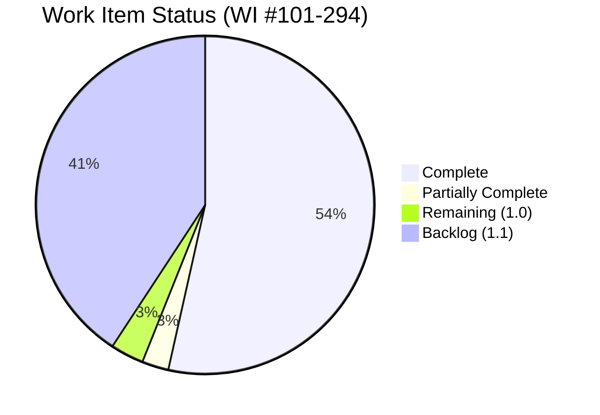
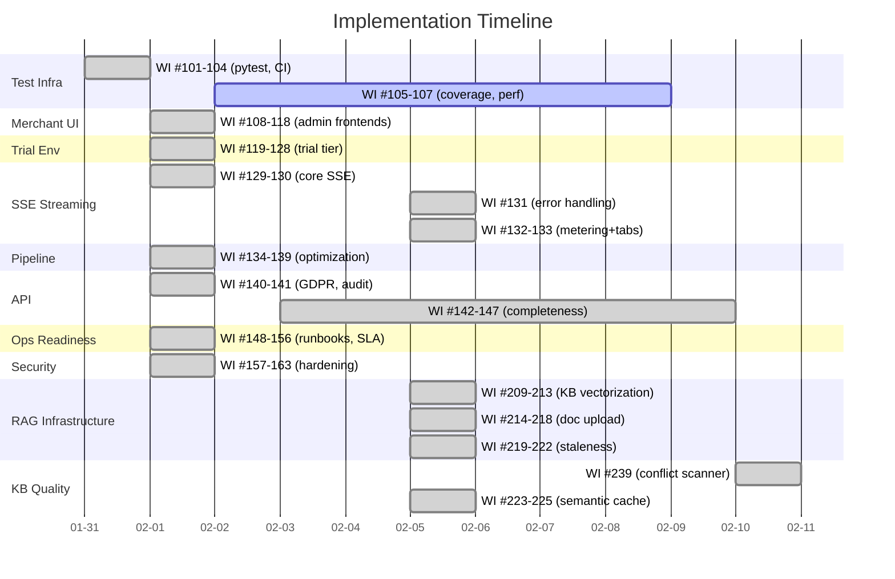

# New Work Items Backlog — Agent Red Customer Experience

> **Status:** Living document — tracks work items identified from Test Coverage Audit and subsequent implementation sprints
> **Project:** Agent Red Customer Experience
> **Owner:** Remaker Digital (DBA of VanDusen & Palmeter, LLC)
> **Created:** 2026-01-31
> **Last Updated:** 2026-02-11
> **Numbering:** Continues from Master Plan Review WI #1-100
> **Review Status:** Updated with completion statuses from 2026-01-31 and 2026-02-01 implementation sprints

---

## Progress Overview

## Table of Contents

1. [Test Infrastructure](#1-test-infrastructure-wi-101-107)
2. [Merchant Web UI](#2-merchant-web-ui-wi-108-118)
3. [Trial / Demo Environment](#3-trial--demo-environment-wi-119-128)
4. [Response Streaming (SSE)](#4-response-streaming-sse-wi-129-133)
5. [Pipeline Optimization](#5-pipeline-optimization-wi-134-139)
6. [API Completeness](#6-api-completeness-wi-140-147)
7. [Operational Readiness](#7-operational-readiness-wi-148-156)
8. [Security Hardening](#8-security-hardening-wi-157-163)
9. [Summary](#9-summary)
10. [Launch Preparation](#10-launch-preparation-wi-196-204)
11. [RAG Infrastructure](#11-rag-infrastructure-wi-209-225)

---

## 1. Test Infrastructure (WI #101-107)

**ALL COMPLETE** (2026-01-31, WI #105 completed 2026-02-05, WI #107 completed 2026-02-05). Full test infrastructure: pytest config, CI workflow, conftest fixtures, coverage gate (73.1%), and Locust load testing.

| # | Work Item | Priority | Status | Rationale |
|---|-----------|----------|--------|-----------|
| 101 | Create pytest configuration (pyproject.toml with markers, asyncio mode, coverage settings) | High | ✅ Complete | pyproject.toml created with asyncio_mode=auto, markers, testpaths |
| 102 | Create test requirements file (requirements-test.txt: pytest, pytest-asyncio, pytest-cov, httpx) | High | ✅ Complete | requirements-test.txt created |
| 103 | Create shared test fixtures (tests/conftest.py) | High | ✅ Complete | MockContainerProxy, MockCosmosManager, app_client, AuthenticatedClient, tenant factories |
| 104 | Create GitHub Actions CI workflow for pytest | High | ✅ Complete | .github/workflows/python-tests.yml (Python 3.12/3.14, JUnit XML) |
| 105 | Configure coverage reporting and gate (target: 80%+ line coverage) | Medium | ✅ Complete | Gate ramped 50%→70% (73.1% actual). Badge, per-module breakdown, JSON report added to CI. Launch target: 80%. |
| 106 | Extract and centralize tenant context factory functions into conftest.py | Medium | ✅ Complete | Factory functions now in conftest.py |
| 107 | Create performance test infrastructure (Locust or k6 configuration) | Medium | ✅ Complete | `tests/performance/locustfile.py` — 3 user scenarios (WidgetUser 70%, AdminUser 20%, HealthProbeUser 10%), `locust.conf`, SLA violation logging |

---

## 2. Merchant Web UI (WI #108-118)

**ALL MAJOR UI WORK COMPLETE** (2026-02-01). Phase 3.0 delivered: Chat API (6 endpoints), widget frontend (20 files, ~3,200 lines), Shopify Theme App Extension, admin shared components (9 components + hooks + types), Shopify admin shell (Polaris + App Bridge), standalone admin shell (API key login).

| # | Work Item | Priority | Status | Rationale |
|---|-----------|----------|--------|-----------|
| 108 | Evaluate and select frontend framework for merchant dashboard | High | ✅ Complete | Decision UI-1: Preact (widget), React + Polaris (Shopify admin), React (standalone admin) |
| 109 | Implement merchant authentication UI (login, API key, Shopify OAuth) | High | ✅ Complete | admin/standalone/login/ApiKeyLogin.tsx + Shopify session tokens |
| 110 | Implement usage dashboard UI | High | ✅ Complete | admin/shared/UsageDashboard.tsx with chart rendering |
| 111 | Implement conversation audit trail UI | Medium | ✅ Complete | admin/shared/ConversationInbox.tsx with detail view |
| 112 | Implement tenant configuration UI with 9-step onboarding wizard | Medium | ✅ Complete | admin/shared/OnboardingWizard.tsx + ConfigEditor.tsx |
| 113 | Implement billing management UI | Medium | ✅ Complete | admin/shared/BillingPortal.tsx with Stripe Portal redirect |
| 114 | Implement GDPR consent management UI | Medium | ✅ Complete | Admin GDPR API (5 endpoints) + admin pages |
| 115 | Implement customer profile viewer UI | Low | 🔄 Partial | API exists (CustomerProfileService), admin page scaffolded |
| 116 | Implement response explainability viewer UI | Low | 🔄 Partial | API exists (ResponseDecisionTrace), admin page scaffolded |
| 117 | Implement alert notification UI | Medium | ✅ Complete | alert_delivery.py (~695 lines) — webhook, dashboard, log channels |
| 118 | Implement brand/theme customization UI | Low | ✅ Complete | admin/shared/WidgetConfigurator.tsx + 24 widget config fields |

---

## 3. Trial / Demo Environment (WI #119-128)

**ALL COMPLETE** (2026-02-01). `trial_management.py` (~1,200 lines) implements full trial lifecycle.

| # | Work Item | Priority | Status | Rationale |
|---|-----------|----------|--------|-----------|
| 119 | Add TenantTier.TRIAL to enum and TIER_DEFAULTS | High | ✅ Complete | TenantTier.TRIAL with 50 conv, 5 rpm, 2 concurrent, 14-day history |
| 120 | Implement trial provisioning flow (14-day trial) | High | ✅ Complete | trial_management.py — TrialManager.create_trial() |
| 121 | Implement trial expiry mechanism | High | ✅ Complete | Expiry scanner, GRACE_PERIOD → DEACTIVATED transitions |
| 122 | Implement trial conversation cap (50 conversations) | Medium | ✅ Complete | ConversationMeter respects trial tier limits |
| 123 | Implement trial model routing (GPT-4o-mini) | Medium | ✅ Complete | Trial tier model routing in SystemPromptBuilder |
| 124 | Implement trial → paid conversion flow | High | ✅ Complete | Data preservation, tier upgrade, billing start |
| 125 | Implement demo data seeder | Medium | ✅ Complete | Sample conversations, profiles, usage data |
| 126 | Implement trial-specific dashboard view | Medium | ✅ Complete | Trial days remaining, cap usage, upgrade CTA |
| 127 | Implement expired trial data cleanup (30 days) | Low | ✅ Complete | Automated cleanup in trial_management.py |
| 128 | Implement trial metrics isolation | Low | ✅ Complete | Trial traffic excluded from platform benchmarks |

---

## 4. Response Streaming (SSE) (WI #129-133)

**ALL SSE WORK ITEMS COMPLETE** (WI #129-133). SSE infrastructure, Critic validation, mid-stream error handling, first-chunk metering, and multi-tab coordination all implemented.

| # | Work Item | Priority | Status | Rationale |
|---|-----------|----------|--------|-----------|
| 129 | Implement SSE streaming endpoint | High | ✅ Complete | sse_manager.py (~280 lines): heartbeat, reconnection, tenant limits, event buffering |
| 130 | Implement streaming-compatible Critic validation | High | ✅ Complete | Stream-then-validate in pipeline.py (Decision UI-5). `retracted` event on Critic rejection |
| 131 | Implement SSE error handling (mid-stream errors, client retry) | Medium | ✅ Complete | Enhanced error_event() with recoverable/tokens_sent/stage fields, _classify_openai_error() (7 categories), mid-stream try/except in pipeline streaming loop, 32 tests in test_sse_error_handling.py |
| 132 | Update conversation metering for streaming | Medium | ✅ Complete | SSE metering callback wired at startup — records `first_chunk_at` on conversation document via `ConversationMeter.record_first_chunk()`. Async/sync callbacks, non-fatal errors. 12 tests in test_sse_metering_multitab.py |
| 133 | Implement SSE connection management (multi-tab coordination) | Medium | ✅ Complete | `tab_id` query parameter on SSE stream endpoint, tab-aware connect/disconnect, `X-Tab-Count` response header, `GET /stream/{id}/status` endpoint for tab coordination, widget `getTabId()` with sessionStorage persistence. 20 tests in test_sse_metering_multitab.py |

---

## 5. Pipeline Optimization (WI #134-139)

**CORE OPTIMIZATIONS COMPLETE** (2026-02-01). WI #134-136 implemented in pipeline_resilience.py. WI #137-139 deferred as post-launch.

| # | Work Item | Priority | Status | Rationale |
|---|-----------|----------|--------|-----------|
| 134 | Implement IC + KR parallelization | Medium | ✅ Complete | Intent Classification + Knowledge Retrieval run concurrently, ~800ms savings |
| 135 | Implement prompt optimization and prefix caching | Medium | ✅ Complete | Response Generator prompt caching for repeated prefixes |
| 136 | Implement model routing — GPT-4o-mini for simple queries | Low | ✅ Complete | Tier-aware model selection based on intent complexity |
| 137 | ~~Implement semantic response caching~~ | ~~Low~~ | ✅ Complete | Superseded by WI #223-225 (semantic_cache.py) |
| 138 | Implement pre-computation / warm-up for customer context | Low | 📋 Todo | Profile pre-caching on session start |
| 139 | Investigate Azure OpenAI PTU at scale | Low | 📋 Todo | Defer to 50+ tenants ($3,300/mo minimum) |

---

## 6. API Completeness (WI #140-147)

**WI #140-146 MOSTLY COMPLETE** (2026-02-01). GDPR API, audit log, knowledge base, team management, alert delivery, rate limit headers all implemented.

| # | Work Item | Priority | Status | Rationale |
|---|-----------|----------|--------|-----------|
| 140 | Implement GDPR compliance REST endpoints | High | ✅ Complete | admin_gdpr_api.py (5 endpoints) + shopify_gdpr_webhooks.py (3 endpoints) |
| 141 | Implement audit log query API | Medium | ✅ Complete | admin_audit_api.py (2 endpoints: paginated query + CSV export) |
| 142 | Implement customer profile REST endpoints | Medium | ✅ Complete | admin_customer_profile_api.py (5 endpoints: list, get, consent, sync, delete) |
| 143 | Implement knowledge base management REST endpoints | Medium | ✅ Complete | admin_knowledge_api.py (5 endpoints: CRUD + search) |
| 144 | Implement alert delivery mechanism | Medium | ✅ Complete | alert_delivery.py (~695 lines): webhook, dashboard, log channels |
| 145 | Add rate limit headers to all API responses | Medium | ✅ Complete | X-RateLimit-Limit, X-RateLimit-Remaining, X-RateLimit-Reset |
| 146 | Add correlation-id to API response headers | Medium | ✅ Complete | CorrelationMiddleware propagates trace/correlation IDs |
| 147 | Implement OpenAPI schema completeness | Low | ✅ Complete | All 74 endpoints have summary, description, response models, error codes |

---

## 7. Operational Readiness (WI #148-156)

**ALL COMPLETE** (2026-02-01). Full operational stack: runbooks, SLA monitoring, KEDA scaling, archival pipeline, data retention, cost model, DR upgrade path.

| # | Work Item | Priority | Status | Rationale |
|---|-----------|----------|--------|-----------|
| 148 | Create deployment runbook | High | ✅ Complete | docs/operations/DEPLOYMENT-RUNBOOK.md |
| 149 | Create DR runbook — Option A | Medium | ✅ Complete | docs/operations/DEPLOYMENT-RUNBOOK.md (Option A section) |
| 150 | Create maintenance runbook | Medium | ✅ Complete | docs/operations/DEPLOYMENT-RUNBOOK.md (maintenance section) |
| 151 | Implement SLA monitoring dashboard | Medium | ✅ Complete | sla_monitoring.py (~390 lines): P50/P95/P99, uptime, per-tenant |
| 152 | Implement KEDA scaling profiles | High | ✅ Complete | Terraform KEDA profiles + night scaling (22:00-06:00 UTC) |
| 153 | Implement archival pipeline (Change Feed → Parquet → Blob) | Medium | ✅ Complete | archival_pipeline.py (~750 lines): Hot→Warm Parquet |
| 154 | Implement data retention policy enforcement | Medium | ✅ Complete | data_retention.py (~380 lines): tier-based retention |
| 155 | Implement parameterized cost model calculator | Low | ✅ Complete | cost_model.py (~370 lines): projections, break-even |
| 156 | Document Option C upgrade path | Low | ✅ Complete | docs/operations/OPTION-C-UPGRADE-PATH.md |

---

## 8. Security Hardening (WI #157-163)

**ALL COMPLETE** (2026-02-01, WI #159 completed 2026-02-05). Security middleware stack: body size limits, JSON depth, security headers, input sanitization, CORS, CSP, session validation, pre-auth rate limiting, API key rotation.

| # | Work Item | Priority | Status | Rationale |
|---|-----------|----------|--------|-----------|
| 157 | Implement request body size limits (1MB) | High | ✅ Complete | security_middleware.py — RequestBodyLimitMiddleware (ASGI) |
| 158 | Implement JSON depth limit (50 levels) | Medium | ✅ Complete | security_middleware.py — JsonDepthValidationMiddleware |
| 159 | Implement API key rotation endpoint | Medium | ✅ Complete | `admin_apikey_api.py` — 4 endpoints (GET metadata, POST generate, POST rotate, DELETE revoke). 36 tests. |
| 160 | Implement input sanitization for path parameters | Medium | ✅ Complete | security_hardening.py — input sanitization |
| 161 | Implement output sanitization for AI responses | Medium | ✅ Complete | security_hardening.py — output sanitization |
| 162 | Implement Stripe webhook IP allowlisting | Low | ✅ Complete | `stripe_webhooks.py` — 12 Stripe IPs, X-Forwarded-For support, localhost dev, env var toggle. 20 tests in `test_stripe_ip_allowlist.py`. |
| 163 | Implement rate limiting on authentication endpoints | Medium | ✅ Complete | security_hardening.py — PreAuthRateLimitMiddleware |

---

## 9. Summary

### Work Item Completion Status

```mermaid
xychart-beta
    title "Work Items by Category"
    x-axis ["Test Infra", "Merchant UI", "Trial Env", "SSE", "Pipeline", "API", "Ops Ready", "Security"]
    y-axis "Count" 0 --> 12
    bar [7, 10, 10, 5, 4, 8, 9, 7]
    bar [0, 1, 0, 0, 2, 0, 0, 0]

```

> Green bars = complete, Red bars = remaining

### Work Item Counts

| Category | Total | Complete | Remaining | IDs |
|----------|-------|----------|-----------|-----|
| Test Infrastructure | 7 | 7 | 0 | #101-107 |
| Merchant Web UI | 11 | 10 | 1 | #108-118 |
| Trial / Demo Environment | 10 | 10 | 0 | #119-128 |
| Response Streaming (SSE) | 5 | 5 | 0 | #129-133 |
| Pipeline Optimization | 6 | 4 | 2 | #134-139 |
| API Completeness | 8 | 8 | 0 | #140-147 |
| Operational Readiness | 9 | 9 | 0 | #148-156 |
| Security Hardening | 7 | 7 | 0 | #157-163 |
| **Total** | **63** | **60** | **3** | **#101-163** |

### Remaining Work Items (Priority Order)

| # | Work Item | Priority | Category |
|---|-----------|----------|----------|
| 137 | ~~Semantic response caching~~ | ~~Low~~ | ~~Pipeline~~ | Superseded by WI #223-225 |
| 138 | Customer context pre-computation | Low | Pipeline |
| 139 | Azure OpenAI PTU investigation | Low | Pipeline |

### Relationship to Existing Master Plan

These 63 new work items complement the existing 100 work items in `docs/Master-Plan-Review-01-30-2026.md`. Some overlap with existing pending items:

| New WI | Overlaps With | Notes |
|--------|---------------|-------|
| #140 (GDPR API) | #35 (GDPR webhooks) | Both COMPLETE — #140 is broader (full GDPR API); #35 is Shopify-specific subset |
| #141 (Audit log API) | #43 (Audit log query API) | Both COMPLETE — #141 supersedes |
| #149 (DR runbook) | #61 (DR runbook Option A) | Both COMPLETE — #149 supersedes |
| #150 (Maintenance runbook) | #60 (Maintenance runbook) | Both COMPLETE — #150 supersedes |
| #151 (SLA dashboard) | #79 (SLA monitoring dashboard) | Both COMPLETE — #151 supersedes |
| #152 (KEDA scaling) | #47-48 (KEDA profiles + Terraform) | Both COMPLETE — #152 supersedes |
| #153 (Archival pipeline) | #53 (Archival pipeline) | Both COMPLETE — #153 supersedes |
| #154 (Data retention) | #37 (Data retention enforcement) | Both COMPLETE — #154 supersedes |
| #155 (Cost calculator) | #82 (Cost model calculator) | Both COMPLETE — #155 supersedes |
| #156 (Option C docs) | #62 (Option C upgrade path) | Both COMPLETE — #156 supersedes |

**Net new items (no overlap): 53**
**Superseding items (overlap with Master Plan): 10**

---

## 10. Launch Preparation (WI #196-204)

**NEW — Added 2026-02-03.** Work items for production deployment, Remaker Digital storefront (dual-purpose: sales channel + live demo), UX consultant evaluation, and creative assets.

| # | Work Item | Priority | Status | Rationale |
|---|-----------|----------|--------|-----------|
| 196 | Build Docker container images + push to ACR | High | 📋 Todo | Production deployment prerequisite — Dockerfiles for API Gateway, all 6 agents, SLIM Gateway |
| 197 | Execute production Terraform deployment (Container Apps, App Gateway, networking) | High | 📋 Todo | Production infrastructure — all Terraform modules ready, needs `terraform apply` |
| 198 | Build widget bundle + deploy to Shopify Theme App Extension | High | 📋 Todo | Widget IIFE bundle → extensions/agent-red-chat/assets/. Requires `shopify app deploy` |
| 199 | Create Remaker Digital Shopify storefront | High | 📋 Todo | **Owner task.** Branded storefront for Agent Red subscription sales + live demo |
| 200 | Onboard Remaker Digital as tenant #1 (trial → paid) | High | 📋 Todo | First tenant provisioning via production system. Validates full onboarding flow |
| 201 | Seed knowledge base with Agent Red product data | Medium | 📋 Todo | Product info, pricing, features, setup guides, FAQ for demo widget conversations |
| 202 | Deploy widget on Remaker Digital storefront + verify end-to-end | Medium | 📋 Todo | Theme App Extension enabled, widget renders, AI responds, escalation works |
| 203 | UX consultant evaluation (Mazel) — onboarding, Shopify integration, widget testing, escalation | Medium | 📋 Todo | **Blocked on production deployment.** Mazel evaluates core merchant workflows |
| 204 | Generate favicon and app icons from icon-master.png | Medium | 📋 Todo | favicon.ico (16/32/48), apple-touch-icon (180), PWA icons (192/512) |

### Updated Work Item Counts

| Category | Total | Complete | Remaining | IDs |
|----------|-------|----------|-----------|-----|
| Test Infrastructure | 7 | 7 | 0 | #101-107 |
| Merchant Web UI | 11 | 10 | 1 | #108-118 |
| Trial / Demo Environment | 10 | 10 | 0 | #119-128 |
| Response Streaming (SSE) | 5 | 5 | 0 | #129-133 |
| Pipeline Optimization | 6 | 4 | 2 | #134-139 |
| API Completeness | 8 | 8 | 0 | #140-147 |
| Operational Readiness | 9 | 9 | 0 | #148-156 |
| Security Hardening | 7 | 7 | 0 | #157-163 |
| Launch Preparation | 9 | 0 | 9 | #196-204 |
| **Total** | **72** | **60** | **12** | **#101-204** |

### Remaining Work Items (Priority Order — 1.0 GA)

| # | Work Item | Priority | Blocked By |
|---|-----------|----------|------------|
| 196 | Docker images + ACR push | High | — (unblocked) |
| 197 | Production Terraform deployment | High | #196 |
| 198 | Widget bundle → Theme App Extension | High | #197 |
| 199 | Create Remaker Digital storefront | High | Owner |
| 200 | Onboard tenant #1 | High | #197, #199 |
| 201 | Seed knowledge base | Medium | #200 |
| 202 | Deploy widget on storefront | Medium | #198, #200 |
| 203 | UX evaluation (Mazel) | Medium | #202 |
| 204 | Favicon and app icons | Medium | — (unblocked) |
| ~~137~~ | ~~Semantic response caching~~ | ~~Low~~ | Superseded by WI #223-225 |
| 138 | Context pre-computation | Low | Post-launch |
| 139 | PTU investigation | Low | Post-launch |

---

## 11. RAG Infrastructure (WI #209-225)

**NEW — Added 2026-02-05.** Comprehensive RAG infrastructure gap analysis revealed that Merchant Knowledge Base has basic CRUD with keyword search only, while Persistent Customer Memory (Layer 2) correctly uses vector embeddings. These work items bring the Knowledge Base to production-grade RAG standards.

> **Reference:** Full gap analysis in `docs/architecture/RAG-GAP-ANALYSIS.md`

### P0: Knowledge Base Vectorization (WI #209-213) — 9 days

| # | Work Item | Priority | Status | Rationale |
|---|-----------|----------|--------|-----------|
| 209 | KB Vector Embedding Schema — add embedding, embedding_model, embedded_at fields to KnowledgeBaseDocument, DiskANN vector index | P0 | ✅ Complete | `cosmos_schema.py` — KnowledgeBaseDocument updated |
| 210 | KB Embedding Pipeline — create knowledge_vectorizer.py, embed on create/update, batch embedding | P0 | ✅ Complete | `knowledge_vectorizer.py` (~520 lines) |
| 211 | KB Vector Search — replace keyword matching in _call_knowledge_retrieval_direct() with cosine similarity | P0 | ✅ Complete | `pipeline.py` — vector search replaces keyword matching |
| 212 | Hybrid Retrieval — add BM25 scoring, implement Reciprocal Rank Fusion (RRF), configurable alpha | P0 | ✅ Complete | `knowledge_vectorizer.py` — hybrid_search() with RRF |
| 213 | Retrieval Quality Monitoring — log retrieval events with scores, track click-through, dashboard | P0 | ✅ Complete | `knowledge_vectorizer.py` — retrieval event logging |

### P0: Document Upload & Processing (WI #214-218) — 9 days

| # | Work Item | Priority | Status | Rationale |
|---|-----------|----------|--------|-----------|
| 214 | File Upload API — POST /api/admin/knowledge/upload, multipart/form-data, PDF/DOCX/CSV/TXT | P0 | ✅ Complete | `admin_knowledge_api.py` — upload endpoint |
| 215 | Document Parsing Pipeline — create document_parser.py, PDF (PyPDF2), DOCX (python-docx), CSV, HTML/URL | P0 | ✅ Complete | `document_parser.py` (~480 lines) |
| 216 | Document Chunking — page-level chunking (256-512 tokens), respect paragraph boundaries | P0 | ✅ Complete | `document_parser.py` — semantic chunking |
| 217 | Bulk Import/Export — CSV export of all KB entries, CSV import with validation | P0 | ✅ Complete | `admin_knowledge_api.py` — bulk endpoints |
| 218 | Admin UI for Upload — file dropzone in KnowledgeBaseManager.tsx, progress indicator | P0 | ✅ Complete | `KnowledgeBaseManager.tsx` — upload UI |

### P1: Staleness & Freshness Management (WI #219-222) — 4.5 days

| # | Work Item | Priority | Status | Rationale |
|---|-----------|----------|--------|-----------|
| 219 | Staleness Schema — add last_verified_at, staleness_score, auto_refresh_enabled to KnowledgeBaseDocument | P1 | ✅ Complete | `cosmos_schema.py` — staleness fields added |
| 220 | Staleness Detection Service — create staleness_service.py, compute staleness from age + feedback | P1 | ✅ Complete | `staleness_service.py` (~540 lines) |
| 221 | Refresh Prompts UI — badge stale entries in table, "Mark as verified" action | P1 | ✅ Complete | `KnowledgeBaseManager.tsx` — staleness badges + verify action |
| 222 | Automatic Re-embedding — scheduled job for stale entries, re-embed on content change | P1 | ✅ Complete | `staleness_service.py` — re-embedding on content change |

### P1: Semantic Caching (WI #223-225) — 4 days

| # | Work Item | Priority | Status | Rationale |
|---|-----------|----------|--------|-----------|
| 223 | Query Embedding Cache — cache query embeddings, TTL-based expiration | P1 | ✅ Complete | semantic_cache.py — EmbeddingCache (LRU + TTL, per-tenant isolation) |
| 224 | Semantic Response Cache — cache similar queries by vector similarity (0.95 threshold) | P1 | ✅ Complete | semantic_cache.py — SearchCache + SemanticIndex (cosine similarity matching) |
| 225 | Cache Monitoring Dashboard — hit rate metrics, cost savings estimate | P1 | ✅ Complete | semantic_cache.py — CacheMetrics, health(), summary() wired to /ready |

### RAG Work Item Summary

| Priority | Work Items | Total Effort | Description |
|----------|------------|--------------|-------------|
| **P0** | WI #209-218 | 18 days | ✅ KB vectorization + document upload — COMPLETE |
| **P1** | WI #219-222 | 4.5 days | ✅ Staleness management — COMPLETE |
| **P1** | WI #223-225 | 4 days | ✅ Semantic caching — COMPLETE |
| **Total** | 17 items | 26.5 days | 17 complete, 0 remaining |

### Document Inconsistencies Resolved

| Document | Issue | Resolution |
|----------|-------|------------|
| PRODUCT-FEATURES-RAG.md line 525 | Claims "1536-dimension embeddings" | Actual: 3072 dimensions (text-embedding-3-large) |
| PRODUCT-FEATURES-RAG.md line 207 | Claims "semantic embeddings...vector similarity search" for KB | Current: keyword matching only → WI #211 |
| PRODUCT-FEATURES-RAG.md line 466 | Claims "Hybrid search (BM25 + dense vectors)" | Not implemented → WI #212 |
| PRODUCT-FEATURES-RAG.md line 221 | Claims "Index freshness: < 1 hour" | No freshness tracking → WI #219-222 |

---

### Updated Work Item Counts (Final)

| Category | Total | Complete | Remaining | IDs |
|----------|-------|----------|-----------|-----|
| Test Infrastructure | 7 | 7 | 0 | #101-107 |
| Merchant Web UI | 11 | 10 | 1 | #108-118 |
| Trial / Demo Environment | 10 | 10 | 0 | #119-128 |
| Response Streaming (SSE) | 5 | 3 | 2 | #129-133 |
| Pipeline Optimization | 6 | 4 | 2 | #134-139 |
| API Completeness | 8 | 8 | 0 | #140-147 |
| Operational Readiness | 9 | 9 | 0 | #148-156 |
| Security Hardening | 7 | 7 | 0 | #157-163 |
| Launch Preparation | 9 | 0 | 9 | #196-204 |
| **RAG Infrastructure** | **17** | **17** | **0** | **#209-225** |
| KB Quality Tools | 1 | 1 | 0 | #239 |
| Admin UX Polish | 1 | 0 | 1 | #226 |
| **Total** | **92** | **80** | **12** | **#101-239** |

---

## 12. KB Quality Tools (WI #239)

**NEW — Added 2026-02-10.** On-demand knowledge base conflict and duplication scanner. Prevents inconsistent AI responses caused by duplicate or conflicting KB entries — the #1 root cause of response quality issues. Part of the ongoing chat quality testing lifecycle.

| # | Work Item | Priority | Status | Rationale |
|---|-----------|----------|--------|-----------|
| 239 | KB Conflict/Duplication Scanner — 4-phase detection (embedding similarity, title trigrams, content overlap, factual conflict regex), severity classification, admin UI button, scan caching, documentation | P1 | ✅ Complete | `kb_conflict_scanner.py` (~705 lines), 2 API endpoints (POST /scan, GET /scan/result), admin UI in KnowledgeBaseManager.tsx, 85 tests, docs at `docs-site/docs/admin-guide/conflict-scanner.md` |

**Quality testing protocol:** Scanner should be run as part of every quality cycle:
1. Before/after KB changes (uploads, edits, bulk imports) → verify no new conflicts
2. Before chat quality testing (`scripts/test_chat_battery.py`) → fix all HIGH conflicts first
3. When AI responses are inconsistent → re-scan to identify KB root cause
4. Periodic (weekly/monthly) → as part of KB maintenance alongside staleness review

---

## 13. Admin UX Polish (WI #226+)

### Contextual Tooltips (WI #226) — Priority: P1

**Requirement:** Every interactive element (button, field, display metric) across both admin interfaces (Shopify embedded + standalone Mantine) must have a mouseover tooltip that:

1. **Briefly explains** what the element does or displays (concise — less is better)
2. **Links to documentation** — opens the relevant section of the docs site in a new tab, pointing to the specific page/anchor that explains how to use the element, understand its data, or how it affects system behavior

**Scope:** All 9 shared components (OnboardingWizard, ConfigEditor, UsageDashboard, ConversationInbox, KnowledgeBaseManager, AnalyticsOverview, BillingPortal, WidgetConfigurator, TeamManager) plus standalone-specific pages. Shopify shell inherits from shared components.

**Implementation notes:**
- Tooltip component must be framework-agnostic in shared components (inline styles, no Polaris/Mantine dependency)
- Standalone pages can use Mantine `<Tooltip>` component
- Documentation URLs should use a constant map (e.g., `HELP_LINKS`) for maintainability — when docs structure changes, only the map needs updating
- Requires docs-site sections to exist first (or at minimum, placeholder anchors)

**Estimate:** 3-4 days (tooltip component + link map + apply across all components)

| WI | Title | Priority | Estimate |
|----|-------|----------|----------|
| #226 | Admin contextual tooltips with docs links | P1 | 3-4 days |

---

## Agent Red 1.1 — Widget Enhancement Phases 3-5

> **Source:** `docs/CHAT-WIDGET-ENHANCEMENT-IMPLEMENTATION-PLAN-PROPOSAL.md` (UX designer proposal, 2026-02-07)
> **Dependency:** Phase 1 (schema alignment) and Phase 2 (visual expansion) completed in 1.0
> **Priority:** Post-launch — deferred from 1.0

### Phase 3 — Mobile & Layout Controls

Provide per-device widget configuration so merchants can tailor the mobile UX without CSS hacks.

| WI | Title | Priority | Estimate | Details |
|----|-------|----------|----------|---------|
| #227 | Mobile position + offset config fields | P2 | 1 day | `widget_mobile_position`, `widget_mobile_offset_x`, `widget_mobile_offset_y` in schema + runtime + admin |
| #228 | Mobile fullscreen mode | P2 | 1 day | `widget_mobile_fullscreen` — panel takes full viewport on mobile devices |
| #229 | Panel width/height config | P3 | 0.5 day | `widget_panel_width`, `widget_panel_height` — desktop panel dimensions |
| #230 | Mobile layout switching in runtime | P2 | 1.5 days | Launcher + panel responsive layout based on mobile config fields |

### Phase 4 — Targeting and Rules Engine

Match advanced targeting behavior (Tidio, Intercom) with structured rulesets evaluated at widget init.

| WI | Title | Priority | Estimate | Details |
|----|-------|----------|----------|---------|
| #231 | Targeting rules schema (`widget_rules`) | P2 | 1 day | Structured ruleset model: URL include/exclude, referrer, UTM, time-on-page, scroll depth, exit-intent |
| #232 | Lightweight rule evaluator in widget | P2 | 2 days | Client-side rule engine evaluating conditions at init and on page events |
| #233 | Targeting rules admin UI | P2 | 1.5 days | Rule builder in WidgetConfigurator with condition/action pairs |
| #234 | Exit-intent and scroll-depth triggers | P3 | 1 day | Browser event listeners for exit-intent (mouseleave) and scroll percentage |

### Phase 5 — Localization & Runtime JS API

Enable multi-language support and per-page programmatic overrides.

| WI | Title | Priority | Estimate | Details |
|----|-------|----------|----------|---------|
| #235 | Locale packs infrastructure | P2 | 1.5 days | `widget_locale` field (auto/en/es/fr-ca/...), locale file loading, fallback chain |
| #236 | Localized header/offline text per locale | P2 | 1 day | Per-locale overrides for user-visible strings (header, offline message, placeholder) |
| #237 | Runtime JS API: setTheme/setLocale | P2 | 1 day | `window.AgentRed.setTheme({...})`, `setLocale(locale)` for per-page overrides |
| #238 | Runtime JS API: setConfigPartial/setTargetingRules | P3 | 1 day | `setConfigPartial({...})`, `setTargetingRules(rules)` for advanced JS integrations |

**Total Phase 3-5 estimate:** ~13 development days

---

## 14. Widget & Quick Actions UX Fixes (WI #240-245)

**NEW — Added 2026-02-11.** UX issues identified during manual QA of the production standalone admin (v1.20.0). These affect merchant onboarding flow and widget configurator usability. Grouped as a single batch for the next update cycle.

| WI | Title | Priority | Estimate | Details |
|----|-------|----------|----------|---------|
| #240 | Widget does not apply saved color configuration | P1 | 1 day | Widget ignores color settings saved via the Widget page in admin. After saving a new primary color or header gradient, the live widget preview and storefront widget do not reflect the change. Likely a config delivery or widget init issue — widget may not be re-fetching updated config from `/api/config`. |
| #241 | Widget does not display custom greeting message | P1 | 0.5 day | The greeting message configured in admin (e.g., "Hi there! How can I help you today \<FIRST_NAME\>?") is not rendered in the widget. Widget shows default greeting instead of the merchant-customized one. Related to #240 — config delivery gap. |
| #242 | Quick actions page has no starter examples on first visit | P2 | 0.5 day | When a merchant first visits the Quick Actions page, the prompt library is empty with no guidance on what to create. Add 3-4 pre-populated example quick actions (e.g., "Track my order", "Return policy", "Product recommendations") that merchants can activate, customize, or delete. |
| #243 | Quick action "Icon" field lacks guidance | P2 | 0.5 day | The "Icon (optional)" input on the Create Quick Action dialog shows only a rocket emoji placeholder. No guidance on what format to use (emoji, icon name, URL), where to find icons, or what renders in the widget. Add helper text, an emoji picker or dropdown of common icons, and a visual preview. |
| #244 | Quick action "Sort order" field is redundant | P2 | 0.5 day | The per-prompt "Sort order" field is unnecessary because ordering is already set per-page via the Page Assignments tab (Slot 1, Slot 2). Remove "Sort order" from the Create/Edit dialog or repurpose it as a global library ordering for the admin list view only (not affecting widget display). |
| #245 | Quick actions not previewable in admin widget | P1 | 1 day | Quick actions created in the admin do not appear in the live widget preview on the Widget page or in the floating widget on the admin itself. Merchants cannot verify their quick actions without visiting the storefront. The admin widget preview should render active quick actions as pill buttons in the greeting area, matching storefront behavior. |

**Total estimate:** ~4 days

**Dependency notes:**
- WI #240 and #241 likely share a root cause (config delivery pipeline from admin save → widget load). Fix together.
- WI #245 requires the widget preview component (`WidgetConfigurator.tsx`) to fetch and render quick action data.

---

## 15. Standalone Admin Test Mode Integration (WI #246-248)

**NEW — Added 2026-02-11.** The standalone admin's `Onboarding.tsx` is a separate implementation from the shared `OnboardingWizard.tsx`. All test mode features (Mode Selection Step 0, AI field locking, Review & Launch with activation/rollout/abandon, global banner) were built in the shared component but the standalone page never adopted them. **This blocks Mazel's UX evaluation of test mode in the standalone admin.**

**Root cause:** Two divergent onboarding implementations. The Shopify admin uses the shared `OnboardingWizard` (which has test mode). The standalone admin uses its own Mantine-based `Onboarding.tsx` (which does not).

**Recommended approach:** Replace the standalone `Onboarding.tsx` with the shared `OnboardingWizard` component wrapped in minimal Mantine layout chrome. The shared component is framework-agnostic (inline styles) and already works in both shells. This eliminates the divergence permanently.

| WI | Title | Priority | Estimate | Details |
|----|-------|----------|----------|---------|
| #246 | Replace standalone Onboarding with shared OnboardingWizard | P0 | 1.5 days | Replace `admin/standalone/pages/Onboarding.tsx` with a thin wrapper that renders the shared `OnboardingWizard` with standalone-specific props (`apiFetch`, `tenantContext`, `onComplete`, `hasProductionConfig`, `testModeStatus`). Must pass test mode hooks and config through. Verify all 9+ wizard steps render correctly with Mantine AppShell chrome. |
| #247 | Add test mode banner to StandaloneLayout | P0 | 0.5 day | `StandaloneLayout.tsx` must fetch test mode status (`useTestModeStatus`) and render the amber "Test Mode Active" banner in the header area when `enabled === true`. Must also pass `testModeStatus` and `onTestModeChange` to child pages/wizard. |
| #248 | Test mode E2E validation in standalone admin | P1 | 0.5 day | Manual + automated test: activate test mode via wizard → verify banner appears → verify field locking on config pages → verify analytics filter works → rollout/abandon → verify banner disappears. |

**Total estimate:** ~2.5 days

**Impact:** Blocks Mazel's UX evaluation (WI #203). Without this, the test mode feature is only testable in the Shopify embedded admin, not the standalone admin that Mazel is using.

## 16. Widget & Chat UI Controls (WI #249-257)

**NEW — Added 2026-02-11.** Nine UX issues identified during owner manual review of the Widget admin page and live chat UI. These affect both the admin-side Widget configurator controls and the runtime chat widget behavior.

| WI | Title | Priority | Scope | Details |
|----|-------|----------|-------|---------|
| #249 | Widget drop-shadow control | P2 | Admin + Widget | No visible admin control for the chat panel drop-shadow. Add a shadow intensity selector (none / subtle / standard / heavy) to Widget admin page and pass to widget via config. |
| #250 | Widget launcher icon and agent avatar customization | P2 | Admin + Widget | No controls for changing the floating launcher icon or the "AR" agent avatar in the chat header. Add image upload or icon-picker for both. Launcher icon should support custom SVG/PNG; header avatar should support uploaded image or initials fallback. |
| #251 | Pre-chat form and offline form explanations | P1 | Admin | The "Pre-chat form" and "Offline form" toggles on the Widget page have no description or tooltip explaining what they do. Add descriptive helper text (e.g., "Collect visitor name and email before starting a conversation" / "Show a contact form when no agents are available"). |
| #252 | Chat UI resizable width | P2 | Widget | The chat panel has a fixed narrow width (~320px). Add a drag handle on the left edge allowing horizontal resize, or provide width presets (compact / standard / wide) configurable in admin. Persist user preference in localStorage. |
| #253 | Chat UI draggable/repositionable | P3 | Widget | The chat panel cannot be click-dragged to other regions of the browser window. Add drag-to-reposition capability on the header bar. Persist position in localStorage per session. |
| #254 | Auto-open per page via Quick Actions config | P2 | Admin + Widget | Auto-open should be configurable per page type (product, collection, homepage, etc.) as part of the Quick Actions page assignment configuration, not just a global toggle. Extend `QuickActionPageAssignment` model to include `auto_open: boolean` and `auto_open_delay_ms: number`. |
| #255 | Chat input area height (3 text lines) | P1 | Widget | The chat input area is a single-line field. Increase default height to 3 lines of text (auto-grow up to ~5 lines). Use a `<textarea>` with `rows=3` and auto-resize behavior. |
| #256 | Chat display area scroll controls | P1 | Widget | The chat message area has no visible scroll indicators or scroll-to-bottom button. Add: (1) subtle scrollbar styling, (2) a "scroll to bottom" floating button when user scrolls up, (3) auto-scroll to bottom on new messages. |
| #257 | Launcher position offset controls | P1 | Admin + Widget | Configuring the launcher position should include numeric controls for vertical (Y) and horizontal (X) offset from browser edges. Add two `NumberInput` fields (px) to the Widget admin page next to the position selector. Pass values to widget via config data attributes. |

**Notes:**
- WI #255, #256, #257 are the highest-impact improvements — they affect core usability of the chat experience.
- WI #251 is a quick fix (add tooltip/description text to existing toggles).
- WI #252 and #253 are enhancement features that improve power-user experience but are not critical for launch.
- WI #254 extends the Quick Actions data model; coordinate with WI #226-229 (Quick Actions CRUD).

**Total estimate:** ~6-8 days

## 17. Dashboard UX Improvements (WI #258-259)

**NEW — Added 2026-02-11.** Two UX issues identified during owner manual review of the Dashboard page.

| WI | Title | Priority | Scope | Details |
|----|-------|----------|-------|---------|
| #258 | Display storefront name prominently on Dashboard | P1 | Admin | The Dashboard page should display the merchant's storefront name (e.g., "blanco-9939" or custom store name) in large type above the "Dashboard" heading. Source from `tenantContext.shopDomain` (strip `.myshopify.com` suffix) or a `store_name` config field if available. Gives the merchant immediate confirmation of which store they're managing. |
| #259 | Dashboard metric cards: help tooltips with doc links | P1 | Admin | Each dashboard metric card (Total conversations, Avg response time, Resolution rate, Customer satisfaction, Escalation rate) and each dashboard section (Daily conversation volume, Recent conversations, Top intents) should include a help icon tooltip that explains what the metric means and links to the relevant documentation page on agentredcx.com. Use the existing `HelpTooltip` component pattern with `docLink` prop. |

**Notes:**
- WI #258 is a quick win — the `shopDomain` is already available in the layout context; just render it as a heading.
- WI #259 requires defining tooltip copy for 8 metrics/sections and linking to the appropriate docs-site pages (some may need to be created under `docs-site/docs/admin-guide/`).

**Total estimate:** ~1.5 days

## 18. Knowledge Base Toolbar Tooltips (WI #260)

**NEW — Added 2026-02-11.** Identified during owner manual review of the Knowledge Base page.

| WI | Title | Priority | Scope | Details |
|----|-------|----------|-------|---------|
| #260 | KB toolbar buttons: help tooltips with doc links | P1 | Admin | The "Scan for conflicts", "Export CSV", and "Import" toolbar buttons on the Knowledge Base page should have on-hover tooltips explaining what each action does, with links to the relevant documentation pages (conflict scanner guide, KB import/export guide). Use the existing `HelpTooltip` or Mantine `Tooltip` pattern. |

**Notes:**
- Quick fix — wrap existing buttons with `Tooltip` components and add `docLink` references.
- Doc pages: `docs-site/docs/admin-guide/conflict-scanner.md` (exists), import/export guide (may need creation).

**Total estimate:** ~0.5 day

## 19. Analytics Page Help Tooltips (WI #261)

**NEW — Added 2026-02-11.** Identified during owner manual review of the Analytics page.

| WI | Title | Priority | Scope | Details |
|----|-------|----------|-------|---------|
| #261 | Analytics metric cards and sections: help tooltips with doc links | P1 | Admin | Each Analytics metric card (Total conversations, Avg response time, Resolution rate, Customer satisfaction, Escalation rate) and each section (Conversation volume chart, Recent conversations, Intents breakdown, Knowledge gaps) should include a help icon tooltip explaining what the metric measures and linking to the relevant analytics documentation page on agentredcx.com. Same pattern as WI #259 (Dashboard tooltips). |

**Notes:**
- Coordinate with WI #259 — both Dashboard and Analytics share several identical metrics (Total conversations, Avg response time, Resolution rate, Customer satisfaction, Escalation rate). Define tooltip copy once in a shared constants file and reuse across both pages.
- Analytics-specific sections (Intents breakdown, Knowledge gaps) need their own tooltip copy.
- Doc page: `docs-site/docs/admin-guide/analytics.md` (may need creation or expansion).

**Total estimate:** ~0.5 day

## 20. Configuration Page UX Improvements (WI #262-267)

**NEW — Added 2026-02-11.** Six issues identified during owner manual review of the Configuration page.

| WI | Title | Priority | Scope | Details |
|----|-------|----------|-------|---------|
| #262 | Rename "Configuration" to "Agent configuration" | P1 | Admin | Page title, sidebar nav label, and breadcrumbs should read "Agent configuration" instead of "Configuration" to clarify that this configures the AI agent's behavior, not the app itself. Update in both standalone (`Configuration.tsx`, `StandaloneLayout.tsx` nav) and Shopify admin. |
| #263 | Configuration section help tooltips with doc links | P1 | Admin | Each configuration section (Brand & persona, Policies, Escalation, Custom instructions, Language, Test mode) should include a help icon tooltip explaining what the section controls and linking to the relevant documentation page on agentredcx.com. Same `HelpTooltip` pattern as WI #259/#261. |
| #264 | Escalation threshold slider label alignment | P1 | Admin | The "Conservative" and "Aggressive" labels on the escalation threshold slider extend beyond the slider width. Left-justify "Conservative" and right-justify "Aggressive" so neither label overflows the slider control bounds. Apply to both Configuration page and Onboarding wizard escalation step. |
| #265 | Named configuration save/restore | P2 | Admin + API | Configurations should be nameable. Add ability to save the current configuration with a user-defined name, and select/apply a previously saved named configuration from a dropdown list. Backend: extend `tenant_config_api.py` named configs endpoint (already has version history infrastructure). Frontend: add "Save as..." button and named config selector to Configuration page header. |
| #266 | Delete saved configurations | P2 | Admin + API | Add ability to delete previously saved named configurations from the list. Backend: `DELETE /api/config/named/{name}` endpoint. Frontend: delete icon/button on each item in the named configs list with confirmation dialog. |
| #267 | Saved configuration date-stamp | P2 | Admin + API | Each previously saved named configuration should display a date-stamp indicating when it was last applied (not just when it was saved). Backend: track `last_applied_at` timestamp on named configs. Frontend: render relative timestamp (e.g., "Applied 3 days ago") next to each saved config in the list. |

**Notes:**
- WI #262 and #264 are quick cosmetic fixes.
- WI #263 follows the same pattern as #259 and #261 — define tooltip copy, wire up `HelpTooltip`.
- WI #265-267 form a feature group (named config management). The backend already has config version history (`tenant_config_api.py` with 12+ endpoints including named configs). The frontend needs a config selector UI and the API needs `last_applied_at` tracking.

**Total estimate:** ~4-5 days (quick fixes: ~1 day; named config feature: ~3-4 days)

## 21. Widget Configuration Page UX (WI #268-272)

**NEW — Added 2026-02-11.** Five issues identified during owner manual review of the Widget page.

| WI | Title | Priority | Scope | Details |
|----|-------|----------|-------|---------|
| #268 | Rename "Widget" nav/page to "Widget configuration" | P1 | Admin | Sidebar nav label and page title should read "Widget configuration" instead of "Widget configurator" / "Widget". Clarifies purpose. Update in both standalone (`StandaloneLayout.tsx` nav, `WidgetConfigurator.tsx` title) and Shopify admin. |
| #269 | Rename color fields: "Header left color" / "Header right color" | P1 | Admin | "Primary color" should be renamed "Header left color". "Header gradient end" should be renamed "Header right color". These labels accurately describe what each color controls (left and right sides of the gradient header bar). Update in `WidgetConfigurator.tsx`. |
| #270 | Gradient enable/disable toggle (default: off) | P1 | Admin + Widget | Add a toggle switch "Enable header gradient" between the two color pickers. When off (default), the entire header uses the "Header left color" as a solid fill. When on, the header renders a left-to-right gradient from left color to right color. The "Header right color" picker should be visually disabled/hidden when gradient is off. Update config schema, admin UI, and widget rendering. |
| #271 | Side-by-side color pickers for header colors | P1 | Admin | The "Header left color" and "Header right color" pickers are currently stacked vertically. Place them side-by-side in a two-column layout (using `Group grow` or CSS grid) so the merchant can see both colors at once and compare them against the live preview. |
| #272 | Widget page section help tooltips with doc links | P1 | Admin | Each section of the Widget configuration page (Appearance, Content, Behavior) should include a help icon tooltip with a link to the relevant documentation. Same `HelpTooltip` pattern as WI #259/#261/#263. |

**Notes:**
- WI #268, #269, #271 are quick label/layout changes in `WidgetConfigurator.tsx`.
- WI #270 requires a new config field (`header_gradient_enabled: boolean`, default `false`) in the tenant config schema, admin UI toggle, and widget CSS rendering logic. The widget currently always renders a gradient — needs conditional `background` vs `linear-gradient`.
- WI #272 follows the established tooltip pattern.

**Total estimate:** ~2 days

## 22. Quick Actions Page UX (WI #273-274)

**NEW — Added 2026-02-11.** Two issues identified during owner manual review of the Quick Actions page.

| WI | Title | Priority | Scope | Details |
|----|-------|----------|-------|---------|
| #273 | Page assignments: single-column list instead of dropdown | P1 | Admin | The "Page assignments" tab currently uses a "Page type" dropdown to select one page at a time. Replace with a single-column list showing all available page types (homepage, product, collection, cart, blog, etc.) with toggle switches or checkboxes next to each. This lets the merchant see all pages at a glance and assign the quick action to multiple pages without repeated dropdown interactions. |
| #274 | Template variables inline below prompt input | P1 | Admin | The "Template variables" tab should be removed. Instead, display clickable template variable chips (`{{product_title}}`, `{{collection_name}}`, etc.) directly below the "Prompt template" textarea in the Create/Edit quick action dialog — using the same pattern as the greeting message template variables on the Widget configuration page. Clicking a chip inserts the variable at the cursor position. |

**Notes:**
- WI #273 changes the Page Assignments tab layout from a form-per-page-type pattern to a checklist grid. Consider showing the current prompt assignment status (assigned/not assigned) for each page type inline.
- WI #274 eliminates the "Template variables" tab entirely and moves the content inline. The Widget page already has this pattern implemented — reuse the same chip-click-to-insert approach from `WidgetConfigurator.tsx` greeting message section.
- These two changes together simplify the Quick Actions page from 3 tabs to 2 tabs (or even 1 tab if page assignments are shown inline per prompt).

**Total estimate:** ~1.5 days

## 23. Team Page UX (WI #275-280)

**NEW — Added 2026-02-11.** Six issues identified during owner manual review of the Team page.

| WI | Title | Priority | Scope | Details |
|----|-------|----------|-------|---------|
| #275 | Role selector replaces textual role badges, move out of Actions column | P1 | Admin | The role dropdown selector currently sits in the "Actions" column alongside edit/delete icons. Move the role selector to replace the static "Role" badge column — the badge should become the selector itself (e.g., a styled `Select` or `SegmentedControl` inline in the Role column). Remove the separate role selector from Actions. |
| #276 | Rename "Member" column to "Team member" | P1 | Admin | Column heading "Member" should read "Team member" for clarity. Quick label change in the Team page component. |
| #277 | "Roles & permissions" as tooltip on Role column header | P1 | Admin | The "Roles & permissions" explanatory section currently takes up page real estate. Move it to an on-hover tooltip (or `HelpTooltip` with doc link) on the "Role" column header. This keeps the information accessible but doesn't consume layout space. |
| #278 | Rename "Agent" role to "Escalation agent" | P1 | Admin + API | The role label "Agent" should be renamed to "Escalation agent" throughout the UI to clearly distinguish it from the AI agent. Update in the Team page component, role selector options, role badges, and any API response display. Backend `team_member` schema may need a display_name mapping if the stored value remains `agent`. |
| #279 | Escalation category assignment per team member | P2 | Admin + API | When a team member has the "Escalation agent" role, show a multi-select for escalation categories (Sales, Support, Service, Account, Technical assistance, General inquiry) — matching the categories from the Configuration escalation section. This determines which escalation types route to that agent. Backend: add `escalation_categories: string[]` field to team member schema. Frontend: show category chips/checkboxes when role is "Escalation agent", hidden otherwise. |
| #280 | Enable/disable toggle per team member | P1 | Admin + API | Add a toggle switch in each team member row to enable/disable the member (matching the existing `status: active/disabled` field). Currently status is shown as a badge but there is no inline toggle to change it — the merchant must use a separate action. The toggle should directly call `PATCH /api/admin/team/{id}` with `{ status: "active" }` or `{ status: "disabled" }`. |

**Notes:**
- WI #275-278, #280 are UI changes in the Team page component (`admin/shared/` or standalone `Team.tsx`).
- WI #279 is the most significant — it ties team members to escalation categories, creating a routing relationship. This should coordinate with the escalation categories defined in Configuration (WI #264 slider, same category list). Consider a shared constants file for the 6 category definitions.
- WI #280 replaces the current read-only status badge with an interactive toggle, which is a better UX pattern for enable/disable.

**Total estimate:** ~3-4 days

## 24. Billing & Usage Page UX (WI #281-282)

**NEW — Added 2026-02-11.** Two issues identified during owner manual review of the Billing & usage page.

| WI | Title | Priority | Scope | Details |
|----|-------|----------|-------|---------|
| #281 | Billing metric cards and sections: help tooltips with doc links | P1 | Admin | Each Billing metric card (Current plan, Conversations used, Pack balance, Current overage, Estimated overage cost) and each section (Daily usage chart) should include a help icon tooltip explaining what the metric means and linking to the relevant billing documentation page on agentredcx.com. Same `HelpTooltip` pattern as WI #259/#261/#263. |
| #282 | "Purchase" button hover color consistency | P1 | Admin | The on-hover background color for the "Purchase" conversation pack buttons should match the sidebar nav item hover color for visual consistency. Currently uses a different hover state. Update the button `styles` or `variant` prop to use the same hover background as `NavLink` items in `StandaloneLayout.tsx` (likely `rgba(255, 255, 255, 0.06)` or similar from the dark theme). |

**Notes:**
- WI #281 follows the established tooltip pattern (same as #259, #261, #263, #272).
- WI #282 is a quick CSS fix — identify the sidebar hover color from `StandaloneLayout.tsx` NavLink styles and apply it to the Purchase button hover state.

**Total estimate:** ~0.5 day

## 25. Sidebar Navigation Reorder & Analytics Merge (WI #283-284)

**NEW — Added 2026-02-11.** Owner-directed restructuring of the sidebar navigation order and merging of Analytics into Dashboard.

### WI #283 — Merge Analytics into Dashboard (remove Analytics page)

**Priority:** P1 | **Scope:** Admin (standalone + Shopify)

The Analytics page should be removed as a separate page. All analytics content (metric cards with time-range selector, conversation volume chart, intents breakdown, knowledge gaps) should be merged into the Dashboard page below the existing summary cards. The Dashboard becomes the single combined view of performance overview + detailed analytics.

**Implementation:**
- Move all Analytics sections (7d/14d/30d/90d selector, detailed metric cards with sub-labels, conversation volume chart, intents breakdown, knowledge gaps) into `Dashboard.tsx` below the existing summary cards
- Remove `AnalyticsPage` component, route, and import from `index.tsx`
- Remove "Analytics" nav item from `StandaloneLayout.tsx` and Shopify admin nav
- Ensure the Dashboard time-range selector controls both the summary cards and the merged analytics sections
- Update WI #259 (Dashboard tooltips) to cover the merged analytics content

### WI #284 — Reorder sidebar navigation

**Priority:** P1 | **Scope:** Admin (standalone + Shopify)

New sidebar order (owner-approved):

| # | Label | Route | Notes |
|---|-------|-------|-------|
| 1 | Dashboard | `/` | Combined dashboard + analytics (WI #283) |
| 2 | Inbox | `/inbox` | Unchanged |
| 3 | Team | `/team` | Moved up from position 8 |
| 4 | Agent configuration | `/configuration` | Renamed per WI #262 |
| 5 | Knowledge base | `/knowledge-base` | Unchanged |
| 6 | Quick actions | `/quick-actions` | Unchanged |
| 7 | Widget configuration | `/widget` | Renamed per WI #268 |
| 8 | Integrations | `/integrations` | Unchanged |
| 9 | Billing | `/billing` | Unchanged |
| 10 | Setup wizard | `/onboarding` | Moved down from position 9 |
| 11 | Documentation | external link | Unchanged (bottom) |

**Implementation:**
- Reorder the `NavLink` items in `StandaloneLayout.tsx` nav section
- Reorder equivalent nav in Shopify admin layout
- Update nav labels for "Agent configuration" (WI #262) and "Widget configuration" (WI #268)
- Remove "Analytics" nav item (WI #283)

**Notes:**
- WI #283 is the larger effort (merging two page components). WI #284 is a quick reorder of NavLink items.
- These two WIs supersede the current Analytics-related tooltip WI #261 — those tooltips should be applied to the merged Dashboard instead.
- The Shopify embedded admin nav should follow the same order.

**Total estimate:** ~2-3 days (merge: ~2 days; reorder: ~0.5 day)

## 26. Setup Wizard Architectural Redesign (WI #285-294)

**NEW — Added 2026-02-11.** Owner-directed fundamental redesign of the Setup Wizard purpose, flow, and step structure. The wizard serves two distinct modes: (A) first-time activation checklist, and (B) test mode configuration for A/B testing AI behavior. This replaces the current 10-step onboarding wizard with a streamlined flow that mirrors the sidebar pages.

### Design Principles

1. **The Wizard is not a replacement for pages** — it is a checklist (initial setup) or a focused override editor (test mode).
2. **Each wizard step maps to a sidebar page** — the step exposes the same fields as the corresponding page.
3. **Initial setup mode:** All fields visible; mandatory fields highlighted; "Go live" shows completion checklist.
4. **Test mode:** Only AI-behavior fields visible; locked to overrides only; "Go live" shows diff against standard config.
5. **Post-activation, the wizard is a test-mode-only tool.** Standard mode configuration changes are made directly on sidebar pages with immediate-commit (save = active). The wizard does not provide a second Standard mode editing path after initial activation.
6. **Merchants making comprehensive cross-page changes should use Test mode** for atomic rollout, rather than editing multiple sidebar pages sequentially.

### Post-Activation Wizard Behavior (Decision: Option 1 — Confirmed 2026-02-11)

After initial activation, when the admin opens the Setup Wizard:
- **Step 0 (Mode):** Standard mode is shown as active but not editable through the wizard. A message reads: "Standard mode is active. Edit your configuration using the sidebar pages. To test AI behavior changes, switch to Test mode."
- **Test mode toggle** is available — switching to Test mode reveals the AI-behavior steps.
- **If test mode is already active:** The wizard opens showing the current test overrides with options to modify fields, adjust percentage, rollout to production, or abandon.

**Rationale:** Test mode already provides atomic multi-page changes. A second Standard mode wizard path would create UX confusion (two ways to edit the same config). Staged-commit for sidebar pages is deferred as a post-launch enhancement if merchant feedback indicates the immediate-commit inconsistency window is a real problem.

### Wizard Steps (New Structure)

| Step | Label | Initial Setup | Test Mode | Maps To |
|------|-------|:---:|:---:|---------|
| 0 | Mode selection | Always visible | Always visible | — (toggle: Standard / Test) |
| 1 | Team | Visible | Hidden | Team page |
| 2 | Agent configuration | Visible (all fields) | Visible (AI fields only, lockable) | Agent configuration page |
| 3 | Knowledge base | Visible | Hidden | Knowledge base page |
| 4 | Quick actions | Visible | Visible (AI prompt fields only) | Quick actions page |
| 5 | Widget configuration | Visible | Hidden | Widget configuration page |
| 6 | Integrations | Visible | Hidden | Integrations page |
| 7 | Go live | Visible (completion checklist) | Visible (diff checklist) | — |

### Work Items

| WI | Title | Priority | Scope | Details |
|----|-------|----------|-------|---------|
| #285 | Wizard mode selector: Standard / Test toggle (Step 0) | P1 | Admin | First step is always a toggle between "Primary configuration" (initial setup) and "Test group configuration" (A/B test). When Test is selected, steps 1, 3, 5, 6 are hidden. When Standard is selected, all steps visible. Replaces the current test mode toggle that was embedded in the old wizard. |
| #286 | Remove wizard steps that belong on dedicated pages | P1 | Admin | Remove from the wizard: "Brand & tone" (→ Agent configuration page), "Languages" (→ Agent configuration page, except in test mode), "Response style" (→ Agent configuration page, except in test mode), "Knowledge base" (→ Knowledge base page), "Business policies" (→ Agent configuration page), "Escalation rules" (→ Team page), "Integrations" (→ Integrations page), "Memory and privacy" (→ new dedicated page, see WI #290), "Widget appearance" (→ Widget configuration page). The wizard steps should reference the sidebar pages, not duplicate their content. |
| #287 | Wizard steps mirror sidebar pages with full field access | P1 | Admin | Each remaining wizard step should expose the complete set of fields/inputs from the corresponding page. In initial setup mode, the wizard step IS the page content (all fields accessible). In test mode, only AI-behavior fields are editable. Implementation: reuse the shared page components within the wizard step containers. |
| #288 | "Go live" — Initial setup completion checklist | P1 | Admin | In Standard mode, "Go live" shows a checklist of mandatory inputs required for activation. Completed items shown green; incomplete shown amber with link to the relevant step. Advisory items (Knowledge base populated, Integrations connected, Team members added) shown as recommended but not blocking. "Activate standard mode" button enabled only when all mandatory items are complete. |
| #289 | "Go live" — Test mode diff checklist | P1 | Admin | In Test mode, "Go live" shows a diff-style checklist of values that have been changed from the Standard mode configuration. Each changed field shows: field name, standard value, test value. Merchant can easily see exactly what differs for the test group. "Activate test mode" button with percentage selector. |
| #290 | New sidebar page: "Memory and privacy" | P2 | Admin + API | "Memory and privacy" should be removed from the wizard and become a dedicated page accessible via the sidebar menu. Contains: customer memory layer configuration (Layers 1-4), data retention settings, GDPR consent management, PII scrubbing rules. Add route `/memory-privacy`, nav item, and page component. Position in sidebar TBD (likely between Integrations and Billing). |
| #291 | "Inactive" system state indicator in nav bar | P1 | Admin | When the system has not yet been activated (no "Go live" completed), the nav bar should show an "Inactive" badge (same position as the "Test Mode" indicator). Clicking "Inactive" navigates to the Setup Wizard. After activation, the indicator disappears (or shows "Active" briefly, then hides). |
| #292 | Welcome message popup for first-time merchants | P1 | Admin | On first login (no config version exists), display a welcome modal/popup: "Welcome to Agent Red! Your AI assistant is not yet active. Complete the Setup Wizard to activate." Dismiss button closes it. "Go to Setup Wizard" button navigates to `/onboarding`. Show only once (persist dismissal in localStorage or tenant config). |
| #293 | Rename "Review and launch" to "Custom AI instructions" | P1 | Admin | The current "Review and launch" step should be renamed to "Custom AI instructions" and should NOT include a test-mode toggle (that's now Step 0). This step provides a textarea for free-form advisory instructions to the AI, matching the "Custom instructions" section currently on the Configuration page. |
| #294 | Relocate fields from removed wizard steps to their target pages | P1 | Admin | Ensure all fields removed from the wizard (WI #286) are present on their target pages: (a) Brand & tone, Languages, Response style, Business policies → Agent configuration page; (b) Escalation rules → Team page (coordinate with WI #279 escalation category assignment); (c) Memory and privacy → new page (WI #290); (d) Widget appearance → Widget configuration page (already there). Verify no fields are lost in the migration. |

### Superseded Work Items

- **WI #246-248** (standalone wizard replacement): WI #246 is complete (shared wizard wrapper). WI #285-294 will further modify the shared `OnboardingWizard.tsx` component.
- **WI #261** (Analytics tooltips): Superseded by WI #283 (merge into Dashboard) + WI #259.
- The current shared `OnboardingWizard.tsx` step definitions (`STEP_LABELS`, `STEP_DESCRIPTIONS`) will need to be rewritten to match the new structure.

### Example Flow: Initial Setup

1. Merchant subscribes → accesses admin → sees "Inactive" badge in nav (WI #291)
2. Welcome popup appears (WI #292) → merchant clicks "Go to Setup Wizard"
3. **Step 0 (Mode):** Toggle shows "Primary configuration" selected (default)
4. **Step 1 (Team):** Merchant adds team members and assigns escalation categories
5. **Step 2 (Agent configuration):** Full config fields (brand, voice, formality, policies, etc.)
6. **Step 3 (Knowledge base):** Upload/create KB articles
7. **Step 4 (Quick actions):** Create contextual prompt buttons
8. **Step 5 (Widget configuration):** Customize colors, position, greeting
9. **Step 6 (Integrations):** Enable Shopify sync, etc.
10. **Step 7 (Go live):** Completion checklist — mandatory items green, advisory items noted
11. Merchant clicks "Activate standard mode" → system activates → "Inactive" badge disappears → widget goes live

### Example Flow: Test Mode (Detailed — Owner-Approved Scenario)

1. Admin selects "Setup wizard" from sidebar
2. **Step 0 (Mode):** Admin toggles to "Test group configuration"
3. Steps 1 (Team), 3 (Knowledge base), 5 (Widget configuration), 6 (Integrations) are hidden — only AI-behavior steps remain
4. **Step 2 (Agent configuration):** Only AI-behavior fields are editable (formality, response length, custom instructions, retrieval weights, etc.). Non-AI fields are visible but locked/greyed out for reference.
5. Admin modifies several AI-behavior fields (e.g., changes formality from "Professional" to "Casual", response length from "Moderate" to "Concise")
6. **Admin skips a step** (e.g., skips Quick actions) and proceeds directly to "Go live"
7. **Step 7 (Go live — diff checklist):** Shows a checklist of all AI-behavior fields:
   - **Green checkmark (✓):** Fields that have been changed from Standard mode values. Each shows: field name, standard value → test value (e.g., "Formality: Professional → Casual")
   - **Yellow X (✗):** Fields the admin intended to change but did not yet modify (still matching Standard mode). This serves as a visual reminder of unchanged fields.
   - The admin notices that one setting they intended to change still shows a yellow X
8. **Admin clicks the incomplete step** in the wizard sidebar to return to it
9. Admin makes the overlooked change, then returns to "Go live"
10. The previously yellow-X item now shows a **green checkmark** — the diff is live and reactive
11. Admin selects the **test traffic percentage** (e.g., 15% of new sessions) via a slider or numeric input
12. Admin clicks **"Activate test mode"**
13. Test mode activates:
    - The mode indicator in the sticky nav bar switches from "Inactive" / blank to **"Test mode 15%"** (amber badge, same as current `TestModeState` indicator)
    - The percentage and override count are shown in the badge tooltip
    - The wizard returns to Step 0 with the toggle showing "Test group configuration" selected

**Key UX behaviors validated by this scenario:**
- The "Go live" diff checklist is **reactive** — it updates in real-time as the admin navigates between steps and makes changes
- Skipping steps is allowed — the checklist catches any gaps
- The diff shows **both directions**: what was changed (green ✓) and what was not changed (yellow ✗)
- After activation, the nav bar indicator immediately reflects the new test mode state
- The wizard is re-enterable — selecting it again shows the current mode and allows further adjustments

**Total estimate:** ~8-12 days

**Notes:**
- This is the largest single redesign in the backlog. Recommend breaking implementation into phases: (1) new step structure + mode toggle, (2) field relocation to pages, (3) Go Live checklists, (4) Inactive state + welcome popup.
- The shared `OnboardingWizard.tsx` is the primary file affected (~2,000 lines). The page components (Agent configuration, Team, etc.) will also need field additions per WI #294.

---

## Section 27: Multi-User Admin Access (Post-Launch)

### WI #295 — Multi-user admin access with magic link authentication
- **Priority:** P3 (post-launch, based on customer demand)
- **Scope:** Standalone admin only (Shopify merchants use Shopify's native staff accounts)
- **Description:** Replace single shared API key with per-user accounts. Passwordless magic link auth (SendGrid transactional email) eliminates password custodianship. Includes: invite flow, JWT session tokens with short expiry + refresh, role-based route guards (admin vs read-only vs escalation-only), last-login tracking, active/inactive status, admin controls (resend invite, deactivate, delete user).
- **Components required:**
  - User credential storage (Cosmos DB per-tenant user records)
  - Login flow (magic link email → JWT session)
  - Transactional email integration (SendGrid, ~$0/mo at low volume)
  - Password-free lifecycle (invite → magic link → session → expiry → re-auth)
  - Activity tracking (last login timestamp, inactive flagging)
  - Admin controls UI (invite, resend, deactivate, delete)
  - RBAC enforcement on API routes
- **Rationale:** At launch, each tenant is typically one person. Multi-user is an enterprise feature. Building auth wrong creates security risk. Passwordless magic links avoid password custodianship entirely.
- **Estimate:** ~5-8 days

### WI #296 — AI-generated greeting message option
- **Priority:** P3 (post-launch enhancement)
- **Scope:** Widget configuration (standalone + Shopify admin)
- **Description:** Add an "AI greeting" toggle to the greeting message settings. When enabled, the AI generates a personalized greeting for each new chat session based on the customer's profile context (name, order history, previous interactions) instead of displaying a static template. When disabled, the current static greeting message behavior is preserved. Requires pipeline integration: the greeting is generated as the first agent response before the customer's first message, using the same response generation agent with a greeting-specific prompt.
- **Estimate:** ~2-3 days

---

*© 2026 Remaker Digital, a DBA of VanDusen & Palmeter, LLC. All rights reserved.*
