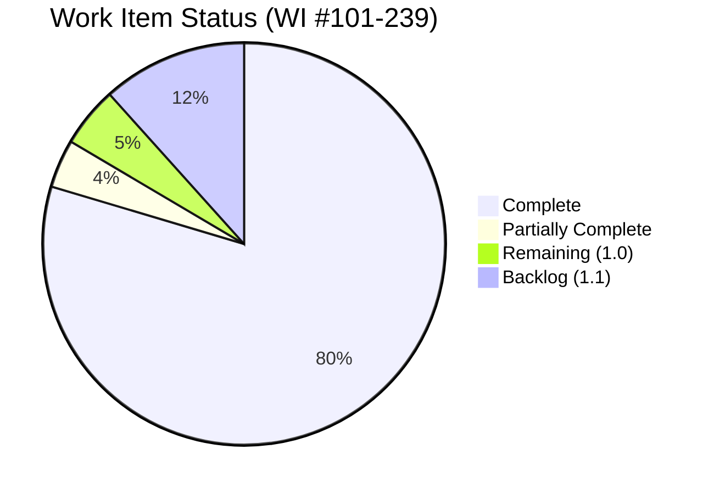
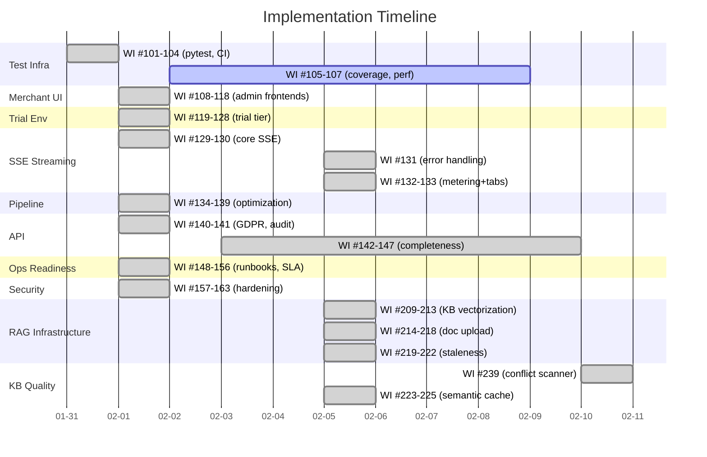

# New Work Items Backlog — Agent Red Customer Experience

> **Status:** Living document — tracks work items identified from Test Coverage Audit and subsequent implementation sprints
> **Project:** Agent Red Customer Experience
> **Owner:** Remaker Digital (DBA of VanDusen & Palmeter, LLC)
> **Created:** 2026-01-31
> **Last Updated:** 2026-02-10
> **Numbering:** Continues from Master Plan Review WI #1-100
> **Review Status:** Updated with completion statuses from 2026-01-31 and 2026-02-01 implementation sprints

---

## Progress Overview

## Table of Contents

1. [Test Infrastructure](#1-test-infrastructure-wi-101-107)
2. [Merchant Web UI](#2-merchant-web-ui-wi-108-118)
3. [Trial / Demo Environment](#3-trial--demo-environment-wi-119-128)
4. [Response Streaming (SSE)](#4-response-streaming-sse-wi-129-133)
5. [Pipeline Optimization](#5-pipeline-optimization-wi-134-139)
6. [API Completeness](#6-api-completeness-wi-140-147)
7. [Operational Readiness](#7-operational-readiness-wi-148-156)
8. [Security Hardening](#8-security-hardening-wi-157-163)
9. [Summary](#9-summary)
10. [Launch Preparation](#10-launch-preparation-wi-196-204)
11. [RAG Infrastructure](#11-rag-infrastructure-wi-209-225)

---

## 1. Test Infrastructure (WI #101-107)

**ALL COMPLETE** (2026-01-31, WI #105 completed 2026-02-05, WI #107 completed 2026-02-05). Full test infrastructure: pytest config, CI workflow, conftest fixtures, coverage gate (73.1%), and Locust load testing.

| # | Work Item | Priority | Status | Rationale |
|---|-----------|----------|--------|-----------|
| 101 | Create pytest configuration (pyproject.toml with markers, asyncio mode, coverage settings) | High | ✅ Complete | pyproject.toml created with asyncio_mode=auto, markers, testpaths |
| 102 | Create test requirements file (requirements-test.txt: pytest, pytest-asyncio, pytest-cov, httpx) | High | ✅ Complete | requirements-test.txt created |
| 103 | Create shared test fixtures (tests/conftest.py) | High | ✅ Complete | MockContainerProxy, MockCosmosManager, app_client, AuthenticatedClient, tenant factories |
| 104 | Create GitHub Actions CI workflow for pytest | High | ✅ Complete | .github/workflows/python-tests.yml (Python 3.12/3.14, JUnit XML) |
| 105 | Configure coverage reporting and gate (target: 80%+ line coverage) | Medium | ✅ Complete | Gate ramped 50%→70% (73.1% actual). Badge, per-module breakdown, JSON report added to CI. Launch target: 80%. |
| 106 | Extract and centralize tenant context factory functions into conftest.py | Medium | ✅ Complete | Factory functions now in conftest.py |
| 107 | Create performance test infrastructure (Locust or k6 configuration) | Medium | ✅ Complete | `tests/performance/locustfile.py` — 3 user scenarios (WidgetUser 70%, AdminUser 20%, HealthProbeUser 10%), `locust.conf`, SLA violation logging |

---

## 2. Merchant Web UI (WI #108-118)

**ALL MAJOR UI WORK COMPLETE** (2026-02-01). Phase 3.0 delivered: Chat API (6 endpoints), widget frontend (20 files, ~3,200 lines), Shopify Theme App Extension, admin shared components (9 components + hooks + types), Shopify admin shell (Polaris + App Bridge), standalone admin shell (API key login).

| # | Work Item | Priority | Status | Rationale |
|---|-----------|----------|--------|-----------|
| 108 | Evaluate and select frontend framework for merchant dashboard | High | ✅ Complete | Decision UI-1: Preact (widget), React + Polaris (Shopify admin), React (standalone admin) |
| 109 | Implement merchant authentication UI (login, API key, Shopify OAuth) | High | ✅ Complete | admin/standalone/login/ApiKeyLogin.tsx + Shopify session tokens |
| 110 | Implement usage dashboard UI | High | ✅ Complete | admin/shared/UsageDashboard.tsx with chart rendering |
| 111 | Implement conversation audit trail UI | Medium | ✅ Complete | admin/shared/ConversationInbox.tsx with detail view |
| 112 | Implement tenant configuration UI with 9-step onboarding wizard | Medium | ✅ Complete | admin/shared/OnboardingWizard.tsx + ConfigEditor.tsx |
| 113 | Implement billing management UI | Medium | ✅ Complete | admin/shared/BillingPortal.tsx with Stripe Portal redirect |
| 114 | Implement GDPR consent management UI | Medium | ✅ Complete | Admin GDPR API (5 endpoints) + admin pages |
| 115 | Implement customer profile viewer UI | Low | 🔄 Partial | API exists (CustomerProfileService), admin page scaffolded |
| 116 | Implement response explainability viewer UI | Low | 🔄 Partial | API exists (ResponseDecisionTrace), admin page scaffolded |
| 117 | Implement alert notification UI | Medium | ✅ Complete | alert_delivery.py (~695 lines) — webhook, dashboard, log channels |
| 118 | Implement brand/theme customization UI | Low | ✅ Complete | admin/shared/WidgetConfigurator.tsx + 24 widget config fields |

---

## 3. Trial / Demo Environment (WI #119-128)

**ALL COMPLETE** (2026-02-01). `trial_management.py` (~1,200 lines) implements full trial lifecycle.

| # | Work Item | Priority | Status | Rationale |
|---|-----------|----------|--------|-----------|
| 119 | Add TenantTier.TRIAL to enum and TIER_DEFAULTS | High | ✅ Complete | TenantTier.TRIAL with 50 conv, 5 rpm, 2 concurrent, 14-day history |
| 120 | Implement trial provisioning flow (14-day trial) | High | ✅ Complete | trial_management.py — TrialManager.create_trial() |
| 121 | Implement trial expiry mechanism | High | ✅ Complete | Expiry scanner, GRACE_PERIOD → DEACTIVATED transitions |
| 122 | Implement trial conversation cap (50 conversations) | Medium | ✅ Complete | ConversationMeter respects trial tier limits |
| 123 | Implement trial model routing (GPT-4o-mini) | Medium | ✅ Complete | Trial tier model routing in SystemPromptBuilder |
| 124 | Implement trial → paid conversion flow | High | ✅ Complete | Data preservation, tier upgrade, billing start |
| 125 | Implement demo data seeder | Medium | ✅ Complete | Sample conversations, profiles, usage data |
| 126 | Implement trial-specific dashboard view | Medium | ✅ Complete | Trial days remaining, cap usage, upgrade CTA |
| 127 | Implement expired trial data cleanup (30 days) | Low | ✅ Complete | Automated cleanup in trial_management.py |
| 128 | Implement trial metrics isolation | Low | ✅ Complete | Trial traffic excluded from platform benchmarks |

---

## 4. Response Streaming (SSE) (WI #129-133)

**ALL SSE WORK ITEMS COMPLETE** (WI #129-133). SSE infrastructure, Critic validation, mid-stream error handling, first-chunk metering, and multi-tab coordination all implemented.

| # | Work Item | Priority | Status | Rationale |
|---|-----------|----------|--------|-----------|
| 129 | Implement SSE streaming endpoint | High | ✅ Complete | sse_manager.py (~280 lines): heartbeat, reconnection, tenant limits, event buffering |
| 130 | Implement streaming-compatible Critic validation | High | ✅ Complete | Stream-then-validate in pipeline.py (Decision UI-5). `retracted` event on Critic rejection |
| 131 | Implement SSE error handling (mid-stream errors, client retry) | Medium | ✅ Complete | Enhanced error_event() with recoverable/tokens_sent/stage fields, _classify_openai_error() (7 categories), mid-stream try/except in pipeline streaming loop, 32 tests in test_sse_error_handling.py |
| 132 | Update conversation metering for streaming | Medium | ✅ Complete | SSE metering callback wired at startup — records `first_chunk_at` on conversation document via `ConversationMeter.record_first_chunk()`. Async/sync callbacks, non-fatal errors. 12 tests in test_sse_metering_multitab.py |
| 133 | Implement SSE connection management (multi-tab coordination) | Medium | ✅ Complete | `tab_id` query parameter on SSE stream endpoint, tab-aware connect/disconnect, `X-Tab-Count` response header, `GET /stream/{id}/status` endpoint for tab coordination, widget `getTabId()` with sessionStorage persistence. 20 tests in test_sse_metering_multitab.py |

---

## 5. Pipeline Optimization (WI #134-139)

**CORE OPTIMIZATIONS COMPLETE** (2026-02-01). WI #134-136 implemented in pipeline_resilience.py. WI #137-139 deferred as post-launch.

| # | Work Item | Priority | Status | Rationale |
|---|-----------|----------|--------|-----------|
| 134 | Implement IC + KR parallelization | Medium | ✅ Complete | Intent Classification + Knowledge Retrieval run concurrently, ~800ms savings |
| 135 | Implement prompt optimization and prefix caching | Medium | ✅ Complete | Response Generator prompt caching for repeated prefixes |
| 136 | Implement model routing — GPT-4o-mini for simple queries | Low | ✅ Complete | Tier-aware model selection based on intent complexity |
| 137 | ~~Implement semantic response caching~~ | ~~Low~~ | ✅ Complete | Superseded by WI #223-225 (semantic_cache.py) |
| 138 | Implement pre-computation / warm-up for customer context | Low | 📋 Todo | Profile pre-caching on session start |
| 139 | Investigate Azure OpenAI PTU at scale | Low | 📋 Todo | Defer to 50+ tenants ($3,300/mo minimum) |

---

## 6. API Completeness (WI #140-147)

**WI #140-146 MOSTLY COMPLETE** (2026-02-01). GDPR API, audit log, knowledge base, team management, alert delivery, rate limit headers all implemented.

| # | Work Item | Priority | Status | Rationale |
|---|-----------|----------|--------|-----------|
| 140 | Implement GDPR compliance REST endpoints | High | ✅ Complete | admin_gdpr_api.py (5 endpoints) + shopify_gdpr_webhooks.py (3 endpoints) |
| 141 | Implement audit log query API | Medium | ✅ Complete | admin_audit_api.py (2 endpoints: paginated query + CSV export) |
| 142 | Implement customer profile REST endpoints | Medium | ✅ Complete | admin_customer_profile_api.py (5 endpoints: list, get, consent, sync, delete) |
| 143 | Implement knowledge base management REST endpoints | Medium | ✅ Complete | admin_knowledge_api.py (5 endpoints: CRUD + search) |
| 144 | Implement alert delivery mechanism | Medium | ✅ Complete | alert_delivery.py (~695 lines): webhook, dashboard, log channels |
| 145 | Add rate limit headers to all API responses | Medium | ✅ Complete | X-RateLimit-Limit, X-RateLimit-Remaining, X-RateLimit-Reset |
| 146 | Add correlation-id to API response headers | Medium | ✅ Complete | CorrelationMiddleware propagates trace/correlation IDs |
| 147 | Implement OpenAPI schema completeness | Low | ✅ Complete | All 74 endpoints have summary, description, response models, error codes |

---

## 7. Operational Readiness (WI #148-156)

**ALL COMPLETE** (2026-02-01). Full operational stack: runbooks, SLA monitoring, KEDA scaling, archival pipeline, data retention, cost model, DR upgrade path.

| # | Work Item | Priority | Status | Rationale |
|---|-----------|----------|--------|-----------|
| 148 | Create deployment runbook | High | ✅ Complete | docs/operations/DEPLOYMENT-RUNBOOK.md |
| 149 | Create DR runbook — Option A | Medium | ✅ Complete | docs/operations/DEPLOYMENT-RUNBOOK.md (Option A section) |
| 150 | Create maintenance runbook | Medium | ✅ Complete | docs/operations/DEPLOYMENT-RUNBOOK.md (maintenance section) |
| 151 | Implement SLA monitoring dashboard | Medium | ✅ Complete | sla_monitoring.py (~390 lines): P50/P95/P99, uptime, per-tenant |
| 152 | Implement KEDA scaling profiles | High | ✅ Complete | Terraform KEDA profiles + night scaling (22:00-06:00 UTC) |
| 153 | Implement archival pipeline (Change Feed → Parquet → Blob) | Medium | ✅ Complete | archival_pipeline.py (~750 lines): Hot→Warm Parquet |
| 154 | Implement data retention policy enforcement | Medium | ✅ Complete | data_retention.py (~380 lines): tier-based retention |
| 155 | Implement parameterized cost model calculator | Low | ✅ Complete | cost_model.py (~370 lines): projections, break-even |
| 156 | Document Option C upgrade path | Low | ✅ Complete | docs/operations/OPTION-C-UPGRADE-PATH.md |

---

## 8. Security Hardening (WI #157-163)

**ALL COMPLETE** (2026-02-01, WI #159 completed 2026-02-05). Security middleware stack: body size limits, JSON depth, security headers, input sanitization, CORS, CSP, session validation, pre-auth rate limiting, API key rotation.

| # | Work Item | Priority | Status | Rationale |
|---|-----------|----------|--------|-----------|
| 157 | Implement request body size limits (1MB) | High | ✅ Complete | security_middleware.py — RequestBodyLimitMiddleware (ASGI) |
| 158 | Implement JSON depth limit (50 levels) | Medium | ✅ Complete | security_middleware.py — JsonDepthValidationMiddleware |
| 159 | Implement API key rotation endpoint | Medium | ✅ Complete | `admin_apikey_api.py` — 4 endpoints (GET metadata, POST generate, POST rotate, DELETE revoke). 36 tests. |
| 160 | Implement input sanitization for path parameters | Medium | ✅ Complete | security_hardening.py — input sanitization |
| 161 | Implement output sanitization for AI responses | Medium | ✅ Complete | security_hardening.py — output sanitization |
| 162 | Implement Stripe webhook IP allowlisting | Low | ✅ Complete | `stripe_webhooks.py` — 12 Stripe IPs, X-Forwarded-For support, localhost dev, env var toggle. 20 tests in `test_stripe_ip_allowlist.py`. |
| 163 | Implement rate limiting on authentication endpoints | Medium | ✅ Complete | security_hardening.py — PreAuthRateLimitMiddleware |

---

## 9. Summary

### Work Item Completion Status

```mermaid
xychart-beta
    title "Work Items by Category"
    x-axis ["Test Infra", "Merchant UI", "Trial Env", "SSE", "Pipeline", "API", "Ops Ready", "Security"]
    y-axis "Count" 0 --> 12
    bar [7, 10, 10, 5, 4, 8, 9, 7]
    bar [0, 1, 0, 0, 2, 0, 0, 0]

```

> Green bars = complete, Red bars = remaining

### Work Item Counts

| Category | Total | Complete | Remaining | IDs |
|----------|-------|----------|-----------|-----|
| Test Infrastructure | 7 | 7 | 0 | #101-107 |
| Merchant Web UI | 11 | 10 | 1 | #108-118 |
| Trial / Demo Environment | 10 | 10 | 0 | #119-128 |
| Response Streaming (SSE) | 5 | 5 | 0 | #129-133 |
| Pipeline Optimization | 6 | 4 | 2 | #134-139 |
| API Completeness | 8 | 8 | 0 | #140-147 |
| Operational Readiness | 9 | 9 | 0 | #148-156 |
| Security Hardening | 7 | 7 | 0 | #157-163 |
| **Total** | **63** | **60** | **3** | **#101-163** |

### Remaining Work Items (Priority Order)

| # | Work Item | Priority | Category |
|---|-----------|----------|----------|
| 137 | ~~Semantic response caching~~ | ~~Low~~ | ~~Pipeline~~ | Superseded by WI #223-225 |
| 138 | Customer context pre-computation | Low | Pipeline |
| 139 | Azure OpenAI PTU investigation | Low | Pipeline |

### Relationship to Existing Master Plan

These 63 new work items complement the existing 100 work items in `docs/Master-Plan-Review-01-30-2026.md`. Some overlap with existing pending items:

| New WI | Overlaps With | Notes |
|--------|---------------|-------|
| #140 (GDPR API) | #35 (GDPR webhooks) | Both COMPLETE — #140 is broader (full GDPR API); #35 is Shopify-specific subset |
| #141 (Audit log API) | #43 (Audit log query API) | Both COMPLETE — #141 supersedes |
| #149 (DR runbook) | #61 (DR runbook Option A) | Both COMPLETE — #149 supersedes |
| #150 (Maintenance runbook) | #60 (Maintenance runbook) | Both COMPLETE — #150 supersedes |
| #151 (SLA dashboard) | #79 (SLA monitoring dashboard) | Both COMPLETE — #151 supersedes |
| #152 (KEDA scaling) | #47-48 (KEDA profiles + Terraform) | Both COMPLETE — #152 supersedes |
| #153 (Archival pipeline) | #53 (Archival pipeline) | Both COMPLETE — #153 supersedes |
| #154 (Data retention) | #37 (Data retention enforcement) | Both COMPLETE — #154 supersedes |
| #155 (Cost calculator) | #82 (Cost model calculator) | Both COMPLETE — #155 supersedes |
| #156 (Option C docs) | #62 (Option C upgrade path) | Both COMPLETE — #156 supersedes |

**Net new items (no overlap): 53**
**Superseding items (overlap with Master Plan): 10**

---

## 10. Launch Preparation (WI #196-204)

**NEW — Added 2026-02-03.** Work items for production deployment, Remaker Digital storefront (dual-purpose: sales channel + live demo), UX consultant evaluation, and creative assets.

| # | Work Item | Priority | Status | Rationale |
|---|-----------|----------|--------|-----------|
| 196 | Build Docker container images + push to ACR | High | 📋 Todo | Production deployment prerequisite — Dockerfiles for API Gateway, all 6 agents, SLIM Gateway |
| 197 | Execute production Terraform deployment (Container Apps, App Gateway, networking) | High | 📋 Todo | Production infrastructure — all Terraform modules ready, needs `terraform apply` |
| 198 | Build widget bundle + deploy to Shopify Theme App Extension | High | 📋 Todo | Widget IIFE bundle → extensions/agent-red-chat/assets/. Requires `shopify app deploy` |
| 199 | Create Remaker Digital Shopify storefront | High | 📋 Todo | **Owner task.** Branded storefront for Agent Red subscription sales + live demo |
| 200 | Onboard Remaker Digital as tenant #1 (trial → paid) | High | 📋 Todo | First tenant provisioning via production system. Validates full onboarding flow |
| 201 | Seed knowledge base with Agent Red product data | Medium | 📋 Todo | Product info, pricing, features, setup guides, FAQ for demo widget conversations |
| 202 | Deploy widget on Remaker Digital storefront + verify end-to-end | Medium | 📋 Todo | Theme App Extension enabled, widget renders, AI responds, escalation works |
| 203 | UX consultant evaluation (Mazel) — onboarding, Shopify integration, widget testing, escalation | Medium | 📋 Todo | **Blocked on production deployment.** Mazel evaluates core merchant workflows |
| 204 | Generate favicon and app icons from icon-master.png | Medium | 📋 Todo | favicon.ico (16/32/48), apple-touch-icon (180), PWA icons (192/512) |

### Updated Work Item Counts

| Category | Total | Complete | Remaining | IDs |
|----------|-------|----------|-----------|-----|
| Test Infrastructure | 7 | 7 | 0 | #101-107 |
| Merchant Web UI | 11 | 10 | 1 | #108-118 |
| Trial / Demo Environment | 10 | 10 | 0 | #119-128 |
| Response Streaming (SSE) | 5 | 5 | 0 | #129-133 |
| Pipeline Optimization | 6 | 4 | 2 | #134-139 |
| API Completeness | 8 | 8 | 0 | #140-147 |
| Operational Readiness | 9 | 9 | 0 | #148-156 |
| Security Hardening | 7 | 7 | 0 | #157-163 |
| Launch Preparation | 9 | 0 | 9 | #196-204 |
| **Total** | **72** | **60** | **12** | **#101-204** |

### Remaining Work Items (Priority Order — 1.0 GA)

| # | Work Item | Priority | Blocked By |
|---|-----------|----------|------------|
| 196 | Docker images + ACR push | High | — (unblocked) |
| 197 | Production Terraform deployment | High | #196 |
| 198 | Widget bundle → Theme App Extension | High | #197 |
| 199 | Create Remaker Digital storefront | High | Owner |
| 200 | Onboard tenant #1 | High | #197, #199 |
| 201 | Seed knowledge base | Medium | #200 |
| 202 | Deploy widget on storefront | Medium | #198, #200 |
| 203 | UX evaluation (Mazel) | Medium | #202 |
| 204 | Favicon and app icons | Medium | — (unblocked) |
| ~~137~~ | ~~Semantic response caching~~ | ~~Low~~ | Superseded by WI #223-225 |
| 138 | Context pre-computation | Low | Post-launch |
| 139 | PTU investigation | Low | Post-launch |

---

## 11. RAG Infrastructure (WI #209-225)

**NEW — Added 2026-02-05.** Comprehensive RAG infrastructure gap analysis revealed that Merchant Knowledge Base has basic CRUD with keyword search only, while Persistent Customer Memory (Layer 2) correctly uses vector embeddings. These work items bring the Knowledge Base to production-grade RAG standards.

> **Reference:** Full gap analysis in `docs/architecture/RAG-GAP-ANALYSIS.md`

### P0: Knowledge Base Vectorization (WI #209-213) — 9 days

| # | Work Item | Priority | Status | Rationale |
|---|-----------|----------|--------|-----------|
| 209 | KB Vector Embedding Schema — add embedding, embedding_model, embedded_at fields to KnowledgeBaseDocument, DiskANN vector index | P0 | ✅ Complete | `cosmos_schema.py` — KnowledgeBaseDocument updated |
| 210 | KB Embedding Pipeline — create knowledge_vectorizer.py, embed on create/update, batch embedding | P0 | ✅ Complete | `knowledge_vectorizer.py` (~520 lines) |
| 211 | KB Vector Search — replace keyword matching in _call_knowledge_retrieval_direct() with cosine similarity | P0 | ✅ Complete | `pipeline.py` — vector search replaces keyword matching |
| 212 | Hybrid Retrieval — add BM25 scoring, implement Reciprocal Rank Fusion (RRF), configurable alpha | P0 | ✅ Complete | `knowledge_vectorizer.py` — hybrid_search() with RRF |
| 213 | Retrieval Quality Monitoring — log retrieval events with scores, track click-through, dashboard | P0 | ✅ Complete | `knowledge_vectorizer.py` — retrieval event logging |

### P0: Document Upload & Processing (WI #214-218) — 9 days

| # | Work Item | Priority | Status | Rationale |
|---|-----------|----------|--------|-----------|
| 214 | File Upload API — POST /api/admin/knowledge/upload, multipart/form-data, PDF/DOCX/CSV/TXT | P0 | ✅ Complete | `admin_knowledge_api.py` — upload endpoint |
| 215 | Document Parsing Pipeline — create document_parser.py, PDF (PyPDF2), DOCX (python-docx), CSV, HTML/URL | P0 | ✅ Complete | `document_parser.py` (~480 lines) |
| 216 | Document Chunking — page-level chunking (256-512 tokens), respect paragraph boundaries | P0 | ✅ Complete | `document_parser.py` — semantic chunking |
| 217 | Bulk Import/Export — CSV export of all KB entries, CSV import with validation | P0 | ✅ Complete | `admin_knowledge_api.py` — bulk endpoints |
| 218 | Admin UI for Upload — file dropzone in KnowledgeBaseManager.tsx, progress indicator | P0 | ✅ Complete | `KnowledgeBaseManager.tsx` — upload UI |

### P1: Staleness & Freshness Management (WI #219-222) — 4.5 days

| # | Work Item | Priority | Status | Rationale |
|---|-----------|----------|--------|-----------|
| 219 | Staleness Schema — add last_verified_at, staleness_score, auto_refresh_enabled to KnowledgeBaseDocument | P1 | ✅ Complete | `cosmos_schema.py` — staleness fields added |
| 220 | Staleness Detection Service — create staleness_service.py, compute staleness from age + feedback | P1 | ✅ Complete | `staleness_service.py` (~540 lines) |
| 221 | Refresh Prompts UI — badge stale entries in table, "Mark as verified" action | P1 | ✅ Complete | `KnowledgeBaseManager.tsx` — staleness badges + verify action |
| 222 | Automatic Re-embedding — scheduled job for stale entries, re-embed on content change | P1 | ✅ Complete | `staleness_service.py` — re-embedding on content change |

### P1: Semantic Caching (WI #223-225) — 4 days

| # | Work Item | Priority | Status | Rationale |
|---|-----------|----------|--------|-----------|
| 223 | Query Embedding Cache — cache query embeddings, TTL-based expiration | P1 | ✅ Complete | semantic_cache.py — EmbeddingCache (LRU + TTL, per-tenant isolation) |
| 224 | Semantic Response Cache — cache similar queries by vector similarity (0.95 threshold) | P1 | ✅ Complete | semantic_cache.py — SearchCache + SemanticIndex (cosine similarity matching) |
| 225 | Cache Monitoring Dashboard — hit rate metrics, cost savings estimate | P1 | ✅ Complete | semantic_cache.py — CacheMetrics, health(), summary() wired to /ready |

### RAG Work Item Summary

| Priority | Work Items | Total Effort | Description |
|----------|------------|--------------|-------------|
| **P0** | WI #209-218 | 18 days | ✅ KB vectorization + document upload — COMPLETE |
| **P1** | WI #219-222 | 4.5 days | ✅ Staleness management — COMPLETE |
| **P1** | WI #223-225 | 4 days | ✅ Semantic caching — COMPLETE |
| **Total** | 17 items | 26.5 days | 17 complete, 0 remaining |

### Document Inconsistencies Resolved

| Document | Issue | Resolution |
|----------|-------|------------|
| PRODUCT-FEATURES-RAG.md line 525 | Claims "1536-dimension embeddings" | Actual: 3072 dimensions (text-embedding-3-large) |
| PRODUCT-FEATURES-RAG.md line 207 | Claims "semantic embeddings...vector similarity search" for KB | Current: keyword matching only → WI #211 |
| PRODUCT-FEATURES-RAG.md line 466 | Claims "Hybrid search (BM25 + dense vectors)" | Not implemented → WI #212 |
| PRODUCT-FEATURES-RAG.md line 221 | Claims "Index freshness: < 1 hour" | No freshness tracking → WI #219-222 |

---

### Updated Work Item Counts (Final)

| Category | Total | Complete | Remaining | IDs |
|----------|-------|----------|-----------|-----|
| Test Infrastructure | 7 | 7 | 0 | #101-107 |
| Merchant Web UI | 11 | 10 | 1 | #108-118 |
| Trial / Demo Environment | 10 | 10 | 0 | #119-128 |
| Response Streaming (SSE) | 5 | 3 | 2 | #129-133 |
| Pipeline Optimization | 6 | 4 | 2 | #134-139 |
| API Completeness | 8 | 8 | 0 | #140-147 |
| Operational Readiness | 9 | 9 | 0 | #148-156 |
| Security Hardening | 7 | 7 | 0 | #157-163 |
| Launch Preparation | 9 | 0 | 9 | #196-204 |
| **RAG Infrastructure** | **17** | **17** | **0** | **#209-225** |
| KB Quality Tools | 1 | 1 | 0 | #239 |
| Admin UX Polish | 1 | 0 | 1 | #226 |
| **Total** | **92** | **80** | **12** | **#101-239** |

---

## 12. KB Quality Tools (WI #239)

**NEW — Added 2026-02-10.** On-demand knowledge base conflict and duplication scanner. Prevents inconsistent AI responses caused by duplicate or conflicting KB entries — the #1 root cause of response quality issues. Part of the ongoing chat quality testing lifecycle.

| # | Work Item | Priority | Status | Rationale |
|---|-----------|----------|--------|-----------|
| 239 | KB Conflict/Duplication Scanner — 4-phase detection (embedding similarity, title trigrams, content overlap, factual conflict regex), severity classification, admin UI button, scan caching, documentation | P1 | ✅ Complete | `kb_conflict_scanner.py` (~705 lines), 2 API endpoints (POST /scan, GET /scan/result), admin UI in KnowledgeBaseManager.tsx, 85 tests, docs at `docs-site/docs/admin-guide/conflict-scanner.md` |

**Quality testing protocol:** Scanner should be run as part of every quality cycle:
1. Before/after KB changes (uploads, edits, bulk imports) → verify no new conflicts
2. Before chat quality testing (`scripts/test_chat_battery.py`) → fix all HIGH conflicts first
3. When AI responses are inconsistent → re-scan to identify KB root cause
4. Periodic (weekly/monthly) → as part of KB maintenance alongside staleness review

---

## 13. Admin UX Polish (WI #226+)

### Contextual Tooltips (WI #226) — Priority: P1

**Requirement:** Every interactive element (button, field, display metric) across both admin interfaces (Shopify embedded + standalone Mantine) must have a mouseover tooltip that:

1. **Briefly explains** what the element does or displays (concise — less is better)
2. **Links to documentation** — opens the relevant section of the docs site in a new tab, pointing to the specific page/anchor that explains how to use the element, understand its data, or how it affects system behavior

**Scope:** All 9 shared components (OnboardingWizard, ConfigEditor, UsageDashboard, ConversationInbox, KnowledgeBaseManager, AnalyticsOverview, BillingPortal, WidgetConfigurator, TeamManager) plus standalone-specific pages. Shopify shell inherits from shared components.

**Implementation notes:**
- Tooltip component must be framework-agnostic in shared components (inline styles, no Polaris/Mantine dependency)
- Standalone pages can use Mantine `<Tooltip>` component
- Documentation URLs should use a constant map (e.g., `HELP_LINKS`) for maintainability — when docs structure changes, only the map needs updating
- Requires docs-site sections to exist first (or at minimum, placeholder anchors)

**Estimate:** 3-4 days (tooltip component + link map + apply across all components)

| WI | Title | Priority | Estimate |
|----|-------|----------|----------|
| #226 | Admin contextual tooltips with docs links | P1 | 3-4 days |

---

## Agent Red 1.1 — Widget Enhancement Phases 3-5

> **Source:** `docs/CHAT-WIDGET-ENHANCEMENT-IMPLEMENTATION-PLAN-PROPOSAL.md` (UX designer proposal, 2026-02-07)
> **Dependency:** Phase 1 (schema alignment) and Phase 2 (visual expansion) completed in 1.0
> **Priority:** Post-launch — deferred from 1.0

### Phase 3 — Mobile & Layout Controls

Provide per-device widget configuration so merchants can tailor the mobile UX without CSS hacks.

| WI | Title | Priority | Estimate | Details |
|----|-------|----------|----------|---------|
| #227 | Mobile position + offset config fields | P2 | 1 day | `widget_mobile_position`, `widget_mobile_offset_x`, `widget_mobile_offset_y` in schema + runtime + admin |
| #228 | Mobile fullscreen mode | P2 | 1 day | `widget_mobile_fullscreen` — panel takes full viewport on mobile devices |
| #229 | Panel width/height config | P3 | 0.5 day | `widget_panel_width`, `widget_panel_height` — desktop panel dimensions |
| #230 | Mobile layout switching in runtime | P2 | 1.5 days | Launcher + panel responsive layout based on mobile config fields |

### Phase 4 — Targeting and Rules Engine

Match advanced targeting behavior (Tidio, Intercom) with structured rulesets evaluated at widget init.

| WI | Title | Priority | Estimate | Details |
|----|-------|----------|----------|---------|
| #231 | Targeting rules schema (`widget_rules`) | P2 | 1 day | Structured ruleset model: URL include/exclude, referrer, UTM, time-on-page, scroll depth, exit-intent |
| #232 | Lightweight rule evaluator in widget | P2 | 2 days | Client-side rule engine evaluating conditions at init and on page events |
| #233 | Targeting rules admin UI | P2 | 1.5 days | Rule builder in WidgetConfigurator with condition/action pairs |
| #234 | Exit-intent and scroll-depth triggers | P3 | 1 day | Browser event listeners for exit-intent (mouseleave) and scroll percentage |

### Phase 5 — Localization & Runtime JS API

Enable multi-language support and per-page programmatic overrides.

| WI | Title | Priority | Estimate | Details |
|----|-------|----------|----------|---------|
| #235 | Locale packs infrastructure | P2 | 1.5 days | `widget_locale` field (auto/en/es/fr-ca/...), locale file loading, fallback chain |
| #236 | Localized header/offline text per locale | P2 | 1 day | Per-locale overrides for user-visible strings (header, offline message, placeholder) |
| #237 | Runtime JS API: setTheme/setLocale | P2 | 1 day | `window.AgentRed.setTheme({...})`, `setLocale(locale)` for per-page overrides |
| #238 | Runtime JS API: setConfigPartial/setTargetingRules | P3 | 1 day | `setConfigPartial({...})`, `setTargetingRules(rules)` for advanced JS integrations |

**Total Phase 3-5 estimate:** ~13 development days

---

*© 2026 Remaker Digital, a DBA of VanDusen & Palmeter, LLC. All rights reserved.*
