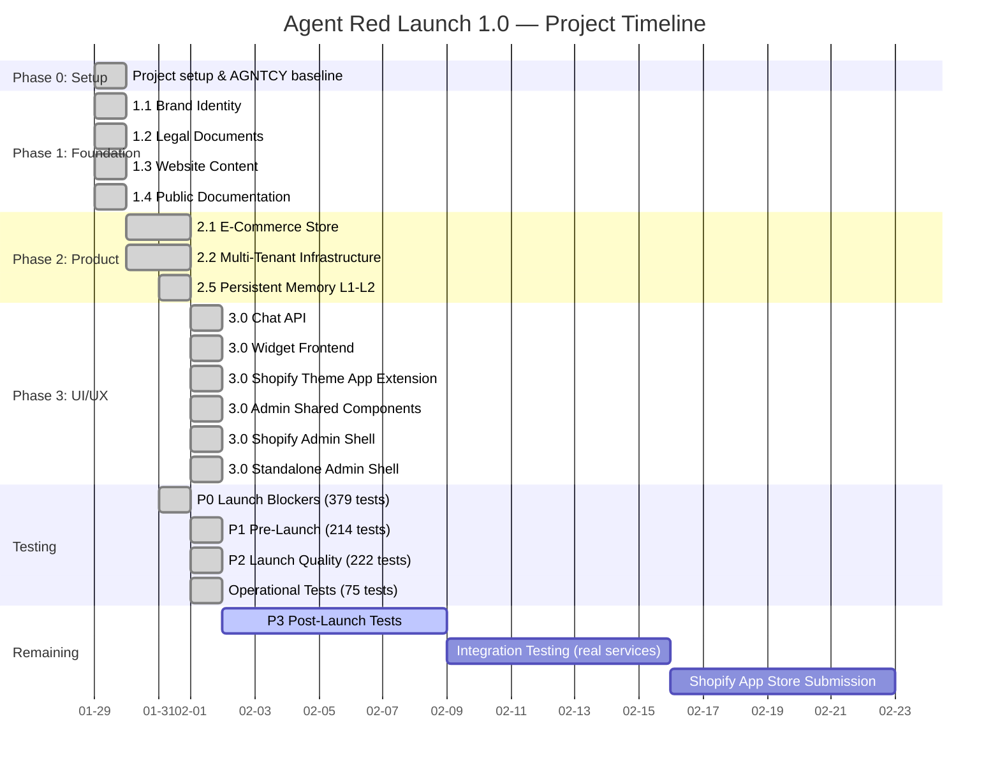
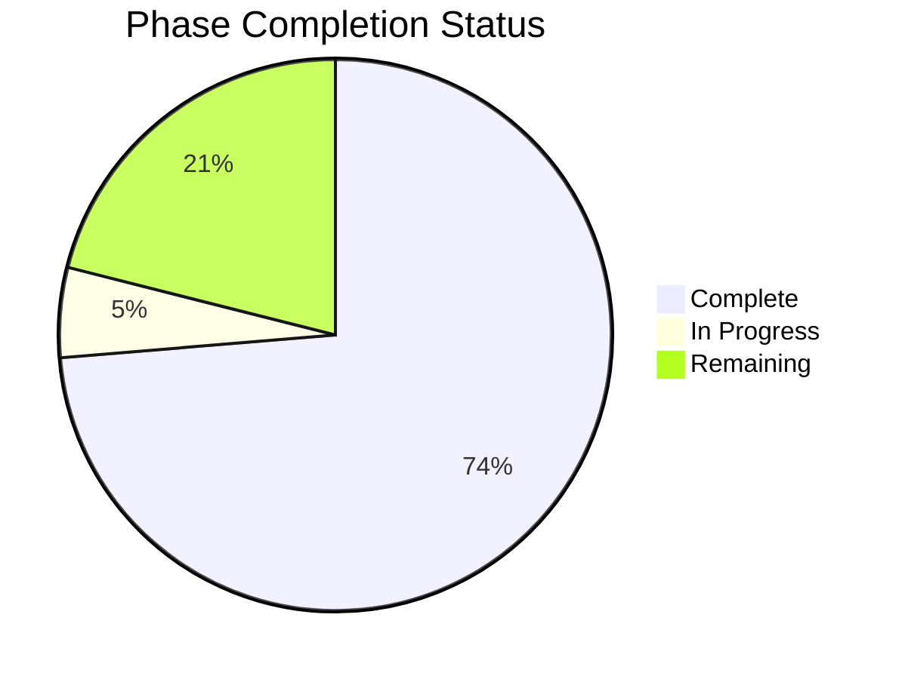
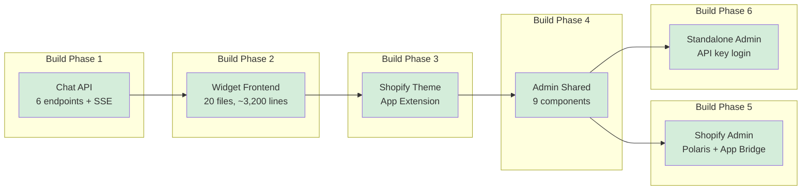
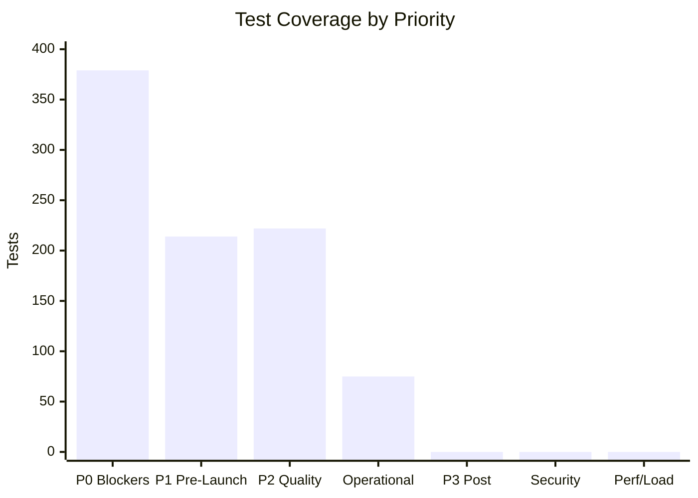
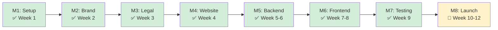

# Agent Red Customer Experience - Launch 1.0 Project Plan

> **Project:** Agent Red Customer Experience
> **Release:** Launch 1.0
> **Timeline:** Q1 2026 (8-12 weeks)
> **Budget:** $500-1,000/month operational
> **Last Updated:** 2026-02-02

---

## Executive Summary

Agent Red Customer Experience is a commercial SaaS product built on the open-source AGNTCY Customer Engagement Platform foundation. Launch 1.0 targets MVP delivery within Q1 2026, focusing on core commercial infrastructure and Phase 1-2 marketing materials.

---

## Project Progress

---

## Project Phases

### Phase 0: Project Setup (Week 1)
**Status:** Complete ✅

| Task | Status | Notes |
|------|--------|-------|
| Create project directory structure | ✅ Done | E:\Claude-Playground\CLAUDE-PROJECTS\Agent Red Customer Engagement |
| Create CLAUDE.md | ✅ Done | AI assistant guidance (v14.0.0 with full knowledge transfer) |
| Create PROJECT-PLAN.md | ✅ Done | This file |
| Create GitHub repository | ✅ Done | github.com/mike-remakerdigital/agent-red |
| AGNTCY dependency model | ✅ Done | Arms-length via public GitHub (no submodule) |
| Migrate commercial materials | ✅ Done | SaaS proposal, product features, website content |
| Initial commit pushed | ✅ Done | 23 files, 5,825 lines |
| Docker dev environment | ✅ Done | Dockerfile, docker-compose.yml, requirements.txt |
| AGNTCY baseline verification (local) | ✅ Done | 15 containers healthy, 97.8% unit / 99.3% integration pass |
| AGNTCY baseline verification (Azure) | ✅ Done | All 53 resources operational |
| Set up GitHub Project board | ✅ Done | 8 milestone issues (M1-M8) |

---

### Phase 1: Foundation (Weeks 2-4)
**Status:** Complete ✅

#### 1.1 Brand Identity

| Task | Status |
|------|--------|
| Logo concepts (primary, icon, wordmark) | ✅ Done — "The Beacon" AR monogram approved |
| Color palette selection | ✅ Done — 15 colors, WCAG AA/AAA, primary #C41E2A |
| Typography selection | ✅ Done — Inter + JetBrains Mono |
| Brand guidelines document | ✅ Done — branding/guidelines/BRAND-GUIDELINES.md |
| Favicon and app icons | 📋 Todo — derive from branding/logo/PNG/icon-master.png |

#### 1.2 Legal Documents

| Task | Status |
|------|--------|
| Draft Terms of Service | ✅ Done — legal/terms/TERMS-OF-SERVICE.md |
| Draft Privacy Policy | ✅ Done — legal/privacy/PRIVACY-POLICY.md |
| Draft SLA document | ✅ Done — legal/sla/SERVICE-LEVEL-AGREEMENT.md (v0.2.0) |
| Draft Data Processing Agreement | ✅ Done — legal/dpa/DATA-PROCESSING-AGREEMENT.md |
| Validate via iubenda | 📋 Deferred to pre-launch |

#### 1.3 Website Content

| Task | Status |
|------|--------|
| Write homepage (commercial buyer focus) | ✅ Done |
| Write features page | ✅ Done |
| Write pricing page | ✅ Done — $149/$399/$999 base + metered AI usage |
| Write integrations page | ✅ Done |
| Write about page | ✅ Done |
| Write contact page | ✅ Done |

#### 1.4 Public Documentation

| Task | Status |
|------|--------|
| Set up Docusaurus | ✅ Done — docs-site/ with Agent Red branding, Mermaid support |
| Documentation quality framework | ✅ Done — Vale, markdownlint, alex, link-check, CI pipeline |
| Write getting-started guide | ✅ Done — 3 pages, 14 Mermaid diagrams |
| Write Shopify integration guide | ✅ Done — OAuth, sync, field mapping, 6 Mermaid diagrams |
| API authentication guide | 📋 Deferred to Phase 2 |
| API endpoint documentation | 📋 Deferred to Phase 2 |

---

### Phase 2: Product & Infrastructure (Weeks 5-8)
**Status:** Complete ✅ (E-Commerce ~95%, Multi-Tenant 100%, Memory L1-L2 100%)

#### 2.1 E-Commerce Store
**Platform:** Dual-channel — Shopify App Store (primary) + Stripe (direct). Decision documented in `docs/architecture/ECOMMERCE-PLATFORM-EVALUATION.md`.

| Task | Status |
|------|--------|
| Evaluate Shopify vs Stripe vs Paddle | ✅ Done — Three-way evaluation, dual-channel |
| Create Stripe Products/Prices/Coupons (test mode) | ✅ Done — 27 objects (config/stripe_product_ids.json) |
| Implement Stripe Checkout | ✅ Done — stripe_checkout.py |
| Implement Stripe webhook handler (7 events) | ✅ Done — stripe_webhooks.py |
| Implement metered usage reporting (3-tier) | ✅ Done — stripe_usage.py |
| Implement Shopify Billing API | ✅ Done — shopify_billing.py + shopify_client.py |
| Implement conversation pack purchase flow | ✅ Done — stripe_packs.py (FIFO, 90-day validity) |
| Implement unified webhook handler | ✅ Done — provisioning.py (channel-agnostic) |
| Implement Stripe Customer Portal | ✅ Done — stripe_portal.py |
| Set up Stripe Tax | ✅ Done — automatic_tax, txcd_10103001, exclusive pricing |
| Set up Rewardful affiliate integration | ✅ Done — client_reference_id (live connection deferred) |
| Implement GDPR compliance webhooks (3 Shopify endpoints) | ✅ Done — shopify_gdpr_webhooks.py |
| Implement session token authentication | ✅ Done — auth.py (Shopify JWT verification) |
| Implement App Bridge Save Bar API | ✅ Done — admin/shopify/hooks/useSaveBar.ts |
| Shopify App Store listing copy | ✅ Done — docs/shopify/APP-STORE-LISTING.md |
| Creative assets (icon, screenshots, demo video) | 📋 Todo — blocked on design |
| Submit for Shopify App Store review | 📋 Todo — blocked by creative assets |
| Test checkout flows (both channels) | 📋 Todo — integration testing |

#### 2.2 Multi-Tenant Infrastructure
**Status:** COMPLETE — 38 modules, ~25,000 lines. Architecture review: 32 decisions, 100 work items.

| Task | Status |
|------|--------|
| Architecture review (32 decisions, 100 WIs) | ✅ Done — docs/Master-Plan-Review-01-30-2026.md |
| Cosmos DB schema + TenantScopedRepository (#13-14, #24-25) | ✅ Done — cosmos_schema.py, cosmos_client.py, repository.py |
| Dual auth + middleware (#18, #27-28) | ✅ Done — auth.py, middleware.py |
| Billable conversation + ConversationMeter (#71-72) | ✅ Done — conversation_meter.py |
| Fail-closed Critic policy (#50) | ✅ Done — critic_policy.py |
| NATS tenant isolation (#15-17, #26) | ✅ Done — nats_isolation.py |
| GDPR services (#30-34, #36) | ✅ Done — gdpr_services.py |
| OpenTelemetry tracing (#39-41) | ✅ Done — otel_tracing.py |
| Pipeline resilience (#44-46) | ✅ Done — pipeline_resilience.py |
| SystemPromptBuilder (#70) | ✅ Done — system_prompt_builder.py |
| Usage Dashboard API (#73-74) | ✅ Done — usage_dashboard_api.py |
| Tenant config schema/processor/API (#63-65) | ✅ Done — tenant_config_*.py (3 modules) |
| TenantSecretService (#29) | ✅ Done — tenant_secret_service.py |
| DR + security Terraform (#52, #55, #58-59) | ✅ Done — dr_security.tf |
| Billing doc + SLA updates (#77-78) | ✅ Done — billable-conversation-spec.md, SLA v0.2.0 |
| TenantUsageMonitor progressive throttling (#51) | ✅ Done — tenant_usage_monitor.py |
| KEDA auto-scaling profiles (#47-48) | ✅ Done — dr_security.tf (KEDA + night scaling) |
| Security middleware (#157-159) | ✅ Done — security_middleware.py |
| Security hardening (#160-163) | ✅ Done — security_hardening.py |
| Structured logging (#149) | ✅ Done — structured_logging.py |
| API versioning (#140) | ✅ Done — api_versioning.py |
| Trial management (#119-128) | ✅ Done — trial_management.py (~1,200 lines) |
| SLA monitoring (#151) | ✅ Done — sla_monitoring.py (~390 lines) |
| Data retention (#154) | ✅ Done — data_retention.py (~380 lines) |
| Archival pipeline (#153) | ✅ Done — archival_pipeline.py (~750 lines) |
| Cost model calculator (#155) | ✅ Done — cost_model.py (~370 lines) |
| Alert delivery (#192) | ✅ Done — alert_delivery.py (~695 lines) |

#### 2.5 Persistent Customer Memory
**Status:** Layers 1-2 COMPLETE (3 modules + 30 passing tests). Layers 3-4 deferred.

| Task | Status |
|------|--------|
| CustomerProfileService — Layer 1 (#83-85) | ✅ Done — customer_profile_service.py |
| ConversationVectorizer — Layer 2 (#87-88) | ✅ Done — conversation_vectorizer.py |
| Response explainability framework (#86) | ✅ Done — response_explainability.py |
| Test fixtures + 30 tests (#97-98, #100) | ✅ Done — tests/persistent_memory/ |
| PatternExtractionService — Layer 3 (#90-92) | 📋 Todo — Professional+ |
| Fine-tuning pipeline — Layer 4 (#93-96) | 📋 Todo — Enterprise add-on |
| 5 A/B production tests (#99) | 📋 Todo |

#### 2.3 Admin Guides *(deferred — requires working product)*
| Task | Status |
|------|--------|
| Initial setup guide | 📋 Todo |
| Shopify connection guide | 📋 Todo |
| Knowledge base setup guide | 📋 Todo |
| Monitoring and alerts guide | 📋 Todo |

#### 2.4 Demo Videos *(deferred — requires working product)*
| Task | Status |
|------|--------|
| Platform overview (2-3 min) | 📋 Todo |
| Quick start tutorial (3-5 min) | 📋 Todo |

---

### Phase 3: UI/UX Frontend (Weeks 9-10)
**Status:** ALL BUILD PHASES COMPLETE ✅

| Deliverable | Files | Lines | Status |
|-------------|-------|-------|--------|
| Chat API (models, session, pipeline, endpoints, SSE manager) | 6 modules | ~2,800 | ✅ Complete |
| Widget frontend (Preact, Shadow DOM, iframe, 3-channel transport) | 20 files | ~3,200 | ✅ Complete |
| Shopify Theme App Extension (Liquid template, manifest) | 3 files | ~200 | ✅ Complete |
| Admin shared components (9 components + hooks + types) | 11 files | ~5,400 | ✅ Complete |
| Shopify admin shell (Polaris + App Bridge, 7 pages) | 10 files | ~2,700 | ✅ Complete (build validated) |
| Standalone admin shell (API key login, 7 pages) | 10 files | ~2,800 | ✅ Complete (build validated) |

**Admin Build Validation:**
- admin/shopify: 0 TS errors, 599.57 KB bundle (146.67 KB gzip)
- admin/standalone: 0 TS errors, 304.74 KB bundle (87.63 KB gzip)

---

### Phase 4: Testing & QA
**Status:** P0+P1+P2 COMPLETE — 999 tests passing, 0 warnings

| Suite | Tests | Status |
|-------|-------|--------|
| P0 — Launch blockers (HTTP billing, middleware, meter, Critic, Cosmos, health, catalog, usage) | 379 | ✅ Complete |
| P1 — Pre-launch (NATS, GDPR, OTEL, resilience, prompts, config, Shopify, memory, dashboard) | 214 | ✅ Complete |
| P2 — Launch quality (Shopify client, billing, checkout, explainability, profiles, vectors, cross-module, errors) | 222 | ✅ Complete |
| Operational (archival, retention, SLA, cost model) | 75 | ✅ Complete |
| Conftest smoke + health + pre-existing | 109 | ✅ Complete |
| P3 — Post-launch (~90 tests) | 0 | 📋 Todo |
| Adversarial / security (~45 tests) | 0 | 📋 Todo |
| Performance / load (~30 tests) | 0 | 📋 Todo |

| Metric | Value |
|--------|-------|
| Total tests | 999 |
| Warnings | 0 |
| Execution time | ~12s |
| CI pipeline | GitHub Actions (Python 3.12/3.14) |

---

### Phase 5: Operational Readiness
**Status:** Complete ✅

| Task | Status |
|------|--------|
| Deployment runbook | ✅ Done — docs/operations/DEPLOYMENT-RUNBOOK.md |
| DR runbook — Option A | ✅ Done — docs/operations/DEPLOYMENT-RUNBOOK.md |
| Maintenance runbook | ✅ Done — docs/operations/DEPLOYMENT-RUNBOOK.md |
| Option C upgrade path documentation | ✅ Done — docs/operations/OPTION-C-UPGRADE-PATH.md |
| SLA monitoring service | ✅ Done — sla_monitoring.py |
| Data retention enforcement | ✅ Done — data_retention.py |
| Archival pipeline (Hot→Warm Parquet) | ✅ Done — archival_pipeline.py |
| Cost model calculator | ✅ Done — cost_model.py |
| Alert delivery service | ✅ Done — alert_delivery.py |
| KEDA night scaling | ✅ Done — dr_security.tf |
| Scheduled Container App Jobs (cron) | ✅ Done — run_retention.py, run_archival.py |

---

### Phase 6: Launch Preparation (Remaining)

#### 6.1 Pre-Launch Testing
| Task | Status |
|------|--------|
| P3 post-launch tests (~90 tests) | 📋 Todo |
| Adversarial/security tests (~45 tests) | 📋 Todo |
| Performance/load tests (~30 tests) | 📋 Todo |
| Integration testing (real Stripe + Shopify sandbox) | 📋 Todo |

#### 6.2 Shopify App Store Submission
| Task | Status |
|------|--------|
| App icon (1024x1024) | 📋 Todo — blocked on design |
| Screenshots (desktop + mobile) | 📋 Todo — blocked on design |
| Demo video | 📋 Todo — blocked on design |
| App Store review submission | 📋 Todo — blocked by creative assets |

#### 6.3 Launch Readiness
| Task | Status |
|------|--------|
| Final documentation review | 📋 Todo |
| Soft launch (beta users) | 📋 Todo |
| Address beta feedback | 📋 Todo |
| Public launch | 📋 Todo |

---

## Budget Allocation

### Monthly Operational Costs

| Category | Service | Monthly Cost |
|----------|---------|--------------|
| **Infrastructure** | Azure (production) | $252-436 |
| **E-commerce** | Stripe (~3.5% variable) + Shopify ($0 < $1M) + Rewardful (~$49/mo) | $49 + variable |
| **Legal** | iubenda (Advanced plan) | $0-52 |
| **Documentation** | Docusaurus (Vercel) | $0 |
| **Domain/DNS** | Cloudflare | $0-20 |
| **Total** | | **$301-557** |

---

## Risk Register

| Risk | Impact | Probability | Mitigation |
|------|--------|-------------|------------|
| Timeline slip | High | Medium | MVP scope, aggressive optimization |
| Budget overrun | Medium | Low | Cost model validated ($252-436/mo infra) |
| Multi-tenant complexity | High | Low | 38 modules complete, 999 tests passing |
| Shopify App Store rejection | Medium | Medium | GDPR webhooks, session tokens, Save Bar all implemented |
| Creative asset delays | Medium | High | App Store submission blocked on icon/screenshots |

---

## Success Criteria

### Launch 1.0 Minimum Viable

| Criterion | Target | Status |
|-----------|--------|--------|
| Website content ready | Yes | ✅ |
| Documentation published | Yes | ✅ |
| Legal documents drafted | Yes | ✅ |
| Multi-tenant infrastructure | Yes | ✅ (38 modules, 999 tests) |
| Chat widget functional | Yes | ✅ (20 files, build validated) |
| Admin dashboard functional | Yes | ✅ (2 shells, build validated) |
| E-commerce billing functional | Yes | ✅ (dual-channel) |
| Shopify App Store listed | Yes | 📋 Pending (creative assets) |
| First trial signup | Yes | 📋 Pending |
| Platform stable 48 hrs | Yes | 📋 Pending (integration testing) |

### Post-Launch (30 days)

| Metric | Target |
|--------|--------|
| Trial signups | 10+ |
| Paid conversions | 2+ |
| Uptime | 99.5%+ |
| Support ticket resolution | <24 hrs |

---

## Dependencies

### External Dependencies

| Dependency | Type | Risk |
|------------|------|------|
| AGNTCY open-source stability | Technical | Medium |
| Azure service availability | Infrastructure | Low |
| Shopify App Store review | E-commerce (primary) | Low |
| Stripe | E-commerce (direct) | Low |
| Rewardful | Affiliate program | Low |
| iubenda | Legal document generation | Low |

---

## Milestones

| Milestone | Deliverables | Status |
|-----------|--------------|--------|
| **M1: Setup Complete** | Repo, project board | ✅ Complete |
| **M2: Brand Ready** | Logo, color palette, typography, guidelines | ✅ Complete |
| **M3: Legal Ready** | ToS, Privacy, SLA, DPA (AI-drafted) | ✅ Complete |
| **M4: Website Ready** | Marketing site content (6 pages) | ✅ Complete |
| **M5: Backend Complete** | Multi-tenant (38 modules), billing (11 modules), memory (3 modules) | ✅ Complete |
| **M6: Frontend Complete** | Chat API, widget, Shopify extension, admin (2 shells) | ✅ Complete |
| **M7: Testing Complete** | 999 tests (P0+P1+P2), CI pipeline | ✅ Complete |
| **M8: Public Launch** | App Store listed, integration tested, soft launch, GA | 🔄 In Progress |

---

## Change Log

| Version | Date | Changes |
|---------|------|---------|
| 1.0.0 | 2026-01-29 | Initial project plan |
| 1.1.0 | 2026-01-29 | Phase 0 complete |
| 1.2.0 | 2026-01-29 | Docker dev environment, AGNTCY baseline verified |
| 1.3.0 | 2026-01-29 | Work priority review complete |
| 1.4.0 | 2026-01-29 | Phase 1.1 + 1.2 complete |
| 1.5.0 | 2026-01-29 | Phase 1.3 website content complete |
| 1.6.0 | 2026-01-29 | Phase 1.4 documentation complete |
| 1.7.0 | 2026-01-30 | Phase 2.1 platform decision, dual-channel |
| 1.8.0 | 2026-01-30 | Phase 2.5 Persistent Customer Memory added |
| 2.0.0 | 2026-02-02 | **Major update:** Phase 2.1-2.2 complete (38 multi_tenant modules, 11 integration modules). Phase 2.5 Layers 1-2 complete. Phase 3.0 ALL BUILD PHASES complete (chat API, widget, admin shells). 999 tests passing. Operational readiness, security hardening, pipeline optimization, trial environment all complete. PROJECT-PLAN restructured to reflect actual phase completion. |

---

*© 2026 Remaker Digital, a DBA of VanDusen & Palmeter, LLC. All rights reserved.*
