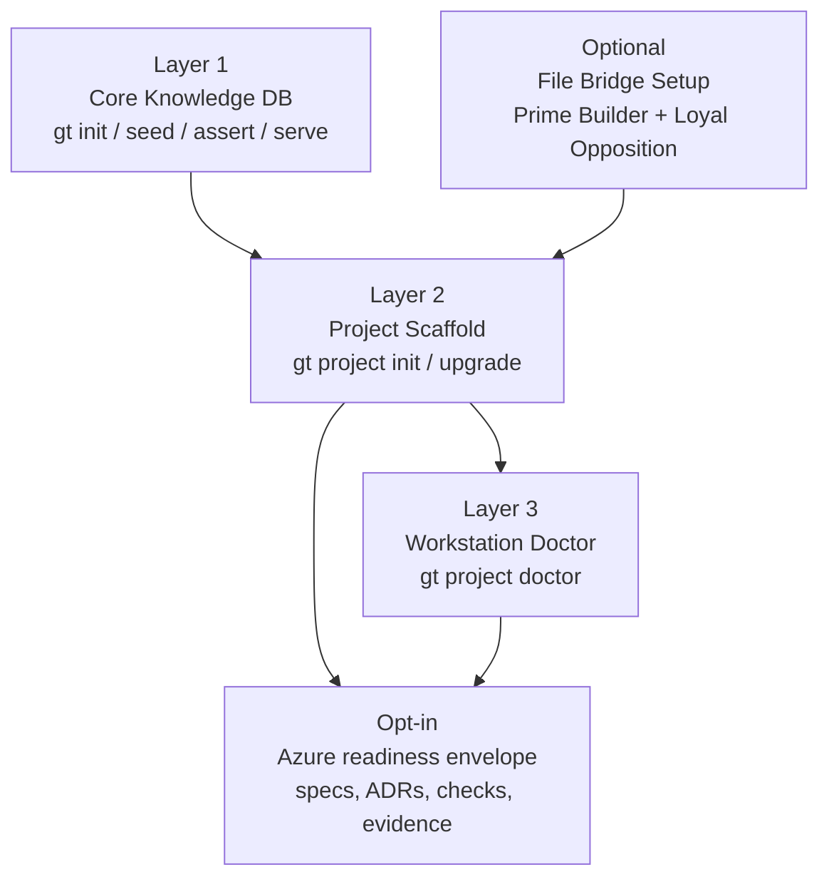
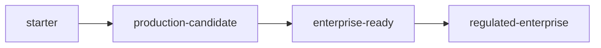

# GroundTruth Knowledge DB

A specification-driven governance toolkit for AI engineering teams.

Track specifications, tests, work items, and architecture decisions with
append-only versioning. Built for teams that need traceable, auditable
engineering decisions.

## At a Glance

| Capability | Description |
|-----------|-------------|
| **Specifications** | Decision log for what the system must do |
| **Tests** | Verify implementation meets specifications |
| **Work Items** | Track gaps between specs and implementation |
| **Architecture Decisions** | ADR/DCL workflow for cross-cutting choices |
| **Assertions** | Continuously verify spec-implementation alignment |
| **Governance Gates** | Pluggable enforcement at lifecycle transitions |

## Architecture



Tier labels in the diagram map to ADR-0001: Three-Tier Memory Architecture — MemBase (Layer 1), MEMORY.md (operational notepad), and the Deliberation Archive (DA).

**New here?** Read [The User Journey](user-journey.md) to see what building
a product with GroundTruth looks like — from first install to production.

## Quick Start

```bash
pip install groundtruth-kb
gt project init my-project --owner "Your Organization" --init-git
gt --config my-project/groundtruth.toml summary
```

See the [Start Here](start-here.md) guide for a complete walkthrough, or the
[Bootstrap Guide](bootstrap.md) for a 10-step technical reference.

## Tooling

- **CLI** (`gt`) — init, seed, assert, summary, history, config, serve, project management
- **Web UI** — read-only dashboard with branding, filtering, and assertion results
- **Python API** — direct database access for automation and CI/CD
- **Project Scaffolding** — three profiles for different team configurations
- **CI Templates** — test, build, and deploy workflow templates
- **Process Templates** — CLAUDE.md, MEMORY.md, hooks, and rules
- **File Bridge Setup** — dual-agent coordination templates (Prime Builder + Loyal Opposition)
- **Azure Readiness Taxonomy** - opt-in enterprise SaaS readiness vocabulary, categories, and verification model

## Azure Readiness

GroundTruth-KB keeps starter scaffolding lightweight by default. Teams that
intend to deploy SaaS on Azure can use the
[Azure Enterprise Readiness Taxonomy](reference/azure-readiness-taxonomy.md)
to organize landing zone, tenancy, identity, secrets, networking, CI/CD,
observability, compliance, cost, DR, and doctor verification decisions.


