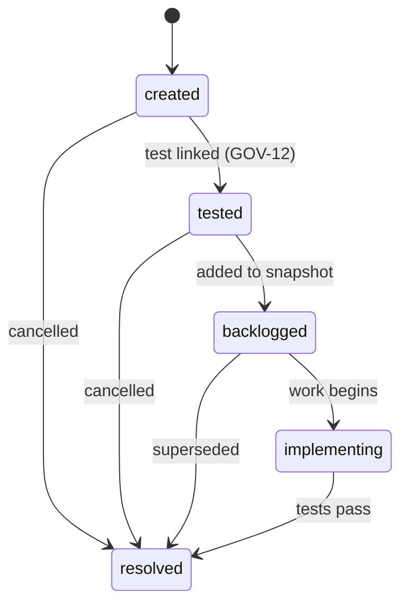

# 4. Work Items & Backlog

Work items track the gap between what specifications require and what the implementation provides. They are the actionable bridge between "what should be" and "what is."

## What is a work item

A work item represents a single, addressable piece of work: a feature to build, a defect to fix, a regression to investigate. Each work item:

- Links to a source specification (what requirement it addresses)
- Has an origin (why it exists)
- Has a component (what part of the system it affects)
- Moves through a defined stage lifecycle

## Work item origins

Every work item has an `origin` that explains why it was created:

| Origin | Meaning |
|--------|---------|
| `new` | New feature or capability not yet implemented |
| `defect` | Something that was working is now broken |
| `regression` | A previously verified behavior no longer passes |
| `enhancement` | Improvement to an existing, working feature |
| `compliance` | Required for legal, security, or regulatory reasons |
| `technical_debt` | Internal quality improvement with no user-visible change |

The origin matters because it determines governance requirements. Defect and regression work items require owner approval before resolution (built-in OwnerApprovalGate). New and enhancement work items can be resolved by the implementing agent.

## Work item stages

Work items move through five stages:

**Created**: The work item exists but no test has been linked yet.

**Tested**: A test linked to the work item's source specification has been created. This stage gate (GOV-12) ensures that every work item has a way to verify it is complete.

**Backlogged**: The work item has been added to a backlog snapshot and prioritized. This prevents implementing work that hasn't been reviewed and ordered.

**Implementing**: Active implementation is underway. Only one transition leads here — from backlogged.

**Resolved**: The work is complete. The linked tests pass, the specification is satisfied. Resolution can be one of: `resolved` (done), `blocked` (cannot proceed), or `superseded` (replaced by another work item).

### Stage transition rules

Not all transitions are valid:

- `created` can advance to `tested` or `resolved`
- `tested` can advance to `backlogged` or `resolved`
- `backlogged` can advance to `implementing` or `resolved`
- `implementing` can advance to `resolved`
- You cannot skip stages (e.g., `created` → `implementing` is blocked)

These rules are enforced by MemBase. Attempting an invalid transition raises an error.

## Backlog snapshots

A backlog snapshot captures the prioritized work queue at a point in time. It records:

- Which work items are included
- Their priority ordering
- Summary statistics by origin and component

Backlog snapshots are append-only like all other artifacts. This means you can always answer: "What was the team's priority list on March 15?"

## The work item workflow

The complete workflow from gap identification to resolution:

1. **Compare specs to implementation.** Identify what is specified but not yet built, or what was built but no longer matches.
2. **Create work items** for each gap. Set the origin, component, and source spec.
3. **Create tests** linked to each work item's source spec (GOV-12 triggers this).
4. **Add to backlog.** Group work items into a prioritized snapshot.
5. **Get prioritization approval.** The owner or team reviews and approves the ordering.
6. **Implement** in backlog order. Move work items through `implementing` as you work.
7. **Verify** by running the linked tests. If they pass, resolve the work item.
8. **Record defects** for failures. If a test fails, create a new work item (origin: defect) rather than fixing inline (GOV-07).

## Priority and component

Work items carry a `priority` field (e.g., `P0` through `P3`) and a `component` field for the affected subsystem. These are project-defined — use whatever categories make sense for your domain.

Common component examples: `api`, `auth`, `billing`, `ui`, `infrastructure`, `documentation`.
