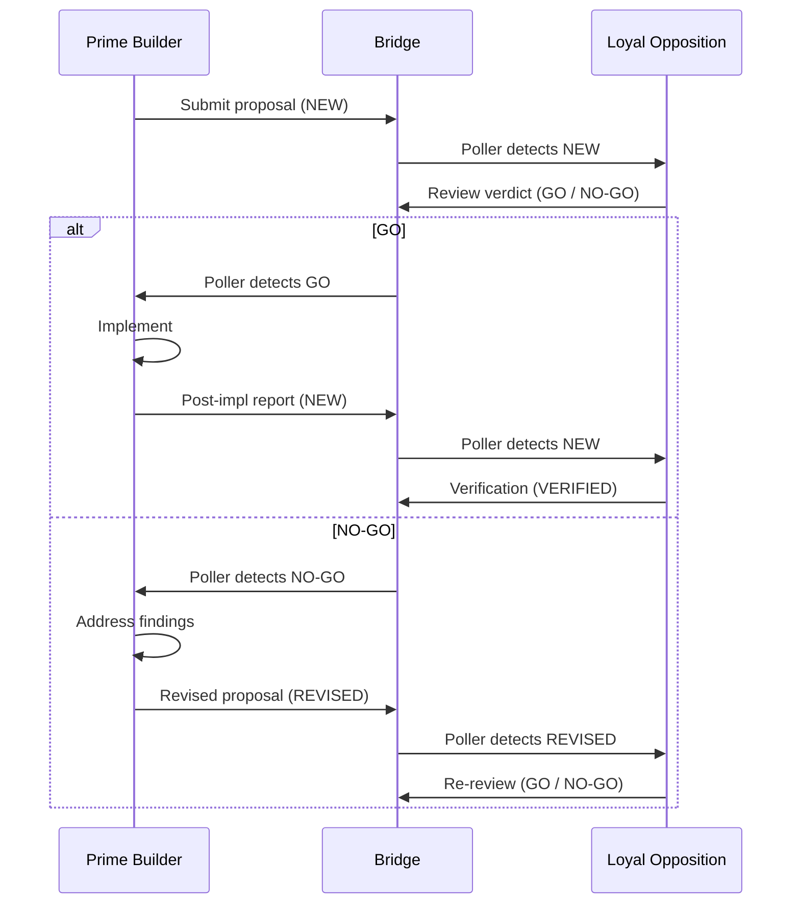

# 6. Dual-Agent Collaboration

GroundTruth supports a two-agent workflow where the agent building the system is not the same agent evaluating it. This separation catches blind spots, overconfidence, and scope drift that single-agent workflows miss.

## Roles

### Prime Builder

The implementing agent. Responsible for:

- Creating and maintaining specifications, tests, and work items
- Writing implementation code
- Running tests and assertions
- Proposing architectural decisions
- Session wrap-up and state management

Prime Builder is the *how* agent. It receives direction (what to build) and produces artifacts (the built thing plus its documentation trail).

### Loyal Opposition

The evaluating agent. Responsible for:

- Reviewing plans, code, and configuration for correctness
- Identifying security, architecture, and operational risks
- Producing evidence-based reports with concrete findings
- Challenging assumptions with data, not opinion

Loyal Opposition is the *whether it is good enough* agent. It does not implement — it inspects and critiques. Its output is a report, not a code change.

### Owner-assigned active role

Prime Builder and Loyal Opposition are roles, not model names. The owner assigns
which capable harness is the active Prime Builder for a session or project.
Implementation authority, file authority, and wrap-up responsibility attach to
that Prime Builder assignment. Loyal Opposition restrictions attach only to the
independent reviewer role.

The default `dual-agent` scaffold still maps Claude Code to Prime Builder and
Codex to Loyal Opposition because those are the battle-tested defaults. Adopter
projects may override the mapping when another harness is designated as Prime
Builder. When that happens, update role files, startup disclosures, dashboard
notes, and bridge instructions so the active builder is stated explicitly.

## Vision Decision Filter

Prime Builder and Loyal Opposition should evaluate options against the
GroundTruth KB vision: the owner supplies specifications, clarifications, and
trade-off decisions; the pipeline handles routine implementation,
verification, traceability, and deployment-readiness work.

Use this question in proposals and reviews:

> Does this reduce the owner's role to specifications, clarifications, and
> decisions?

Prefer designs that automate or systematize owner-burdened tasks. Flag designs
that require the owner to supervise routine implementation, reconcile spec/code
drift, inspect basic generated artifacts, or remember cross-agent process state.

## The review cycle

The standard collaboration pattern:

1. **Prime Builder** completes a unit of work and sends it for review. The submission includes: what was done, what files changed, what tests pass, and specific questions for the reviewer.

2. **Loyal Opposition** inspects the work against specifications, governance rules, and architectural constraints. Each significant finding includes:
   - A concrete claim
   - Evidence (file paths, line numbers, reproduction steps)
   - Severity (P0–P3)
   - Impact assessment
   - Recommended action

3. **Verdict** is one of:
   - **GO**: work is acceptable, close the review
   - **NO-GO**: blockers found, must fix before closure
   - **VERIFIED**: follow-up verification is complete and no Prime response is expected

4. **Prime Builder** addresses NO-GO findings, then resubmits.

5. The cycle repeats until GO is achieved.

## Why separation matters

A single agent that builds and evaluates its own work has a natural bias toward finding it acceptable. The dual-agent model addresses this:

- **Builder blind spots**: the agent that wrote the code is least likely to notice its assumptions
- **Scope creep detection**: an independent reviewer catches when implementation exceeds or falls short of the specification
- **Governance enforcement**: the reviewer checks whether the process was followed, not just whether the code works
- **Evidence quality**: findings require concrete evidence, not "I think this might be wrong"

## Communication protocol

Effective dual-agent collaboration requires structured communication:

### Review requests must include

- What was done (summary of changes)
- Artifact references (file paths, spec IDs, commit hashes)
- Expected outcome (advisory review, GO/NO-GO verdict, verification, acknowledgement)
- Specific action items (numbered questions or evaluation criteria)

### Review responses must include

- Verdict (GO, NO-GO, or VERIFIED when a verdict is required)
- For file bridge reviews, verdict status must be GO, NO-GO, or VERIFIED.
  Non-blocking recommendations can be included in the verdict body.
- For each finding: claim, evidence, severity, impact, recommended action
- Verification performed (what tests were run, what files were inspected)

### General principles

- Every message gets a substantive acknowledgement (not just "received")
- Long-running work sends periodic status updates
- Escalate to the owner only for true owner-only decisions, not for ordinary execution sequencing

## When to use dual-agent vs single-agent

Dual-agent collaboration is most valuable for:

- Non-trivial implementation sessions (3+ file changes)
- Architectural decisions
- Security-sensitive changes
- Release readiness evaluation
- Plan review before large implementations

Single-agent is sufficient for:

- Simple bug fixes with obvious solutions
- Documentation-only changes
- Routine maintenance (dependency updates, log rotation)
- Exploratory research that doesn't modify production artifacts

## Configuration capture for dual-agent systems

If dual-agent work depends on a bridge, scheduled pollers, scheduled jobs, or
other automation, that configuration must be captured explicitly in the
project. At minimum, keep an inventory of:

- runtime entrypoints and bridge scripts
- rule files and markdown directives
- scheduled tasks and automation definitions
- role ownership, review boundaries, and standing exceptions
- protocol, retry, handshake, and recovery rules

See [Operational Configuration Capture](11-operational-configuration.md) for
the full capture contract and [File Bridge Automation](12-file-bridge-automation.md)
for the durable file-bridge polling pattern.

## Harness role configuration comparison

The current GroundTruth-KB dual-agent install is asymmetric. It configures
Claude Code most strongly for the Prime Builder role and Codex most directly
for the Loyal Opposition role. It does not yet fully implement a harness-neutral
model where every capable harness, such as Claude Code, Codex, or Cursor, is
prepared to assume either role.

| Area | Prime Builder configuration | Loyal Opposition configuration | Current tests / enforcement | Gap |
|---|---|---|---|---|
| Default harness mapping | `claude-code` provider, `claude` CLI, `CLAUDE.md` plus `.claude/settings.json`, bridge role `prime`. | `codex` provider, `codex` CLI, `AGENTS.md`, bridge role `loyal-opposition`. | Scaffold tests verify default dual-agent outputs. | Registry only contains Claude Code and Codex. Cursor is not first-class. Role portability is not fully encoded. |
| Primary instructions | `CLAUDE.md` and `.claude/rules/prime-builder.md` define builder responsibilities: specifications, implementation, tests, MemBase, and work items. | `AGENTS.md` and `.claude/rules/loyal-opposition.md` define review, critique, evidence, GO/NO-GO/VERIFIED output, and file-safety behavior. | Bootstrap and scaffold tests verify `CLAUDE.md`, `AGENTS.md`, and bridge files are created. | Loyal Opposition configuration is Codex-shaped through `AGENTS.md`, not a generic harness-neutral role package. |
| Hooks and settings | `.claude/settings.json` registers Claude Code hooks such as session-start governance, spec-before-code, bridge compliance, destructive gate, credential scan, scanner-safe-writer, owner-decision capture, and deliberation gates. | Loyal Opposition receives project files and rules, but Codex does not automatically consume `.claude/settings.json` hooks. Its enforcement is mostly textual plus bridge and report workflow. | Doctor and scaffold tests check hook registration and managed artifact presence. | No native Codex or Cursor hook-registration parity exists today. |
| Skills | Dual-agent install copies managed skills under `.claude/skills`: `decision-capture`, `bridge-propose`, and `spec-intake`. These mostly support Prime/spec/bridge workflows. | Loyal Opposition uses `AGENTS.md`, bootstrap documents, and report conventions. There is not yet an equivalent native Codex/Cursor Loyal Opposition skill package installed by GroundTruth-KB. | Skill scaffold and upgrade tests verify managed skills are copied and repaired. | Skills are Claude Code filesystem skills, not yet cross-harness plugin packages. |
| Bridge behavior | Prime Builder writes `NEW` / `REVISED` bridge files, watches for `GO`, `NO-GO`, or `VERIFIED`, and owns implementation follow-through. | Loyal Opposition reads actionable `NEW` / `REVISED` entries, writes numbered review files, and marks `GO`, `NO-GO`, or `VERIFIED`. | Bridge inventory and scaffold tests verify file-bridge defaults. | Defaults are still Claude/Codex-oriented. Harness command slots exist conceptually, but complete multi-harness configuration is not enforced. |
| Output locations | Prime Builder updates specifications, work items, implementation files, MemBase, bridge artifacts, and release/governance records. | Loyal Opposition reports go under `independent-progress-assessments/CODEX-INSIGHT-DROPBOX/` and related Loyal Opposition logs/bootstrap documents. | Scaffold copies Codex bootstrap and independent-progress-assessment files. | Directory names and contracts are Codex-specific rather than role-generic. |
| Doctor / repair behavior | GroundTruth-KB doctor and upgrade flows strongly protect `.claude` hooks, rules, settings, and managed skills. | Some Loyal Opposition bridge rules and Codex bootstrap artifacts are scaffolded and repaired, but not all Loyal Opposition role enablement is verified as a complete harness package. | Tests cover settings warnings, missing bridge-rule repair, and missing managed-skill repair. | No doctor check yet proves every installed capable harness can act as Prime Builder or Loyal Opposition. |
| Cursor | No current first-class Prime Builder provider. | No current first-class Loyal Opposition provider. | No provider-registry or scaffold tests for Cursor. | Cursor support remains a candidate implementation item, not current behavior. |

Target state: every installed capable harness should receive role-ready
configuration for Prime Builder and Loyal Opposition, with harness-native
instructions, hooks, skills/plugins, bridge polling, and doctor checks where
the harness supports those capabilities. The owner assigns the active Prime
Builder role; the bridge participant that is not Prime Builder acts as Loyal
Opposition.
