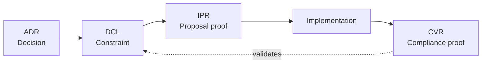

# 8. Architecture Decisions

Cross-cutting technical decisions — choosing a database, adopting a communication pattern, selecting a deployment strategy — deserve the same traceability as business requirements. GroundTruth manages these through four artifact types that capture decisions, derive constraints, and verify compliance.

## The four artifacts

| Artifact | ID prefix | Purpose |
|----------|-----------|---------|
| **ADR** (Architecture Decision Record) | `ADR-*` | The decision itself: context, options considered, choice made, consequences |
| **DCL** (Design Constraint) | `DCL-*` | A machine-checkable rule derived from an ADR |
| **IPR** (Implementation Proposal) | `IPR-*` | Pre-implementation proof: work item reviewed against ADR/DCL |
| **CVR** (Constraint Verification) | `CVR-*` | Post-implementation proof of DCL compliance |

These form a chain:

## Architecture Decision Records (ADR)

An ADR captures a significant technical decision with full context. It is stored as a specification with `type = 'architecture_decision'`.

### ADR structure

- **Context**: What situation prompted this decision? What constraints exist?
- **Decision**: What was chosen and why?
- **Options considered**: What alternatives were evaluated? Why were they rejected?
- **Failed approaches**: What was tried and didn't work? (This prevents future teams from repeating failed experiments.)
- **Consequences**: What trade-offs does this decision create? What becomes easier? What becomes harder?

### When to write an ADR

Write an ADR when the decision:

- Affects multiple components or subsystems
- Is difficult or costly to reverse
- Has been debated or has non-obvious trade-offs
- Sets a precedent that future work should follow

Do not write ADRs for routine implementation choices. "We used a dictionary for lookup" is not an architecture decision. "We chose SQLite over PostgreSQL for MemBase because of single-file portability" is.

## Design Constraints (DCL)

A DCL is a machine-checkable rule derived from an ADR. Where the ADR says "we decided X", the DCL says "therefore Y must always be true" and carries assertions to verify it.

DCLs are stored as specifications with `type = 'design_constraint'`. They must have non-empty assertions before promotion to "implemented" (enforced by the built-in ADR/DCL Assertion Gate).

### Example

ADR-001 decides: "MemBase must use append-only versioning."

DCL-001 derives: "No UPDATE or DELETE statements may appear in the database module."
- Assertion: `grep_absent` for `UPDATE.*SET` and `DELETE FROM` in `db.py`

(ADR-0001: Three-Tier Memory Architecture is the canonical GT-KB-level ADR governing MemBase, MEMORY.md, and the DA.)

## Implementation Proposals (IPR)

Before implementing a work item that touches an architecture-tagged specification or cross-cutting concern, create an IPR. This is a pre-implementation check: "Does my plan respect the existing ADRs and DCLs?"

An IPR is stored as a document (category: `implementation_proposal`) and includes:

- The work item being implemented
- Which ADRs and DCLs are relevant
- How the proposed implementation respects each constraint
- Any tensions or trade-offs identified

The IPR does not need to be exhaustive. Its purpose is to force a conscious check before writing code, not to create a bureaucratic gate.

## Constraint Verification Reports (CVR)

After implementation, create a CVR proving that the relevant DCLs are still satisfied. This is the post-implementation counterpart to the IPR.

A CVR is stored as a document (category: `constraint_verification`) and includes:

- Which DCLs were checked
- Assertion results (pass/fail for each)
- Any new constraints discovered during implementation

## The workflow

1. **Before implementing**: check for relevant ADRs/DCLs. If the work item touches an architecture-tagged area, create an IPR.
2. **Implement** the work item.
3. **After implementing**: run DCL assertions. Create a CVR documenting compliance.
4. **If a constraint is violated**: either fix the implementation to comply, or propose an amendment to the ADR/DCL through the normal specification change process.

## Amending decisions

Architecture decisions can be amended — they are specifications, and specifications have versions. When the context changes enough to warrant revisiting a decision:

1. Create a new version of the ADR with updated context and decision
2. Update affected DCLs and their assertions
3. Run assertions to verify the codebase matches the new constraints
4. Document the amendment reason in `change_reason`

The original decision is preserved in the version history. You can always answer: "What did we decide in v1, and why did we change it in v2?"
