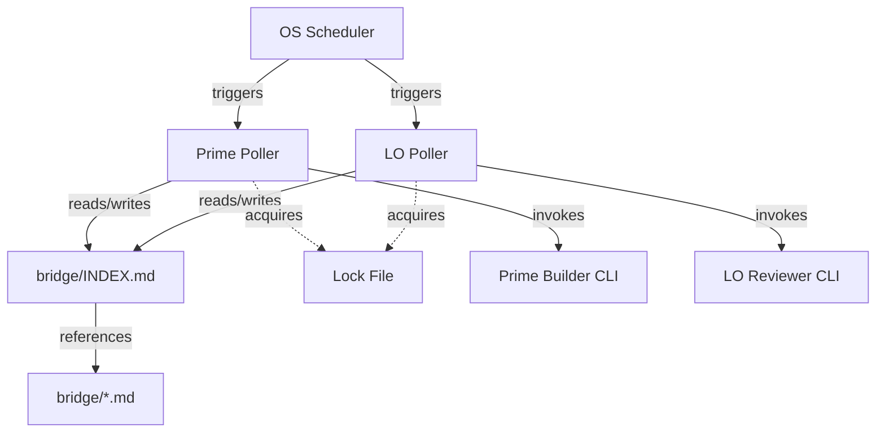
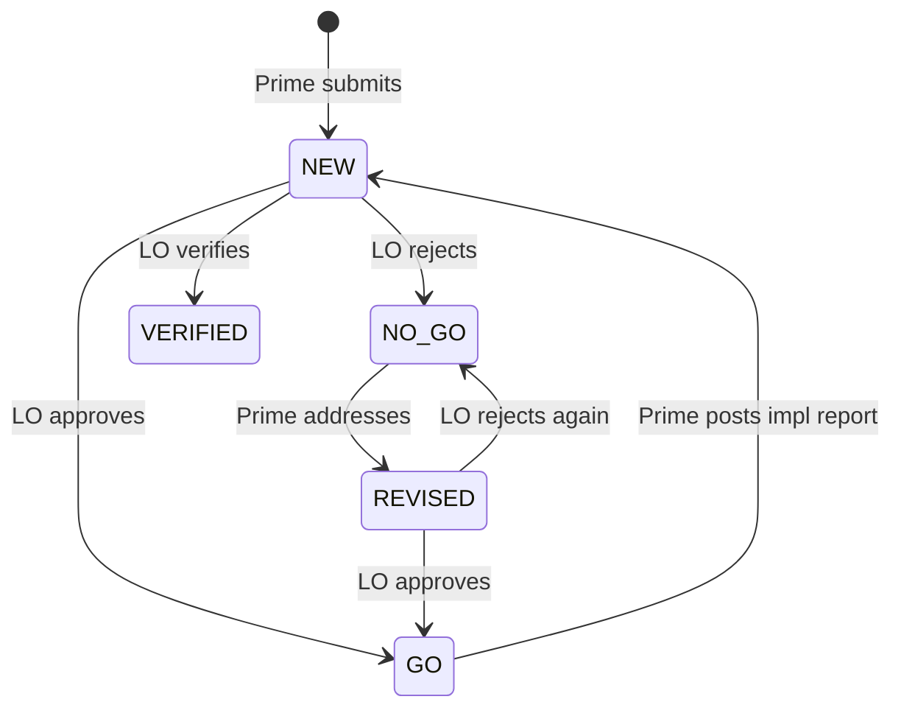

# 12. File Bridge Automation

Dual-agent GroundTruth workflows are not just a pair of prompts. They depend on
an operating surface: bridge files, status rules, scheduler definitions,
agent-specific startup instructions, CLI invocations, plugins, skills, locks,
logs, and recovery procedures. If those pieces are not captured, the pipeline
can appear documented while the working system is actually tribal knowledge.

This document defines the reference file-bridge pattern for GroundTruth
projects that use a Prime Builder and Loyal Opposition review loop.

## Purpose

The file bridge exists to make the review pipeline routine and durable:

- Prime Builder can submit implementation reports without waiting for a live
  Loyal Opposition chat.
- Loyal Opposition can review queued work without manual owner prompting.
- Prime Builder can act on review verdicts without the owner copying messages
  between tools.
- The owner can verify health from files, scheduled task state, and logs.

The owner should provide specifications, clarifications, and decisions. The
bridge should handle ordinary review handoff, polling, retry prevention, and
evidence capture.

## Reference topology

The preferred topology is a file-based bridge with symmetric OS-level pollers.



| Component | Responsibility |
|-----------|----------------|
| `bridge/INDEX.md` | Authoritative review queue and status index |
| `bridge/*.md` | Numbered review documents, implementation reports, and verdicts |
| Prime poller | Watches Codex verdicts and invokes the Prime Builder CLI |
| Loyal Opposition poller | Watches Prime submissions and invokes the reviewer CLI |
| OS scheduler | Runs each poller independently of active chat sessions |
| Lock files | Prevent overlapping runs when a poll takes longer than the interval |
| Logs | Provide proof of scans, dispatches, exits, and failures |
| Inventory | Records scripts, prompts, schedules, agents, plugins, skills, and recovery |

On Windows, the operational shape is usually:

```text
Task Scheduler
  -> hidden launcher, usually wscript.exe running a small .vbs wrapper
  -> PowerShell scanner
  -> bridge/INDEX.md parser
  -> lock acquisition
  -> CLI invocation only when work exists
  -> log append
```

On Unix-like systems, the same pattern can be implemented with `cron`,
`systemd` timers, or `launchd`, replacing the VBS hidden launcher with the
native scheduler's background execution model.

## Protocol model

The index is the source of truth. Each bridge document has a status history.
Entries are newest-first.

For a Prime Builder plus Loyal Opposition loop, use these status families:



| Status | Written by | Meaning |
|--------|------------|---------|
| `NEW` | Prime Builder | New implementation report or review request |
| `REVISED` | Prime Builder | Revised submission after a prior verdict |
| `GO` | Loyal Opposition | Work is accepted or may proceed |
| `NO-GO` | Loyal Opposition | Blockers remain; Prime Builder must respond |
| `VERIFIED` | Loyal Opposition | Terminal verification; no Prime response is expected |

Pollers must inspect the latest status for each document entry. Historical
statuses below the latest line are evidence, not action items.

## Poller filters

Use separate filters for the two directions.

| Poller | Actionable latest statuses | Ignore |
|--------|----------------------------|--------|
| Loyal Opposition | `NEW`, `REVISED` | `GO`, `NO-GO`, `VERIFIED` |
| Prime Builder | `GO`, `NO-GO` | `NEW`, `REVISED`, `VERIFIED` |

`VERIFIED` is terminal. A Prime poller that treats `VERIFIED` as actionable
will re-open completed work. A poller that scans historical statuses instead
of latest statuses will repeatedly process stale entries.

## Scheduler standard

Use an OS scheduler as the authoritative recurring mechanism when the bridge
must operate across sessions.

App-native automations, in-chat timers, and local loops can improve
responsiveness, but they are not the reliability boundary unless they provide
durable run records and survive app/session restarts. An automation being
listed as active is weaker evidence than a run ledger showing dispatches,
exits, and outputs.

Recommended scheduler properties:

- Run each direction independently.
- Use a short interval appropriate for review latency, commonly every few
  minutes.
- Acquire a lock before parsing and dispatching.
- Skip CLI invocation when no action item exists.
- Append logs for every scan, including clear scans.
- Record command, working directory, exit code, start time, end time, and
  selected bridge entries.
- Keep stdout and stderr from CLI invocations in a diagnosable location.

## Prompt and configuration capture

The bridge setup is incomplete unless it captures the agent-control surface.
For each side, document:

- CLI executable and invocation form, for example `claude -p` or `codex exec`
- Model or runtime selection
- Working directory
- Permission mode and sandbox assumptions
- Startup instruction files, such as `CLAUDE.md`, `AGENTS.md`, or `MEMORY.md`
- Rule files, such as `.claude/rules/file-bridge-protocol.md`
- Prompt templates used by scheduled runs
- Plugins, MCP servers, and skills required for the run
- Environment variables and config files needed by the CLI
- Log, lock, and transcript locations
- Owner-only escalation rules

Prompt text is configuration. If changing a prompt changes what the poller
does, that prompt must be versioned or inventoried like code.

## Inventory fields

Each project using this pattern should maintain a project-owned inventory,
usually `BRIDGE-INVENTORY.md`, with at least:

- agent roles and ownership
- file bridge paths and status semantics
- scheduler task names and intervals
- launcher and scanner script paths
- lock and log paths
- CLI commands and working directories
- prompt templates or inline prompt locations
- required plugins, skills, MCP servers, and config files
- health-check commands
- failure signals and recovery procedure
- MemBase records that capture design decisions and procedures

The package template `templates/BRIDGE-INVENTORY.md` includes these sections.

## Health checks

A bridge health check should answer four questions:

1. Are the scheduled tasks registered and enabled?
2. Are they actually running on schedule?
3. Do logs show clear scans and dispatched runs?
4. Does the index reflect expected status transitions?

Example Windows checks:

```powershell
Get-ScheduledTask -TaskName "<PROJECT>-FileBridge-Prime"
Get-ScheduledTask -TaskName "<PROJECT>-FileBridge-LoyalOpposition"
Get-ScheduledTaskInfo -TaskName "<PROJECT>-FileBridge-Prime"
Get-ScheduledTaskInfo -TaskName "<PROJECT>-FileBridge-LoyalOpposition"
Get-Content "<PROJECT_ROOT>\independent-progress-assessments\bridge-automation\logs\prime-scan.log" -Tail 40
Get-Content "<PROJECT_ROOT>\independent-progress-assessments\bridge-automation\logs\lo-scan.log" -Tail 40
```

Example index check:

```text
For each bridge document entry:
1. Read the top status line only.
2. If top status is NEW or REVISED, Loyal Opposition has work.
3. If top status is GO or NO-GO, Prime Builder has work.
4. If top status is VERIFIED, the item is complete.
```

## Failure modes

Common failures to review explicitly:

| Failure | Signal | Correction |
|---------|--------|------------|
| App automation is active but no runs occur | Next run changes but no run records, inbox items, or logs | Move authoritative polling to OS scheduler |
| Completed items re-open | Prime poller treats `VERIFIED` as actionable | Treat `VERIFIED` as terminal |
| Stale entries repeat | Poller scans all historical statuses | Inspect only latest status per document |
| Duplicate CLI runs | Long poll overlaps next interval | Add lock file with stale-lock handling |
| Visible terminal windows | Scheduler starts PowerShell directly | Use hidden launcher or scheduler-native background mode |
| Silent failures | Logs only record positive work | Log clear scans, command exits, stdout, and stderr |
| Wrong agent behavior | CLI prompt omits role, verdict rules, or config paths | Version the prompt and include it in inventory |
| Stale integration config | Archived MCP or bridge config remains active | Remove or mark inactive in config and inventory |

## MemBase mapping

Per ADR-0001: Three-Tier Memory Architecture, MemBase is the auditable history and decision trail below.

Use GroundTruth records to preserve the operating history:

| Record type | Use |
|-------------|-----|
| `environment_config` | CLI paths, scheduler names, config files, env vars |
| `operation_procedure` | Setup, health check, recovery, and review procedures |
| `document` | Bridge design notes, inventories, prompt captures, audits |
| `work_item` | Follow-up tasks for missing automation, docs, or verification |
| `decision` or ADR/DCL records | Scheduler choice, bridge protocol, role-boundary decisions |

Markdown files are the working control surface. MemBase is the auditable history and decision trail.

## Setup prompt

GroundTruth ships a reusable setup prompt at
`templates/bridge-os-poller-setup-prompt.md`. Use it when a Claude Code or
Codex session should configure the file bridge for a project.

At a minimum, the setup agent should be instructed to:

1. Inspect existing bridge rules, agent files, scheduler state, plugins, and
   skills before editing.
2. Preserve existing project rules and ask before replacing unrelated bridge
   systems.
3. Configure the file bridge around `bridge/INDEX.md`.
4. Create separate Prime and Loyal Opposition pollers.
5. Use latest-status filtering with `VERIFIED` terminal.
6. Use an OS scheduler for durable recurring scans.
7. Add lock files, logs, health checks, and failure diagnostics.
8. Capture prompts, plugins, skills, MCP servers, and config paths in the
   bridge inventory.
9. Verify the setup by forcing one no-work scan and, when safe, one work scan.
10. Report exact files changed, scheduler names, commands, logs, and remaining
    owner decisions.

## Review checklist

Before accepting a bridge setup, verify:

- The latest-status semantics match the protocol table above.
- The OS scheduler, not a chat session, is the reliability boundary.
- Both directions are configured and independently testable.
- CLI prompts are captured and versioned.
- Required plugins, skills, MCP servers, and config files are inventoried.
- Logs prove both clear scans and dispatched runs.
- Locking prevents overlap.
- Archived bridge runtimes are removed or explicitly marked inactive.
- The owner can inspect status without manually prompting either agent.
