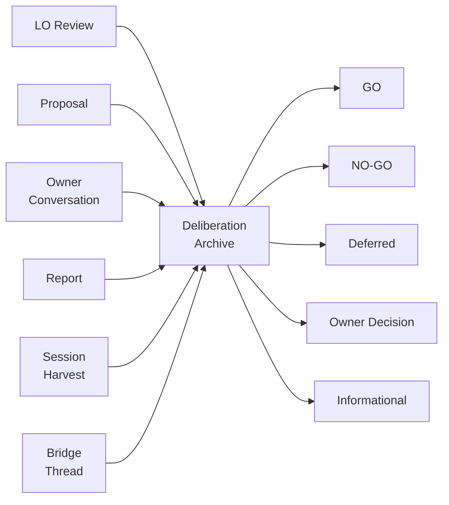

# 13. Deliberation Archive

The deliberation archive captures the reasoning behind decisions: why a
proposal was accepted or rejected, what alternatives were considered, and
what the owner decided. It is the institutional memory of the project.

## Why deliberations matter

Code tells you *what* was built. Commits tell you *when*. Specifications
tell you *what was agreed*. Deliberations tell you *why it was agreed* —
the reasoning, the rejected paths, the trade-offs that shaped every decision.

Without this record, teams repeat rejected experiments, relitigate settled
decisions, and lose the context that makes specifications understandable.

## What gets archived

A deliberation is created whenever substantive reasoning occurs:



| Source | Created by | Example |
|--------|-----------|---------|
| **LO review** | Loyal Opposition | Bridge proposal review with GO/NO-GO verdict |
| **Proposal** | Prime Builder | Implementation proposal submitted for review |
| **Owner conversation** | Either agent | Policy decision from the project owner |
| **Report** | Either agent | Post-implementation report or insight report |
| **Session harvest** | Prime Builder | End-of-session automated extraction |
| **Bridge thread** | Either agent | Complete bridge exchange (proposal → review → verdict) |

Each deliberation captures: title, summary, full content, source reference,
participants, outcome, and links to related specifications and work items.

## Outcomes

| Outcome | Meaning |
|---------|---------|
| `go` | Proposal approved for implementation |
| `no_go` | Proposal requires changes |
| `deferred` | Decision postponed |
| `owner_decision` | Owner made a direct policy call |
| `informational` | Insight or observation, no action required |

## Traceability

Deliberations link to the artifacts they discuss:

- **Primary links:** Each deliberation can have a `spec_id` and/or
  `work_item_id` as its primary context.
- **Relation links:** Additional specs and work items can be linked via
  `link_deliberation_spec()` and `link_deliberation_work_item()` with a
  role label (e.g., `related`, `rejected_alternative`, `supersedes`).

This creates a bidirectional web: from a specification, you can find every
deliberation that shaped it; from a deliberation, you can find every
artifact it affected.

## Safety features

### Credential redaction

All deliberation content passes through automatic redaction before storage.
The redactor scans for common credential patterns (API keys, tokens,
connection strings) and replaces them with `[REDACTED:type]` markers.

- **Redaction is applied at write time** — the raw content never reaches
  the database.
- A SHA-256 hash of the pre-redaction content is stored for deduplication
  and audit.
- Redacted deliberations are flagged with `sensitivity = "contains_redacted"`
  and include human-readable `redaction_notes`.

### Content hashing

Every deliberation's raw content is hashed before redaction. This serves
two purposes:

1. **Deduplication** — identical content is detected without storing the
   raw text.
2. **Integrity audit** — the hash chain proves no content was silently
   modified after insertion.

### Append-only versioning

Like all GroundTruth artifacts, deliberations use append-only versioning.
Updates create new versions; nothing is overwritten or deleted. The
`current_deliberations` view always returns the latest version.

## Semantic search

When ChromaDB is installed (`groundtruth-kb[search]`), deliberations are
automatically indexed for semantic search.

```mermaid
flowchart TD
    W[insert_deliberation] -->|write| SQL[(SQLite\nSource of Truth)]
    W -->|index| CHR[(ChromaDB\nSemantic Index)]
    Q[search_deliberations] -->|1. try semantic| CHR
    CHR -->|results above threshold| R[Enriched Results]
    Q -->|2. fallback to LIKE| SQL
    SQL -->|text match| R
    RB[rebuild-index] -->|drop + reindex| CHR
    RB -->|reads all rows| SQL
``` This enables natural-language
queries like "why did we choose SQLite?" instead of exact keyword matching.

### How it works

1. **At write time:** each deliberation's content is chunked (500-character
   segments with overlap) and embedded into ChromaDB with metadata.
2. **At search time:** the query is embedded and compared against all
   chunks using L2 distance. Results below a relevance threshold are
   filtered out, deduplicated by deliberation ID, and enriched with the
   full SQLite row.
3. **Fallback:** if ChromaDB is unavailable or no results survive the
   relevance filter, the search falls back to SQLite `LIKE` matching.

### Search from the Python API

```python
results = db.search_deliberations("why did we choose append-only versioning?")

for r in results:
    print(f"[{r['search_method']}] {r['id']}: {r['title']}")
    print(f"  Score: {r['score']}")
    print(f"  Preview: {r['matched_chunk_preview']}")
```

Each result includes:

| Field | Description |
|-------|-------------|
| `search_method` | `"semantic"` or `"text_match"` |
| `score` | L2 distance (lower = better); `None` for text match |
| `matched_chunk_id` | ChromaDB document ID of the matched chunk |
| `matched_chunk_preview` | First 200 characters of the matched chunk |

### Rebuilding the index

The ChromaDB index can be rebuilt from the authoritative SQLite database
at any time:

```bash
gt deliberations rebuild-index
```

This drops and recreates the entire collection. SQLite is always the
source of truth.

## Python API

### Insert a deliberation

```python
db.insert_deliberation(
    id="DELIB-0042",
    source_type="lo_review",
    title="Review of widget refactor proposal",
    summary="GO with conditions on test coverage",
    content="Full review text...",
    changed_by="codex",
    change_reason="Bridge review of widget-refactor-002.md",
    spec_id="SPEC-1234",
    work_item_id="WI-5678",
    outcome="go",
    session_id="S42",
)
```

### Query deliberations

```python
# By spec
deliberations = db.get_deliberations_for_spec("SPEC-1234")

# By work item
deliberations = db.get_deliberations_for_work_item("WI-5678")

# By source type
deliberations = db.list_deliberations(source_type="owner_conversation")

# Semantic search
results = db.search_deliberations("authentication middleware decision")
```

### Link additional artifacts

```python
db.link_deliberation_spec("DELIB-0042", "SPEC-5555", role="related")
db.link_deliberation_work_item("DELIB-0042", "WI-9999", role="rejected_alternative")
```

## Dual-agent workflow

In a dual-agent project, deliberations are the primary coordination record:

1. **Before proposing:** Prime Builder searches deliberations for the target
   spec or component. If prior reviews exist, the proposal cites them and
   explains how it differs.
2. **Before reviewing:** Loyal Opposition searches deliberations and adds
   a "Prior Deliberations" section to every review. This prevents relitigating
   settled decisions.
3. **After owner decisions:** Either agent archives the decision immediately
   as `source_type = "owner_conversation"` with the question, options, and
   rationale.
4. **At session end:** The session-wrap procedure harvests new deliberations
   from completed bridge threads and reports.

## What NOT to archive

- Protocol chatter (routine bridge acknowledgments, liveness checks)
- Content already in the KB (the content hash catches duplicates)
- Raw credentials (redaction handles this, but avoid submitting them)
- Session start boilerplate

---

*Copyright 2026 Remaker Digital, a DBA of VanDusen & Palmeter, LLC. All rights reserved.*
