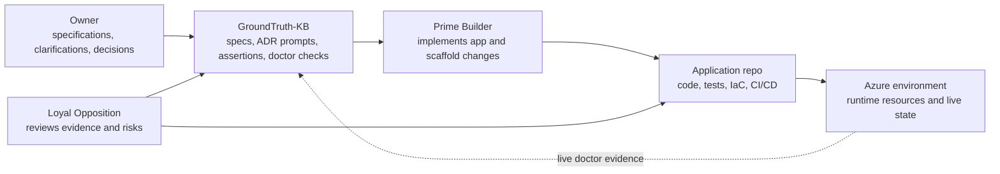
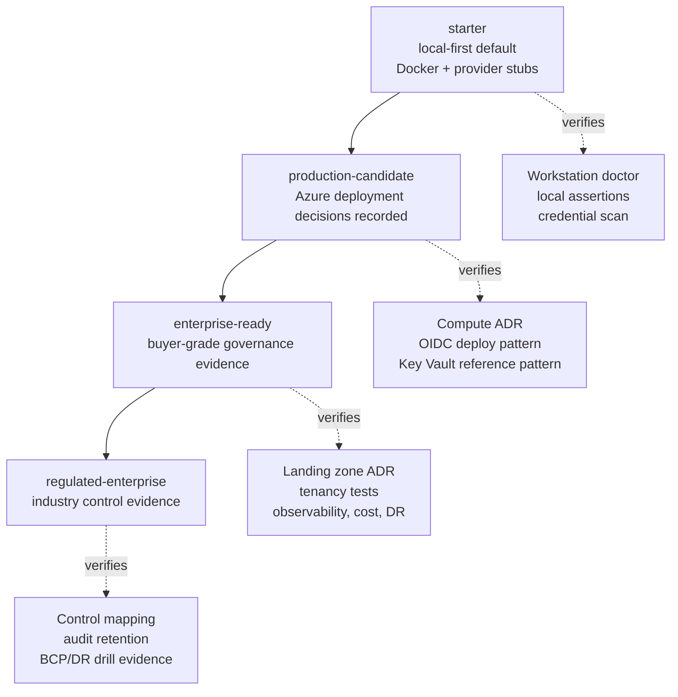
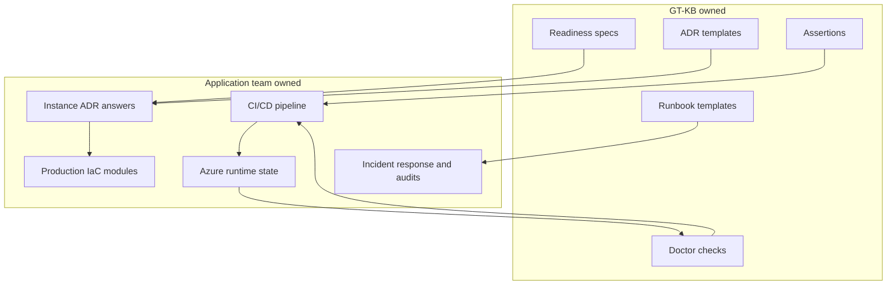
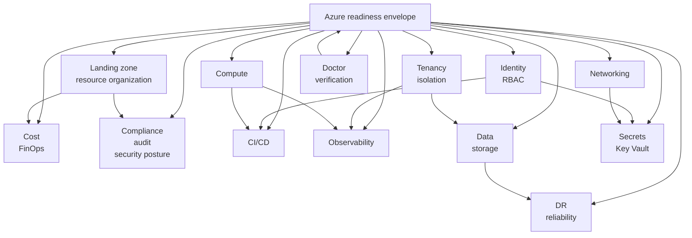
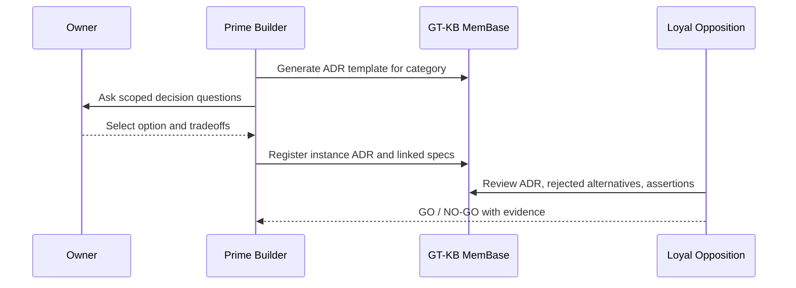
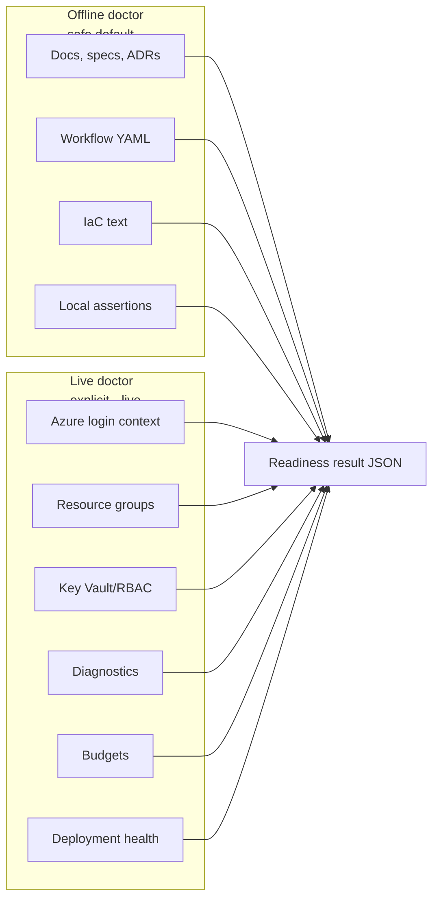
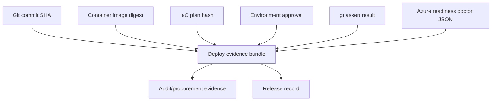

# Azure Enterprise Readiness Taxonomy

> **Status:** Taxonomy (scope) reference — authorized by bridge
> `gtkb-azure-enterprise-readiness-taxonomy` GO `-002`.
> **Scope:** vocabulary, category catalog, ADR template shape, verification
> plan skeleton, child-bridge preview. **No IaC, CI, or doctor code changes
> ship with this document.**

## 1. Purpose

This document establishes the shared vocabulary GroundTruth-KB uses when
generating specifications, decision prompts, and verification checks for
projects that intend to deploy as SaaS on Microsoft Azure.

It is a **scope document**, not an implementation plan. Its job is to make
the downstream decisions nameable and reviewable before any Azure resource
template, CI gate, or doctor check is written.

### 1.1 Readiness Envelope At A Glance



The readiness envelope keeps Azure production readiness visible without
making GT-KB the owner of the deployed Azure estate. GT-KB owns the
governance artifacts and checks; the adopting team owns runtime resources.

### 1.2 Starter To Enterprise Path



## 2. GT-KB Product Boundary

> **What GT-KB owns:** governed specifications, decision prompts, ADR
> templates, assertions, and verification checks that make Azure readiness
> a *traceable* workflow.
>
> **What GT-KB does NOT own:** the customer's deployed CI/CD pipeline, the
> actual Azure resource definitions, or runtime Azure state. Reference
> scaffolds and templates may be produced, but the deployed system remains
> owned by the application team.

This boundary reconciles two statements that coexist in the method layer:

- `docs/method/00-vision.md` names the goal: "the pipeline produces a
  production-deployable SaaS application."
- `docs/method/01-overview.md` clarifies the non-goal: "Not a CI/CD
  pipeline. It does not build, deploy, or run your application."

Both are true. GT-KB produces the **readiness envelope** — the specs,
ADRs, decision prompts, and automated checks that force every cloud
readiness question to become a recorded artifact. The pipeline that
actually deploys is owned and operated by the adopting team.

### What GT-KB Generates vs. What the Team Decides

| GT-KB generates | Application team decides |
|-----------------|--------------------------|
| Spec skeletons per readiness category | Their specific landing zone, tenancy, compute target |
| ADR templates with decision prompts | Instance ADR answers (their actual choices) |
| Assertion patterns (grep / glob / absence) | What the assertion tolerates for their project |
| Doctor checks for offline readiness | Their Azure subscription, identity, and resource setup |
| CI workflow templates (reference scaffolding) | Their actual pipeline, secrets, environments |
| IaC skeletons (reference scaffolding) | Their production Terraform/Bicep modules |
| Verification runbook templates | Their incident response, DR drills, and audits |

**Rule:** every time GT-KB adds a reference scaffold, the scaffold must
either be a `starter` default or be gated behind an explicit profile
selection.

### 2.1 Ownership Boundary



## 3. Readiness Tiers

GT-KB recognizes four readiness tiers. Higher tiers inherit from lower
tiers — criteria accumulate rather than replace.

### 3.1 `starter` (default — unchanged)

**What it is:** the current default scaffold output. Local-first,
cloud-neutral, with minimal provider stubs (current behavior at
`src/groundtruth_kb/project/scaffold.py` Terraform stubs and the Azure
provider stub).

**Entry criteria:**
- Runs locally against the MemBase SQLite database.
- Generates Docker and (optional) Terraform provider stubs.
- Credential detection runs on every save; no secrets committed.
- `gt project doctor` checks workstation tools only.
- CI template exists but does not assume a particular cloud contract.

**What is NOT in scope at this tier:**
- Landing zone / management group design.
- Tenancy isolation, multi-tenant data partitioning.
- Managed identity, Key Vault, OIDC deploy flows.
- Observability, DR, cost, or compliance evidence.

**Who this tier serves:** local adopters, teams still making technology
decisions, single-author demos, and projects that have not yet declared
an intent to deploy on Azure.

### 3.2 `production-candidate`

**What it is:** a tier that produces the specifications and decision
records required to deploy *somewhere on Azure*, without yet claiming
enterprise governance.

**Entry criteria:**
- All `starter` criteria hold.
- ADR answered for compute target (Container Apps, AKS, App Service, or
  Functions).
- ADR answered for tenancy model (single, pooled multi-tenant, or
  siloed multi-tenant).
- Key Vault reference pattern documented in the generated scaffold;
  managed identity wiring named in an ADR.
- OIDC federated credentials named as the deploy pattern; no static
  `AZURE_CREDENTIALS` JSON secret in the recommended path.
- Diagnostic settings named (Log Analytics workspace, retention period)
  at ADR level.
- Environment topology ADR (at minimum: dev + prod, with naming).

**What is NOT in scope at this tier:**
- Management group / policy hierarchy.
- Per-tenant cost attribution and FinOps cadence.
- Regulated-industry controls (SOC 2, HIPAA, PCI-DSS, FedRAMP).
- DR drills with RPO/RTO evidence.

**Who this tier serves:** single-tenant and small multi-tenant SaaS
projects that deploy on Azure but are not yet selling into regulated
enterprise accounts.

### 3.3 `enterprise-ready`

**What it is:** a tier that produces the evidence an enterprise buyer's
security, cloud-governance, and procurement teams typically request
before approving a SaaS vendor.

**Entry criteria:**
- All `production-candidate` criteria hold.
- Landing zone ADR answered (platform + application landing zones, or
  single-subscription with documented rationale).
- Management group and subscription strategy ADR (even if simple).
- Naming and tagging standard documented and enforced by an assertion.
- Network posture ADR: private endpoints for data-plane services,
  egress controls, WAF, DDoS protection.
- Tenancy isolation evidence: cross-tenant test specs + assertions that
  verify the chosen isolation model.
- Observability plan: Application Insights, Azure Monitor, OpenTelemetry
  traces with per-tenant view.
- Cost plan: budgets per subscription/environment, tag hygiene
  assertion, FinOps review cadence recorded.
- DR plan: RPO/RTO targets per workflow, backup + restore tests,
  documented incident response runbook.
- Compliance baseline: SOC 2-aligned controls, audit trail retention,
  data-residency statement.
- Security posture: threat model recorded, Defender for Cloud enabled
  (or explicit waiver ADR), secret rotation schedule.

**What is NOT in scope at this tier:**
- Regulated-industry certifications beyond SOC 2-style baseline (those
  live in `regulated-enterprise`).

**Who this tier serves:** SaaS teams selling into large enterprise
accounts that require a security questionnaire, a data-processing
agreement, and evidence of cloud governance.

### 3.4 `regulated-enterprise` (additive)

**What it is:** `enterprise-ready` **plus** additional regulated-industry
evidence and audit controls. Not a separate disconnected track — it
inherits all enterprise-ready criteria and adds regulation-specific
requirements.

> `regulated-enterprise = enterprise-ready + industry-regulation-specific
> evidence & audit controls`

**Entry criteria:**
- All `enterprise-ready` criteria hold.
- Named industry regulation set (SOC 2 Type II, HIPAA, PCI-DSS,
  FedRAMP, GDPR, ISO 27001, or a combination).
- Control mapping ADR: each regulation control mapped to a generated
  spec, assertion, or documented waiver.
- Data boundary ADR: data residency, subprocessor list, cross-border
  transfer controls.
- Audit evidence artifact: automated audit log export, immutable
  retention, periodic access review cadence.
- BCP/DR drill evidence: documented frequency, last-drill artifact, gap
  remediation record.
- Vulnerability management: periodic scans, patch SLAs, CVE response
  runbook.

**What is NOT in scope at this tier:**
- FedRAMP Authorization package preparation (that is a separate program
  larger than a SaaS readiness envelope — GT-KB can contribute evidence
  but does not own the package).

**Who this tier serves:** SaaS teams operating in financial services,
healthcare, government, or critical infrastructure — where
regulatory-level evidence is a go/no-go for procurement.

### 3.5 Tier Capability Matrix

| Capability | `starter` | `production-candidate` | `enterprise-ready` | `regulated-enterprise` |
|------------|:---------:|:----------------------:|:------------------:|:----------------------:|
| Local MemBase, specs, assertions | yes | yes | yes | yes |
| Docker and provider stubs | yes | yes | yes | yes |
| Compute target ADR | no | yes | yes | yes |
| OIDC deploy pattern | no | yes | yes | yes |
| Key Vault reference pattern | no | yes | yes | yes |
| Landing zone/resource organization ADR | no | optional | yes | yes |
| Tenancy isolation specs/tests | no | basic | required | required |
| Cost budgets and FinOps cadence | no | optional | required | required |
| Observability and SLO evidence | no | basic | required | required |
| DR RPO/RTO and restore evidence | no | optional | required | required |
| Compliance control mapping | no | no | baseline | regulation-specific |
| Offline Azure readiness doctor | no | yes | yes | yes |
| Live Azure readiness doctor | no | optional | recommended | expected |

## 4. Category Catalog

The readiness envelope is organized into 13 first-class categories. Each
category carries named subtopics so that service-to-service auth,
B2B/B2C, FinOps/budgets, environment topology, policy, and security
posture are explicit — not implicit narrative.

Each category maps to one or more ADR templates (Section 5) and one or
more doctor checks (Section 6). Child bridges (Section 7) populate the
concrete specs, assertions, and scaffolds per category.

### 4.0 Category Map



### 4.0.1 Category To Evidence Matrix

| Category | Required evidence shape | Typical verification |
|----------|-------------------------|----------------------|
| Landing zone/resource organization | ADR plus naming/tagging standard | File/assertion scan; optional Azure API tag/policy check |
| Identity/RBAC | ADR plus OIDC and managed identity pattern | Workflow scan; optional Azure role assignment check |
| Tenancy | Tenant model ADR plus isolation tests | Test/spec linkage and cross-tenant assertion results |
| Cost | Budget/tagging spec plus FinOps cadence | Tag assertion; optional Azure budget check |
| Compliance/audit/security posture | Control baseline and waivers | Spec coverage; audit artifact presence |
| Networking | Ingress/egress and private endpoint ADR | IaC scan; optional live resource check |
| CI/CD | OIDC, plan/apply, approval, evidence artifacts | Workflow parse and forbidden-secret scan |
| Observability | Logs, metrics, traces, SLOs | Config scan; optional App Insights/Log Analytics check |
| Compute | Compute target ADR and scaling rules | IaC/workflow scan; optional deployment health check |
| Data/storage | Partitioning, retention, backup decisions | Spec/assertion scan; optional backup setting check |
| Secrets/Key Vault | Key Vault references and rotation policy | IaC scan; optional Key Vault RBAC check |
| DR/reliability | RPO/RTO, restore, incident runbook | Artifact scan; optional restore evidence check |
| Doctor/verification | Offline/live checks and result schema | Unit tests plus doctor output validation |

### 4.1 `landing-zone` / `resource-organization`

**Subtopics:**
- Subscription strategy (single, per-environment, per-workload,
  platform + application).
- Management group hierarchy (including "no hierarchy, documented").
- Resource naming convention (prefix/suffix format, abbreviations,
  casing).
- Tagging strategy (required tags, allowed values, enforcement
  mechanism).
- Policy inheritance (Azure Policy baseline, exemption process).
- Environment topology (dev / test / stage / prod; count, separation,
  promotion flow).

**Why it is first-class:** without a resource-organization decision, the
same Azure objects can be created anywhere, making governance,
cost-attribution, and isolation effectively impossible. Enterprise
buyers expect this to be answered.

### 4.2 `identity` / `RBAC`

**Subtopics:**
- OIDC federated identity for CI/CD (no static `AZURE_CREDENTIALS`).
- Managed identity for workload-to-service authentication.
- Service-to-service auth model (system-assigned, user-assigned,
  workload identity, service principal — and when each is acceptable).
- Entra ID (Azure AD) integration: tenant selection, directory roles.
- B2B / B2C model if the product surfaces external users (B2B guest
  accounts vs. B2C consumer sign-ins — chosen separately from tenancy).
- RBAC role design: built-in vs. custom roles, least-privilege patterns.

**Why it is first-class:** identity is the most common entry point for
enterprise audit and procurement. Static secrets embedded in CI or
config are treated as material findings by most security reviewers.

### 4.3 `tenancy`

**Subtopics:**
- Tenant definition: what constitutes a tenant for the product (single
  user, company account, workspace, project, etc.).
- Isolation model: pooled (shared infrastructure, logical isolation),
  siloed (per-tenant infrastructure), or hybrid (pooled by default,
  silo on request).
- Tenant lifecycle: onboarding, suspension, offboarding, data export,
  data deletion.
- Data partitioning: how tenant data is separated in storage (schema,
  table, row, container, database).
- Cross-tenant authorization boundary: how the system proves a request
  from tenant A cannot access tenant B data.

**Why it is first-class:** SaaS readiness is not only deployment. A
product with a tenancy ADR but no isolation tests is not enterprise-ready
regardless of how well the deployment pipeline works.

### 4.4 `cost`

**Subtopics:**
- Budgets per subscription / environment / tenant.
- Tag hygiene (every resource carries required tags — enforced by
  Azure Policy or an equivalent assertion).
- Per-tenant cost attribution: how the team answers "what did tenant X
  cost us last month?"
- FinOps review cadence: who reviews spend, how often, what happens on
  budget breach.
- Reservation / savings plan strategy (or documented decision not to).

**Why it is first-class:** enterprise accounts that are large enough to
have a cloud-finance function expect answers here during procurement.

### 4.5 `compliance` / `audit` / `security posture`

**Subtopics:**
- SOC 2-aligned control baseline (access reviews, logging, change
  management).
- Audit trail retention and export.
- Data boundary: residency, cross-border transfer controls,
  subprocessor list.
- Threat modeling: a recorded threat model per major component.
- Defender for Cloud enablement (or explicit waiver ADR).
- Secret rotation schedule and exception process.
- Vulnerability management (scans, patch SLAs, CVE response).

**Why it is first-class:** in regulated and enterprise sales,
compliance evidence often becomes a go/no-go gate, not a preference.

### 4.6 `networking`

**Subtopics:**
- Private endpoints for data-plane services (Storage, Cosmos, Key
  Vault, ACR).
- WAF in front of public endpoints.
- DDoS protection tier (basic vs. standard).
- Egress controls (firewall, NAT gateway, UDRs).
- Service-mesh (if applicable) or documented decision not to use one.
- VNet topology (hub-and-spoke, single VNet with subnets, etc.).

**Why it is first-class:** network posture is one of the first
questions an enterprise security review will raise.

### 4.7 `CI/CD`

**Subtopics:**
- OIDC federation to Azure (no `AZURE_CREDENTIALS` JSON secret).
- IaC validation (Terraform / Bicep plan, format, security scan).
- Environment approval gates (staging → production requires a human
  approval).
- Drift detection (periodic plan vs. deployed state).
- Deploy evidence artifacts (image digest, IaC plan hash, assertion
  result, owner approval link).

**Why it is first-class:** the CI pipeline is where most accidental
production changes originate; auditors routinely ask for this evidence.

### 4.8 `observability`

**Subtopics:**
- Azure Monitor workspace + retention.
- Application Insights (instrumentation key vs. connection string;
  sampling policy).
- OpenTelemetry traces (language SDKs, exporters, context propagation).
- Per-tenant log view (the security team can answer "show me everything
  tenant X did yesterday").
- SLO tracking (availability, latency, error budget).
- Alert routing (on-call schedule, paging integration).

**Why it is first-class:** without per-tenant log views and SLO
tracking, incident response and SLA credits cannot be enforced.

### 4.9 `compute`

**Subtopics:**
- Compute target decision: Azure Container Apps, AKS, App Service, or
  Functions.
- Decision criteria: expected scale, stateful vs. stateless, multi-region
  needs, team operational experience.
- Autoscaling model (replicas, rules, scale-to-zero).
- Health probes (readiness, liveness).
- Image supply chain (ACR vs. GHCR; signing; scanning).

**Why it is first-class:** the compute target constrains almost every
other category — identity model, networking, deploy pipeline, cost
attribution.

### 4.10 `data` / `storage`

**Subtopics:**
- Tenant partitioning model in storage (schema, table, row, container,
  database).
- Backup strategy and PITR (point-in-time recovery) window.
- Geo-replication (zone-redundant, geo-redundant, read-access
  geo-redundant).
- Retention policies (how long data is kept per tenant and category).
- Data classification (PII, PHI, payment data — per regulation).

**Why it is first-class:** data category decisions cascade into
compliance, cost, and DR. They cannot be revisited cheaply once a
system is in production.

### 4.11 `secrets` / `Key Vault`

**Subtopics:**
- Key Vault references from Container Apps / App Service / Functions
  (no static secrets in app config).
- Secret rotation policy and automation.
- No-static-credentials-in-CI assertion (the forbidden-pattern scan).
- Certificate management (TLS, client auth).
- Customer-managed keys (CMK) vs. Microsoft-managed keys — decision
  recorded per data store.

**Why it is first-class:** secret handling is where the credential
scanning infrastructure meets deployment; the envelope turns detection
into a deployment pattern.

### 4.12 `DR` / `reliability`

**Subtopics:**
- RPO (recovery point objective) and RTO (recovery time objective) per
  workflow.
- Backup + restore tested on a recorded cadence (backups that are never
  restored are not backups).
- Chaos testing or failure-injection exercises (optional at
  `enterprise-ready`, expected at `regulated-enterprise`).
- Incident response runbook with named owners.
- Multi-region strategy (active-active, active-passive, or single-region
  with documented rationale).

**Why it is first-class:** SaaS contracts routinely attach SLAs;
without tested DR, the SLA cannot be committed to in good faith.

### 4.13 `doctor` / `verification`

**Subtopics:**
- Offline checks (specs, ADRs, CI workflows, assertions) — run without
  calling Azure APIs.
- Live checks — explicit `--live` opt-in — call Azure APIs to verify
  subscription context, resource groups, Key Vault wiring, diagnostics,
  budgets, deployment health.
- Severity model: `fail` vs. `warn` — and which categories raise which.
- Result artifact: machine-readable verification output that can be
  attached to deploy evidence.

**Why it is first-class:** the readiness envelope only works if it is
verifiable. A tier without doctor checks is a checklist, not an
envelope.

## 5. ADR Template Shape

Per-category Azure decisions use a consistent ADR template so each
decision is answered in the same structured way. The template is a
template — *how to ask the question*. Instance ADRs (the owner's
actual answers) are deferred to later child bridges.

### 5.1 Template Questions

Every Azure readiness ADR template asks the following questions:

1. **Context.** What triggered the decision? What changed or what new
   readiness tier was targeted?
2. **Decision scope.** Which category does this ADR cover (one of the
   13 in Section 4)? Which subtopics does it answer?
3. **Options considered.** At least two concrete options, with enough
   detail to evaluate each.
4. **Decision.** Which option was selected?
5. **Rationale.** Why was this option chosen over the others?
6. **Rejected alternatives.** Which options were explicitly rejected,
   and why?
7. **Consequences.** What becomes possible, what becomes harder, what
   downstream ADRs or specs are affected?
8. **Assertions.** Which grep / glob / absence assertions verify this
   ADR is still honored in the codebase?
9. **Review trigger.** What would cause this ADR to be reopened (a
   regulation change, a scale shift, a cost breach)?

### 5.2 Registration in MemBase

The ADR template itself is registered as a specification of type
`architecture_decision` (the existing schema type at
`src/groundtruth_kb/db.py:737-741` and
`docs/method/02-specifications.md:48-56`) with a template-indicating
ID prefix (`ADR-TEMPLATE-AZURE-*`). The template ID, title, and
description make its template nature explicit; no new spec type is
introduced.

When a project later answers a per-category decision, the generated
instance ADR is registered as a separate `architecture_decision` spec
with its own ID (e.g., `ADR-AZURE-LANDING-ZONE-001`), not by mutating
the template.

### 5.3 ADR Decision Flow



## 6. Verification Plan Skeleton

The doctor / verification surface is split into two modes. Live mode
is explicit opt-in; it is not the default because live checks call
Azure APIs that require credentials and produce external state
effects.

### 6.1 Offline Mode (default)

`gt project doctor --readiness azure-enterprise` (offline is implied
when `--live` is absent).

Offline mode checks:

- Every category in Section 4 has at least one spec present in the
  local MemBase.
- Every ADR template in Section 5 has a recorded ADR instance (or an
  explicit waiver spec).
- The CI workflow file uses OIDC federation (text scan, not runtime
  test).
- The IaC skeleton references Key Vault for secrets (text scan).
- No static `AZURE_CREDENTIALS` JSON secret appears in the recommended
  CI path.
- Assertions configured for each readiness category pass.

Offline mode is the one adopters run in CI and at session start. It
produces a `fail` / `warn` / `pass` summary per category.

### 6.2 Live Mode (`--live` opt-in)

`gt project doctor --readiness azure-enterprise --live`

Live mode additionally checks:

- `az login` context matches the expected subscription(s).
- Resource groups named in the IaC skeleton exist.
- Key Vault access policies / RBAC grants are present.
- Managed identity is assigned to the compute target.
- Diagnostic settings point at the expected Log Analytics workspace.
- Budgets are configured at the expected subscription / resource-group
  level.
- Deployed image tag matches the expected version.

Live mode requires explicit opt-in. It is designed for pre-deploy
gates and periodic drift checks, not for routine session-start runs.

### 6.2.1 Offline And Live Verification Split



### 6.3 Verification Evidence Artifact

Both modes produce a machine-readable result artifact (JSON) that can
be attached to a deployment's evidence bundle. The artifact names each
category, severity, and either the passing assertion or the failure
detail. The exact schema is defined in a later child bridge.

### 6.4 Deployment Evidence Bundle



## 7. Child-Bridge Preview (NOT authorized by this taxonomy)

> **Explicit disclaimer:** The child-bridge list below is a
> **dependency preview only**. Each child bridge requires its own
> bridge proposal and GO before any implementation begins. Approval of
> this taxonomy does **NOT** authorize implementation of any child
> bridge. The list is here so downstream sequencing is visible.

The Codex INSIGHTS report (Phase 2-6) maps to these child bridges:

1. **`gtkb-azure-spec-scaffold`** — implements `gt scaffold specs
   --profile azure-enterprise` (or equivalent) to generate per-category
   spec skeletons from this taxonomy.
2. **`gtkb-azure-adr-template-activation`** — activates the per-category
   ADR template and the assertion harness that verifies instance ADRs
   were answered.
3. **`gtkb-azure-iac-skeletons`** — adds Terraform (or Bicep)
   skeleton modules for Container Apps / ACR / Key Vault / managed
   identity / diagnostics. Preserves the current `starter` stub
   behavior; adds a separate profile rather than replacing.
4. **`gtkb-azure-cicd-gates`** — adds the OIDC-based deploy workflow,
   IaC validation job, environment approval gate, and drift-detection
   schedule.
5. **`gtkb-azure-doctor-offline`** — implements the offline verification
   mode (Section 6.1).
6. **`gtkb-azure-doctor-live`** — implements the live verification mode
   (Section 6.2), behind the explicit `--live` opt-in.
7. **`gtkb-azure-operational-docs`** — the enterprise readiness guide,
   owner decision checklist, and Prime/Loyal-Opposition protocol
   extensions.

Dependency ordering: 1 and 2 first, then 3 and 4 in parallel, then 5,
then 6, then 7 as docs wrap-up.

## 8. Source Material and Citations

### 8.1 Authoritative source for this taxonomy

The taxonomy is derived from the Codex Loyal Opposition INSIGHTS report
at:

```text
independent-progress-assessments/CODEX-INSIGHT-DROPBOX/
INSIGHTS-2026-04-17-05-13-GTKB-AZURE-ENTERPRISE-SAAS-READINESS.md
```

This report is tracked in the Agent Red Customer Engagement repository
and was the input to the bridge proposal
`gtkb-azure-enterprise-readiness-taxonomy-001`. It enumerates 15
deficiency areas across the current GT-KB Azure scaffold and anchors
recommendations in current Microsoft Learn guidance.

### 8.2 GT-KB method-layer sources

- `docs/method/00-vision.md` — the pipeline-produces-SaaS vision.
- `docs/method/01-overview.md` — the "not a CI/CD pipeline"
  non-goal clarification.
- `docs/groundtruth-kb-executive-overview.md` — current Azure
  starter-scaffold behavior.
- `docs/method/02-specifications.md` — the five existing spec types
  (the ADR template reuses `architecture_decision`, no new type).

### 8.3 External Microsoft Learn anchors (from Codex INSIGHTS report)

Full URLs and line references are preserved in the INSIGHTS report.
Summary:

- **Azure Landing Zones** — recommended approach for scaled Azure
  environments; covers billing, IAM, management groups, network
  topology, security, governance, platform DevOps.
- **Azure Multitenant Solutions** — design areas include compute,
  networking, storage, data, messaging, identity, deployment,
  configuration, resource organization, governance, compliance, cost
  management.
- **Azure Container Apps secret management** — Key Vault references
  with managed identity and Key Vault Secrets User access.
- **IaC + GitHub Actions** — OIDC federated credentials, PR/main plan
  stages, manual review for apply, drift detection.
- **Azure business continuity** — workload RPO/RTO per flow, tested
  backups/restore, IaC for DR, drills.
- **Azure Well-Architected Framework** — reliability, security, cost,
  operational excellence, performance efficiency pillars.
- **Azure cost optimization** — financial targets, cost models, cost
  data review, spending guardrails.

## 9. MemBase Registration Status

The following entries are registered in the local MemBase (the adopting
project's `groundtruth.db`) when this taxonomy is adopted:

1. **ADR template spec** — type `architecture_decision`, ID
   `ADR-TEMPLATE-AZURE-CATEGORY-DECISION`. Records the template shape
   defined in Section 5.
2. **Verification plan spec** — type `requirement`, ID
   `SPEC-AZURE-READINESS-VERIFICATION`. Records the offline/live
   verification skeleton defined in Section 6.
3. **Taxonomy document entry** — document category `taxonomy`,
   ID `DOC-AZURE-READINESS-TAXONOMY`, with `source_path` pointing at
   this file.

These entries are **local MemBase state** — they live in the adopting
project's local SQLite database, which is ignored by git (`.gitignore`
line 3). They are not shipped as part of the GT-KB package. The
bridge's post-implementation report captures the exact `db.insert_spec`
and `db.insert_document` calls run against the GT-KB repository's local
MemBase, along with the returned IDs and versions, as evidence of
local-state sync. They are not git-verifiable artifacts — they are
verified by querying the local DB.

Downstream adopters register their own instance ADRs and verification
specs by running the same kind of inserts against their own MemBase.
Child bridges may add tracked seed/migration artifacts if any registration
needs to be reproducible from git history alone; that is an explicit
child-bridge scope decision, not something this taxonomy commits to.

### 9.1 Populated by D1 (`gtkb-azure-spec-scaffold`)

When an adopter runs `gt scaffold specs --profile azure-enterprise --apply`
against their own MemBase, the D1 scaffold populates the following 16 artifacts:

**13 category specs** (one per §4 category, all `type='requirement'`,
`authority='inferred'`, `status='specified'`):

- `SPEC-AZURE-LANDING-ZONE-001`
- `SPEC-AZURE-IDENTITY-001`
- `SPEC-AZURE-TENANCY-001`
- `SPEC-AZURE-COST-001`
- `SPEC-AZURE-COMPLIANCE-001`
- `SPEC-AZURE-NETWORKING-001`
- `SPEC-AZURE-CICD-001`
- `SPEC-AZURE-OBSERVABILITY-001`
- `SPEC-AZURE-COMPUTE-001`
- `SPEC-AZURE-DATA-001`
- `SPEC-AZURE-SECRETS-001`
- `SPEC-AZURE-DR-001`
- `SPEC-AZURE-DOCTOR-001`

**1 ADR template spec** (`type='architecture_decision'`):
- `ADR-TEMPLATE-AZURE-CATEGORY-DECISION`

**1 verification plan spec** (`type='requirement'`):
- `SPEC-AZURE-READINESS-VERIFICATION`

**1 taxonomy document** (`category='taxonomy'`, via `db.insert_document()`):
- `DOC-AZURE-READINESS-TAXONOMY`

Each category spec persists its taxonomy-aligned outline (subtopics +
owner decision placeholders + automatable assertion pointers) in the
`description` field. Each has at least one automatable assertion or an
explicit `owner_decision_placeholder` assertion per INSIGHTS Phase 2
verification clause.

Idempotence: re-running `--apply` skips pre-existing artifacts (matched by
handle for specs; by id for the taxonomy document). No artifact is
promoted to version 2 on re-run.

Downstream child bridges:
- **D2 (`gtkb-azure-adr-template-activation`)** activates instance-ADR
  creation per category + the assertion harness that verifies adopter
  ADR answers.
- **D3-D6** add IaC skeletons, CI/CD gates, and offline/live doctor
  implementation.

## 10. Constraints and Non-Goals

### 10.1 Preserved defaults

- The `starter` cloud-provider behavior remains unchanged. Projects
  that do not declare an Azure readiness tier keep their current
  Terraform stub output and workstation-only doctor checks.
- Existing tests that protect the `# stub` Terraform output (at
  `tests/test_scaffold_smoke.py` around the Azure scaffold smoke
  assertions) continue to hold.

### 10.2 Out of scope

- **No Azure resource template authoring in this bridge.** Terraform,
  Bicep, and compute-target module skeletons are deferred to the
  `gtkb-azure-iac-skeletons` child bridge.
- **No `gt scaffold specs --profile azure-enterprise` implementation.**
  Deferred to `gtkb-azure-spec-scaffold`.
- **No CI workflow changes.** The OIDC federation workflow, environment
  approval, and drift detection are deferred to `gtkb-azure-cicd-gates`.
- **No doctor offline/live code changes.** Deferred to
  `gtkb-azure-doctor-offline` and `gtkb-azure-doctor-live`.
- **No instance ADR creation.** The ADR template is in scope; specific
  owner decisions (landing zone, tenancy, compute target) are deferred
  to the project that adopts a readiness tier.
- **No Azure API integration or Azure-specific Python dependency.** No
  runtime Azure SDK is added as a result of this taxonomy.

### 10.3 Additive, not disruptive

Everything in this taxonomy is additive to the existing GT-KB method
layer. No existing spec, test, or generated artifact is silently
re-scoped by the act of committing this taxonomy document.

## 11. Glossary

- **Readiness envelope** — the collection of specs, ADRs, assertions,
  and doctor checks that make a given tier verifiable.
- **Readiness tier** — one of `starter`, `production-candidate`,
  `enterprise-ready`, `regulated-enterprise`. Tiers inherit; higher
  tiers add criteria rather than replace them.
- **Reference scaffold** — a generated artifact that the adopter may
  own and modify; GT-KB generates it but does not operate it.
- **Instance ADR** — an ADR that answers the questions raised by an
  ADR template for a specific project.
- **Offline check** — a verification that runs without calling Azure
  APIs, using only local specs, workflow files, and IaC text.
- **Live check** — a verification that calls Azure APIs to compare
  declared readiness against deployed state. Requires explicit
  `--live` opt-in.

---

*© 2026 Remaker Digital, a DBA of VanDusen & Palmeter, LLC. All rights reserved.*
