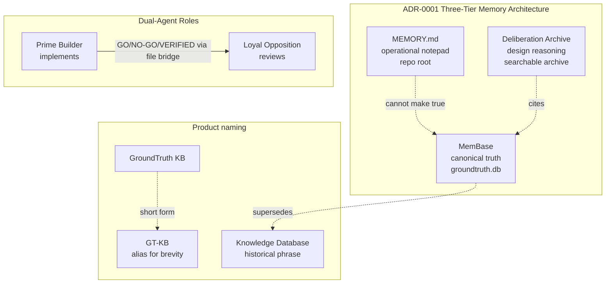

# Canonical Terminology

GroundTruth KB scaffolds a canonical terminology surface into every new
project. It is loaded alongside `CLAUDE.md` and `AGENTS.md` at session
start so fresh agent sessions immediately know the project's vocabulary
without cross-referencing.

## What gets scaffolded

Every `gt project init <name>` invocation installs:

| File | Purpose |
|------|---------|
| `.claude/rules/canonical-terminology.md` | Full glossary — 8 canonical terms + full `MEMBASE-4-CLAUDE.md` term set |
| `.claude/rules/canonical-terminology.toml` | Profile-aware doctor config (required terms + required files + severity) |

Both files are managed `rule` artifacts in
[`templates/managed-artifacts.toml`](templates.md). Lifecycle (scaffold,
upgrade, drift repair) is registry-driven — no hard-coded copy logic in
`scaffold.py` or `upgrade.py`. Presence and validity of the canonical
terminology surface are enforced by the composite doctor check
`_check_canonical_terminology()`, **not** by generic `_check_rules()`
Markdown enumeration. The registry entries therefore set
`doctor_required_profiles = []` — the composite check owns enforcement.

A concise glossary block is embedded in the scaffolded `CLAUDE.md` and
`AGENTS.md` (dual-agent profiles) so startup-time loading picks it up
without a separate read. The `MEMORY.md` template carries a one-line
pointer to the full glossary.

## The eight canonical terms (ADR-0001 core vocabulary)

These terms are inherited by every GroundTruth project and MUST NOT be
redefined locally. Full definitions live in the scaffolded
`.claude/rules/canonical-terminology.md`.



| Term | One-line definition |
|------|---------------------|
| **MemBase** | Canonical, authoritative store of specs and governed knowledge (`groundtruth.db`). Append-only versioning. |
| **Deliberation Archive (DA)** | Design-reasoning tier — decisions, reviews, rejected alternatives. Answers *why*. |
| **MEMORY.md** | Operational notepad at repo root. Can coordinate work; cannot make anything true. |
| **Knowledge Database** | Historical phrase — use "MemBase" going forward. |
| **GroundTruth KB** | The product: MemBase + `gt` CLI + templates + doctor + file bridge. |
| **GT-KB** | Canonical alias for GroundTruth KB. |
| **Prime Builder** | Implementing agent. Proposes, implements, tests. |
| **Loyal Opposition** | Reviewing agent. Inspects, critiques, issues GO / NO-GO / VERIFIED. |

## Profile matrix

`gt project doctor` enforces profile-specific required-term sets:

| Profile | Required files | Required startup terms |
|---------|----------------|------------------------|
| `local-only` | CLAUDE.md, MEMORY.md | MemBase, Deliberation Archive, MEMORY.md |
| `dual-agent` | CLAUDE.md, AGENTS.md, MEMORY.md, `.claude/rules/deliberation-protocol.md` | MemBase, Deliberation Archive, MEMORY.md, Prime Builder, Loyal Opposition |
| `dual-agent-webapp` | (extends `dual-agent`) | MemBase, Deliberation Archive, MEMORY.md, Prime Builder, Loyal Opposition |
| `harness-memory` | CLAUDE.md, AGENTS.md, `.claude/rules/deliberation-protocol.md` | Same as `dual-agent`, but **MEMORY.md content check is skipped** |

- **Missing canonical term** → ERROR (doctor reports `fail`).
- **Minor drift** → WARN (doctor reports `warning`).

The `harness-memory` opt-in profile is for projects whose `MEMORY.md`
lives outside the project repo (managed by an external harness or
orchestration layer).

## Doctor check

```bash
gt project doctor
```

The `canonical terminology` check:

- Loads `.claude/rules/canonical-terminology.toml`.
- Resolves the active profile's effective config (handling `extends`).
- Verifies every required file exists and contains every required term.
- Reports the first six findings if any terms or files are missing.

Example output:

```text
[OK]  Canonical-terminology surface OK — 5 required terms present in 4 required files (profile: dual-agent)
```

### Lifecycle vs enforcement (class-taxonomy note)

The TOML config is a managed `rule` artifact for **lifecycle** purposes —
`gt project init` scaffolds it and `gt project upgrade --apply` repairs
drift. It is *not* enforced as a generic Markdown rule. Presence and
content validity are enforced by `_check_canonical_terminology()`, a
composite check that knows how to read and apply the TOML profile
matrix. Generic `_check_rules()` continues to enumerate only `.md`
files in `.claude/rules/`.

## Adding a project-specific canonical term

When a bridge proposal introduces a new canonical term, the
`.claude/rules/deliberation-protocol.md` **Canonical Term Propagation
Gate** requires listing all propagation targets before Loyal Opposition
issues GO:

1. MemBase record (spec ID or document ID)
2. CLAUDE.md glossary pointer
3. AGENTS.md glossary pointer (dual-agent profiles)
4. `.claude/rules/canonical-terminology.md` entry
5. Doctor check coverage (update
   `.claude/rules/canonical-terminology.toml` if the term is profile-required)

This converts canonical-term creation from a judgement call into a
mechanical governance step. Reviews that introduce canonical terms
without these propagation targets should be returned NO-GO.

## Upgrading existing projects

Existing scaffolded projects that pre-date this feature can be upgraded
idempotently:

```bash
gt project upgrade --apply
```

The registry-driven upgrade planner emits `add` actions for any missing
managed canonical-terminology file and `skip` actions when a customized
file differs from the template (use `--force` to overwrite). No
`MEMORY.md` path change — root `MEMORY.md` remains the scaffold default
per owner decision `DELIB-0719`.

## See also

- [Templates reference](templates.md) — full inventory of scaffolded files
- `MEMBASE-4-CLAUDE.md` (in origin-pattern repo) — the 858-line pattern doc

---

*© 2026 Remaker Digital, a DBA of VanDusen & Palmeter, LLC. All rights reserved.*
