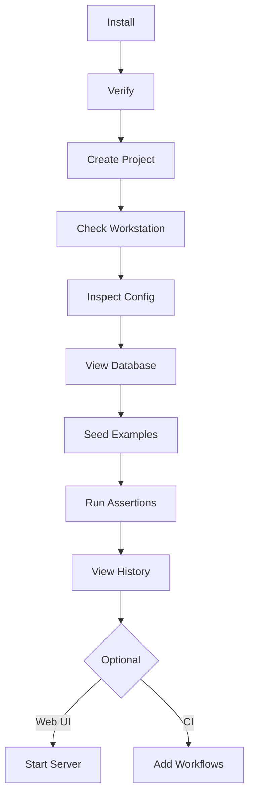

# Start Here

A complete walkthrough from zero to a working GroundTruth project. Every command
on this page has been verified against the current release.

## Prerequisites

- **Python 3.11+** — check with `python --version`
- **Git** — check with `git --version`
- **pip** — included with Python



## Step 1: Install GroundTruth

```bash
pip install groundtruth-kb
```

!!! tip "Pinned installs"
    For reproducible installs, pin to an exact version:
    `pip install groundtruth-kb==0.4.0`

## Step 2: Verify Installation

```bash
gt --version
```

Expected output:

```
gt, version 0.4.0
```

## Step 3: Create a New Project

```bash
gt project init my-first-project --profile local-only --no-seed-example --no-include-ci
```

This creates a `my-first-project/` directory with the core GroundTruth scaffold:
configuration, database, rules, hooks, and project files.

Now switch into the project directory — all remaining commands run from here:

```bash
cd my-first-project
```

??? info "Available profiles"
    | Profile | What it includes |
    |---------|-----------------|
    | `local-only` | Single-agent setup: KB, rules, hooks |
    | `dual-agent` | Above + Loyal Opposition bridge, AGENTS.md |
    | `dual-agent-webapp` | Above + Dockerfile, docker-compose, web UI config |

    The default `gt project init` (without `--no-seed-example --no-include-ci`)
    also includes example specifications, tests, and GitHub Actions CI workflows.

## Step 4: Check Workstation Readiness

```bash
gt project doctor
```

This reports which tools are installed and which are optional. All core
checks should pass after Step 1.

## Step 5: Inspect Configuration

```bash
gt config
```

Shows the resolved database path, project root, branding settings, and
governance gates. These values come from `groundtruth.toml` in your
project directory.

## Step 6: View the Database

```bash
gt summary
```

Expected output:

```
Specifications: 5 total
Tests: 0
Work items: 0
```

The 5 specifications are **governance rules** — they define the GroundTruth
method itself and are always included. Your project starts with structure,
not an empty void.

## Step 7: Add Example Content

```bash
gt seed --example
```

This loads example specifications and tests that demonstrate the method
using a sample task-tracker application.

## Step 8: Verify the Seeded Content

```bash
gt summary
```

Expected output:

```
Specifications: 8 total
Tests: 5
Work items: 0
```

The database now contains governance rules plus example specifications
with linked tests.

## Step 9: Run Assertions

```bash
gt assert
```

Expected output includes:

```
File not found: src/tasks.py
FAILED: 2
```

!!! tip "Why do assertions fail?"
    The example specifications reference application code (`src/tasks.py`)
    that doesn't exist yet in your project. This is **expected** —
    assertions verify your implementation against specifications. Failures
    tell you what to build next.

## Step 10: View History

```bash
gt history
```

Shows the seed operation and all recent changes to the knowledge base.
Every insert, update, and promotion is tracked with timestamps and
change reasons.

## Step 11: Start the Web UI (optional)

Install the web extra:

```bash
pip install "groundtruth-kb[web]"
```

Then start the server:

```bash
gt serve
```

Open [http://localhost:8090](http://localhost:8090) in your browser to
browse specifications, tests, work items, and assertion results.

## Step 12: Add CI (optional)

If you skipped CI in Step 3, you can add it manually by copying the
CI templates into your project:

```bash
# From your project directory:
gt project upgrade
```

Or copy individual workflow files from the
[templates/ci/](https://github.com/Remaker-Digital/groundtruth-kb/tree/main/templates/ci)
directory.

!!! note "Default behavior"
    If you run `gt project init my-project --profile local-only` without
    the `--no-include-ci` flag, CI workflows are included automatically.

## Command Quick Reference

| Task | Command |
|------|---------|
| Scaffold new project | `gt project init my-project --profile <profile>` |
| Same-day prototype | `gt bootstrap-desktop my-project` |
| Check workstation | `gt project doctor` |
| Update scaffold | `gt project upgrade` |
| View summary | `gt summary` |
| Run assertions | `gt assert` |
| View history | `gt history` |
| Export database | `gt export` |
| Import database | `gt import db.json` |
| Show config | `gt config` |
| Start web UI | `gt serve` |
| Rebuild search index | `gt deliberations rebuild-index` |

## What's Next?

- **[Method Guide](method/01-overview.md)** — understand the full GroundTruth
  discipline: specifications, testing, governance, and dual-agent workflows
- **[Example Project](https://github.com/Remaker-Digital/groundtruth-kb/tree/main/examples/task-tracker/WALKTHROUGH.md)** —
  a guided walkthrough of a task-tracker that exercises all six layers
- **[CLI Reference](reference/cli.md)** — all 14 commands with options and examples
- **[Configuration Reference](reference/configuration.md)** — every
  `groundtruth.toml` field and environment variable

---

*Copyright 2026 Remaker Digital, a DBA of VanDusen & Palmeter, LLC. All rights reserved.*
