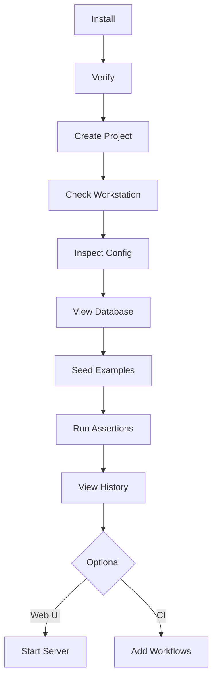

# Start Here

A complete walkthrough from zero to a working GroundTruth project. Every command
on this page has been verified against the current release.

## Prerequisites

- **Python 3.11+** — check with `python --version`
- **Git** — check with `git --version`
- **pip** — included with Python



## Step 1: Install GroundTruth

```bash
pip install groundtruth-kb
```

!!! tip "Pinned installs"
    For reproducible installs, pin to an exact version:
    `pip install groundtruth-kb==0.6.0`

## Step 2: Verify Installation

```bash
gt --version
```

Expected output:

```
gt, version 0.6.0
```

## Step 3: Create a New Project

```bash
gt project init my-first-project --profile local-only --no-seed-example --no-include-ci
```

This creates a `my-first-project/` directory with the core GroundTruth scaffold:
configuration, database, rules, hooks, and project files.

Now switch into the project directory — all remaining commands run from here:

```bash
cd my-first-project
```

??? info "Available profiles"
    | Profile | What it includes | CI tier |
    |---------|-----------------|---------|
    | `local-only` | Single-agent setup: KB, rules, hooks | minimal |
    | `dual-agent` | Above + Loyal Opposition bridge, AGENTS.md | standard |
    | `dual-agent-webapp` | Above + Dockerfile, docker-compose, web UI config | full |

    CI workflows are generated by default for all profiles. The profile
    determines the tier (minimal / standard / full). Use `--no-include-ci`
    to suppress all CI for any profile.

## Step 4: Check Workstation Readiness

```bash
gt project doctor
```

This reports which tools are installed and which are optional. All core
checks should pass after Step 1.

## Step 5: Inspect Configuration

```bash
gt config
```

Shows the resolved database path, project root, branding settings, and
governance gates. These values come from `groundtruth.toml` in your
project directory.

## Step 6: View the Database

```bash
gt summary
```

Expected output:

```
Specifications: 5 total
Tests: 0
Work items: 0
```

The 5 specifications are **governance rules** — they define the GroundTruth
method itself and are always included. Your project starts with structure,
not an empty void.

## Step 7: Add Example Content

```bash
gt seed --example
```

This loads example specifications and tests that demonstrate the method
using a sample task-tracker application.

## Step 8: Verify the Seeded Content

```bash
gt summary
```

Expected output:

```
Specifications: 8 total
Tests: 5
Work items: 0
```

The database now contains governance rules plus example specifications
with linked tests.

## Step 9: Run Assertions

```bash
gt assert
```

Expected output:

```
PASSED: 2
FAILED: 0
```

!!! tip "Why do assertions pass on a fresh scaffold?"
    On a fresh scaffold, `gt assert` exits 0 because `src/tasks.py` is
    pre-generated as a stub that satisfies the seeded SPEC-001 and SPEC-002
    assertions. The tutorial teaches you to evolve it — as you replace the
    stub with real application code, assertions confirm that your
    implementation still meets the specifications.

## Step 10: View History

```bash
gt history
```

Shows the seed operation and all recent changes to the knowledge base.
Every insert, update, and promotion is tracked with timestamps and
change reasons.

Deliberations live in the Deliberation Archive (DA), one of three tiers defined by ADR-0001: Three-Tier Memory Architecture (MemBase, MEMORY.md, DA).

## Step 11: Capture a Deliberation

Deliberations are the "why" behind your decisions — rejected alternatives,
owner conversations, review verdicts, and any reasoning that shapes your
specs. They travel with the project in the same database as your specs.

Capture a deliberation from the command line:

```bash
gt deliberations add \
  --id DELIB-0001 \
  --source-type owner_conversation \
  --source-ref "walkthrough notes" \
  --title "Start with 3 layers, add the rest later" \
  --summary "Chose to seed governance first and defer full layering" \
  --content "We picked the minimal example because it highlights the spec/test/implementation triangle without overwhelming a first-time reader." \
  --outcome owner_decision
```

Retrieve it later:

```bash
gt deliberations get DELIB-0001
```

Or find it by free-text search (SQLite LIKE fallback works even in the base
install; add the `[search]` extra for semantic search):

```bash
gt deliberations search "minimal example"
```

Link it to a spec so the reasoning travels with the decision:

```bash
gt deliberations link DELIB-0001 --spec SPEC-0001 --role related
```

See the [Method Guide — Deliberation Archive](method/13-deliberation-archive.md)
for a full workflow and the complete CLI surface.

## Step 12: Start the Web UI (optional)

Install the web extra:

```bash
pip install "groundtruth-kb[web]"
```

Then start the server:

```bash
gt serve
```

Open [http://localhost:8090](http://localhost:8090) in your browser to
browse specifications, tests, work items, and assertion results.

## Step 13: Add CI (optional)

If you skipped CI in Step 3, you can add it manually by copying the
CI templates into your project:

```bash
# From your project directory:
gt project upgrade
```

Or copy individual workflow files from the
[templates/ci/](https://github.com/Remaker-Digital/groundtruth-kb/tree/main/templates/ci)
directory.

!!! note "Default behavior"
    If you run `gt project init my-project --profile local-only` without
    the `--no-include-ci` flag, CI workflows are included automatically.

## Command Quick Reference

| Task | Command |
|------|---------|
| Scaffold new project | `gt project init my-project --profile <profile>` |
| Same-day prototype | `gt bootstrap-desktop my-project` |
| Check workstation | `gt project doctor` |
| Update scaffold | `gt project upgrade` |
| View summary | `gt summary` |
| Run assertions | `gt assert` |
| View history | `gt history` |
| Export database | `gt export` |
| Import database | `gt import db.json` |
| Show config | `gt config` |
| Start web UI | `gt serve` |
| Capture a deliberation | `gt deliberations add --id DELIB-... --summary ... --content ...` |
| Capture (auto-id, idempotent) | `gt deliberations upsert --source-ref ... --content-file ...` |
| Fetch a deliberation | `gt deliberations get DELIB-0001 [--history]` |
| List / filter deliberations | `gt deliberations list [--spec-id ...] [--outcome ...]` |
| Search deliberations | `gt deliberations search "query" [--semantic-only]` |
| Link deliberation to spec | `gt deliberations link DELIB-... --spec SPEC-... --role related` |
| Rebuild search index | `gt deliberations rebuild-index` |

## What's Next?

- **[Your First Specification](tutorials/first-spec.md)** — write your first spec, link a test, and run an assertion
- **[Dual-Agent Setup](tutorials/dual-agent-setup.md)** — add the Loyal Opposition and configure the file bridge
- **[Method Guide](method/01-overview.md)** — understand the full GroundTruth
  discipline: specifications, testing, governance, and dual-agent workflows
- **[Example Project](https://github.com/Remaker-Digital/groundtruth-kb/tree/main/examples/task-tracker/WALKTHROUGH.md)** —
  a guided walkthrough of a task-tracker that exercises all six layers
- **[CLI Reference](reference/cli.md)** — the full command surface (including the six `gt deliberations` subcommands) with options and examples
- **[Configuration Reference](reference/configuration.md)** — every
  `groundtruth.toml` field and environment variable

---

*Copyright 2026 Remaker Digital, a DBA of VanDusen & Palmeter, LLC. All rights reserved.*
