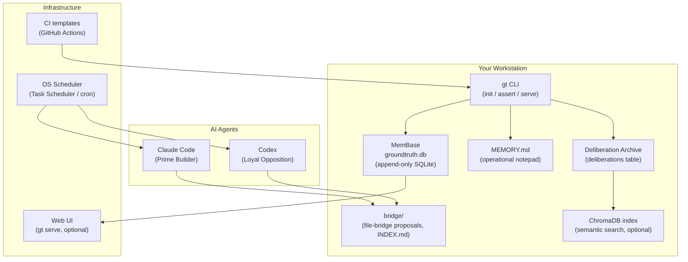

# Start Here

A guided walkthrough for adopters evaluating GroundTruth-KB for the first time.

## Reader Profile

This page assumes **zero prior context**. You have not used GroundTruth-KB
before, you have not read the method documentation, and you may have never
run a file-bridge protocol in your life. The only assumption is that you are
sitting at a Windows workstation with internet access and can copy-paste
commands into a PowerShell terminal.

If that describes you, keep reading. Everything a senior technologist needs
to decide whether GroundTruth-KB is worth an evaluation sits on this page or
behind the links at the bottom.

## Prerequisites

Before anything else, make sure these are present on your workstation:

- **Python 3.11+** — check with `python --version`
- **Git** — check with `git --version`
- **pip** — included with Python
- **Claude Code** — Anthropic's terminal-based coding assistant. Install
  from the [Anthropic Claude Code install page](https://docs.anthropic.com/claude/docs/claude-code)
  (retrieved 2026-04-17). Claude Code is a **separate prerequisite**. Install
  and authenticate Claude Code before installing GroundTruth-KB.
  GroundTruth-KB does not bundle Claude Code and does not manage its updates.
- **(Optional) Codex** — available through OpenAI. Only needed if you intend
  to run the dual-agent file bridge with a Loyal Opposition reviewer.

The PowerShell primer at the bottom of this page shows exactly what commands
to run if any of the above are missing.

## 1. What Is GroundTruth-KB?

GroundTruth-KB is a **specification-first governance toolkit for AI
engineering teams**. It gives you three things that are hard to keep in sync
without discipline:

- A **canonical record** of what the system is supposed to do
  (specifications).
- A **machine-checkable proof** that the code still does it (assertions).
- An **audit trail** of every decision and its rejected alternatives
  (the Deliberation Archive).

The toolkit is a single Python package (`pip install groundtruth-kb`). It
ships with a CLI (`gt`), an optional Web UI, project scaffolding, CI
templates, and a dual-agent file-bridge pattern for AI code review.

See [Architecture — Product Split](architecture/product-split.md) for the
three-layer split (Core Knowledge Database, Project Scaffold, Workstation
Doctor).

## 2. Features, One Problem at a Time

Each capability exists because a specific thing is hard to get right without
tooling. Read the problem first; the feature follows.

### Specifications

**Problem:** "What is this thing supposed to do?" is the single most common
source of argument in AI-assisted development. Without a canonical record,
every team member, every agent, and every reviewer carries their own
unverifiable mental model.

**Solution:** GroundTruth-KB stores specifications in an append-only SQLite
database. Each spec has an ID, a status (`specified` → `implemented` →
`verified`), and a history of every change. Specs are the project's
decision log — not a build specification for an implementer.

### Assertions

**Problem:** Documentation rots. A spec that says "users can create tasks
with a priority" does not prove the code still does it.

**Solution:** Every spec can carry one or more machine-checkable
**assertions**. A grep pattern, a file-exists check, a JSON path, a counted
occurrence. Run `gt assert` and GroundTruth-KB tells you which specs still
hold and which have drifted.

### Tests

**Problem:** Tests written without specifications drift in a different
direction than the code they were meant to pin down.

**Solution:** Every test is linked to a spec. When a test fails, you see
which specification is at risk. When a spec changes, you see which tests
need review.

### Work Items

**Problem:** "Known gap between spec and implementation" is a real
engineering state, but most trackers (Jira, Linear) don't distinguish it
from ordinary bugs or feature requests.

**Solution:** A work item (WI) is always tied to a source spec. It has an
origin (`new`, `regression`, `defect`, `hygiene`) and a stage. When the WI
resolves, the linked spec can advance its status.

### Deliberation Archive

**Problem:** Six months from now, nobody will remember why you picked
approach A over approach B, or whether a rejected alternative has already
been tried.

**Solution:** Every decision — owner conversation, Loyal Opposition review,
bridge thread — is archived as a deliberation with semantic search. Cite
deliberation IDs in proposals. Search before re-opening a settled decision.

### Governance Gates

**Problem:** "We will review every change" is aspirational. It does not
survive contact with a fast-moving codebase.

**Solution:** GroundTruth-KB enforces GOV specs (spec-first, test clarity,
owner consent, no-fixes-during-testing, KB-is-truth) as runnable assertions.
If a governance rule is violated, `gt assert` says so.

### File-Bridge Dual-Agent Pattern

**Problem:** A single AI agent reviewing its own work is weaker than two
agents with opposing incentives. But coordinating two agents over chat is
lossy.

**Solution:** A file-bridge protocol in `bridge/` with a versioned INDEX.
Prime Builder writes proposals; Loyal Opposition writes GO / NO-GO reviews;
both agents poll the index independently. The filesystem is the audit trail.

## 3. Block Diagram: Where Things Live



The diagram names the 14 directive entities an adopter touches in the first
week: the CLI, the canonical database (MemBase), the operational memory
file, the Deliberation Archive, the ChromaDB index, the bridge directory,
the two AI agents, the OS scheduler, the Web UI, the CI templates, plus
three roles (Prime Builder, Loyal Opposition, OS Scheduler).

The **three-tier memory architecture** is defined in
[ADR-0001](method/08-architecture.md): **MemBase** is the canonical
knowledge tier (specs, tests, work items, procedures, documents);
**MEMORY.md** is the operational notepad (session state, what you were
working on yesterday); the **Deliberation Archive** is the decision log
(why you picked approach A over approach B). ChromaDB is a derived search
index, not a fourth tier. See
[product-split.md](architecture/product-split.md) for the authoritative
definition of each layer.

## 4. Install

Once the prerequisites are satisfied, installation is a single command:

```powershell
pip install groundtruth-kb
```

Verify the install:

```powershell
gt --version
```

Expected output:

```
gt, version 0.6.1
```

Create your first project:

```powershell
gt project init my-first-project --profile local-only --no-seed-example --no-include-ci
```

Switch into the project and verify its health:

```powershell
cd my-first-project
gt project doctor
```

The doctor reports which tools are present and which are optional. All core
checks should pass at this point.

See the [Bootstrap Guide](bootstrap.md) for the full 10-step technical
walkthrough (seed data, first spec, first test, first assertion, Web UI,
CI). See [Desktop Setup](desktop-setup.md) for the same-day prototype
path (`gt bootstrap-desktop`).

## 5. PowerShell Primer

If you have never opened a terminal, this five-command primer covers
everything the walkthrough above requires. Open PowerShell (Start menu →
type `PowerShell` → press Enter).

| Task | Command | What it does |
|------|---------|--------------|
| Change directory | `cd C:\Users\you\projects` | Move into a folder |
| List files | `ls` | Show what is in the current folder |
| Run a program | `python --version` | Run a `.exe` that is on your `PATH` |
| Install a Python package | `pip install groundtruth-kb` | Download + install a package from PyPI |
| Check a command exists | `where.exe python` | Show the path to a `.exe` |

If a command fails with "not recognized," it usually means the `.exe` is
not on your `PATH`. The installers for Python and Git both offer to add
themselves to `PATH` during setup — accept that option. If you already
installed them without that option, re-run the installer and choose
"Modify."

## 6. Third-Party Integrations

GroundTruth-KB deliberately stays thin. The heavy lifting is delegated to
tools you probably already have. Here is the named inventory:

| Tool | Why it is needed |
|------|------------------|
| **Claude Code** | Prime Builder — reads the bridge, writes proposals, edits code. |
| **Codex** (OpenAI) | Loyal Opposition — reads the bridge, writes GO/NO-GO reviews. |
| **OS Scheduler** (Windows Task Scheduler / Linux cron / macOS launchd) | Runs the bridge pollers every 3 minutes, independent of open chat sessions. |
| **GitHub** | Hosts the repo and runs the CI templates. Not required for local-only mode. |
| **PyPI** | Distributes the `groundtruth-kb` wheel. Required for install. |
| **MkDocs + Material theme** | Renders the docs site (this page). Optional but recommended for team-scale adoption. |
| **ChromaDB** | Semantic search backend for the Deliberation Archive. Optional; a SQLite LIKE fallback ships in the base install. |

Nothing on this list is installed automatically by GroundTruth-KB. That is
intentional — each is a separate decision that an adopter (or their IT
department) should make explicitly. See [Desktop Setup](desktop-setup.md)
for the install order that has been battle-tested on Windows.

## 7. The Web UI Dashboard

With the web extra installed (`pip install "groundtruth-kb[web]"`) and
`gt serve` running at `http://localhost:8090`, the **dashboard** is the
adopter's daily status screen. Each metric has an action attached to it:

| Metric | What it tells you | If it is off-normal |
|--------|-------------------|---------------------|
| Specs by status | How many specs are `specified`, `implemented`, `verified` | A growing `specified` pile means WIs are not being created. A shrinking `verified` pile means drift. |
| Tests total | How many tests are linked to specs | Test count dropping without a deletion reason → regression. |
| Assertion pass / fail | How many machine-checkable assertions currently pass | Any failing `verified` spec is a regression. Failing `specified` is expected. |
| Work item counts | Open vs. resolved WIs | An open WI with no recent change → investigate stalling. |
| Recent activity | Last 20 spec / WI / test changes | A quiet day when you know you worked → the CLI is not writing to the expected DB. |
| Deliberation archive size | Rows in the `deliberations` table | Zero rows after a session with reviews → the harvest script did not run. |

The dashboard is text-first. No charting, no animated widgets. Every row
can be exported via `gt export` for external tooling.

## 8. Core Operational Loops

Adoption means internalizing two loops. Both are short.

### The Deploy Loop

```
develop → staging → prod
```

- **develop** is the branch where every change lands. CI runs on every
  push. Nobody commits directly to `main`.
- **staging** is where the branch is tested against a production-shaped
  environment before release.
- **prod** is what the user sees. A merge to `main` is a deployment
  operation; `main` is always deployable.

GroundTruth-KB itself does not provision the staging and prod
environments. The CI templates in `templates/ci/` show the wiring; the
rest is your cloud decision.

### The Bridge Loop

```
propose → review → implement → verify
```

- **Propose:** Prime Builder writes `bridge/{topic}-001.md` and inserts a
  `NEW` entry at the top of `bridge/INDEX.md`.
- **Review:** Loyal Opposition reads the proposal and writes
  `bridge/{topic}-002.md` with verdict `GO` or `NO-GO`.
- **Implement:** On `GO`, Prime writes the code. On `NO-GO`, Prime writes
  a `REVISED` proposal as `-003.md`.
- **Verify:** Prime files a post-implementation report; Loyal Opposition
  reads it and writes `VERIFIED` or another `NO-GO`.

Both agents poll `bridge/INDEX.md` on a 3-minute cadence via the OS
scheduler. No human has to babysit the queue. See
[Method — File Bridge Automation](method/12-file-bridge-automation.md)
for the full protocol.

## 9. Next Steps

Once this page makes sense, walk through these in order:

- **[Your First Specification](tutorials/first-spec.md)** — write a spec,
  link a test, run an assertion. 15 minutes.
- **[Dual-Agent Setup](tutorials/dual-agent-setup.md)** — add the Loyal
  Opposition and wire the file-bridge poller. 30 minutes.
- **[A Day in the Life](day-in-the-life.md)** — a synthetic first week
  with a solo developer using Claude Code + GroundTruth-KB together.
- **[Evidence](evidence.md)** — live metrics from the reference
  implementation, each with generating command + commit SHA + date.
- **[Known Limitations](known-limitations.md)** — open gaps you should
  know about before committing. Honesty beats marketing.
- **[Executive Overview](groundtruth-kb-executive-overview.md)** — the
  business case for an engineering manager reviewing this tool.

## Command Quick Reference

| Task | Command |
|------|---------|
| Install | `pip install groundtruth-kb` |
| Scaffold a project | `gt project init my-project --profile <profile>` |
| Same-day prototype | `gt bootstrap-desktop my-project` |
| Check workstation | `gt project doctor` |
| View summary | `gt summary` |
| Run assertions | `gt assert` |
| View history | `gt history` |
| Capture a deliberation | `gt deliberations add --id DELIB-... --summary ... --content ...` |
| Search deliberations | `gt deliberations search "query"` |
| Start the Web UI | `gt serve` |

---

*Copyright 2026 Remaker Digital, a DBA of VanDusen & Palmeter, LLC. All rights reserved.*
