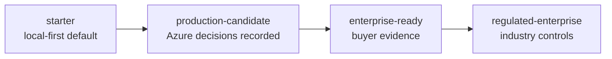
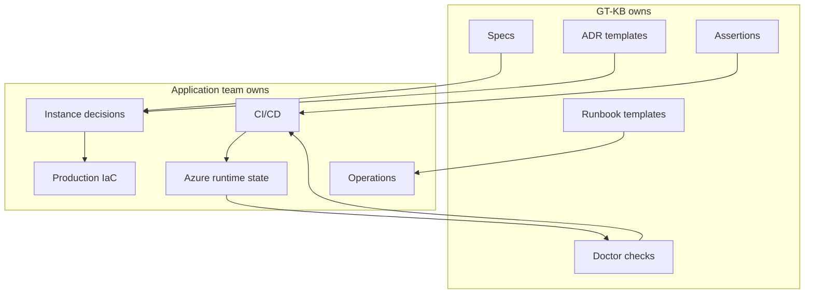
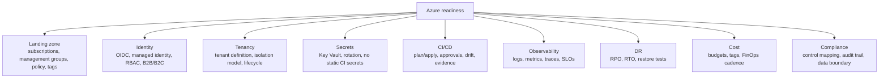
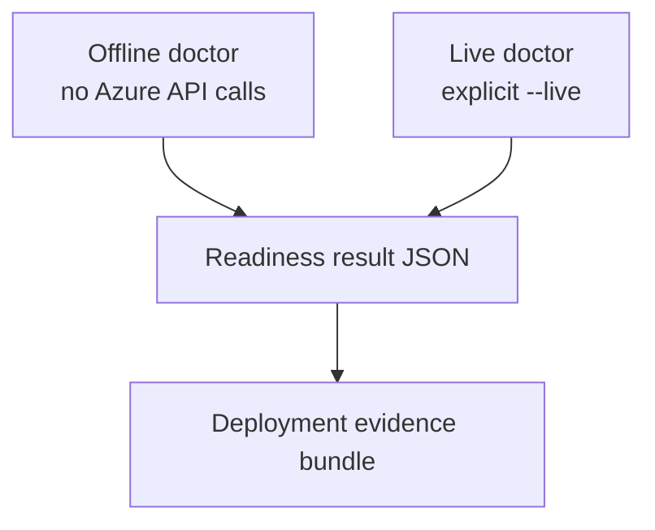

# Azure Enterprise Readiness

This page is the wiki-ready summary for GroundTruth-KB Azure Enterprise
Readiness. It mirrors the source documentation so the GitHub Wiki can stay
short, visual, and current.

## One-Page Summary

GroundTruth-KB keeps the default scaffold lightweight, then adds an opt-in
Azure enterprise readiness envelope for teams that need SaaS deployment
evidence. The envelope is made of specifications, ADR prompts, assertions,
doctor checks, runbooks, and deploy evidence artifacts.

## What GT-KB Owns

GT-KB does not own a customer's Azure subscription or deploy pipeline. It
owns the readiness workflow that makes Azure decisions recorded,
reviewable, and verifiable.

## Readiness Categories

## Tier Matrix

| Capability | starter | production-candidate | enterprise-ready | regulated-enterprise |
|------------|:-------:|:--------------------:|:----------------:|:--------------------:|
| Local specs/assertions | yes | yes | yes | yes |
| Docker/provider stubs | yes | yes | yes | yes |
| Compute target ADR | no | yes | yes | yes |
| OIDC deploy pattern | no | yes | yes | yes |
| Key Vault pattern | no | yes | yes | yes |
| Landing zone ADR | no | optional | yes | yes |
| Tenancy tests | no | basic | required | required |
| Cost budgets | no | optional | required | required |
| Observability/SLOs | no | basic | required | required |
| DR restore evidence | no | optional | required | required |
| Compliance mapping | no | no | baseline | regulation-specific |

## Verification Model

Offline checks inspect local specs, ADRs, workflow files, IaC text, and
assertions. Live checks call Azure APIs only when explicitly requested.

## First Implementation Bridge

The first implementation bridge should be taxonomy-first, not IaC-first:

`gtkb-azure-enterprise-readiness-taxonomy`

Follow-on bridges can add spec scaffolding, ADR activation, IaC skeletons,
CI/CD gates, offline doctor checks, live doctor checks, and operational docs.

## Source Of Truth

The full maintained source page is
[`docs/reference/azure-readiness-taxonomy.md`](../reference/azure-readiness-taxonomy.md).
