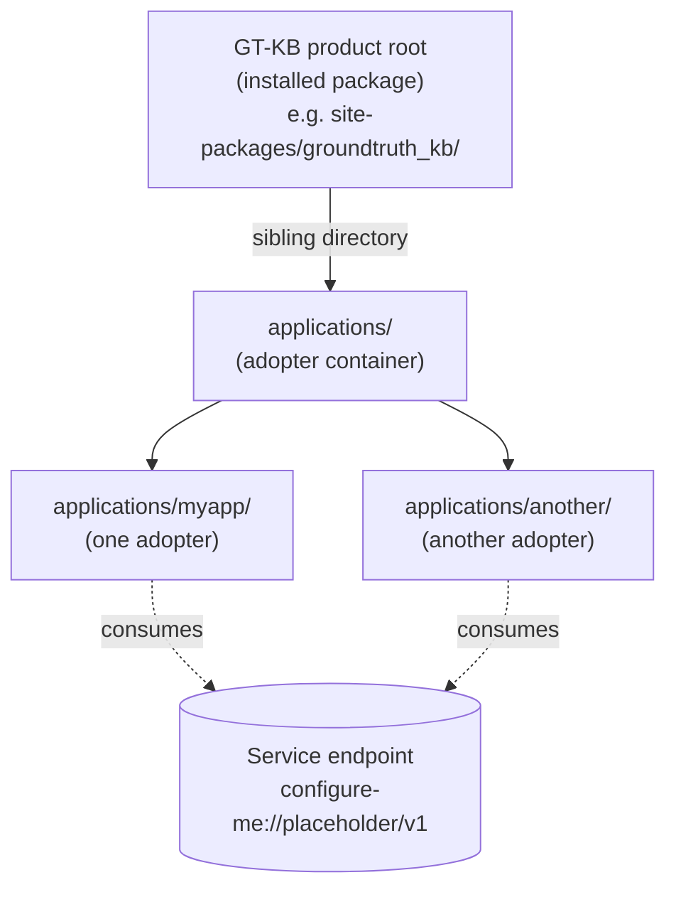

# Application/Platform Isolation

GT-KB enforces a two-root model: the **platform** (GT-KB itself) lives at one
root, and each **adopter application** lives at `<gt-kb-root>/applications/<name>/`.
This separation keeps adopter-owned files editable while protecting product-managed
files from accidental mutation.

This chapter documents the isolation contract, the tools that enforce it, and
the migration path for existing projects that predate the contract.

---

## What is an application subject?

A GT-KB session has a **work subject** that is either `application` or
`platform`. The subject determines which files the session may write, which
governance rules apply, and how the doctor interprets a project's state.

| Subject | Meaning | Typical session |
|---|---|---|
| `application` | The session is editing one adopter's files. Adopter-owned content (memory, bridge files, tests) is freely editable; product-managed content (hooks, rules, registry) is read-only. | An adopter implementing features against their own application. |
| `platform` | The session is editing GT-KB itself. Adopter applications are not in scope. | A GT-KB maintainer working on hooks, rules, or the registry. |

The default subject for a freshly scaffolded adopter is `application`. The
durable state lives at `.claude/session/work-subject.json` inside the adopter
root and is read by the Slice 1 doctor check `isolation:work-subject`.

For the canonical terminology of `application`, `platform`, `hosted application`,
and related terms, see [canonical-terminology.md](../reference/canonical-terminology.md).

---

## Application root vs GT-KB product root

Adopters consume GT-KB through a service contract, not by mounting the
product database. This contract is encoded as a path constraint:



**ADR-ISOLATION-APPLICATION-PLACEMENT-001** binds adopters to
`<gt-kb-root>/applications/<name>/`. `gt project init` enforces this at scaffold
time; `gt project doctor` verifies it via the `isolation:adopter-root-placement`
check; `gt project upgrade` hard-refuses to migrate an adopter that does not
satisfy the contract.

Writing into the wrong root is detected, not silently allowed:

| Write target | Outcome |
|---|---|
| File under the adopter root, marked `adopter-owned` | Permitted. |
| File under the adopter root, marked `gt-kb-managed` | Detected by `isolation:no-writable-product-paths` doctor check. Slice 5 verifies the detection contract; enforcement at the filesystem layer is out of scope for the current contract. |
| Adopter root placed under the product root | Refused at scaffold time by `_validate_application_target`. Refused at upgrade time by the partition's hard-refuse classification. |

For platform-vs-application terminology and the full ADR-0001 three-tier memory
model (MemBase, MEMORY.md, Deliberation Archive), see
[canonical-terminology.md](../reference/canonical-terminology.md).

---

## Starting a new project with `gt project init`

`gt project init` produces a fresh adopter root with all isolation invariants
satisfied. The command writes the scaffold tree, initializes an
adopter-scope `groundtruth.db`, and records the binding to the host product
root.

```bash
pip install groundtruth-kb
gt project init myapp --profile dual-agent --owner "My Organization"
cd myapp
gt project doctor
```

The scaffolded tree includes:

| Path | Ownership | Purpose |
|---|---|---|
| `groundtruth.toml` | gt-kb-scaffolded | Adopter manifest with `[service]` block. Editable. |
| `groundtruth.db` | bootstrap | Adopter-scope database. |
| `.claude/hooks/` | gt-kb-managed | Product-managed hook scripts. Refreshed by upgrade. |
| `.claude/rules/` | gt-kb-managed | Product-managed rule files. Refreshed by upgrade. |
| `.claude/settings.json` | synthesized | Hook registrations from the managed-artifact registry. |
| `memory/` | adopter-owned | Adopter work-list and release-readiness. |
| `bridge/` | adopter-owned | File-bridge proposals and reviews. |
| `README.md` | adopter-owned | Adopter README; the quickstart block is scaffolded by `gt project init` and explains the `[service]` endpoint contract. |

Refusal modes:

- The target directory must live directly under the host's `applications/`
  directory. Other parents are rejected with a `must live directly under` error.
- An existing `groundtruth.toml` at the target path is rejected with an
  `Existing adopter detected` error directing the operator to
  `gt project upgrade` instead.

For the full flag inventory and command-form reference, see
[cli.md](../reference/cli.md).

---

## What `gt project doctor` checks

`gt project doctor` runs nine isolation checks plus the rest of the workstation
verification suite. Each isolation check returns one of `pass` / `fail` /
`warning` / `info`.

| Check name | Severity model | What triggers a non-pass |
|---|---|---|
| `isolation:adopter-root-placement` | `fail` if the adopter root is under the product root. | Misplaced directory layout. Remediation: relocate the adopter to `<gt-kb-root>/applications/<name>/`. |
| `isolation:service-endpoint` | `fail` for raw-DB endpoints (e.g., `groundtruth.db`); `pass` for scoped service URLs; `warning` for unrecognized shapes. | Adopter's `[service].endpoint` points at the raw database file. Remediation: replace with a scoped service URL or the placeholder `configure-me://placeholder/v1`. |
| `isolation:work-subject` | `pass` when `current_subject=application`; `info` when state file is absent (defaults to application); `warning` when an unexpected subject is set. | A platform-subject session left state behind in the adopter root. Remediation: edit `.claude/session/work-subject.json` or remove it to restore the default. |
| `isolation:no-writable-product-paths` | `fail` when at least one product-scope path is writable from the adopter session. | The session has filesystem write permission on a `gt-kb-managed` path. Remediation: depends on the deployment; the check is a detection contract, not a filesystem-permission setter. |
| `isolation:hooks-point-to-wrappers` | `pass` for wrapper-shaped hook registrations; `warning` for embedded inline logic. | Adopter's `.claude/settings.json` has a hook command with embedded shell logic instead of a wrapper invocation. Remediation: refactor the registration to invoke a script under `.claude/hooks/` or `${CLAUDE_PLUGIN_ROOT}`. |
| `isolation:workstream-focus-hook-absent` | `pass` when absent; `warning` when present. | The deprecated `.claude/hooks/workstream-focus.py` reappeared. Remediation: delete the file. |
| `isolation:release-readiness-app-subject-header` | `pass` when the file leads with an application-subject header; `warning` when the header omits "application" or combines GT-KB readiness with green keywords. | Adopter's `memory/release-readiness.md` claims GT-KB platform readiness alongside adopter readiness. Remediation: scope the file to the adopter only and rename the header. |
| `isolation:chroma-regeneratable` | `pass` when chroma is absent or paired with a non-empty `groundtruth.db`; `warning` when chroma exists without a usable database. | An orphaned `.groundtruth-chroma/` directory exists but the database that feeds it is missing or empty. Remediation: regenerate the database or remove the orphan cache. |

The doctor is deterministic: repeated runs against the same adopter state
produce the same output. Non-determinism in any check is a contract violation,
not a feature.

---

## Upgrading an existing project with `gt project upgrade`

`gt project upgrade` applies registry diffs (missing managed files, drift
repairs, settings registrations, gitignore patterns) and writes a rollback
receipt. Upgrade is gated by isolation pre-flight: a non-compliant adopter
must opt into one-shot migration via `--accept-migration`.

```bash
gt project upgrade --dry-run        # plan without mutation
gt project upgrade --apply          # apply (refuses on isolation failures)
gt project upgrade --apply --accept-migration   # opt into one-shot migration
```

The flow per a successful `--apply`:

1. **Pre-flight.** The isolation pre-flight runs first. Failing checks
   partition into hard-refuse / auto-fixable / needs-adopter-input.
2. **Branch.** A short-lived `gt-upgrade-payload-<id>` branch is created.
3. **Migration auto-fixers.** When `--accept-migration` is set and the failing
   set is auto-fixable only, the auto-fixer runs (replaces raw-DB endpoint with
   the placeholder, deletes the legacy hook, normalizes the release-readiness
   header, normalizes the work-subject state).
4. **Payload.** File actions execute on the branch.
5. **Merge.** The branch merges to the target branch with `--no-ff`.
6. **Receipt.** A v1 JSON receipt is written under
   `.claude/upgrade-receipts/active/<receipt_id>.json`. The receipt is the
   evidence that lets `gt project rollback` undo the merge cleanly.

Receipt fields and rollback semantics (filesystem vs tracked mode, payload
boundary, etc.) are documented in
[upgrade-receipts.md](../reference/upgrade-receipts.md).

The Slice 4 partition determines what each isolation failure mode does:

| Partition | Members | Behavior under `--apply` (no migration) | Behavior under `--apply --accept-migration` |
|---|---|---|---|
| Hard refuse | `isolation:adopter-root-placement` | `IsolationLocationFailureError` | Same — relocation cannot be auto-fixed. |
| Auto-fixable | `isolation:service-endpoint`, `isolation:work-subject`, `isolation:workstream-focus-hook-absent`, `isolation:release-readiness-app-subject-header` | `IsolationMigrationRequiredError` | Auto-fixer runs; outcomes recorded in the receipt's `isolation_migration` block. |
| Needs adopter input | `isolation:no-writable-product-paths`, `isolation:hooks-point-to-wrappers`, `isolation:chroma-regeneratable` | `IsolationMigrationRequiredError` | `IsolationNonAutoFixableError` — adopter must address manually. |

Rollback reverses the merge while preserving the receipt:

```bash
gt project rollback              # consume the latest receipt
gt project rollback --receipt-id <id>   # consume a specific receipt
```

---

## Migrating an existing mixed-root project

Adopters that predate ADR-ISOLATION-APPLICATION-PLACEMENT-001 should rehearse
the migration in a sandbox before running it against production state. The
**Phase 8 rehearsal kit** at `scripts/rehearse_isolation.py` drives the
non-destructive rehearsal pattern.

The full recipe lives at
`groundtruth-kb/templates/project/upgrade-rehearsal-recipe.md`. The recipe
documents:

- How to capture a snapshot of the existing adopter state.
- How to invoke the rehearsal driver against the snapshot in a sandbox.
- How to evaluate the rehearsal output before committing to the live migration.
- How to invoke `gt project upgrade --apply --accept-migration` once the
  rehearsal evidence is satisfactory.

Migration policy under
`DELIB-S328-ISOLATION-017-SLICE4-DECISIONS-1-3-7-OWNER-DIRECTIVE` v1:

| Decision | Choice |
|---|---|
| Mandatory vs opt-in isolation for existing adopters | `mandatory_at_upgrade` — the upgrade refuses non-compliant adopters by default; `--accept-migration` is the documented opt-in. |
| Backward-compatibility policy | `one_shot_migration_at_upgrade` — there is no extended deprecation window; the auto-fixer runs once and the adopter converges to the isolation-compliant shape. |
| Phase 8 rehearsal-evidence integration | `out_of_band_recipe_only` — the rehearsal driver is documentation; the upgrade flow does not require attached rehearsal evidence at runtime. |

---

## Clean-adopter smoke contract

A clean adopter is one that satisfies every isolation invariant. The Slice 5
clean-adopter test suite at `groundtruth-kb/tests/adopter/` encodes the
contract as 13 spec-derived test files; the same file set serves as a
reference smoke contract for adopter operators.

| Invariant | Verification |
|---|---|
| Init defaults to application subject. | `test_init_defaults_to_application_subject.py` |
| Init scaffolds every adopter-owned path declared in the registry. | `test_init_scaffolds_adopter_owned_paths.py` |
| Init refuses to overwrite an existing adopter. | `test_init_refuses_to_overwrite_existing_adopter.py` |
| Upgrade applies the registry diff and writes a receipt. | `test_upgrade_applies_registry_diff_under_receipts.py` |
| Upgrade preserves adopter-owned customizations. | `test_upgrade_preserves_adopter_owned_files.py` |
| Rollback restores the pre-upgrade tree byte-for-byte. | `test_upgrade_rollback_restores_prior_state.py` |
| Doctor detects each named isolation violation. | `test_doctor_detects_isolation_violations.py` |
| The detection contract for product-path mutation is observable. | `test_app_subject_cannot_mutate_product_artifacts.py` |
| Every scaffolded file is registry-covered or in the explicit exemption list. | `test_registry_entry_present_for_every_scaffolded_file.py` |
| The retired `workstream-focus.py` hook stays absent across upgrades. | `test_workstream_focus_retired_hook_stays_absent.py` |
| The scaffold output byte-matches the committed golden fixture (per GT-KB version). | `test_golden_fixture_diff_per_version.py` |
| Three pre-isolation fixture trees exercise the migration outcome paths (auto-fix success, needs-adopter-input refusal, hard-refuse). | `test_existing_adopter_migration_kit.py` |
| Stale chroma overlays emit a warning. | `test_overlay_stale_detection.py` |

Run the suite locally with:

```bash
python -m pytest groundtruth-kb/tests/adopter/ -v --tb=short
```

The `uv run pytest` form is the local + reproducibility contract per the
Phase 9 plan; environments without `uv` may fall back to the `python -m pytest`
form above with no loss of coverage.

---

## Service-down behavior

The Phase 4 service contract is the boundary an adopter consumes through. When
the configured `[service].endpoint` is unreachable, GT-KB degrades in a
predictable order:

| Surface | Behavior when service is unreachable |
|---|---|
| `gt project doctor` | Runs to completion. The `isolation:service-endpoint` check reports the configured endpoint shape but does not test reachability — reachability is intentionally an operator concern, not a doctor invariant. |
| File-based bridge protocol | Unaffected. `bridge/INDEX.md` and the bridge proposal/review files are filesystem-resident; the bridge protocol does not consult the service. |
| Adopter-scope `groundtruth.db` | Unaffected. Adopter-local queries against the adopter's database continue to work without the service. |
| Cross-adopter or platform-scope queries | Fail closed. Operations that the service mediates (e.g., platform-scope policy lookups) return an error rather than silently falling back to the adopter-scope database. |
| `gt project upgrade` | Runs to completion if the service is not on the upgrade path. The upgrade payload uses the registry shipped in the GT-KB package, not a service round-trip. |

The placeholder endpoint `configure-me://placeholder/v1` is intentional: it
satisfies `isolation:service-endpoint` (it has a scheme prefix, so the check
recognizes it as a scoped service URL) without requiring an operator to stand
up a service before running the doctor for the first time.

---

## Overlay fallback semantics

The `.groundtruth-chroma/` directory is a derived semantic-search overlay built
from the canonical `groundtruth.db`. The overlay is **regeneratable**, not
authoritative. The Slice 1 check `isolation:chroma-regeneratable` enforces
this contract:

| State | Check result |
|---|---|
| Neither `.groundtruth-chroma/` nor `groundtruth.db` present. | `pass` (no orphan cache). |
| `.groundtruth-chroma/` present, `groundtruth.db` non-empty. | `pass` (overlay is regeneratable from the database). |
| `.groundtruth-chroma/` present, `groundtruth.db` missing or empty. | `warning` (overlay is orphaned; cannot be regenerated). |

When the overlay is present and the database is healthy, the overlay can be
deleted at any time and rebuilt from the database. When the overlay is
orphaned, the doctor reports the warning and the operator's choice is to
either restore the database or remove the orphan.

**Stale-detection only at this stage.** Per
`DELIB-S328-ISOLATION-017-SLICE5-OVERLAY-SCOPE-REVISION-OWNER-DIRECTIVE` v1,
Slice 5 ships only the stale-detection portion of the overlay contract.
The overlay **refresh** API and the **disposability** test (rebuild from
authoritative records produces equivalent state) are tracked in
MemBase work item `GTKB-ISOLATION-017-SLICE-5.5` and ship in a
follow-on slice. Until that slice lands, overlay refresh is a manual
operation outside the GT-KB CLI surface.

---

## See also

- [cli.md](../reference/cli.md) — full `gt project init` / `gt project doctor` /
  `gt project upgrade` / `gt project rollback` flag inventory.
- [upgrade-receipts.md](../reference/upgrade-receipts.md) — receipt schema,
  filesystem vs tracked mode, payload-boundary semantics.
- [canonical-terminology.md](../reference/canonical-terminology.md) — full
  glossary including `application`, `platform`, `hosted application`,
  `MemBase`, `Deliberation Archive`, `bridge`, `dashboard`.
- [product-split.md](product-split.md) — the GT-KB layer architecture (Layer 1
  Core KB, Layer 2 Project Scaffold, Layer 3 Workstation Doctor) that this
  isolation chapter sits inside.
- [examples/](../../examples/) — 4 example adopter trees demonstrating the
  isolation contract end-to-end: clean-adopter-minimal, adopter-with-transport-tests,
  adopter-with-release-gate, existing-adopter-migration.

---

*© 2026 Remaker Digital, a DBA of VanDusen & Palmeter, LLC. All rights reserved.*
