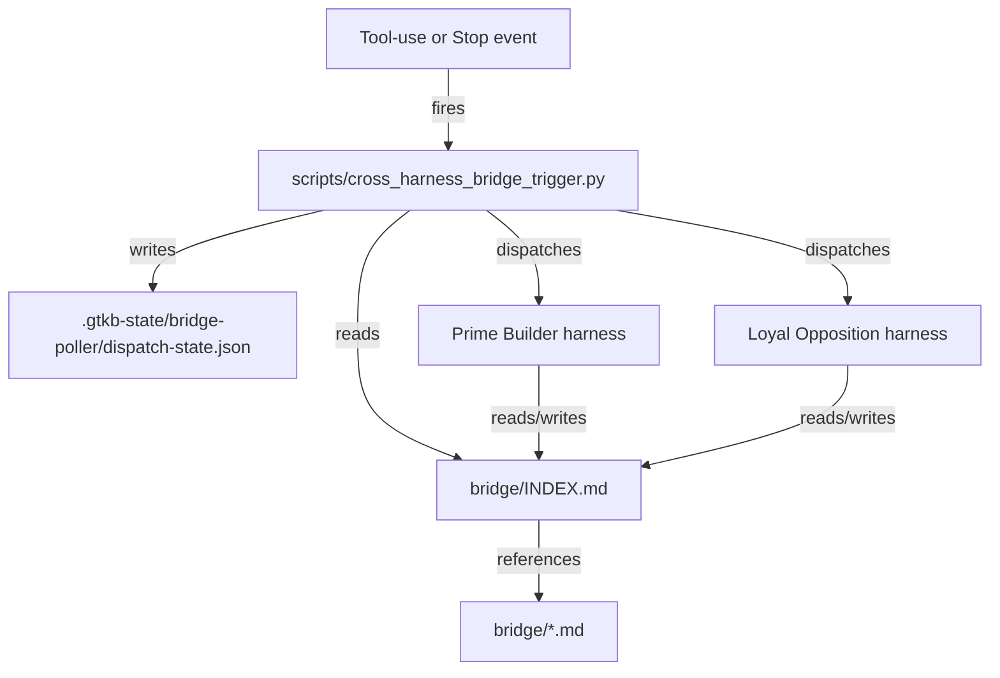
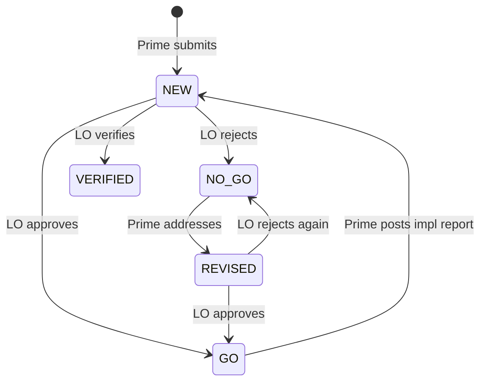

# 12. File Bridge Automation

Dual-agent GroundTruth workflows are not just a pair of prompts. They depend on
an operating surface: bridge files, status rules, hook registrations,
agent-specific startup instructions, CLI invocations, plugins, skills, locks,
logs, and recovery procedures. If those pieces are not captured, the pipeline
can appear documented while the working system is actually tribal knowledge.

This document defines the reference file-bridge pattern for GroundTruth
projects that use a Prime Builder and Loyal Opposition review loop.

## Purpose

The file bridge exists to make the review pipeline routine and durable:

- Prime Builder can submit implementation reports without waiting for a live
  Loyal Opposition chat.
- Loyal Opposition can review queued work without manual owner prompting.
- Prime Builder can act on review verdicts without the owner copying messages
  between tools.
- The owner can verify health from files, hook registrations, and dispatch
  state.

The owner should provide specifications, clarifications, and decisions. The
bridge should handle ordinary review handoff, dispatch, retry prevention, and
evidence capture.

## Reference topology

The preferred topology is a file-based bridge with a cross-harness
event-driven trigger that dispatches the appropriate counterpart harness when
a recipient's actionable queue signature changes. The retired smart-poller and
OS-scheduler implementations (archived under `archive/smart-poller-2026-05-09/`)
are no longer the active automation path; bridge dispatch is now event-driven
rather than interval-driven.



| Component | Responsibility |
|-----------|----------------|
| `bridge/INDEX.md` | Authoritative review queue and status index |
| `bridge/*.md` | Numbered review documents, implementation reports, and verdicts |
| `scripts/cross_harness_bridge_trigger.py` | Event-driven dispatch entrypoint that inspects INDEX and dispatches the appropriate counterpart harness when its actionable queue signature changes |
| `.claude/settings.json` (`PostToolUse`, `Stop` hooks) | Claude Code-side trigger registration |
| `.codex/hooks.json` (`PostToolUse`, `Stop` hooks) | Codex-side parity trigger registration (forward-compatible per `ADR-CODEX-HOOK-PARITY-FALLBACK-001`) |
| `.gtkb-state/bridge-poller/dispatch-state.json` | Per-recipient dispatch-state record consulted by the doctor's `_check_bridge_dispatch_liveness` check |
| Logs | Hook output and dispatch state provide proof of triggers and dispatches |
| Inventory | Records hook registrations, the trigger script, dispatch-state path, CLI commands, plugins, skills, and the manual fallback procedure |

The retired smart-poller and OS-scheduler topology required Windows scheduled
tasks, hidden VBS launchers, PowerShell scanners, lock files, and short
polling intervals. None of those pieces remain active. Bridge dispatch fires
when the agent's tool-call writes the INDEX or the agent's turn ends, not on
a fixed interval.

## Protocol model

The index is the source of truth. Each bridge document has a status history.
Entries are newest-first.

For a Prime Builder plus Loyal Opposition loop, use these status families:



| Status | Written by | Meaning |
|--------|------------|---------|
| `NEW` | Prime Builder | New implementation report or review request |
| `REVISED` | Prime Builder | Revised submission after a prior verdict |
| `GO` | Loyal Opposition | Work is accepted or may proceed |
| `NO-GO` | Loyal Opposition | Blockers remain; Prime Builder must respond |
| `VERIFIED` | Loyal Opposition | Terminal verification; no Prime response is expected |

The trigger inspects the latest status for each document entry. Historical
statuses below the latest line are evidence, not action items.

## Dispatch filters

The trigger uses separate signatures for the two directions to decide
whether dispatching is warranted.

| Recipient | Actionable latest statuses | Ignored |
|-----------|----------------------------|---------|
| Loyal Opposition | `NEW`, `REVISED` | `GO`, `NO-GO`, `VERIFIED` |
| Prime Builder | `GO`, `NO-GO` | `NEW`, `REVISED`, `VERIFIED` |

`VERIFIED` is terminal. The trigger never dispatches Prime Builder for
`VERIFIED` items, and the dispatch-state signature ignores historical statuses
beneath the latest entry per document.

## Trigger dispatch standard

The cross-harness event-driven trigger is the authoritative dispatch
mechanism when the bridge must operate across sessions.

Recommended trigger properties:

- Fire on `PostToolUse` (so an INDEX-modifying tool call dispatches the
  counterpart immediately) and `Stop` (so an end-of-turn check catches
  pending recipient work).
- Compute an actionable-queue signature for each recipient and dispatch only
  when the signature changes.
- Record dispatches in `.gtkb-state/bridge-poller/dispatch-state.json` with
  per-recipient `updated_at` so the doctor can detect missed dispatches.
- Skip dispatch when no recipient has actionable work.
- Keep stdout and stderr from dispatched harness invocations in a
  diagnosable location.
- Provide a single-instance lock so an INDEX modification under heavy
  tool-use does not produce overlapping dispatches.

Manual `bridge/INDEX.md` scans remain available as a fallback when the
trigger is unhealthy. The owner triggers a Prime bridge scan with a brief
prompt such as `Bridge` or `Bridge scan`.

## Prompt and configuration capture

The bridge setup is incomplete unless it captures the agent-control surface.
For each side, document:

- CLI executable and invocation form, for example `claude -p` or `codex exec`
- Model or runtime selection
- Working directory
- Permission mode and sandbox assumptions
- Startup instruction files, such as `CLAUDE.md`, `AGENTS.md`, or `MEMORY.md`
- Rule files, such as `.claude/rules/file-bridge-protocol.md`
- Hook registrations (`.claude/settings.json`, `.codex/hooks.json`)
- Dispatch-state path (`.gtkb-state/bridge-poller/dispatch-state.json`)
- Trigger script path (`scripts/cross_harness_bridge_trigger.py`)
- Plugins, MCP servers, and skills required for the run
- Environment variables and config files needed by the CLI
- Log, lock, and transcript locations
- Owner-only escalation rules
- Manual bridge-scan fallback procedure

Prompt text is configuration. If changing a prompt changes what the trigger
does, that prompt must be versioned or inventoried like code.

## Inventory fields

Each project using this pattern should maintain a project-owned inventory,
usually `BRIDGE-INVENTORY.md`, with at least:

- agent roles and ownership
- file bridge paths and status semantics
- hook registrations (`.claude/settings.json`, `.codex/hooks.json`)
- trigger script path (`scripts/cross_harness_bridge_trigger.py`)
- dispatch-state path (`.gtkb-state/bridge-poller/dispatch-state.json`)
- lock and log paths
- CLI commands and working directories
- prompt templates or inline prompt locations
- required plugins, skills, MCP servers, and config files
- health-check commands
- failure signals and recovery procedure
- manual bridge-scan fallback procedure
- MemBase records that capture design decisions and procedures

The package template `templates/BRIDGE-INVENTORY.md` includes these sections.

## Health checks

A bridge health check should answer four questions:

1. Is the cross-harness-trigger script present and executable?
2. Are both hook registrations (`.claude/settings.json` PostToolUse + Stop;
   `.codex/hooks.json` PostToolUse + Stop) in place?
3. Is the dispatch-state file fresh (PASS < 4 min, WARN 4-10 min, ALARM > 10 min)?
4. Does the INDEX reflect expected status transitions?

The doctor exposes this via two checks:

```text
gt project doctor
```

- `_check_cross_harness_trigger` reports PASS/WARN/FAIL covering trigger
  script presence, both hook registrations, and dispatch-state freshness.
- `_check_bridge_dispatch_liveness` reports per-recipient dispatch-state
  liveness for `claude` and `codex`.

Example index check:

```text
For each bridge document entry:
1. Read the top status line only.
2. If top status is NEW or REVISED, Loyal Opposition has work.
3. If top status is GO or NO-GO, Prime Builder has work.
4. If top status is VERIFIED, the item is complete.
```

## Failure modes

Common failures to review explicitly:

| Failure | Signal | Correction |
|---------|--------|------------|
| Trigger script missing | `_check_cross_harness_trigger` reports FAIL on script presence | Restore from scaffold or `gt project init my-project --profile dual-agent` |
| Hook registration missing | `_check_cross_harness_trigger` reports FAIL on hook registrations | Update `.claude/settings.json` PostToolUse/Stop arrays or `.codex/hooks.json` |
| Dispatch-state stale | `_check_bridge_dispatch_liveness` reports WARN/ALARM | Inspect last hook invocation and INDEX state; verify hooks fire on tool-use |
| Completed items re-dispatch | Trigger treats `VERIFIED` as actionable | Verify dispatch-filter logic ignores `VERIFIED` |
| Duplicate dispatches | Concurrent INDEX modifications | Verify single-instance lock acquisition |
| Silent failures | Hook output not captured | Capture trigger stdout/stderr in dispatch-state |
| Wrong agent behavior | CLI prompt omits role, verdict rules, or config paths | Version the prompt and include it in inventory |
| Stale integration config | Archived MCP or bridge config remains active | Remove or mark inactive in config and inventory |

## MemBase mapping

Per ADR-0001: Three-Tier Memory Architecture, MemBase is the auditable history and decision trail below.

Use GroundTruth records to preserve the operating history:

| Record type | Use |
|-------------|-----|
| `environment_config` | CLI paths, hook registration paths, config files, env vars |
| `operation_procedure` | Setup, health check, recovery, and review procedures |
| `document` | Bridge design notes, inventories, prompt captures, audits |
| `work_item` | Follow-up tasks for missing automation, docs, or verification |
| `decision` or ADR/DCL records | Trigger architecture, bridge protocol, role-boundary decisions |

Markdown files are the working control surface. MemBase is the auditable history and decision trail.

## Setup prompt

The legacy setup-prompt template at
`templates/bridge-os-poller-setup-prompt.md` is now a DEPRECATED
compatibility stub retained for two release cycles after the Slice 4
smart-poller retirement (2026-05-09). Do not follow it for new
installations.

For new installations, scaffold the project with:

```bash
gt project init my-project --profile dual-agent --owner "Your Name"
```

The `dual-agent` profile installs the trigger script, both hook
registrations, and the dispatch-state path automatically. See
`docs/tutorials/dual-agent-setup.md` for the end-to-end walkthrough.

## Review checklist

Before accepting a bridge setup, verify:

- The latest-status semantics match the protocol table above.
- The cross-harness event-driven trigger, not a chat session, is the
  reliability boundary.
- Both hook registrations (`.claude/settings.json`,
  `.codex/hooks.json`) are present and reference
  `scripts/cross_harness_bridge_trigger.py`.
- Both directions are configured and independently testable.
- CLI prompts are captured and versioned.
- Required plugins, skills, MCP servers, and config files are inventoried.
- Dispatch state proves both clear scans (no recipient action) and dispatched
  runs.
- Single-instance locking prevents overlap.
- Archived bridge runtimes (smart-poller, OS-poller) under
  `archive/smart-poller-2026-05-09/` are not referenced as live dependencies.
- The owner can inspect status without manually prompting either agent.
