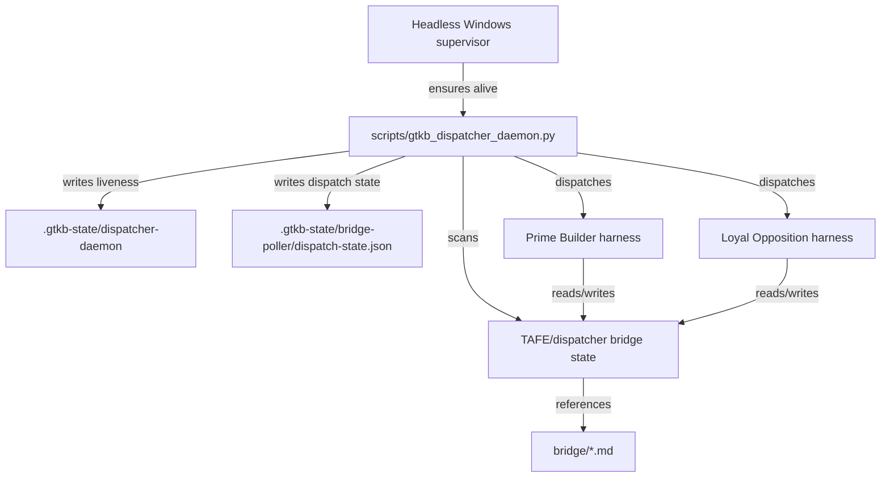
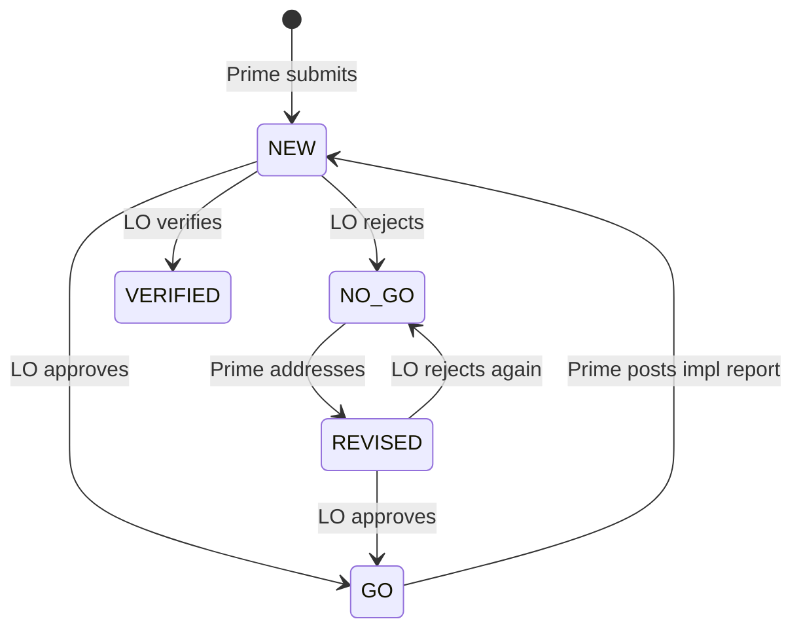

# 12. File Bridge Automation

Dual-agent GroundTruth workflows are not just a pair of prompts. They depend on
an operating surface: bridge files, status rules, daemon configuration,
agent-specific startup instructions, CLI invocations, plugins, skills, locks,
logs, and recovery procedures. If those pieces are not captured, the pipeline
can appear documented while the working system is actually tribal knowledge.

This document defines the reference file-bridge pattern for GroundTruth
projects that use a Prime Builder and Loyal Opposition review loop.

## Purpose

The file bridge exists to make the review pipeline routine and durable:

- Prime Builder can submit implementation reports without waiting for a live
  Loyal Opposition chat.
- Loyal Opposition can review queued work without manual owner prompting.
- Prime Builder can act on review verdicts without the owner copying messages
  between tools.
- The owner can verify health from files, daemon configuration, and dispatch
  state.

The owner should provide specifications, clarifications, and decisions. The
bridge should handle ordinary review handoff, dispatch, retry prevention, and
evidence capture.

## Reference topology

The preferred topology is a file-based bridge with a dispatcher daemon that
dispatches the appropriate counterpart harness when a recipient's actionable
queue signature changes. On Windows, the daemon is kept alive by the hidden
`GTKB-DispatcherDaemon` scheduled-task supervisor. The retired smart-poller,
OS-scheduler queue, and hook-trigger worker implementations are not the active
automation path; bridge dispatch is daemon-driven rather than hook-driven or
interval-driven.


```mermaid
graph TD
    SUP[Headless Windows supervisor] -->|ensures alive| TRG[scripts/gtkb_dispatcher_daemon.py]
    TRG -->|scans| IDX[TAFE/dispatcher bridge state]
    TRG -->|writes liveness| DSTATE[.gtkb-state/dispatcher-daemon]
    TRG -->|writes dispatch state| DST[.gtkb-state/bridge-poller/dispatch-state.json]
    TRG -->|dispatches| PRIME[Prime Builder harness]
    TRG -->|dispatches| LO[Loyal Opposition harness]
    PRIME -->|reads/writes| IDX
    LO -->|reads/writes| IDX
    IDX -->|references| FILES[bridge/*.md]
```

| Component | Responsibility |
|-----------|----------------|
| TAFE/dispatcher bridge state | Authoritative review queue and status index |
| `bridge/*.md` | Numbered review documents, implementation reports, and verdicts |
| `scripts/gtkb_dispatcher_daemon.py` | Long-running dispatcher daemon that inspects bridge state and dispatches the appropriate counterpart harness when its actionable queue signature changes |
| `scripts/install_dispatcher_daemon_task.ps1` | Windows supervisor installer for the hidden `GTKB-DispatcherDaemon` scheduled task |
| `.gtkb-state/dispatcher-daemon/` | Daemon heartbeat, lock, PID provenance, status, and shadow-decision evidence |
| `.gtkb-state/bridge-poller/dispatch-state.json` | Per-recipient dispatch-state record consulted by the doctor's `_check_bridge_dispatch_liveness` check |
| Logs | Daemon output, worker run records, and dispatch state provide proof of dispatches |
| Inventory | Records daemon configuration, supervisor status, daemon script, dispatch-state path, CLI commands, plugins, skills, and the manual fallback procedure |

The retired smart-poller and OS-scheduler queue topology required Windows
scheduled tasks, hidden VBS launchers, PowerShell scanners, lock files, and
short polling intervals. Those queue implementations remain retired. The only
scheduled-task role in the current topology is headless daemon supervision; it
does not scan or route bridge work itself.

## Protocol model

The index is the source of truth. Each bridge document has a status history.
Entries are newest-first.

For a Prime Builder plus Loyal Opposition loop, use these status families:


```mermaid
stateDiagram-v2
    [*] --> NEW: Prime submits
    NEW --> GO: LO approves
    NEW --> NO_GO: LO rejects
    NO_GO --> REVISED: Prime addresses
    REVISED --> GO: LO approves
    REVISED --> NO_GO: LO rejects again
    GO --> NEW: Prime posts impl report
    NEW --> VERIFIED: LO verifies
```

| Status | Written by | Meaning |
|--------|------------|---------|
| `NEW` | Prime Builder | New implementation report or review request |
| `REVISED` | Prime Builder | Revised submission after a prior verdict |
| `GO` | Loyal Opposition | Work is accepted or may proceed |
| `NO-GO` | Loyal Opposition | Blockers remain; Prime Builder must respond |
| `VERIFIED` | Loyal Opposition | Terminal verification; no Prime response is expected |

The daemon inspects the latest status for each document entry. Historical
statuses below the latest line are evidence, not action items.

## Dispatch filters

The daemon uses separate signatures for the two directions to decide
whether dispatching is warranted.

| Recipient | Actionable latest statuses | Ignored |
|-----------|----------------------------|---------|
| Loyal Opposition | `NEW`, `REVISED` | `GO`, `NO-GO`, `VERIFIED` |
| Prime Builder | `GO`, `NO-GO` | `NEW`, `REVISED`, `VERIFIED` |

`VERIFIED` is terminal. The daemon never dispatches Prime Builder for
`VERIFIED` items, and the dispatch-state signature ignores historical statuses
beneath the latest entry per document.

## Dispatcher dispatch standard

The dispatcher daemon is the authoritative dispatch
mechanism when the bridge must operate across sessions.

Recommended dispatcher properties:

- Run as a persistent daemon; on Windows, use the headless scheduled-task
  supervisor for production persistence across IDE and terminal closure.
- Compute an actionable-queue signature for each recipient and dispatch only
  when the signature changes.
- Record daemon heartbeat, lock, status, and PID provenance under
  `.gtkb-state/dispatcher-daemon/`.
- Record dispatches in `.gtkb-state/bridge-poller/dispatch-state.json` with
  per-recipient `updated_at` so the doctor can detect missed dispatches.
- Skip dispatch when no recipient has actionable work.
- Keep stdout and stderr from dispatched harness invocations in a
  diagnosable location.
- Provide a single-instance lock so a bridge update under heavy
  activity does not produce overlapping dispatches.

Manual bridge-state scans remain available as a fallback when the
daemon is unhealthy. The owner triggers a Prime bridge scan with a brief
prompt such as `Bridge` or `Bridge scan`.

## Prompt and configuration capture

The bridge setup is incomplete unless it captures the agent-control surface.
For each side, document:

- CLI executable and invocation form, for example `claude -p` or `codex exec`
- Model or runtime selection
- Working directory
- Permission mode and sandbox assumptions
- Startup instruction files, such as `CLAUDE.md`, `AGENTS.md`, or `MEMORY.md`
- Rule files, such as `.claude/rules/file-bridge-protocol.md`
- Dispatcher configuration and selected targets
- Supervisor install/status surface on Windows
- Dispatch-state path (`.gtkb-state/bridge-poller/dispatch-state.json`)
- Daemon script path (`scripts/gtkb_dispatcher_daemon.py`)
- Plugins, MCP servers, and skills required for the run
- Environment variables and config files needed by the CLI
- Log, lock, and transcript locations
- Owner-only escalation rules
- Manual bridge-scan fallback procedure

Prompt text is configuration. If changing a prompt changes what the daemon
does, that prompt must be versioned or inventoried like code.

## Inventory fields

Each project using this pattern should maintain a project-owned inventory,
usually `BRIDGE-INVENTORY.md`, with at least:

- agent roles and ownership
- file bridge paths and status semantics
- daemon configuration and selected targets
- Windows supervisor task name and status surface
- daemon script path (`scripts/gtkb_dispatcher_daemon.py`)
- dispatch-state path (`.gtkb-state/bridge-poller/dispatch-state.json`)
- lock and log paths
- CLI commands and working directories
- prompt templates or inline prompt locations
- required plugins, skills, MCP servers, and config files
- health-check commands
- failure signals and recovery procedure
- manual bridge-scan fallback procedure
- MemBase records that capture design decisions and procedures

The package template `templates/BRIDGE-INVENTORY.md` includes these sections.

## Health checks

A bridge health check should answer five questions:

1. Is the dispatcher daemon script present and executable?
2. Are daemon configuration and selected dispatch targets valid?
3. Is the daemon heartbeat fresh and, on Windows, is the supervisor healthy?
4. Is the dispatch-state file fresh (PASS < 4 min, WARN 4-10 min, ALARM > 10 min)?
5. Does the INDEX reflect expected status transitions?

The doctor exposes this via several checks:

```text
gt project doctor
```

- `_check_dispatcher_only_bridge_automation` reports PASS/WARN/FAIL covering
  dispatcher script presence, retired worker absence, and dispatch-state
  presence.
- `_check_dispatcher_daemon_substrate_readiness` reports whether the active
  `dispatcher_daemon` substrate has a fresh daemon heartbeat.
- `_check_dispatcher_daemon_supervisor_task` warns when a Windows
  `dispatcher_daemon` substrate lacks a healthy headless supervisor task.
- `_check_bridge_dispatch_liveness` reports per-recipient dispatch-state
  liveness for `claude` and `codex`.

Example index check:

```text
For each bridge document entry:
1. Read the top status line only.
2. If top status is NEW or REVISED, Loyal Opposition has work.
3. If top status is GO or NO-GO, Prime Builder has work.
4. If top status is VERIFIED, the item is complete.
```

## Failure modes

Common failures to review explicitly:

| Failure | Signal | Correction |
|---------|--------|------------|
| Daemon script missing | `_check_dispatcher_only_bridge_automation` reports FAIL on script presence | Restore from scaffold or `gt project init my-project --profile dual-agent` |
| Supervisor disabled or missing (Windows) | `_check_dispatcher_daemon_supervisor_task` reports WARN | Run `gt bridge dispatch daemon supervisor install` |
| Daemon configuration missing | `gt bridge dispatch health` reports configuration findings | Correct selected target eligibility with governed dispatcher CLI/config workflow |
| Dispatch-state stale | `_check_bridge_dispatch_liveness` reports WARN/ALARM | Inspect daemon heartbeat, last decision, worker runs, and INDEX state |
| Completed items re-dispatch | Daemon treats `VERIFIED` as actionable | Verify dispatch-filter logic ignores `VERIFIED` |
| Duplicate dispatches | Concurrent INDEX modifications | Verify single-instance lock acquisition |
| Silent failures | Worker output not captured | Capture daemon and worker stdout/stderr in dispatch-state/run records |
| Wrong agent behavior | CLI prompt omits role, verdict rules, or config paths | Version the prompt and include it in inventory |
| Stale integration config | Archived MCP or bridge config remains active | Remove or mark inactive in config and inventory |

## MemBase mapping

Per ADR-0001: Three-Tier Memory Architecture, MemBase is the auditable history and decision trail below.

Use GroundTruth records to preserve the operating history:

| Record type | Use |
|-------------|-----|
| `environment_config` | CLI paths, dispatcher configuration, supervisor task, config files, env vars |
| `operation_procedure` | Setup, health check, recovery, and review procedures |
| `document` | Bridge design notes, inventories, prompt captures, audits |
| `work_item` | Follow-up tasks for missing automation, docs, or verification |
| `decision` or ADR/DCL records | Trigger architecture, bridge protocol, role-boundary decisions |

Markdown files are the working control surface. MemBase is the auditable history and decision trail.

## Setup prompt

The legacy setup-prompt template at
`templates/bridge-os-poller-setup-prompt.md` is now a DEPRECATED
compatibility stub retained for two release cycles after the Slice 4
smart-poller retirement (2026-05-09). Do not follow it for new
installations.

For new installations, scaffold the project with:

```bash
gt project init my-project --profile dual-agent --owner "Your Name"
```

The `dual-agent` profile installs the daemon script and dispatch-state path
automatically. See
`docs/tutorials/dual-agent-setup.md` for the end-to-end walkthrough.

### Windows dispatcher supervisor (WI-4937)

On Windows hosts using the `dispatcher_daemon` bridge substrate, the
dispatcher must survive IDE and terminal closure without a visible console.
WI-4882 delivered the headless supervisor scripts
(`scripts/install_dispatcher_daemon_task.ps1`,
`scripts/ensure_dispatcher_daemon.py`); WI-4937 governs operator install and
health checks through the CLI and doctor.

**Production path (recommended):**

```bash
gt bridge dispatch daemon supervisor install
gt bridge dispatch daemon supervisor status --json
```

The install command registers the hidden `GTKB-DispatcherDaemon` scheduled
task (``pythonw.exe`` + ensure-alive entrypoint) and enables it. The doctor
emits a WARN when the substrate is `dispatcher_daemon` but the supervisor is
missing, disabled, or misconfigured.

**Diagnostic fallback only:**

```bash
gt bridge dispatch daemon start
```

starts a detached daemon from the current shell but does **not** install or
enable the scheduled-task supervisor. Use it for one-off debugging; do not treat
it as the production persistence boundary.

Supervisor lifecycle commands: `status`, `install`, `enable`, `disable`,
`uninstall` under `gt bridge dispatch daemon supervisor`.

## Bridge author-metadata audit (WI-4938 / WI-4941)

Read-only tooling audits latest status-bearing bridge artifacts for the six
required author metadata fields and synthetic session-id patterns. It does not
mutate committed bridge history.

```bash
gt bridge audit metadata --json
python scripts/bridge_metadata_audit.py --grandfather-report --json
```

**Forward-prevention vs repair queue:** write-time enforcement (WI-4940+) applies
only to newly authored bridge files. Historical non-compliance is recorded once
in `.gtkb-state/bridge-metadata-grandfather-audit/grandfather-audit-<date>.json`
(the grandfather audit). That JSON is an append-only baseline snapshot for
release evidence and repair prioritization; it is not a backfill or rewrite of
`bridge/*.md`.

## Review checklist

Before accepting a bridge setup, verify:

- The latest-status semantics match the protocol table above.
- The dispatcher daemon, not a chat session, is the
  reliability boundary.
- On Windows, the `GTKB-DispatcherDaemon` supervisor is registered,
  enabled, and headless (`pythonw.exe` + ensure script).
- Daemon configuration selects dispatchable targets and references
  `scripts/gtkb_dispatcher_daemon.py`.
- Both directions are configured and independently testable.
- CLI prompts are captured and versioned.
- Required plugins, skills, MCP servers, and config files are inventoried.
- Dispatch state proves both clear scans (no recipient action) and dispatched
  runs.
- Single-instance locking prevents overlap.
- Archived bridge runtimes (smart-poller, OS-poller) under
  `archive/smart-poller-2026-05-09/` are not referenced as live dependencies.
- The owner can inspect status without manually prompting either agent.
