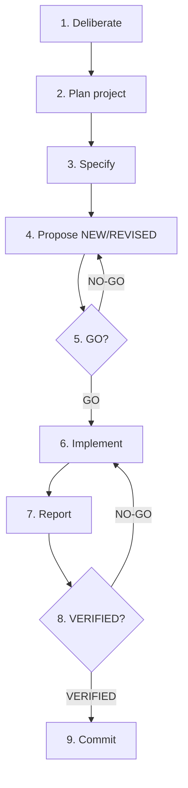

# 14. The End-to-End Lifecycle

GroundTruth-KB work moves through a single integrated cycle from first reasoning
to a scoped local commit. The seven-step workflow in
[Method Overview](01-overview.md) is the **spec-centric core** of this cycle;
this document is the **superset** that adds the deliberate front bookend, project
planning, bridge review gates, and the commit back bookend.

Authoritative sources (this doc cites them; it does not replace them):

- `.claude/rules/operating-model.md` §1 — lifecycle vocabulary
- `.claude/rules/file-bridge-protocol.md` — bridge states and handoffs
- `.claude/rules/deliberation-protocol.md` — Deliberation Archive obligations
- `CLAUDE.md` — platform workflow and bridge dispatch summary

## Full cycle

Nine stages, in order:

| # | Stage | Primary role | Artifact / output | Governing source | Gate to advance |
|---|--------|--------------|-------------------|------------------|-----------------|
| 1 | **Deliberate** | Owner + agents | Deliberation Archive entry (`DELIB-*`) | `deliberation-protocol.md`, operating-model §1 | Material reasoning captured when it becomes a decision, risk, or deferral |
| 2 | **Plan (project)** | Owner + Prime Builder | Project, backlog, `PAUTH-*` authorization | `GOV-PROJECT-IMPLEMENTATION-AUTHORIZATION-001`, `GOV-PROJECT-REQUIRES-LINKED-SPECIFICATIONS-001` | Active project authorization covers intended work items and mutation classes |
| 3 | **Specify** | Owner + Prime Builder | Specifications / requirements in MemBase | `GOV-09`, `GOV-SPEC-CAPTURE-TRANSPARENCY-001` | Requirement recorded before implementation is prioritized |
| 4 | **Propose** | Prime Builder | Bridge proposal `bridge/<topic>-NNN.md` (`NEW` / `REVISED`) | `file-bridge-protocol.md`, `DCL-IMPLEMENTATION-PROPOSAL-SPEC-LINKAGE-MANDATORY-001` | Applicability + clause preflights pass; project-linkage metadata present |
| 5 | **GO** | Loyal Opposition | Review verdict `GO` or `NO-GO` | `file-bridge-protocol.md`, session-context review independence | Independent LO session approves (`GO`) before protected implementation |
| 6 | **Implement** | Prime Builder | Source, tests, config per `target_paths` | Impl-start authorization packet, `GOV-12` | Live `GO` + work-intent claim + `implementation_authorization.py begin` |
| 7 | **Report** | Prime Builder | Post-implementation report (`NEW` on bridge) | `file-bridge-protocol.md`, `codex-review-gate.md` | Report cites spec-to-test evidence from executed commands |
| 8 | **VERIFIED** | Loyal Opposition | Verification verdict `VERIFIED` or `NO-GO` | `DCL-VERIFIED-SPEC-DERIVED-TESTING-MANDATORY-001` | Independent LO session confirms evidence matches governing specs |
| 9 | **Commit** | Prime Builder (owner may gate) | Scoped local git commit bundling verified work | Project / release governance | `VERIFIED` on latest report; commit scope matches authorized `target_paths` |

## Stage notes

### 1. Deliberate

Search the Deliberation Archive before proposing or reviewing. Archive owner
conversations, bridge exchanges, and review findings so later agents inherit
context instead of relitigating settled trade-offs. See
[Deliberation Archive](13-deliberation-archive.md).

### 2. Plan (project)

Group work under a `PROJECT-*` identity with explicit authorization
(`PAUTH-*`), included work items, and allowed mutation classes. Standing backlog
items flow into projects; implementation without authorization is blocked at
the bridge and impl-start gates. See [Work Items & Backlog](04-work-items.md)
and [Governance](05-governance.md).

### 3. Specify

Owner language that states what the system **must** or **should** do is treated
as specification input. Gaps become work items and tests before code changes.
See [Specifications](02-specifications.md).

### 4. Propose

Prime Builder files an implementation proposal through the governed bridge path.
Proposals carry specification links, a spec-derived verification plan, and
project-linkage metadata. `REVISED` follows a `NO-GO` until LO approves.

### 5. GO

Loyal Opposition reviews the proposal in a **different session context** than the
author. `GO` authorizes implementation only; it is not verification of code.
See [Dual-Agent Collaboration](06-dual-agent.md) and
[File Bridge Automation](12-file-bridge-automation.md).

### 6. Implement

After `GO`, Prime Builder acquires a bridge work-intent claim, activates an
implementation authorization packet, and mutates only paths allowed by the
authorization. Cross-cutting gates (write-time hooks, impl-start validation)
enforce the same project and work-item semantics.

### 7. Report

Prime Builder publishes a post-implementation report as the next numbered bridge
file. The report maps governing clauses to executed tests and commands. Status
is `NEW` until LO verifies.

### 8. VERIFIED

Loyal Opposition re-checks evidence against the approved proposal and governing
specs. `VERIFIED` is terminal for the bridge thread unless a follow-on proposal
is filed. `NO-GO` sends Prime Builder back to implementation or a revised report.

### 9. Commit

Bundle the verified implementation, tests, and bridge verdict chain in a scoped
local commit. Deployment and production release may require additional owner
gates beyond this lifecycle doc.

## Mapping to the seven-step workflow

| Seven-step workflow (`01-overview.md`) | Position in the full cycle |
|----------------------------------------|---------------------------|
| 1. Specify | Stage 3 **Specify** |
| 2. Identify gaps | Stages 2–3 **Plan** + **Specify** (work items) |
| 3. Create tests | Stage 3 **Specify** / early **Propose** (test artifacts) |
| 4. Prioritize | Stage 2 **Plan** (backlog ordering) |
| 5. Implement | Stage 6 **Implement** (after **GO**) |
| 6. Verify | Stages 7–8 **Report** → **VERIFIED** |
| 7. Close or iterate | Stage 8 **VERIFIED** / revise loops |

The deliberate stage precedes planning; the commit stage follows verification.
Bridge **GO** and **VERIFIED** gates wrap implementation the seven-step diagram
shows as a single "Implement" and "Verify" pair.

## Deep dives

| Topic | Document |
|-------|----------|
| Specifications | [02-specifications.md](02-specifications.md) |
| Testing | [03-testing.md](03-testing.md) |
| Work items & backlog | [04-work-items.md](04-work-items.md) |
| Governance & gates | [05-governance.md](05-governance.md) |
| Prime Builder / LO roles | [06-dual-agent.md](06-dual-agent.md) |
| File bridge automation | [12-file-bridge-automation.md](12-file-bridge-automation.md) |
| Deliberation Archive | [13-deliberation-archive.md](13-deliberation-archive.md) |
