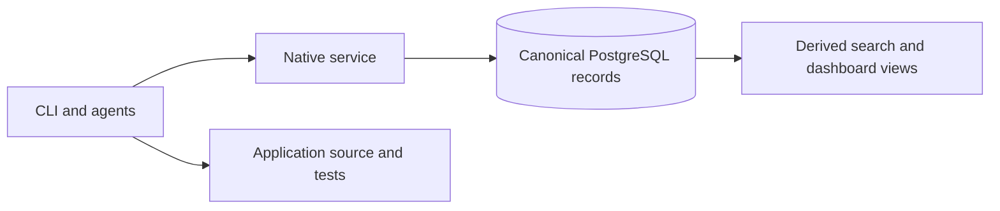

# Start Here

GroundTruth-KB connects engineering requirements, executable tests and current
work through a native service. Use this page to orient yourself, then follow
the [bootstrap guide](bootstrap.md) for the concrete setup sequence.

## What you need

Use Python 3.11 or newer, Node.js 20 or newer and Git, a configured GT-KB host
with a reachable native authority, and any additional harnesses you intend to
use. Goose runs GT-KB's hooks through `sh`: on Windows keep Git for Windows'
`usr\bin` on PATH, because without it every Goose tool call runs unenforced.
GT-KB's Goose launcher refuses to start and `gt project doctor` fails when `sh`
is missing. A Goose Desktop session you start directly is enforced only while
`sh` is on the PATH it inherits; GT-KB cannot refuse that session, so run
`gt project doctor` after any change to PATH. Install the package version
selected for that host and confirm the CLI:

```powershell
gt --version
gt --help
```

`gt --version` prints `gt, version 0.7.0rc1` for the current package.

## Open GT-KB Home

GT-KB Home is GT-KB's primary interface: the DeepSeek Harness Web UI, installed
with GT-KB, started at logon like GT-KB's authority and kept running, on
`127.0.0.1:3080` only. The operator installs and registers it once (see
`infrastructure/deepseek-web/README.md`); the first start opens it, and
afterwards:

```powershell
gt home open
```

Every Home session runs under GT-KB's effect gate. Settings holds GT-KB's own
pages: status and the dashboard, services (start and stop), and the operational
controls (preview, then apply). The Home is GT-KB's default interactive
harness; other harnesses remain available through their projected
configuration.

A harness does not determine an agent's role. Prime Builder and Loyal Opposition
are separate session roles established by the supplied initialization marker.
Independent review remains separate from implementation.

## Where the state lives



Specifications describe required behavior. TEST records identify executable
coverage and test-plan placement. Each work item belongs to one project, whose
authorization field controls dispatch eligibility. Canonical writers preserve
history and check the observed version before changing a record.

Assertions and test results provide evidence about behavior. They do not by
themselves approve a specification or establish complete semantic coverage.
Owner input changes the appropriate canonical record directly; a retained
conversation archive is not a prerequisite.

## Initialize an application

Application registration, execution-project creation and file initialization
are separate steps. The execution project must carry
`repository_ref = application:<APPLICATION>`.

```powershell
gt --config <host>/groundtruth.toml application register <APPLICATION> --host-root <host> --json
gt --config <host>/groundtruth.toml project init <APPLICATION> --project-id <PROJECT> --host-root <host> --owner "<OWNER>" --dry-run --json
gt --config <host>/groundtruth.toml project init <APPLICATION> --project-id <PROJECT> --host-root <host> --owner "<OWNER>" --json
gt --config <host>/groundtruth.toml project doctor --project-id <PROJECT> --host-root <host> --json
```

The [bootstrap guide](bootstrap.md) supplies the project-record fields, first
specification, executable TEST binding and assertion examples. Initialization
creates application files and selected projections; it does not create a local
authority database or a Git commit.

Core specification intake reports the next missing question through
`gt core-specs next-question`. Use the explicit answer writer and current
version to record the owner's answer. `gt core-specs status` reports the current
result; no mutable session-progress file is needed.

## Implement and review work

The owner selects work while Dispatcher Next remains inactive. Start from
`gt context work-item <WI-ID> --json`, the current native attempt and the
applicable formal records.

1. Prime Builder authors a NEW proposal for the selected work.
2. Loyal Opposition reviews it and authors GO or NO-GO.
3. Prime Builder implements after GO, or responds to NO-GO with REVISED.
4. Prime Builder reports the implementation with READY.
5. Loyal Opposition verifies the measured result with VERIFIED, or requests
   correction with NOT-READY.

The native bridge CLI claims and delivers each exact next artifact. An agent
does not acquire ownership of a whole work item. Bridge messages are disposable
coordination; they are excluded from work-product commits. The complete verified
project is the commit unit, with the applicable independent review and native
commit checks.

See [dual-agent setup](tutorials/dual-agent-setup.md) for the current commands.
Release and deployment follow the selected project's requirements and operator
instructions; a particular branch name is not itself deployment authority.

## Operate and inspect

| Task | Current command |
| --- | --- |
| Inspect the current specification | `gt spec show <SPEC-ID> --json` |
| Run its assertions | `gt assert --spec <SPEC-ID> --json` |
| Read a work item's current context | `gt context work-item <WI-ID> --json` |
| Read native coordination | `gt bridge state-report --json` |
| Preview managed application updates | `gt project upgrade <APPLICATION> --project-id <PROJECT> --host-root <host> --json` |
| Operate the derived dashboard | `gt dashboard --help` |
| Open GT-KB Home | `gt home open` |
| Inspect, start or stop GT-KB's services | `gt services status --json` |
| Preview an operational-control change | `gt controls propose --control <ID> --value <VALUE> --output <FILE>` |

Select the intended configuration with `gt --config <path>`. A service failure
remains a failed or unavailable native operation; local files and caches do not
replace authority. Managed harness outputs are refreshed through the projector,
with shared authored sources edited at their source.

## Continue with

- [Bootstrap guide](bootstrap.md): registration, canonical records and executable examples.
- [Product architecture](architecture/product-split.md): current components and boundaries.
- [Application isolation](architecture/isolation.md): host/application ownership and recovery.
- [CLI reference](reference/cli.md): current parameters and refusal behavior.
- [Known limitations](known-limitations.md): remaining operational and host constraints.
- [Release health](wiki/release-health.md): what dashboard observations establish.

Copyright 2026 Remaker Digital, a DBA of VanDusen & Palmeter, LLC. All rights reserved.
